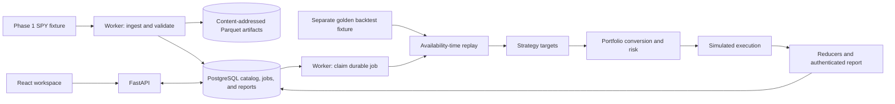

# AutoQuantTrader

AutoQuantTrader is a safety-first, event-driven platform for quantitative
research, backtesting, and eventually automated trading. It is designed to move
a versioned strategy through the same causal decision path—from point-in-time
market data, to deterministic replay, to paper trading, and finally to a
human-approved live canary.

Today, the local application demonstrates two repository-owned fixture
workflows: point-in-time data ingestion and cataloging, plus a separate
deterministic golden backtest through strategy, risk, execution simulation, and
accounting. The React workspace displays both. Production market data has not
yet been admitted, and broker-connected paper and live orders remain deliberately
disabled. Production data still requires licensing and qualification; broker
execution still requires authoritative reconciliation and operational-readiness
evidence.

> The engineering focus is correctness under late data, retries, crashes, and
> uncertain broker responses—not low-latency or high-frequency trading.

## At a glance

| | |
|---|---|
| **Target v1 scope** | One operator, one account, and one trade-enabled strategy |
| **Planned paper universe** | A small set of liquid U.S. ETFs: DIA, IWM, QQQ, and SPY |
| **Trading model** | Regular hours, bar data, long-only, whole-share `DAY` market orders |
| **Current state** | Deterministic local research and safety foundations |
| **Not yet enabled** | Production data, paper order submission, and live trading |
| **Core stack** | Python 3.12, FastAPI, PostgreSQL, React, TypeScript, and Docker Compose |

## Quickstart

### Prerequisites

- Docker with the Compose plugin
- `make`
- Local ports `5173`, `8000`, and `5432` available

From the repository root:

```bash
cp .env.example .env
chmod 600 .env
make dev
```

The first startup builds the containers, starts PostgreSQL, applies migrations,
starts the API and browser application, and launches the local worker. The worker
then:

1. ingests a synthetic SPY market-data fixture into content-addressed Parquet
   artifacts and the PostgreSQL catalog;
2. registers a separate golden SPY strategy and backtest fixture; and
3. waits for durable backtest jobs.

The `trader` container runs its fail-closed preflight once and exits. Its
expected local result is `not_ready` with exit status `2`; this does not mean the
demo stack failed, and it does not submit paper or live orders.

Once PostgreSQL, the API, and the web application are healthy, open:

- Application: <http://localhost:5173>
- API documentation: <http://localhost:8000/docs>
- Readiness check: <http://localhost:8000/health/ready>

### Try the local workflow

1. Open **Data → Datasets** to inspect the ingested fixture and its immutable
   manifest.
2. Open **Research → Backtests**.
3. Keep the registered reference inputs selected and choose **Launch backtest**.
4. When the worker completes the job, inspect the equity curve, performance
   metrics, trade trace, ledger entries, positions, and run provenance.

These screens demonstrate two distinct fixture slices: the launched golden
backtest does not yet consume the Parquet dataset shown in the catalog. Both use
synthetic repository-owned evidence, so no vendor or broker credentials are
required.

### Stop or troubleshoot the stack

Stop the foreground process with `Ctrl-C`, then preserve the database and data
volumes while stopping the containers:

```bash
make down
```

To run in the background or inspect startup problems:

```bash
make dev-detached
make ps
make logs
```

## How it works



1. **Catalog point-in-time data.** One fixture workflow validates observations,
   writes content-addressed Parquet, and stores the manifest and quality evidence
   in PostgreSQL. Invalid data is quarantined.
2. **Run a durable research job.** The browser asks FastAPI to enqueue one exact
   registered golden input. A worker claims it under a bounded lease and invokes
   the separate golden runner, which replays facts by availability time and
   produces only complete, watermark-closed strategy batches.
3. **Turn targets into auditable results.** The strategy emits a desired
   portfolio. Independent portfolio and risk rules authorize intents, the
   simulator emits orders and fills, and deterministic reducers build the
   ledger, positions, P&L, and report evidence.
4. **Persist and inspect the result.** The worker atomically commits the job,
   authenticated report, and run manifest. FastAPI exposes them to the React
   workspace.

Paper and live modes are intended to reuse this core domain path, with
environment-specific adapters and operational gates added around it.

## Key engineering decisions

- **Point-in-time reproducibility.** Replay uses availability time, and immutable
  manifests and facts make decisions reproducible and auditable.
- **Independent risk.** Strategies emit portfolio targets, not broker commands;
  portfolio and risk rules own conversion, approval, and capacity.
- **Effect idempotence.** Submission attempts are persisted before broker I/O.
  Deterministic client IDs support recovery, while an ambiguous result becomes
  `UNKNOWN` instead of being retried blindly.
- **Fail-closed recovery.** Leases and fencing enforce one account writer. The
  broker remains authoritative, so stale evidence, lost ownership, or a mismatch
  blocks new exposure until reconciliation succeeds.

## Current status

| Status | Scope |
|---|---|
| **Working locally** | Synthetic SPY ingestion/cataloging; a separate golden backtest with risk, simulated execution, settlement, corporate actions, and balanced-ledger accounting; durable jobs, reports, and browser views |
| **Bounded foundations** | Feature/target parity, read-only experiment governance, account fencing, ambiguous-submission handling, Alpaca raw-first recovery and reconciliation-evidence contracts, operational controls, alerts, tracing, and trusted time |
| **Disabled** | Admitted production data, an enabled broker loop, paper/live order authority, and automatic re-arm |

The bounded foundations are locally tested but intentionally non-authorizing.

## Project structure

Selected boundaries:

| Path | Responsibility |
|---|---|
| `apps/api`, `apps/web` | FastAPI boundary and React/TypeScript workspace |
| `apps/worker` | Market-data ingestion and durable backtest jobs |
| `apps/trader` | One-shot, fail-closed paper preflight; not an active trader |
| `apps/trusted_time_supervisor` | Local trusted-time evidence supervisor |
| `packages/domain`, `packages/application` | Pure rules and workflows coordinated through ports |
| `packages/backtest`, `packages/market_data`, `packages/datasets` | Simulator, ingestion/admission, and immutable data artifacts |
| `packages/adapters`, `packages/persistence` | External edges, SQL repositories, and integrity checks |
| `packages/observability`, `migrations` | Telemetry support and durable schema history |

Dependency direction is enforced by an architecture check: domain rules stay
independent of frameworks and infrastructure, application workflows depend on
ports, and composition roots wire concrete adapters at the edge.

## Development and checks

Host development uses Python 3.12, `uv` 0.11.28, Node.js 22, and pnpm 11.7.0.
Install locked dependencies and run all current quality gates with:

```bash
make bootstrap
make check
```

`make check` covers Python and frontend quality gates, tests/builds, API contract
drift, architecture boundaries, and Docker Compose validation. Run `make help`
for focused commands such as `make test`, `make api`, `make web`, `make worker`,
and `make trader`.

Vendor qualification and capture commands are documented separately in
[Market-data admission](docs/admission/README.md); they are not part of the
credential-free local demo.

## Future goals

1. **Qualify production market data.** Admit a licensed point-in-time source and
   validate real revisions, security identity, calendars, and corporate actions.
2. **Complete research validation.** Add general isolated strategy workers,
   captured tapes, richer performance evaluation, and replay-versus-shadow
   parity.
3. **Complete the Alpaca paper execution and reconciliation path.** Compose the
   existing broker contracts into a runtime with authenticated submission,
   stream and snapshot reconciliation, authoritative broker-fact application,
   and submission-boundary fault tests. This work does not by itself authorize
   paper orders.
4. **Harden operations, then activate supervised paper trading.** Complete
   external alerting and telemetry, account-bound controls, trusted-time
   monitoring, browser security, backup/restore, and timed failure drills before
   enabling paper execution.
5. **Run a supervised paper soak.** Operate the frozen candidate for at least
   4–8 weeks with evidence quotas and no unexplained order, fill, cash, position,
   ledger, or reconciliation differences.
6. **Consider a minimum-size live canary.** Only after explicit human approval:
   begin with live shadow mode, then one symbol and minimal capital under direct
   supervision. Live promotion is never automatic.

Longer-term expansion may include broader U.S. equities, quote-aware limit
orders, and multiple concurrently trade-enabled strategies sharing one account,
but only after the narrower v1 path is proven.

## Deeper documentation

- [Architecture and product scope](docs/ARCHITECTURE.md)
- [Implementation roadmap and detailed status](docs/IMPLEMENTATION_PLAN.md)
- [Operational budgets](docs/OPERATIONAL_BUDGETS.md)
- [Architecture decision records](docs/adr/README.md)
- [Operational runbooks](docs/runbooks/README.md)

This project is engineering research, not investment or legal advice.
