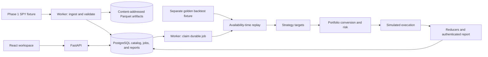

# AutoQuantTrader

AutoQuantTrader is a personal quantitative research and trading system. The
current personal profile imports declared historical datasets, runs a shared
causal economic engine, and exposes durable research jobs, reports, comparisons
and evaluation through a CLI, FastAPI and React workspace. Live trading remains
disabled. Backtest results do not imply future profitability.

## Start here

- [Product specification](docs/SPEC.md): confirmed behavior, requirements and open questions.
- [Current status](docs/STATUS.md): exact next task, validation results and blockers.
- [Executable plan](docs/PLAN.md): small milestones within the existing wave roadmap.
- [Architecture](docs/ARCHITECTURE.md), [decisions](docs/DECISIONS.md) and
  [testing](docs/TESTING.md): source boundaries and safe validation commands.
- [AGENTS.md](AGENTS.md): concise autonomous-development instructions.
- [Personal foundation runbook](docs/runbooks/personal-v1-foundations.md) and
  [research workspace runbook](docs/runbooks/personal-v1-research.md):
  explicit local setup and use.

Waves 0–3 have recorded merged-revision acceptance. Wave 4 has substantial
continuous simulation, account coordination and applied reconciliation code,
but its acceptance is incomplete. The latest integration CI at `b1156ba` fails
a retained-history restore check; consult STATUS for repair progress. The
personal simulation CLI starts HALTED; the fixed continuous worker performs
restore/integrity against preexisting HALTED state, not active strategy execution.

The confirmed target remains one owner, one dedicated USD account, one
cash-funded long-only strategy and DIA/IWM/QQQ/SPY whole-share regular-session
orders. E*TRADE is the eventual live venue. The
[account amendment](docs/contracts/personal-v1/account-eligibility-amendment.md)
permits selected CASH or MARGIN account privileges while retaining no borrowing.
Tiingo samples and prior authorized account reads provide bounded evidence;
current account semantics, genuine source ownership/captured-session replay,
initializer approval and connected execution remain separate gates.

For development, start with architecture and focused offline checks in TESTING.
Do not source private configuration or launch services to validate documentation.
The retained instructions below describe the older fixture demonstration and
historical native foundations, not the current personal-profile acceptance state.

## Historical application quickstart

The existing browser/API fixture stack below is retained separately from the new standard CLI. Its container/native qualification has not been renewed for this personal profile.

### Prerequisites

- Docker with the Compose plugin
- `make`
- Local ports `5173`, `8000`, and `5432` available

From the repository root:

```bash
cp .env.example .env
chmod 600 .env
COMPOSE_PROFILES=legacy-golden-oracle make dev
```

The explicit legacy profile enables the fixture worker; it is absent from the
default Compose startup. This profile builds the containers, starts PostgreSQL, applies migrations,
starts the API and browser application, and launches the local worker. The worker
then:

1. ingests a synthetic SPY market-data fixture into content-addressed Parquet
   artifacts and the PostgreSQL catalog;
2. registers a separate golden SPY strategy and backtest fixture; and
3. waits for durable backtest jobs.

The `trader` container runs its fail-closed preflight once and exits. Its
expected local result is `not_ready` with exit status `2`; this does not mean the
demo stack failed, and it does not submit paper or live orders.

Once PostgreSQL, the API, and the web application are healthy, open:

- Application: <http://localhost:5173>
- API documentation: <http://localhost:8000/docs>
- Readiness check: <http://localhost:8000/health/ready>

### Try the local workflow

1. Open **Data → Datasets** to inspect the ingested fixture and its immutable
   manifest.
2. Open **Research → Backtests**.
3. Keep the registered reference inputs selected and choose **Launch backtest**.
4. When the worker completes the job, inspect the equity curve, performance
   metrics, trade trace, ledger entries, positions, and run provenance.

These screens demonstrate two distinct fixture slices: the launched golden
backtest does not yet consume the Parquet dataset shown in the catalog. Both use
synthetic repository-owned evidence, so no vendor or broker credentials are
required.

### Stop or troubleshoot the stack

Stop the foreground process with `Ctrl-C`, then preserve the database and data
volumes while stopping the containers:

```bash
make down
```

To run in the background or inspect startup problems:

```bash
COMPOSE_PROFILES=legacy-golden-oracle make dev-detached
make ps
make logs
```

## How the historical fixture demonstration works


```mermaid
flowchart LR
    Data["Phase 1 SPY fixture"] --> Ingest["Worker: ingest and validate"]
    Ingest --> Lake[("Content-addressed Parquet artifacts")]
    Ingest --> DB[("PostgreSQL catalog, jobs, and reports")]
    UI["React workspace"] --> API["FastAPI"]
    API <--> DB
    DB --> Worker["Worker: claim durable job"]
    Golden["Separate golden backtest fixture"] --> Replay["Availability-time replay"]
    Worker --> Replay
    Replay --> Strategy["Strategy targets"]
    Strategy --> Risk["Portfolio conversion and risk"]
    Risk --> Execution["Simulated execution"]
    Execution --> Report["Reducers and authenticated report"]
    Report --> DB
```

1. **Catalog point-in-time data.** One fixture workflow validates observations,
   writes content-addressed Parquet, and stores the manifest and quality evidence
   in PostgreSQL. Invalid data is quarantined.
2. **Run a durable research job.** The browser asks FastAPI to enqueue one exact
   registered golden input. A worker claims it under a bounded lease and invokes
   the separate golden runner, which replays facts by availability time and
   produces only complete, watermark-closed strategy batches.
3. **Turn targets into auditable results.** The strategy emits a desired
   portfolio. Independent portfolio and risk rules authorize intents, the
   simulator emits orders and fills, and deterministic reducers build the
   ledger, positions, P&L, and report evidence.
4. **Persist and inspect the result.** The worker atomically commits the job,
   authenticated report, and run manifest. FastAPI exposes them to the React
   workspace.

Paper and live modes are intended to reuse this core domain path, with
environment-specific adapters and operational gates added around it.

## Key engineering decisions

- **Point-in-time reproducibility.** Replay uses availability time, and immutable
  manifests and facts make decisions reproducible and auditable.
- **Independent risk.** Strategies emit portfolio targets, not broker commands;
  portfolio and risk rules own conversion, approval, and capacity.
- **Effect idempotence.** Submission attempts are persisted before broker I/O.
  Deterministic client IDs support recovery, while an ambiguous result becomes
  `UNKNOWN` instead of being retried blindly.
- **Fail-closed recovery.** Leases and fencing enforce one account writer. The
  broker remains authoritative, so stale evidence, lost ownership, or a mismatch
  blocks new exposure until reconciliation succeeds.

## Historical foundation record

| Status | Scope |
|---|---|
| **Working locally** | Synthetic SPY ingestion/cataloging; a separate golden backtest with risk, simulated execution, settlement, corporate actions, and balanced-ledger accounting; durable jobs, reports, and browser views |
| **Bounded foundations** | Feature/target parity, read-only experiment governance, and governed fixed-child exact-decimal fixture economics; account fencing, ambiguous-submission handling, and historical Alpaca raw-first recovery/reconciliation evidence; the E\*TRADE endpoint/request/signing, sanitized OAuth journal, and injected token-runtime prerequisite; operational controls, alerts, tracing, and the complete unreachable/injected ADR-0121 lifecycle-v2 milestone-one implementation plus its uninstalled native milestone-two owner foundation |
| **Disabled** | Admitted production data, an enabled broker loop, paper/live order authority, and automatic re-arm |

The bounded foundations are locally tested but intentionally non-authorizing.
Wave 6 completed ADR 0121 milestone one in unreachable injected code and was
promoted to local and remote `main` at exact revision
`c64cbb2da0e600a3899387d3d58e6a7d8762b00c`; exact-main
[CI run #136](https://github.com/km8trix/AutoQuantTrader/actions/runs/33171993916)
passed all 11 jobs.

The historical native Wave 7 implements ADR 0126 and ADR 0121 milestone two on the local
integration branch. It adds native pre-Python fork ownership, role-narrow
signers, pathname Unix-seqpacket endpoints and resource admission, tmpfs-only
secret custody, fixed provisioners, source-only systemd topology, and four
canonical x86_64 seccomp manifests. Its packaging evidence builds six
reproducible, uninstalled candidates, retains the candidate builders and native
sources in the source distribution only, excludes them from wheels, and binds
three immutable inert role import trees. Every candidate record states
`activation_authorized=false`. All locally runnable Wave 7 gates are complete,
including the branch-wide regression, architecture/source-seal reconciliation,
and independent security review. Linux x86_64 candidate/seccomp qualification
remains remote-CI-only because the local Linux VM returns `ENOSYS` for the
required `close_range(..., CLOSE_RANGE_UNSHARE)` syscall. Promotion and
exact-`main` remote CI verification remain pending.

This milestone creates no production or default real lifecycle root, real
Docker transport or effect, production controller/runtime caller, Compose
projection, unit installation or activation, deployment, or stop authority.
`make trusted-time-stop` remains the exact exit-2 hard close, and the trader
remains `not_ready`. Milestone three must provide isolated injected real-root
and Docker composition, signed socket/process-epoch composition including boot
UUID, executable/import hashes, nonce, and immutable image, plus bounded
`/proc/<pid>/fd` and `/proc/net/unix` pre/post channel-closure proof. Milestone
four still owns the immutable production release, deployment, drills,
activation, and every stop-authority change.

## Project structure

Selected boundaries:

| Path | Responsibility |
|---|---|
| `apps/api`, `apps/web` | FastAPI boundary and React/TypeScript workspace |
| `apps/worker` | Bounded personal research, durable jobs, and separate historical golden oracle |
| `apps/trader` | HALTED personal runtime, bounded continuous restore/integrity, and historical paper preflight |
| `apps/trusted_time_supervisor` | Local trusted-time evidence supervisor |
| `packages/domain`, `packages/application` | Pure rules and workflows coordinated through ports |
| `packages/backtest`, `packages/market_data`, `packages/datasets` | Simulator, ingestion/admission, and immutable data artifacts |
| `packages/adapters`, `packages/persistence` | External edges, SQL repositories, and integrity checks |
| `packages/observability`, `migrations` | Telemetry support and durable schema history |

Dependency direction is enforced by an architecture check: domain rules stay
independent of frameworks and infrastructure, application workflows depend on
ports, and composition roots wire concrete adapters at the edge.

## Development and checks

Host development uses Python 3.12, `uv` 0.11.28, Node.js 22, and pnpm 11.7.0.
Install locked dependencies and run all current quality gates with:

```bash
make bootstrap
make check
```

`make check` covers Python and frontend quality gates, tests/builds, API contract
drift, architecture boundaries, and Docker Compose validation. Run `make help`
for focused commands such as `make test`, `make api`, `make web`, `make worker`,
and `make trader`.

Vendor qualification and capture commands are documented separately in
[Market-data admission](docs/admission/README.md); they are not part of the
credential-free local demo.

## Planning and next work

The [consolidated implementation plan](docs/IMPLEMENTATION_PLAN.md) prioritizes usable daily research, one causal financial engine, applied reconciliation and practical operations. Its wave requirements are decomposed into the [executable plan](docs/PLAN.md); [STATUS](docs/STATUS.md) is the current handoff. One orchestrator may use at most three concurrent workers.

The [design review](docs/reviews/2026-09-08-design-review.md) compares the independent baseline with the previous design and implemented code. E*TRADE remains the selected live target; local stateful simulation, sandbox protocol checks, production reads/previews and actual live evidence remain separate. That dated design review is historical; current implementation and validation are recorded in STATUS.

## Deeper documentation

- [Architecture and product scope](docs/ARCHITECTURE.md)
- [Wave roadmap and historical evidence](docs/IMPLEMENTATION_PLAN.md)
- [Current executable plan](docs/PLAN.md) and [status](docs/STATUS.md)
- [Operational budgets](docs/OPERATIONAL_BUDGETS.md)
- [Architecture decision records](docs/adr/README.md)
- [Operational runbooks](docs/runbooks/README.md)

This project is engineering research, not investment or legal advice.
