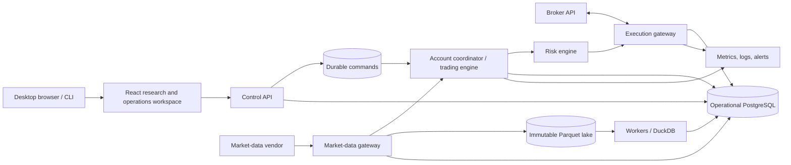
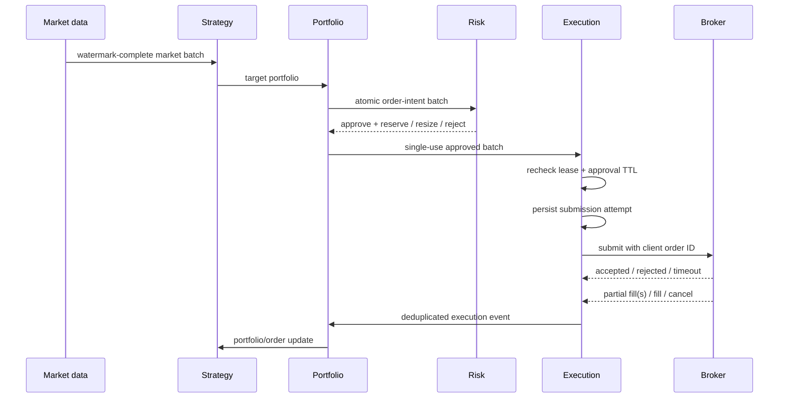

# AutoQuantTrader architecture

## 1. Product definition

AutoQuantTrader will let a single operator:

1. ingest and validate historical and live market data;
2. write versioned quantitative strategies against a stable strategy API;
3. run reproducible event-driven backtests with realistic trading costs;
4. compare experiments and inspect trades, exposures, and failure modes;
5. deploy an approved strategy to a paper account;
6. monitor signals, orders, fills, positions, P&L, health, and risk in real time;
7. stop trading safely and reconcile local state with the broker;
8. promote a proven deployment to live trading through an explicit human gate.

### Initial scope

- Asset class: a small, fixed universe of liquid U.S. ETFs first, then U.S.
  equities after corporate-action and security-lifecycle tests pass.
- Frequency: end-of-day and intraday bars, initially 1 minute or slower.
- Trading behavior: regular market hours, long-only, whole-share DAY market
  orders in the first execution slice. Limit orders follow only after quote-aware
  simulation and broker tests exist.
- Operator model: one user and one brokerage account, with at most one active
  trade-enabled deployment. Multiple strategies may be researched and
  backtested; shared-account netting and virtual strategy sleeves are post-v1.
- Broker: Alpaca paper trading first, behind a broker-neutral adapter.
- Interfaces: Python strategy SDK, CLI for automation, and a desktop-oriented
  browser workspace for research, control, and observation.
- Deployment: Docker Compose locally; one small cloud environment when paper
  trading begins.

### Non-goals for v1

- High-frequency or latency-arbitrage trading.
- Options, futures, FX, crypto, multi-leg orders, or short-locate workflows.
- Multi-tenant SaaS, customer billing, or social strategy marketplace.
- Broker-dealer functions, direct exchange access, co-location, or FIX.
- Machine-learning platform infrastructure beyond consuming a versioned model
  artifact from a strategy.
- A drag-and-drop strategy builder.
- Extended-hours trading, order replacement, internal crossing, or multiple
  strategies sharing one live account.
- Native desktop packaging, native mobile applications, touch-specific mobile
  workflows, PWA installation, service workers, or offline trading.

These constraints are deliberate. A safe, correct event-driven engine for one
asset class is a better foundation than shallow support for many markets.

## 2. Architectural principles

1. **One canonical decision path.** The promotion backtest, shadow, paper, and
   live modes use the same strategy, portfolio, sizing, accounting, and risk
   interfaces. Only the clock, data source, and execution adapter change. Fast
   vectorized notebooks may explore ideas but cannot produce promotion evidence.
2. **Events are facts.** Market observations, signals, order intents, risk
   decisions, submissions, broker updates, fills, and reconciliation results
   are immutable, timestamped records.
3. **The broker is authoritative.** Local state is a projection. On startup,
   reconnect, or disagreement, reconciliation prevents new orders until the
   difference is resolved according to policy.
4. **Risk is independent of strategy.** A strategy proposes an intent; a
   separate risk pipeline may resize or reject it. The strategy cannot bypass
   the risk gate or broker adapter.
5. **Point-in-time reproducibility is a feature.** Every run records code,
   strategy parameters, first-seen or revised dataset policy, feature artifacts,
   calendar/tzdata, fee/slippage model, random seed, schema, and runtime image.
   Backtests see an event only when it would have been available, not merely
   when the underlying market interval occurred.
6. **Safe by default.** Paper mode is the default. Live mode requires separate
   credentials, explicit configuration, an approval record, and a startup
   readiness check.
7. **Simple operations first.** Begin as a modular monolith with separately
   runnable processes. Split a boundary into a service only when scaling or
   failure isolation is demonstrated to require it.
8. **Effect-idempotence, not exactly-once claims.** A database transaction and a
   broker HTTP call cannot commit atomically. Durable attempts, deterministic
   client IDs, broker lookup, deduplication, and reconciliation make retries
   safe; unresolved submissions fail closed.
9. **One writer per account.** An account-scoped lease with a monotonically
   increasing fencing generation is revalidated before every broker side effect.
   Losing ownership or database connectivity blocks new submissions. Because a
   retail broker does not enforce our fencing token, v1 disables automatic
   failover: takeover waits a safety interval and completes reconciliation under
   explicit operator control.

## 3. Recommended stack

| Area | Choice | Rationale |
|---|---|---|
| Core/runtime | Python 3.12+, typed synchronous domain core, `asyncio` adapters | Deterministic replay in the core; async only at broker/data/control I/O edges |
| API | FastAPI + Pydantic | Typed HTTP/SSE contracts and generated API schema |
| Research | NumPy, Polars, SciPy, DuckDB | Columnar feature work and efficient scans over immutable Parquet partitions |
| Dataset storage | Content-addressed Parquet on local/S3-compatible storage | Cheap immutable raw/normalized/feature snapshots with partition checksums |
| Operational database | PostgreSQL 16 | Orders, ledger, risk reservations, commands, jobs, audit, and dataset manifests |
| Hot time series | PostgreSQL first; TimescaleDB only after profiling | Avoids making an extension and a shared hot/history database mandatory |
| Migrations | Alembic + SQLAlchemy | Explicit schema evolution and repository/unit-of-work patterns |
| Jobs | A database-backed job queue initially | Fewer moving parts; migrate to Redis Streams only after measured need |
| Frontend | React + strict TypeScript + Vite | Static desktop-browser SPA; avoids native packaging and an unnecessary SSR runtime |
| UI libraries | React Router, TanStack Query, MUI Community, ECharts | Routing, remote-state synchronization, accessible controls/grids, and analytical charts |
| Browser auth | Auth0 OIDC with server-side tokens/session cookie | Keeps identity tokens and broker/vendor secrets out of browser storage |
| Observability | OpenTelemetry, Prometheus, Grafana, structured JSON logs | Correlated traces, metrics, logs, and alerts |
| Packaging | `uv`, Ruff, mypy/pyright, pytest | Fast deterministic environments and strict automated checks |
| Deployment | Docker Compose, then managed PostgreSQL and containers | Local parity with a modest production footprint |
| Secrets | `.env` only for local development; cloud secret manager elsewhere | Keeps credentials out of code, images, logs, and database rows |

PostgreSQL is the transactional source of truth for operational state and
metadata, not the historical research lake. DuckDB/Polars scan immutable
Parquet partitions directly; PostgreSQL may retain a bounded window of recent
live bars. TimescaleDB is introduced only if profiling shows a sustained hot
time-series query need. This prevents parameter sweeps from competing with the
order ledger for database I/O.

## 4. System context



## 5. Runtime topology

All processes live in one repository and import the same domain packages.

### API process

- Authentication and operator authorization.
- Strategy, dataset, backtest, deployment, and risk configuration endpoints.
- Read models for dashboard views.
- Resumable SSE stream for operational updates and query invalidation.
- Persists control commands: start, pause, drain, resume, flatten, and kill
  switch. It never calls the broker or trading engine directly.

### Worker process

- Historical ingestion and validation.
- Feature computation and dataset snapshots.
- Backtest execution and report generation.
- Scheduled maintenance, retention, and integrity jobs.
- Uses separate database roles/pools and bounded CPU/memory concurrency so
  research cannot starve the live account coordinator.

### Trading process

- An account coordinator obtains the renewable account lease and fencing
  generation; PostgreSQL prevents two current owners. A replacement coordinator
  cannot trade until the old lease has expired, the takeover safety interval has
  passed, and the reconciliation barrier succeeds.
- Exactly one trade-enabled deployment per account in v1.
- Consumes normalized market events.
- Builds watermark-complete market batches and invokes the strategy through a
  supervised subprocess with a decision deadline. Broker/risk handling remains
  alive if strategy computation crashes or times out.
- Converts target positions into order intents.
- Passes every intent batch through accounting and risk reservation checks.
- Atomically persists orders, single-use risk reservations, and durable
  submission attempts before broker I/O.
- Processes order/fill updates idempotently and updates projections.
- Emits heartbeats and refuses to trade when readiness conditions fail.

### Reconciler process

- Runs as a barrier at startup and after reconnects, then periodically and on
  demand. The account cannot enter `RUNNING` before the barrier passes.
- Compares open orders, fills, cash, buying power, and positions with the broker.
- Reconciles a bounded snapshot/fill cursor twice when provider snapshots are
  not atomic; records manual or foreign broker activity under an explicit
  adopt-or-halt policy.
- Classifies differences as expected lag, recoverable mismatch, or critical.
- Blocks affected strategies or the whole account until critical mismatches are
  resolved.

The trading and reconciliation loops may begin in one OS process, but they
remain separate modules and state machines. If PostgreSQL becomes unavailable,
new orders fail closed while the process continues consuming broker updates as
far as it can; recovery always requires reconciliation.

Deployment lifecycle is explicit and audited:

```text
DRAFT -> APPROVED -> STARTING -> RECONCILING -> SHADOW/RUNNING
                                      |              |
                                      v              v
                                   HALTED    PAUSED/DRAINING/FLATTENING
                                                      |
                                                      v
                                               STOPPED/HALTED
```

Only an authenticated human can approve, arm, resume, or promote. Process
restart does not imply strategy resume.

## 6. Domain boundaries

```text
market_data    normalization, calendars, bars, corporate actions, quality
strategy       strategy protocol, parameters, signals, version metadata
portfolio      targets, valuation, target-to-order conversion
accounting     immutable ledger, cash, lots, positions, P&L projections
risk           pre-trade rules, account limits, circuit breakers, approvals
execution      order state machine, broker protocol, idempotency, recovery
backtest       simulated clock, fill model, costs, run orchestration, metrics
deployment     strategy instances, environments, lifecycle and configuration
reporting      performance, attribution, exposure, experiment comparison
platform       auth, jobs, audit, outbox, configuration, observability
```

Dependency direction is enforced by an automated import-boundary test:

```text
domain primitives       -> standard library only
bounded domain modules  -> primitives and declared public domain contracts
application workflows   -> domain modules and abstract ports
infrastructure adapters -> ports, SQLAlchemy, vendor SDKs, storage clients
composition roots       -> wire workflows and adapters for API/worker/trader
```

SQLAlchemy models, Pydantic transport models, broker SDK objects, filesystem
paths, and network clients never enter domain modules. Cross-module calls use
public contracts rather than importing another module's internals.

## 7. Core contracts

The exact syntax may evolve, but these boundaries should be stable:

```python
class Strategy(Protocol):
    def initialize(self, context: StrategyContext) -> None: ...
    def on_market(
        self, context: ReadOnlyStrategyContext, batch: MarketBatch
    ) -> TargetPortfolio | None: ...
    def on_clock(
        self, context: ReadOnlyStrategyContext, event: ClockEvent
    ) -> TargetPortfolio | None: ...
    def on_order_update(
        self, context: StrategyContext, update: OrderUpdate
    ) -> None: ...

class MarketDataPort(Protocol):
    async def stream(self, subscription: Subscription) -> AsyncIterator[MarketEvent]: ...
    async def history(self, query: HistoryQuery) -> list[Bar]: ...

class BrokerPort(Protocol):
    async def submit(self, order: BrokerOrder) -> BrokerOrderRef: ...
    async def cancel(self, broker_order_id: str) -> None: ...
    async def find_by_client_id(self, client_order_id: str) -> BrokerOrder | None: ...
    async def open_orders(self, cursor: str | None) -> BrokerOrderPage: ...
    async def account_snapshot(self) -> BrokerAccountSnapshot: ...
    async def fills_since(self, cursor: str | None) -> BrokerFillPage: ...
    async def updates(self) -> AsyncIterator[BrokerEvent]: ...

class RiskRule(Protocol):
    def evaluate(
        self, batch: OrderIntentBatch, snapshot: VersionedRiskSnapshot
    ) -> RiskDecision: ...
```

`MarketBatch` represents a complete decision slice for an `as_of` timestamp and
includes its watermark, expected/received instruments, missing-data status, and
late-event policy. This removes symbol-order dependence in cross-sectional
strategies. `TargetPortfolio` declares whether it is a full snapshot or delta,
and carries the strategy/version, target ID, `as_of`, expiry, and rebalance
generation.

Strategies emit **targets** (desired quantity or portfolio weight), not broker
orders. The portfolio layer converts the single active strategy's targets into
an atomic intent batch. Multi-strategy netting, internal crossing, and fill/cost
allocation are deliberately deferred until a strategy-sleeve design is proven.

### Temporal and decision semantics

Every market observation distinguishes:

- `event_time` and, for bars, `interval_start`/`interval_end`;
- `vendor_published_at`, `received_at`, `available_at`, and `ingested_at`;
- source ID/sequence, schema version, correction revision, and first-seen flag.

The live engine closes a decision batch only after its configured watermark.
The backtester replays `available_at`, not just exchange time. A decision based
on a completed bar cannot fill using that bar's high, low, close, or volume; the
default market-order model activates at the next eligible market event after
modeled decision and submission latency. Simultaneous events have a documented,
stable sort key. Corrections are new facts and never rewrite an event tape.

Strategies receive a causal, read-only context and cannot query arbitrary
databases. Deterministic random generators, calendars, and any fitted feature
state are injected and versioned.

## 8. Event and order lifecycle



Do not compress the lifecycle into one enum. It contains related state machines:

```text
intent:      CREATED -> APPROVED/RESIZED/REJECTED -> CONSUMED/EXPIRED
submission:  PENDING -> IN_FLIGHT -> CONFIRMED/UNKNOWN -> RESOLVED
broker:      PENDING_NEW -> WORKING -> PARTIALLY_FILLED -> FILLED
                              |  +-> PENDING_CANCEL -> CANCELED/CANCEL_REJECTED
                              +----> REJECTED/EXPIRED
```

Replace/amend orders are out of scope for v1. Cumulative fills and cash/security
ledger entries are tracked independently from broker status, so a late fill,
trade bust, or correction is applied idempotently even after a cancel response.
Terminal-status duplicates never reopen working state, but they also never cause
a legitimate new execution ID to be discarded.

### Single-writer and submission protocol

Before each external side effect, the account coordinator revalidates its lease
and fencing generation. Risk evaluates the complete intent batch against one
immutable account/price snapshot and atomically creates cash/notional/exposure
reservations. Reservations cover approved-unsent, `UNKNOWN`, working, partially
filled, and pending-cancel orders; they have an expiry and are single-use.

The fencing generation is embedded in attempts/client IDs for detection and
audit, but the broker cannot reject a stale generation. Therefore v1 never
performs automatic coordinator failover. A manual takeover quarantines the
account for longer than the maximum in-flight request window, confirms the prior
runtime is stopped where possible, then runs the full reconciliation barrier.

The broker submission protocol is deliberately effect-idempotent:

1. atomically persist the order, payload hash, risk reservation, fencing
   generation, deterministic client order ID, and pending attempt;
2. recheck ownership, approval TTL, price freshness, and kill state;
3. mark the immutable attempt in flight and call the broker once;
4. on timeout/ambiguous response, enter `UNKNOWN` and query by client order ID;
5. reconcile stream events and paginated REST snapshots through an inbox keyed
   by provider event/execution ID;
6. never create a replacement submission while `UNKNOWN` remains unresolved.

A transient “not found” is not enough to resubmit: the adapter applies a bounded
lookup/reconciliation policy because broker read paths can lag write paths. A
broker adapter is not eligible for live use unless deterministic lookup and
recovery semantics are contract-tested.

Each adapter also publishes a capability matrix: order types, time-in-force,
sessions, fractionality, tick/lot rules, client-ID constraints, lifecycle
mappings, pagination/cursors, stream-resume behavior, and request budgets.
Unsupported combinations are rejected locally before risk approval.

### Reconciliation barrier

Startup and reconnect recovery use a race-aware barrier:

1. enter `RECONCILING`, block new exposure, and connect while buffering broker
   events;
2. fetch paginated account, position, open/recent order, fill, and non-trade
   activity snapshots with an overlap window;
3. apply snapshots and buffered events through the same idempotent inbox/reducers;
4. repeat from the last cursor until two economically equivalent views converge;
5. classify any manual/foreign activity under the v1 exclusive-account policy;
6. become `RUNNING` only when ledger/account projections agree and all unknown
   submissions are resolved.

Expected provider lag is time-bounded and never permits new exposure while an
economically relevant difference exists. Unresolved submission uncertainty
halts new account exposure, while cancel and authenticated reduce-only recovery
remain available.

## 9. Persistence model

Key tables and invariants:

| Table | Purpose / invariant |
|---|---|
| `instruments` / `instrument_identifiers` | Stable security identity plus effective-dated, knowledge-time symbol/venue/tradability mappings |
| `corporate_action_revisions` / `corporate_action_sets` | Append-only announcement/effective timestamps, strict split/dividend/merger/symbol-change/delisting terms, and ordered versions |
| `data_objects` / `dataset_partitions` | Content-addressed Parquet object, semantic/byte hashes, schema, ranges, rows, layer, and quarantine state |
| `ingestion_jobs` | Idempotency key, source checksum, lifecycle, and publication/quarantine counts |
| `market_events_hot` | Optional bounded operational cache; uniqueness includes source ID and revision |
| `data_quality_issues` | Gaps, duplicates, stale values, outliers, and resolution |
| `dataset_manifests` / `dataset_manifest_partitions` | Immutable ordered normalized partitions plus schema, calendar, universe, corporate-action version, raw basis, and revision policy |
| `feature_artifacts` | Input lineage, lookback/lag, fitted state, code digest, and batch/online parity result |
| `experiment_families` | Every attempted/canceled/completed trial and holdout-access audit |
| `strategy_versions` | Code/artifact digest, schema, parameters, source commit |
| `backtest_runs` | Immutable run manifest, lifecycle, metrics, and artifact links |
| `deployments` | Strategy version + environment + account + approved config |
| `signals` | Strategy output with causal market event and decision timestamp |
| `order_intents` | Desired trade before and after risk evaluation |
| `risk_reservations` | Single-use cash/shares/notional/exposure hold with state snapshot, config, TTL, and fencing generation |
| `orders` | Logical order, unique client ID, payload hash, broker ID, state axes, cumulative quantity, and version |
| `submission_attempts` | Immutable attempt number, delivery state, request/response digest, timestamps, and error class |
| `order_events` | Append-only broker/local transition history; deduplicated source ID |
| `inbox` | Unique provider event/execution IDs for at-least-once stream and snapshot processing |
| `fills` | Unique broker execution ID; price and quantity stored exactly |
| `ledger_entries` | Balanced append-only cash/security/fee/dividend/split/settlement/P&L postings |
| `positions` | Rebuildable account projection from ledger entries; never source of truth |
| `risk_decisions` | Rule-by-rule inputs, result, reason, and configuration version |
| `reconciliations` | Local/broker snapshots, differences, disposition, operator action |
| `account_leases` | Unique active owner, expiry, heartbeat, and monotonically increasing fencing generation |
| `audit_log` | Append-only user/system commands and configuration changes |
| `outbox` | Durable internal publications; broker submission uses the stricter attempt protocol above |

Use `Decimal`/database `NUMERIC` for broker/accounting money, price, and quantity,
but `float64` arrays for numerical research with explicit conversion boundaries
and tolerance tests. Store wall timestamps in UTC and use a monotonic clock for
deadlines. Soft-delete configuration records; never mutate event or ledger
history. Ledger reconstruction must conserve cash and security quantities.

## 10. Market-data pipeline

1. Fetch raw vendor payloads into immutable content-addressed object storage.
2. Normalize to versioned Parquet partitions using stable security IDs while
   preserving every source timestamp, arrival timestamp, sequence, and revision.
3. Apply effective-dated symbol mappings, exchange calendars, session labels,
   point-in-time universe membership, and corporate-action knowledge.
4. Validate schema, monotonicity, uniqueness, gaps, OHLC relationships, volume,
   staleness, and extreme returns.
5. Quarantine bad partitions rather than silently filling them.
6. Atomically publish an immutable manifest listing ordered partition checksums;
   never overwrite a published partition.
7. Derive higher timeframes and versioned feature artifacts with explicit
   lookback, publication lag, missing-data policy, and fitted training window.

Backtests query only observations with `available_at <= simulated_clock`.
First-seen and corrected tapes are separately selectable. A correction published
at 09:32 is invisible to a 09:31 decision.

Execution and accounting always use raw point-in-time prices plus explicit
split, dividend, merger, fee, and delisting events. Adjusted series may be used
only for research/features and can never become order or fill prices. This
prevents both look-ahead and double-counted corporate actions.

### Current Phase 1A adapter

The implemented adapter is deliberately a recorded, repository-owned synthetic
JSONL fixture. The worker normalizes it through the production-shaped port,
seals deterministic raw and normalized Parquet objects, verifies their hashes,
and only then publishes the catalog in one PostgreSQL transaction. Record-level
failures enter a separate raw quarantine partition. Manifest reads require a
manifest ID and explicit `as_of`, then apply the manifest's frozen revision
policy. The Control API is read-only for this catalog and never performs
ingestion at startup.

This proves local contracts, not vendor admission. The source and entitlement
records shown by the API and browser are permanently marked synthetic,
fixture-only, and unlicensed. A real vendor adapter cannot inherit readiness;
it must pass the same idempotency, temporal, calendar, identity, revision,
corporate-action, quality, and entitlement gates using licensed payloads.

### Current Phase 1B admission boundary

`HistoricalBarSource` is the only ingestion port for recorded and future vendor
adapters. It returns an immutable bundle containing the source profile, raw bar
facts, security master, calendar, corporate actions, entitlement, and source
checksum. The application rejects any bar whose source ID differs from the
profile before opening the object store or a database transaction.

Admission remains separate from parsing and publication. A pure evaluator binds
a frozen source/specification to secret-free evidence, technical artifact
digests, causal timestamps, and an optional independent decision. Synthetic
sources are structurally blocked. A vendor can be admitted only with a licensed
source kind, active entitlement and terms digest, matching identifier/universe/
calendar/corporate-action versions, all required technical checks, a published
manifest, and approval by someone other than the executor. The profile, report,
and checks are inserted atomically and exposed read-only in the browser. Database
integrity checks independently reject an admitted row that violates those
conditions.

### Provider qualification routing

The first external implementation is daily-first. Canonical `1d` bars span one
exact pinned exchange session, including half-days; they are not 24-hour bins.
Sharadar SFP is captured immutably as research evidence, but its supplied OHLCV
is adjusted for splits and stock dividends. Only `closeunadj` is directly raw,
so the adapter preserves all bases and refuses to emit canonical raw OHLCV.
Adjusted SFP OHLCV never enters the canonical raw bar lane.

Exact-page capture is a separate, fail-closed operation. It requires a reviewed,
date-effective authorization artifact that permits local snapshot storage and
research use and binds the digest of the applicable terms. Output is fixed under
the ignored `.local/vendor-snapshots/sharadar-sfp` root. The capture manifest
binds the authorization, terms, exact provider bytes, cursor lineage, and
observed response-column schema digest. Offline loading additionally binds the
capture digest to the pinned calendar ID, version, timezone, and exact session
bounds; derived daily timestamps therefore participate in semantic dataset
identity. None of these artifacts grants admission or trading authority.

Tiingo EOD remains an independent validation and raw-daily qualification
candidate. Its documented unprefixed OHLCV and separately adjusted fields are
different semantic lanes, but field labels do not by themselves prove
execution-safe raw prices. The public contract reviewed here does not establish
a complete publication timestamp or retained vendor-vintage timeline, so a
future acquisition can be known no earlier than its actual receipt time.

The Tiingo lane now includes a strict offline parser and repository-owned
synthetic qualification corpus. It validates schema and numeric bounds,
documented-raw-candidate versus adjusted separation, explicit split/dividend
candidates, complete symbol/session coverage, receipt-time causal rules, and
deterministic scope/calendar-bound digests without requesting or retaining
vendor bytes. Its exported dataset is permanently `synthetic_contract_only`,
uses no canonical execution-safe `PriceBasis`, and refuses canonical-bar or
admission-evidence conversion. Exact capture and a production
`HistoricalBarSource` remain blocked until a Tiingo-specific storage
authorization is reviewed and the exact product, venue or market provenance,
provider identity mappings, calendar, lifecycle, corporate-action authority,
and correction policy are frozen and validated against authorized bytes.

ADR 0013 adds an authorization-gated acquisition seam after that offline
qualifier. The seam's preflight, bounded request count and response size,
per-request socket-I/O timeout, secret-safe manifest, and
immutable-output behavior are tested with synthetic responses and an injected
transport only. No live Tiingo request was made and no Tiingo response was
captured. Actual operation is structurally blocked until a human-approved Tiingo
profile records its reviewer and review time and freezes the product, endpoint,
adapter, symbols, and date scope. A separate matching authorization binds its
normalized profile-contract digest to applicable terms, local-retention rights,
and research-use rights. Credential
presence, successful probing, or the Sharadar authorization cannot satisfy this
provider-specific gate. The profile and authorization artifacts are parsed and
validated before `TIINGO_TOKEN` is read; a failed preflight makes no transport
call and writes no output.

The frozen profile includes source and adapter identity, endpoint template,
market provenance, identifier/calendar/corporate-action authorities, correction
policy, and field-schema digest. The synthetic-tested manifest contract binds
that complete profile and normalized contract digest, the matching authorization
and terms digests, provider/dataset/schema identities, overall request/receipt
bounds, and sorted complete per-symbol receipts. Receipts and manifest bytes are
prebuilt before storage. Owner-only staging, an exclusive final-name reservation,
pre-commit durability requests, and a descriptor-relative atomic rename ensure
that a reported pre-commit failure never leaves a visible final capture. A
final name combines the first request timestamp with the full SHA-256 of those
canonical manifest bytes, so every manifest field participates in the immutable
identity. A process crash can leave only a hidden inert staging or reservation entry. This
acquisition slice does not itself qualify retained bytes or provide a source
adapter, local revision builder, or canonical conversion.

ADR 0014 adds the separate offline final-capture verification boundary. It
accepts only a strict final capture name beneath the fixed repository root and
opens every path component, directory, manifest, and object with descriptor-
relative no-follow operations. It requires current-user ownership, the exact
immutable final tree and modes, a recomputed full-manifest final name, the
caller's expected profile, and the exact reviewed authorization bytes. Before
returning, it revalidates the fixed root and selected name to the opened inodes,
the final and object directory metadata and exact entries, and every file
identity observed during the read. It verifies unique
content-addressed objects, sizes, hashes, strict response contracts, and exact
session coverage using an exact calendar mapping for each symbol; no implicit
single venue calendar is allowed. Unrelated hidden crash residue beside a final
capture is ignored and never traversed.

The resulting semantic digest binds the manifest, authorization, expected
calendar authority, and each symbol's calendar ID, version, venue, timezone,
and scoped sessions. Receipt time remains only local observation time. The
verified research snapshot refuses revision lineage, canonical bars, admission
evidence, and `HistoricalBarSource` integration. Its constructor is not public;
the verifier recomputes its manifest, calendar/session, observation/row, and
semantic proof before creation. The reusable verifier wrapper exposes
`verify()`, not the `load()` method that would structurally satisfy the
production source protocol. The implementation is tested with synthetic
captures only, performs no network or credential access, and has not verified
an actual Tiingo payload. It remains a library boundary until a reviewed
portable pinned-calendar artifact contract exists for an operator CLI.

The staged Tiingo path is therefore contract qualification, approved profile,
matching rights authorization, bounded immutable capture, separate offline
verification, repeated-capture lineage, and only then admission evaluation.
Later stages cannot grant authority backward to an earlier stage. The acquisition
seam records request and receipt evidence but does not invent
`vendor_published_at`, a vendor revision, or a historical vintage. Local
receipt-time revision lineage is explicitly deferred; unchanged, changed, and
missing rows in repeated captures have not yet been assigned correction
semantics. The seam cannot emit canonical bars or implement
`HistoricalBarSource`.

The transport timeout applies to socket I/O for each symbol request. It is not a
strict wall-clock deadline for the complete multi-symbol capture; operational
supervision supplies that stronger deadline until a later transport contract
implements one directly.

Profile and authorization reviewer identifiers are auditable local attestations,
not cryptographic signatures. Reviewer authentication and any required
separation of duties remain external governance controls.

Massive raw U.S. SIP trades and quotes remain the later intraday and
execution-evidence lanes once the required entitlement exists; finalized vendor
aggregates remain reconciliation-only. Neither daily product can silently
satisfy a one-minute contract, Tiingo IEX cannot silently substitute for SIP,
and no provider can silently substitute for another. Provider aliases such as
Sharadar permaticker, Tiingo tickers, and Massive FIGIs map to immutable internal
security IDs through effective-dated facts.

The initial trade-enabled qualification universe is DIA, IWM, QQQ, and SPY; a
separate lifecycle corpus covers a ticker change and delisted ETF. Each future
authorized retained acquisition is archived with observed request/receipt time
and a content digest. Non-retaining access probes and synthetic contract
qualification create no vendor archive. Cross-vendor disagreement quarantines
or flags data; it never triggers automatic fallback. Credential presence and
successful probes remain secret-free candidate evidence, not entitlement,
admission, or trading authority.
[ADR 0010](adr/0010-market-data-provider-qualification-routing.md),
[ADR 0011](adr/0011-daily-first-capture-and-raw-lane-separation.md),
[ADR 0012](adr/0012-tiingo-eod-offline-first-qualification.md),
[ADR 0013](adr/0013-tiingo-eod-authorization-gated-capture.md), and
[ADR 0014](adr/0014-tiingo-eod-offline-capture-verification.md).

## 11. Backtesting model

The canonical event-driven backtester uses a simulated clock and the same
strategy, accounting, portfolio, order reducer, and risk components as trading.
Its simulated broker is the first implementation of `BrokerPort`; the live
adapter must not create a second order model. It models:

- explicit availability, decision, risk, submission, and activation timing;
- market and limit order behavior;
- side-aware synthetic or observed spread, configurable slippage/impact, fees,
  and commissions;
- partial fills and participation caps based on bar volume;
- trading sessions, halts, rejected orders, and missing data;
- cash, buying power, settlement assumptions, and fractional/whole shares.

Minute OHLCV cannot reveal intrabar path, queue position, or true liquidity.
Limit-fill modes therefore declare conservative/optimistic ambiguity rules and
are stress tests, not facts. Paper fills validate workflow, not economic realism.
Observed live execution later calibrates a versioned cost model.

Required outputs include equity curve, returns, trades, turnover, gross/net
exposure, drawdown, Sharpe/Sortino with declared conventions, hit rate, profit
factor, cost attribution, capacity proxy, and per-symbol/per-period attribution.
Reports also declare return type/frequency, annualization, risk-free and
total-return benchmark versions, external cash-flow treatment, and uncertainty
method. Drawdown duration/recovery, Calmar, tracking error, factor/liquidity
exposure, and cost/capacity stresses are included before promotion.

Validation should use chronological train/validation/test segments, walk-forward
analysis, parameter-stability plots, cost stress tests, and comparison against a
declared benchmark. A good in-sample result is never itself a promotion gate.
Trials belong to an experiment family, including failed and canceled attempts.
Exploration cannot inspect the final holdout; access is audited and promotion
criteria are frozen before it is revealed. Overlapping-label studies use
purging/embargo, and tuned studies report a declared multiple-testing correction.

Vectorized notebooks and parameter screens are allowed for fast hypothesis
generation. Any candidate must then pass canonical event replay, batch-versus-
incremental feature parity, and identical target-decision tests before its
results count toward promotion.

The run manifest pins raw/normalized partition hashes, first-seen/revision
policy, feature artifacts, source commit plus dirty-patch digest, lockfile,
container image, schema migration, calendar/tzdata, numerical-library versions,
RNG algorithm/seed, event sort policy, benchmark, and cost/fill model. Bitwise
repeatability is required only inside a pinned runtime; elsewhere, canonical
event equality and declared numerical tolerances are used.

## 12. Risk architecture

### Pre-trade checks

- Coordinator lease/fencing generation, kill state, and single-use approval are
  current at dispatch time.
- Deployment and market session are enabled.
- Data heartbeat is current and price is not stale or invalid.
- Instrument is allow-listed and not halted/restricted.
- Order price, quantity, notional, and daily order count are within limits.
- Limit price is within a configured band of the reference price.
- Resulting symbol, sector, strategy, gross, net, and leverage exposures are
  within limits.
- Cash/buying-power buffer remains after the proposed order.
- Duplicate client order ID and rapid repeat intent checks pass.
- Open-order and broker/API rate budgets are available.
- The intent is not expired or part of a stale reconnect backlog.

Risk evaluates an atomic intent batch against a versioned price/account snapshot,
not sequential independent orders. Approval and reservations commit in the same
database transaction. Worst-case exposure includes approved-unsent, unknown,
working, partially filled, and pending-cancel orders; a cancel request does not
release its reservation. Cancels, reconciliation, and emergency risk reduction
have reserved broker API capacity ahead of new exposure.

### Runtime circuit breakers

- Max daily realized/unrealized loss.
- Max drawdown from session high-water mark.
- Repeated broker rejects or reconciliation mismatches.
- Stale/disconnected market data or broker stream.
- Excessive slippage, spread, volatility, or order latency.
- Process heartbeat failure or clock drift.

### Kill-switch semantics

Higher-severity state wins. Every transition is durable and idempotent; no state
auto-resumes.

| State | New exposure | Reduce-only | Cancel | Reconcile | Completion / re-arm |
|---|---:|---:|---:|---:|---|
| `RUNNING` | Yes | Yes | Yes | Yes | Normal readiness checks |
| `PAUSED` | No | Explicitly allowed | Yes | Yes | Manual resume after fresh readiness check |
| `DRAINING` | No | No, unless separately authorized | Yes | Yes | All orders terminal and two-pass reconciliation clean |
| `FLATTENING` | No | Dedicated flatten policy | Yes | Continuous | Zero position or explicit incomplete/deadline result |
| `HALTED` | No | Separately authenticated emergency action only | Yes | Yes | Manual re-arm, clean reconciliation, healthy data/clock |

`FLATTEN` cannot promise zero when the market is closed, halted, or illiquid;
its result reports residual exposure. The broker dashboard/manual channel is an
independent last resort when this application or its database is unavailable.

## 13. Security and operational controls

- Separate paper and live broker credentials, accounts, databases/schemas, and
  visual environment banners.
- Use a separate live deployment project, service identity, secret scope, and
  preferably database instance. Promote signed immutable artifacts/configuration,
  never mutable paper database state.
- No live secrets in developer `.env` files, CI logs, browser storage, or images.
- Least-privilege service identities; operator actions require authentication.
- Encrypt traffic and managed storage; redact credentials and account secrets
  from structured logs.
- Dependency scanning, locked dependencies, protected branches, and signed or
  digest-addressed deployment images.
- Database backups and tested point-in-time recovery before live trading.
- Use expand/migrate/contract schema changes compatible with the running and
  previous application version; do not rely on destructive down-migrations for
  ledger recovery. Drain and reconcile before trading-aware deployments.
- SLOs and alerts for data lag, decision lag, submission latency, broker
  disconnects, reject rate, reconciliation differences, risk trips, and P&L.
- Operational runbooks for startup, shutdown, broker outage, data outage,
  unknown order state, partial fill, position mismatch, and kill switch.

Before paper execution, set measured budgets for per-symbol data age, market-
batch completion, strategy deadline, approval TTL, clock drift, submission
latency, unknown-order duration, reconciliation duration, and alert delivery.
Use monotonic time for local deadlines. Performance tests establish a reference
universe/backtest throughput and fail CI on a material regression; optimization
is profile-driven rather than achieved by adding services. The versioned initial
values and tuning rules are recorded in
[Operational budgets](OPERATIONAL_BUDGETS.md).

## 14. API surface

Representative resources:

```text
GET/POST  /strategies, /strategy-versions
GET/POST  /datasets, /data-jobs
GET/POST  /backtests
GET       /backtests/{id}/report
GET/POST  /deployments
POST      /deployments/{id}:start|pause|drain|resume|stop
GET       /accounts/{id}/positions|orders|fills|risk
POST      /accounts/{id}:reconcile|flatten|halt
GET       /health/ready, /health/live
GET       /events/stream
```

All mutation requests accept an idempotency key. Control commands return a
durable command ID; asynchronous state changes are observed through the event
stream and audit log.

### Browser-facing contracts

The desktop-browser SPA uses `GET /ui/bootstrap` for immutable environment,
identity, capability, readiness, market-clock, and stream-cursor state;
`GET /dashboard/summary` for the overview projection; and resumable
`GET /events/stream?after={cursor}` SSE for compact resource-version events.
Lists use cursor pagination with an `as_of` timestamp. Time-series responses are
server-downsampled to at most 2,000 rendered points, while full-resolution data
remains a downloadable artifact. Configuration mutations require a resource
version/ETag and errors use RFC Problem Details.

## 15. Browser application

The UI is a static React/Vite SPA optimized for desktop browsers at 1280x720 or
larger. Chromium, Firefox, and WebKit are the supported engines. Native desktop
wrappers, mobile layouts, PWA installation, service workers, persistent query
caches, and offline trading are out of scope.

Navigation groups are Overview; Data; Research; Trading; Risk; Operations; and
Settings. Strategy code remains version-controlled in the repository; the UI
selects immutable strategy versions and edits schema-validated parameters.

TanStack Query owns remote state and React owns temporary presentation state.
SSE carries event IDs and resource versions that invalidate queries rather than
streaming complete snapshots. The client reconnects with `Last-Event-ID`, shows
freshness/`as_of` on operational views, falls back to bounded readiness polling,
and never optimistically completes trading commands.

Paper and live use separate hostnames with a permanent textual environment
banner and no in-app environment switch. `PAUSE` and `HALT` are immediate
idempotent risk-reducing commands; `DRAIN` requires confirmation; and `FLATTEN`,
`RESUME`, `ARM`, and live promotion require fresh readiness, typed
account/environment confirmation, and OIDC reauthentication. Exposure-increasing
controls are disabled when authoritative state is stale.

Auth0 OIDC tokens remain server-side. The browser receives a secure HTTP-only
session cookie and supplies CSRF tokens for mutations. Broker/vendor credentials
never enter browser storage, responses, telemetry, logs, or source maps.

## 16. Repository layout

```text
apps/
  api/                  FastAPI composition root
  worker/               jobs and ingestion runner
  trader/               trading/reconciliation runner
  web/                  desktop-browser React/Vite workspace
packages/
  domain/               pure domain models and rules
  market_data/          ports, normalization, quality, adapters
  strategies/           SDK plus example strategies
  portfolio/            target conversion and valuation
  accounting/           immutable ledger and projections
  risk/                 limits and circuit breakers
  execution/            order state machine and broker adapters
  backtest/             simulated clock and execution
  persistence/          SQLAlchemy models, repositories, migrations
  datasets/             Parquet manifests, feature artifacts, DuckDB access
  observability/        logging, metrics, tracing
tests/
  unit/ integration/ contract/ replay/ e2e/ fault_injection/
infra/
  compose/ monitoring/ deployment/
docs/
  adr/ runbooks/
```

## 17. Testing strategy

- **Unit:** domain invariants, indicators, sizing, risk rules, accounting, order
  transitions, and calendar edge cases.
- **Property-based:** no negative cash unless allowed, cumulative valid fills do
  not exceed order quantity, balanced ledger postings, reservation conservation,
  and fill/position/cash reconstruction. Late fills and corrections remain
  processable after lifecycle closure.
- **Temporal/leakage:** future revisions, universe membership, feature fit state,
  and same-bar prices cannot affect earlier decisions.
- **Golden/replay:** a fixed availability-time tape produces canonical semantic
  equality for decisions and exact ledger/order fields. Metrics use declared
  numerical tolerances; run IDs and wall-clock telemetry are excluded.
- **Differential:** batch and incremental features and target decisions agree on
  the same tape.
- **Contract:** recorded broker/vendor fixtures and sandbox API tests.
- **Integration:** PostgreSQL migrations, transactional outbox, job leases, and
  restart recovery; import-boundary rules prevent architectural dependency drift.
- **End-to-end:** data -> signal -> risk -> order -> fill -> position -> report.
- **Fault injection:** disconnects, duplicate/out-of-order events, timeouts,
  process death after submission, two coordinators/split brain, delayed client-ID
  visibility, fill-during-cancel, stream/snapshot gaps, simultaneous buying-power
  reservations, manual broker orders, database outage, stale intent/backlog, and
  clock drift.
- **Shadow/canary:** compute signals without orders, then minimum-size paper and
  live deployments with automatic rollback/halt criteria.

## 18. Architecture decisions to record

Create short ADRs as implementation begins:

1. supported asset class, sessions, order types, and bar frequency;
2. build-versus-adopt engine spike and canonical event-path rule;
3. batch/watermark strategy contract and event ordering;
4. bitemporal data, correction, security lifecycle, and adjustment policy;
5. Parquet research lake plus PostgreSQL operational store;
6. account lease/fencing and database-outage behavior;
7. broker capability matrix, submission uncertainty, and reconciliation barrier;
8. ledger/account model, settlement, and cost-basis policy;
9. experiment/holdout governance and reproducibility manifest;
10. live-promotion, rollback/halt authority, retention, backup, and recovery;
11. post-v1 portfolio allocation if multiple strategies share an account.

## 19. External constraints and references

- Alpaca exposes separate paper endpoints and streaming trade/order updates, so
  the first adapter should treat streaming updates and REST reconciliation as
  complementary rather than relying on either alone:
  <https://docs.alpaca.markets/us/docs/websocket-streaming>.
- Alpaca documents that paper fills omit market impact, latency slippage, queue
  position, price improvement, regulatory fees, and dividends. Paper evidence
  therefore proves workflow resilience, not live execution quality or alpha:
  <https://docs.alpaca.markets/us/docs/paper-trading>.
- Alpaca supports lookup by deterministic client order ID, which is mandatory in
  the uncertain-submission recovery contract:
  <https://docs.alpaca.markets/us/reference/getorderbyclientorderid>.
- A future Interactive Brokers adapter needs a separate capability/recovery ADR
  covering client ownership, pacing, reconnect behavior, and the operational
  dependency on TWS or IB Gateway. Use the current IBKR Campus documentation:
  <https://ibkrcampus.com/campus/ibkr-api-page/twsapi-doc/>.
- DuckDB can scan Parquet with filter and projection pushdown, supporting the
  immutable research-lake design without loading bulk history into the live
  operational database:
  <https://duckdb.org/docs/stable/data/parquet/overview>.
- Timescale continuous aggregates remain an optional hot-data optimization after
  profiling:
  <https://docs.timescale.com/use-timescale/latest/continuous-aggregates/about-continuous-aggregates/>.
- SEC Rule 15c3-5 directly applies to broker-dealers with market access, not
  automatically to every retail API client. Its controls for erroneous orders,
  capital thresholds, access restriction, and review are nevertheless a useful
  safety model. Obtain qualified legal advice before operating for others or
  changing the business model:
  <https://www.sec.gov/rules-regulations/2011/06/risk-management-controls-brokers-or-dealers-market-access>.

This document is engineering guidance, not investment or legal advice.
