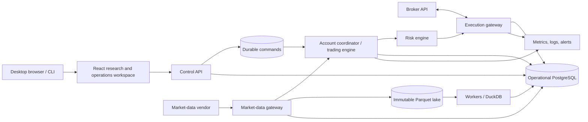
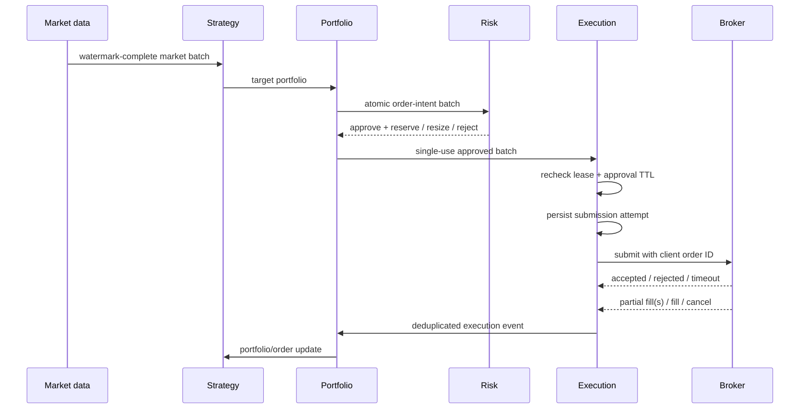

# AutoQuantTrader architecture

## 1. Product definition

AutoQuantTrader will let a single operator:

1. ingest and validate historical and live market data;
2. write versioned quantitative strategies against a stable strategy API;
3. run reproducible event-driven backtests with realistic trading costs;
4. compare experiments and inspect trades, exposures, and failure modes;
5. deploy an approved strategy to a paper account;
6. monitor signals, orders, fills, positions, P&L, health, and risk in real time;
7. stop trading safely and reconcile local state with the broker;
8. promote a proven deployment to live trading through an explicit human gate.

### Initial scope

- Asset class: a small, fixed universe of liquid U.S. ETFs first, then U.S.
  equities after corporate-action and security-lifecycle tests pass.
- Frequency: end-of-day and intraday bars, initially 1 minute or slower.
- Trading behavior: regular market hours, long-only, whole-share DAY market
  orders in the first execution slice. Limit orders follow only after quote-aware
  simulation and broker tests exist.
- Operator model: one user and one brokerage account, with at most one active
  trade-enabled deployment. Multiple strategies may be researched and
  backtested; shared-account netting and virtual strategy sleeves are post-v1.
- Broker: E\*TRADE production is the intended live execution venue behind
  broker-neutral ports. E\*TRADE sandbox is limited to OAuth, transport,
  request-shape, endpoint-isolation, and decoder qualification; it is not
  paper-trading or economic evidence. Existing Alpaca Phase 4 artifacts remain
  historical, provider-bound, and non-authorizing.
- Interfaces: Python strategy SDK, CLI for automation, and a desktop-oriented
  browser workspace for research, control, and observation.
- Deployment: Docker Compose locally; one small cloud environment when paper
  trading begins.

The repository currently completes Phases 0 and 2 against deterministic local
fixtures and implements the Phase 1 ingestion/admission contracts without a
licensed admitted vendor. Phase 2 includes the canonical reducers, durable
fenced batch/submission/reservation lifecycle, and fixture-only research
job/report/API/UI/worker path. Phase 3 has begun with bounded, pure-domain
manifest-bound feature and feature-derived target parity proofs for one
reference path plus a durable bounded experiment-governance registry with
opaque pre-reveal holdout commitments, configuration-bound target-evaluation
receipts, a durable fixture-only segment worker with immutable transcripts, a
fail-closed captured-tape validity gate, and read-only governance inspection.
General segment workers and process isolation, queryable transcript views,
performance evaluation, qualified captured tape, shadow, and broader research-
UI work are not complete. The repository does not
implement the target paper/live topology below. ADR 0096 selects E\*TRADE
production as the future live venue but adds no E\*TRADE runtime or authority;
the Phase 4 chronology that follows describes immutable historical Alpaca paper
evidence, not a live-adapter recommendation. Phase 4A supplies an offline,
non-authorizing Alpaca paper capability contract and deterministic request
translation for the narrow v1 subset. Phase 4B adds bounded offline decoding of
a versioned local wire profile for synthetic client-order lookup responses,
including an explicit inconclusive 404 meaning. Phase 4C adds a durable
provider-neutral raw-delivery journal and Alpaca persist-then-decode wrapper.
Phase 4D adds durable account-local request-budget permits with a conservative
rolling window and protected recovery/control capacity. Phase 4E adds strict
offline account and exact candidate-asset observations, routed through the
raw-first journal. Phase 4F cross-binds the existing pending-attempt, session,
capacity, fence, account/asset, request, and budget evidence into a pure
dispatch-preflight assessment while enumerating the unresolved runtime gates.
Phase 4G adds one bounded authenticated `GET /v2/account` runtime and a
durable short-lived local-alias-to-pinned-provider-UUID binding. It resolves
paper credential material ephemerally, reauthenticates a reconciliation-tier
permit, validates the same stable fence around strict transport, and persists
the response before decoding. Phase 4H adds one exact authenticated
fixed-candidate asset read, rooted in that fresh terminal account binding and
an independent provider-asset UUID pin, and persists a short-lived
account/instrument binding. Phase 4I adds one authenticated raw-first
client-order-ID lookup bound to an exact current UNKNOWN attempt, the current
recovery fence and terminal provider-account identity anchor, and an
independent provider-asset UUID comparison for a 200 response. A null or
different canonical UUID remains a typed reconciliation blocker. The lookup
retains historical observation evidence, requires neither a current account
status window nor current asset tradability, and cannot resolve or resubmit
the attempt. Phase 4J durably schedules bounded one-shot UNKNOWN lookups under
the current recovery fence without changing that state. Phase 4K
reauthenticates and re-decodes an exact Phase 4I/raw-ingress source into a
predecessor-linked normalized historical reconciliation-evidence fact, with
explicit candidate, quarantine, and inconclusive dispositions. It remains
non-applying and is not a stream/snapshot inbox. Phase 4L derives a
versioned source-scoped historical observation and normalized inbox request
from each exact Phase 4K fact. Durable account-local source links and explicit
fixed-policy non-application receipts account for withheld, quarantined, and
inconclusive sources without claiming provider revision, execution, correction,
or cross-channel deduplication identity. Phase 4M adds a pure, bounded,
raw-first descending order-page chain: each page derives its exact cursor and
reconciliation demand from the preceding page, but a short page proves only
cursor exhaustion and never snapshot isolation or convergence. Phase 4N adds a
pure two-capture value comparison for distinct, strictly ordered Phase 4M
sources. It reports page-boundary-independent added, removed, and changed order
IDs, but safety truncation remains incomplete and even an exact separated match
remains unqualified with `converged=false`. Phase 4O adds an authenticated,
durable one-page-at-a-time order traversal that prepares the exact next page
before permit issuance, persists raw bytes before qualification, and commits a
contiguous prefix under the account fence. It is not a deployed traversal
supervisor and cannot claim snapshot isolation or convergence. Phase 4P
reloads and authenticates two exact terminal Phase 4O prefixes, recomputes the
Phase 4N result, and persists a predecessor-linked comparison receipt under a
transaction-internal fence recheck. The receipt is durable provenance, not
convergence or application authority. Phase 4Q adds a bounded application
supervisor that derives one action from authenticated durable Phase 4O state:
append at most one exact page, wait without I/O for the later-start scheduling
boundary, or invoke the idempotent Phase 4P comparison. It has no loop,
automatic resend, or new authority. Phase 4R adds a bounded raw-first
`GET /v2/positions` observation: exact bytes precede strict decoding, overflow
never truncates, and neither an empty nor populated array is canonical account
state. Phase 4S compares two such sources by a sorted exact asset-ID view after
a two-second local receive boundary, but even equality is unqualified. Phase
4T adds one authenticated single-use position request: a fresh durable claim
precedes credentials and capacity, the same terminal provider-account identity
and fence surround raw-first transport, and a distinct commit-time fence check
precedes exact reload. Phase 4U implements that claim and receipt in two
immutable SQL tables, treats a claim without its one-to-one receipt as stalled,
and includes exact source reconstruction in readiness. It has no retry. Phase
4V durably reauthenticates two exact receipts, recomputes their Phase 4S
comparison, and appends a fenced predecessor-linked result without promoting
equality. Phase 4W derives one restart-safe capture, wait, or comparison action
from those single-use states and never retries a stalled claim. Phase 4X
registers the exact position pair under the shared account lock, prevents
cross-round member reuse, and atomically consumes each same-lease role claim
with the unchanged Phase 4U preparation. The account-lock winner is decided
before credentials, request capacity, or transport, without holding a
transaction across provider I/O. Phase 4Y composes those claims through the
unchanged Phase 4T runtime and Phase 4W selector. Pair-authenticating W/V
source loads reject direct Phase 4U
history, while claim-bound snapshot and coordinator adapters require the exact
consumed preparation and lease through record/reload. One call remains bounded
to one capture, wait, or comparison and no transaction spans provider I/O.
Phase 4Z then advances Phase 4Q to a coherent-store version 2 contract. The
Phase 4O source loader and one-page workflow plus the Phase 4P comparison
repository must expose one exact positive process-local SQL-engine identity
before source reads, clock access, or effects. That opaque identity is not
evidence and does not close same-store ordered-pair races. Phase 4AA closes
that pre-effect race with immutable pair membership, gap-free next-page
claims, atomic preparation consumption, public unscoped-prepare exclusion, and
same-lease proofs under the account lock. Revision 0024 also normalizes and
backfills Phase 4O preparations as immutable derived facts and includes
transition-aware readiness checks. Phase 4AB composes that exact page
admission through the unchanged Phase 4Q/4O/4P path, authenticating the
ordered claim/consumption history for every page and pinning the selected
page's own lease through request and reload. Phase 4AC makes the UNKNOWN
recovery composition restart-safe. Phases 4AD-4AI add bounded raw-first
FILL-activity pages, an authenticated durable one-page runtime, pure and
source-authenticated comparisons, migration 0033 comparison history, and
one-effect restart-safe supervision. No deployed resolver, general security
master, stream, reconciliation, order effect, or dispatch authority exists.
The trader remains `not_ready`, Phase 4's exit gate
is open, and no network-capable order transport or production market-data
adapter is enabled. No E\*TRADE OAuth session manager, account binding,
Preview/Place workflow, production reconciliation adapter, or live authority
exists. Phase 3's external gates remain open as well. Phase 5A now provides a
local durable operational-control contract and persistence spine. It freezes
the five-state severity order, actor-bound exact retries, fail-closed absence,
breaker trips, explicit drain/flatten results, and proof-bound manual re-arm
without executing a broker action or qualifying the Phase 4 reconciliation
evidence. Phase 5F now exposes an authenticated loopback-only operations
boundary; `REARM` can use only injected server-authoritative exact-head proof,
and missing authority fails unavailable. Phase 5B retains its separate
observe-only measurement contract, while ADR 0068 freezes the owner-approved
moderate paper-only policy. The local evaluator, persistence, source-shape, and
additive cutover/admission implementation are locally verified through final
dispatch reauthentication and startup integrity, with no deployed assignment
or producer authority inferred. Phase 5C provides strict supervised strategy
subprocesses, durable pre-run claims, restart-safe orphan recovery, and atomic
results; every non-completed result preserves or raises control to at least
`PAUSED` and opens a critical-alert incident. Phase 5D provides a bounded
restart-safe provider-neutral alert worker plus uncomposed, tested PagerDuty
Events API v2 and Twilio Messaging Service SMS adapters; its only local
same-store failure-control composition atomically applies fixed,
severity-preserving `PAUSED`. Phase 5E provides local bounded OpenTelemetry
correlation plus an uncomposed, tested Sentry Cloud OTLP/HTTP trace-exporter
factory. Phase 5G keeps the dashboard
snapshot observational while a
separate capability-gated browser client can request only database-backed
`PAUSE` or `HALT`. Phase 5H adds the pure typed local operational-drill
evidence contract alongside the deterministic pytest fault matrix. Phase 5I
adds a pure digest-only historical enrollment attestation over one exact
repository-authenticated terminal Phase 4G identity.
External alert credentials/routes/recipients and independence probes, Sentry
runtime composition/queryable-ingestion proof, selected strategy runtime
composition, authoritative risk/reconciliation/broker composition, and timed
deployment drills remain open. Phase 5 and its exit gate remain open. Amended
ADR 0088 selects a supervised local fail-closed paper preflight topology: one
unbound exact-image verification plus a separate host-side database/Sentry
check using the owner's Mac CPU/RAM, a Supabase Free runtime database, one
historically enrolled Alpaca paper account, the pinned no-exposure artifact,
and Sentry diagnostic configuration. ADR 0089 authenticates that account's
complete durable source lineage and exact terminal identity from four
nonsecret pins in one repeatable-read snapshot, while treating the expired
status window as historical only. That historical preflight does not select
Alpaca for live execution and supplies no E\*TRADE qualification. Hosted or
unattended compute, PagerDuty,
Twilio, paid Supabase capacity, and an external stale-heartbeat watchdog are
deferred. The profile keeps the operations API/browser nonpublic, configures a
non-authorizing `PAUSED` policy, rejects live credentials and automatic re-arm,
and separates smoke-preflight readiness from Phase 5 activation readiness. It
creates no control state and authenticates no account-bound durable control
head; its aggregate read-only safety scan rejects any `RUNNING` head. Without
external notifications or an independent watchdog, every check must remain
directly supervised and cannot qualify as unattended deployment evidence. The
production container stage pins its base-image
digests, runs as UID/GID 10001 with root-owned strategy inputs, has no inbound
port, defaults to `paper`, and exits nonzero while admission sources remain
unbound. The local workflow resolves its exact inspected `sha256:` image ID
instead of treating a mutable tag as immutable; CI builds and executes the
fail-closed container contract. The v2 typed assessment freezes
owner-supervised local compute, Supabase Free, Sentry, and deferred external
alerts. A separate host-side credential-aware preflight validates the
owner-only database/test/Sentry bindings, all-or-none nonsecret account pins,
exact migrated schema, inspected image ID, artifact pins, exact historical
terminal enrollment, and aggregate absence of `RUNNING` control heads. It
neither executes a credential-bound image nor requests, returns, resolves, or
uses Alpaca API credentials or any E\*TRADE credential, OAuth-token, or verifier
material, refreshes account status, or
authenticates any account-specific control head. The shared dotenv parser does
parse the owner-only file before filtering selected variables, so the preflight
process remains inside that file's credential boundary. Local supervision and
deferred alerts remain permanent activation blockers; fabricated route
evidence cannot remove them. Image, database, historical identity, Sentry
configuration, and offline artifact checks are preflight evidence only. The
durable strategy claim authorizer requires an authenticated account-bound
`RUNNING` head; this profile supplies only the configured `PAUSED` policy plus
an aggregate safety observation, so the durable no-exposure invocation is
unrun and Phase 5 remains open.

### Non-goals for v1

- High-frequency or latency-arbitrage trading.
- Options, futures, FX, crypto, multi-leg orders, or short-locate workflows.
- Multi-tenant SaaS, customer billing, or social strategy marketplace.
- Broker-dealer functions, direct exchange access, co-location, or FIX.
- Machine-learning platform infrastructure beyond consuming a versioned model
  artifact from a strategy.
- A drag-and-drop strategy builder.
- Extended-hours trading, order replacement, internal crossing, or multiple
  strategies sharing one live account.
- Native desktop packaging, native mobile applications, touch-specific mobile
  workflows, PWA installation, service workers, or offline trading.

These constraints are deliberate. A safe, correct event-driven engine for one
asset class is a better foundation than shallow support for many markets.

## 2. Architectural principles

1. **One canonical decision path.** The promotion backtest, shadow, paper, and
   live modes use the same strategy, portfolio, sizing, accounting, and risk
   interfaces. Only the clock, data source, and execution adapter change. Fast
   vectorized notebooks may explore ideas but cannot produce promotion evidence.
2. **Events are facts.** Market observations, signals, order intents, risk
   decisions, submissions, broker updates, fills, and reconciliation results
   are immutable, timestamped records.
3. **The broker is authoritative.** Local state is a projection. On startup,
   reconnect, or disagreement, reconciliation prevents new orders until the
   difference is resolved according to policy.
4. **Risk is independent of strategy.** A strategy proposes an intent; a
   separate risk pipeline may resize or reject it. The strategy cannot bypass
   the risk gate or broker adapter.
5. **Point-in-time reproducibility is a feature.** Every run records code,
   strategy parameters, first-seen or revised dataset policy, feature artifacts,
   calendar/tzdata, fee/slippage model, random seed, schema, and runtime image.
   Backtests see an event only when it would have been available, not merely
   when the underlying market interval occurred.
6. **Safe by default.** Paper mode is the default. Live mode requires separate
   credentials, explicit configuration, an approval record, and a startup
   readiness check.
7. **Simple operations first.** Begin as a modular monolith with separately
   runnable processes. Split a boundary into a service only when scaling or
   failure isolation is demonstrated to require it.
8. **Effect-idempotence, not exactly-once claims.** A database transaction and a
   broker HTTP call cannot commit atomically. Durable attempts, provider-
   constrained correlation IDs, raw-first response retention, provider-specific
   recovery, deduplication, and reconciliation contain uncertainty. They do not
   make automatic resubmission safe; unresolved effects fail closed as
   `UNKNOWN`.
9. **One writer per account.** An account-scoped lease with a monotonically
   increasing fencing generation is revalidated before every broker side effect.
   Losing ownership or database connectivity blocks new submissions. Because a
   retail broker does not enforce our fencing token, v1 disables automatic
   failover: takeover waits a safety interval and completes reconciliation under
   explicit operator control.

## 3. Recommended stack

| Area | Choice | Rationale |
|---|---|---|
| Core/runtime | Python 3.12+, typed synchronous domain core, `asyncio` adapters | Deterministic replay in the core; async only at broker/data/control I/O edges |
| API | FastAPI + Pydantic | Typed HTTP/SSE contracts and generated API schema |
| Research | NumPy, Polars, SciPy, DuckDB | Columnar feature work and efficient scans over immutable Parquet partitions |
| Dataset storage | Content-addressed Parquet on local/S3-compatible storage | Cheap immutable raw/normalized/feature snapshots with partition checksums |
| Operational database | PostgreSQL 16 | Orders, ledger, risk reservations, commands, jobs, audit, and dataset manifests |
| Hot time series | PostgreSQL first; TimescaleDB only after profiling | Avoids making an extension and a shared hot/history database mandatory |
| Migrations | Alembic + SQLAlchemy | Explicit schema evolution and repository/unit-of-work patterns |
| Jobs | A database-backed job queue initially | Fewer moving parts; migrate to Redis Streams only after measured need |
| Frontend | React + strict TypeScript + Vite | Static desktop-browser SPA; avoids native packaging and an unnecessary SSR runtime |
| UI libraries | React Router, TanStack Query, MUI Community, ECharts | Routing, remote-state synchronization, accessible controls/grids, and analytical charts |
| Browser auth | Auth0 OIDC with server-side tokens/session cookie | Keeps identity tokens and broker/vendor secrets out of browser storage |
| Observability | OpenTelemetry with Sentry for the paper diagnostic profile; structured JSON logs; Prometheus/Grafana deferred | Correlated diagnostics with a selected paper backend while PostgreSQL remains authoritative |
| Packaging | `uv`, Ruff, mypy/pyright, pytest | Fast deterministic environments and strict automated checks |
| Deployment | Docker Compose, then managed PostgreSQL and containers | Local parity with a modest production footprint |
| Secrets | `.env` only for non-live local development/sandbox; approved live-scoped secret manager for production on local or hosted compute | Keeps production credentials out of developer files, code, images, logs, and application database rows |

PostgreSQL is the transactional source of truth for operational state and
metadata, not the historical research lake. DuckDB/Polars scan immutable
Parquet partitions directly; PostgreSQL may retain a bounded window of recent
live bars. TimescaleDB is introduced only if profiling shows a sustained hot
time-series query need. This prevents parameter sweeps from competing with the
order ledger for database I/O.

## 4. System context



## 5. Runtime topology

All processes live in one repository and import the same domain packages.

### API process

- Authentication and operator authorization.
- Strategy, dataset, backtest, deployment, and risk configuration endpoints.
- Read models for dashboard views.
- Resumable SSE stream for operational updates and query invalidation.
- Persists control commands: start, pause, drain, resume, flatten, and kill
  switch. It never calls the broker or trading engine directly.

### Worker process

- Historical ingestion and validation.
- Feature computation and dataset snapshots.
- Backtest execution and report generation.
- Scheduled maintenance, retention, and integrity jobs.
- Uses separate database roles/pools and bounded CPU/memory concurrency so
  research cannot starve the live account coordinator.

The current local worker ingests the deterministic Phase 1 fixture, installs
the immutable Phase 2 golden research catalog, and polls durable fixture jobs.
It executes only the repository-owned golden runner under a bounded job claim;
arbitrary strategies, licensed datasets, and paper/live work are not accepted.

### Trading process

- An account coordinator obtains the renewable account lease and fencing
  generation; PostgreSQL prevents two current owners. A replacement coordinator
  cannot trade until the old lease has expired, the takeover safety interval has
  passed, and the reconciliation barrier succeeds.
- Exactly one trade-enabled deployment per account in v1.
- Consumes normalized market events.
- Builds watermark-complete market batches and invokes the strategy through a
  supervised subprocess with a decision deadline. Broker/risk handling remains
  alive if strategy computation crashes or times out.
- Converts target positions into order intents.
- Passes every intent batch through accounting and risk reservation checks.
- Atomically persists orders, single-use risk reservations, and durable
  submission attempts before broker I/O.
- Processes order/fill updates idempotently and updates projections.
- Emits heartbeats and refuses to trade when readiness conditions fail.

### Reconciler process

- Runs as a barrier at startup and after reconnects, then periodically and on
  demand. The account cannot enter `RUNNING` before the barrier passes.
- Compares open orders, fills, cash, buying power, and positions with the broker.
- Reconciles a bounded snapshot/fill cursor twice when provider snapshots are
  not atomic; records manual or foreign broker activity under an explicit
  adopt-or-halt policy.
- Classifies differences as expected lag, recoverable mismatch, or critical.
- Blocks affected strategies or the whole account until critical mismatches are
  resolved.

The trading and reconciliation loops may begin in one OS process, but they
remain separate modules and state machines. If PostgreSQL becomes unavailable,
new orders fail closed while the process continues consuming broker updates as
far as it can; recovery always requires reconciliation.

Deployment lifecycle is explicit and audited:

```text
DRAFT -> APPROVED -> STARTING -> RECONCILING -> SHADOW/RUNNING
                                      |              |
                                      v              v
                                   HALTED    PAUSED/DRAINING/FLATTENING
                                                      |
                                                      v
                                               STOPPED/HALTED
```

Only an authenticated human can approve, arm, resume, or promote. Process
restart does not imply strategy resume.

## 6. Domain boundaries

```text
market_data    normalization, calendars, bars, corporate actions, quality
strategy       strategy protocol, parameters, signals, version metadata
portfolio      targets, valuation, target-to-order conversion
accounting     immutable ledger, cash, lots, positions, P&L projections
risk           pre-trade rules, account limits, circuit breakers, approvals
execution      order state machine, broker protocol, idempotency, recovery
backtest       simulated clock, fill model, costs, run orchestration, metrics
deployment     strategy instances, environments, lifecycle and configuration
reporting      performance, attribution, exposure, experiment comparison
platform       auth, jobs, audit, outbox, configuration, observability
```

Dependency direction within the configured `apps` and `packages` source roots
is enforced by an automated import-boundary test:

```text
domain primitives       -> standard library only
bounded domain modules  -> primitives and declared public domain contracts
application workflows   -> domain modules and abstract ports
infrastructure adapters -> ports, SQLAlchemy, vendor SDKs, storage clients
composition roots       -> wire workflows and adapters for API/worker/trader
```

SQLAlchemy models, Pydantic transport models, broker SDK objects, filesystem
paths, and network clients never enter domain modules. Cross-module calls use
public contracts rather than importing another module's internals.

## 7. Core contracts

The exact syntax may evolve, but these boundaries should be stable:

```python
class Strategy(Protocol):
    def initialize(
        self, context: StrategyInitializationContext
    ) -> VersionedStrategyState: ...
    def on_market(
        self, context: ReadOnlyStrategyContext, batch: MarketBatch
    ) -> StrategyTransition: ...
    def on_clock(
        self, context: ReadOnlyStrategyContext, event: ClockEvent
    ) -> StrategyTransition: ...
    def on_order_update(
        self, context: StrategyContext, update: OrderUpdate
    ) -> None: ...

class MarketDataPort(Protocol):
    async def stream(self, subscription: Subscription) -> AsyncIterator[MarketEvent]: ...
    async def history(self, query: HistoryQuery) -> list[Bar]: ...

class BrokerPort[ResultT](Protocol):
    def submit(
        self,
        intent: OrderIntent,
        risk_decision_id: str,
        submission_attempt_id: str,
    ) -> ResultT: ...

class BrokerControlPort(Protocol):
    async def cancel(self, broker_order_id: str) -> None: ...

class BrokerRecoveryPort(Protocol):
    async def open_orders(self, cursor: str | None) -> BrokerOrderPage: ...
    async def account_snapshot(self) -> BrokerAccountSnapshot: ...
    async def fills_since(self, cursor: str | None) -> BrokerFillPage: ...

class BrokerClientOrderLookupPort(Protocol):
    async def find_by_client_id(self, client_order_id: str) -> BrokerOrder | None: ...

class BrokerUpdateStreamPort(Protocol):
    async def updates(self) -> AsyncIterator[BrokerEvent]: ...

class RiskRule(Protocol):
    def evaluate(
        self, batch: OrderIntentBatch, snapshot: VersionedRiskSnapshot
    ) -> RiskDecision: ...
```

`BrokerPort` is the narrow authorized-submission capability implemented by the
pure simulator. Future paper/live adapters compose it with only their qualified
asynchronous control, recovery, client-order lookup, reconciliation, and
update-stream capabilities instead of granting every caller one broad broker
authority object. Client-order lookup and streaming are optional capabilities;
an E\*TRADE adapter must not simulate either before its provider contract is
qualified.

`MarketBatch` is a replay-proof-constructed decision slice for an `as_of`
timestamp; callers cannot manufacture a strategy-eligible complete batch. It
includes its watermark, expected/received instruments, missing-data status, and
late-event policy. The strategy context binds that batch's exact identity and
semantic digest, not only its timestamp. This removes symbol-order and
same-timestamp substitution from cross-sectional strategies. `TargetPortfolio`
declares whether it is a full snapshot or delta, binds a typed market-batch or
clock-event decision trigger, stores targets as an immutable, sorted, unique
tuple, and carries the strategy/version, target ID, `as_of`, expiry, and
rebalance generation. The current intent converter still requires an exact
causal `PortfolioSnapshot`, but it accepts either the exact complete market-batch
trigger or a clock-event trigger whose snapshot supplies independently causal
price and valuation evidence.

Strategies emit **targets** (desired quantity or portfolio weight), not broker
orders. The portfolio layer converts the single active strategy's targets into
an atomic intent batch. Multi-strategy netting, internal crossing, and fill/cost
allocation are deliberately deferred until a strategy-sleeve design is proven.

### Temporal and decision semantics

Every market observation distinguishes:

- `event_time` and, for bars, `interval_start`/`interval_end`;
- `vendor_published_at`, `received_at`, `available_at`, and `ingested_at`;
- source ID/sequence, schema version, correction revision, and first-seen flag.

The live engine closes a decision batch only after its configured watermark.
The backtester replays `available_at`, not just exchange time. A decision based
on a completed bar cannot fill using that bar's high, low, close, or volume; the
default market-order model activates at the next eligible market event after
modeled decision and submission latency. Simultaneous events have a documented,
stable sort key, facts at a timestamp precede a watermark closed at that same
timestamp, and watermarks cannot regress in event time when read in canonical
closed order. Corrections are new facts and never rewrite an event tape. A
source plus observation identity is globally bound to one instrument/event-time
revision chain. Semantic material uses UTC, compact context-independent decimal
text, and typed length-safe Phase 2 identifiers.

Strategies receive a causal, read-only context and cannot query arbitrary
databases. Deterministic random generators, calendars, and any fitted feature
state are injected and versioned. Strategy callback state is externally carried,
bounded, immutable, and digest-chained: every callback advances one generation
and binds its exact predecessor, strategy/configuration/schema versions,
decision trigger contract, and UTC time. Initialization sees only replay start plus copied initial
positions, never future tape or schedule contents.

## 8. Event and order lifecycle



Do not compress the lifecycle into one enum. It contains related state machines:

```text
intent:      CREATED -> APPROVED/RESIZED/REJECTED -> CONSUMED/EXPIRED
submission:  PENDING -> ABANDONED
             PENDING -> IN_FLIGHT -> CONFIRMED/UNKNOWN -> RESOLVED
broker:      PENDING_NEW -> WORKING -> PARTIALLY_FILLED -> FILLED
                              |  +-> PENDING_CANCEL -> CANCELED/CANCEL_REJECTED
                              +----> REJECTED/EXPIRED
```

`RESOLVED` is the Phase 4 reconciliation transition in this vocabulary; the
current durable readiness boundary rejects every persisted `RESOLVED` attempt.
Its local deterministic path supports `ABANDONED`, `CONFIRMED`, and frozen
`UNKNOWN` heads only.

Replace/amend orders are out of scope for v1. Cumulative fills and cash/security
ledger entries are tracked independently from broker status, so a late fill,
trade bust, or correction is applied idempotently even after a cancel response.
Terminal-status duplicates never reopen working state, but they also never cause
a legitimate new execution ID to be discarded.

### Single-writer and submission protocol

Before each external side effect, the account coordinator revalidates its lease
and fencing generation. Risk evaluates the complete intent batch against one
immutable account/price snapshot and atomically creates cash/notional/exposure
reservations. Reservations cover approved-unsent, `UNKNOWN`, working, partially
filled, and pending-cancel orders; they have an expiry and are single-use.

The fencing generation is embedded in attempts and provider correlation
mappings for detection and audit, but the broker cannot reject a stale
generation. Therefore v1 never performs automatic coordinator failover. A
manual takeover quarantines the account for longer than the maximum in-flight
request window, confirms the prior runtime is stopped where possible, then runs
the full reconciliation barrier. The canonical internal order ID is never
shortened to satisfy a provider. Each adapter derives a separate, immutable,
account-scoped provider ID under its own syntax, length, uniqueness, and
observability rules. E\*TRADE's mapping is at most twenty alphanumeric
characters and cannot be treated as a response or lookup key.

The broker submission protocol is deliberately effect-idempotent and exposes
provider-specific steps. For E\*TRADE it is:

1. atomically persist the internal order, provider correlation mapping, exact
   payload hash, risk reservation, fencing generation, and pending attempt;
2. recheck ownership, approval TTL, session, quote freshness/collar, trusted
   time, OAuth session, and kill state;
3. invoke Preview once and durably retain the raw request/response, exact
   normalized-order digest, preview ID, and expiry before typed decoding;
4. use a local TTL shorter than the provider's three-minute preview lifetime,
   recheck every gate, and prove the Place parameters match the preview;
5. mark the immutable attempt in flight and invoke Place once;
6. on timeout or ambiguous completion, enter durable `UNKNOWN`, halt new account
   exposure, and never retry or resubmit automatically;
7. reconcile paginated Orders and Transactions plus Balance/Portfolio evidence
   through the raw-first inbox and independent broker dashboard; absence never
   proves that Place was unsent, and disposition plus re-arm require a human.

The current Phase 2 SQL boundary implements durable preparation, transaction-
time fence checks before preparation and `IN_FLIGHT`, a dispatch event carrying
the fresh current-lease receipt, proven-unsent stale-`PENDING` recovery to
`ABANDONED`, append-only outcome evidence, UNKNOWN recovery/freezing, and the
replacement prohibition for deterministic simulation. A real broker inbox,
bounded provider lookup, external reconciliation service, automatic or manual
takeover barrier, and operator re-arm remain Phase 4 work.

A transient “not found” or an empty page is not enough to resubmit: each adapter
applies a bounded provider-specific recovery policy because broker read paths
can lag write paths. A broker adapter is not eligible for live use unless its
uncertainty and recovery semantics are contract-tested. Alpaca's historical
path can look up the deterministic client ID; E\*TRADE does not return its
client-order ID in order responses and exposes no client-ID list filter, so its
ambiguous Place policy remains `UNKNOWN` with no automatic resubmission and
manual reconciliation.

Each adapter also publishes a capability matrix: order types, time-in-force,
sessions, fractionality, tick/lot rules, client-ID syntax/uniqueness/
observability, Preview/Place coupling and TTL, lifecycle mappings, OAuth/token
lifetime, closed business-message/disclosure classification, order/transaction
pagination, separately qualified polling and streaming, and documented versus
locally qualified request budgets. Unsupported combinations are rejected
locally before risk approval.

### Historical Phase 4A-4AI Alpaca paper contracts

The first Phase 4 slice freezes a reviewed Alpaca paper capability contract
without granting any broker capability. It records the paper base URL and order
path, authentication-header names, provider order-type and time-in-force
breadth, client-order-ID limit, order and account-activity pagination metadata,
the documented request ceiling, and explicit readiness flags. Those metadata
were reviewed on 2026-07-26 and are bound by a semantic digest; they cannot
silently expand the enabled trading surface.

These immutable provider-specific facts remain useful historical evidence, but
must not be renamed, promoted, or reinterpreted as E\*TRADE qualification.

The translation shape uses the candidate DIA, IWM, QQQ, and SPY
instrument/symbol mapping, U.S. equities, whole shares, a simple market order,
`DAY`, and `extended_hours=false`. It accepts canonical buy and sell intents,
but does not prove that an asset is currently active/tradable, that the current
instant is inside the exact exchange-calendar session, or that a sell is
reduce-only. Those facts require fresh broker/security, `BatchRiskSession`, risk
authorization, position-reservation, and fence evidence at dispatch. This is
important on shortened sessions; no nominal 16:00 close is session authority.
Limit, stop, trailing-stop, fractional/notional, extended-hours, replacement,
and advanced-order-class shapes fail locally even where Alpaca documents
broader provider support. The translation is an intent-bound immutable request
description with the existing deterministic client order ID; constructing it
makes no request.

Provider order statuses are classified through a closed vocabulary.
Acknowledged, working, partial, filled, pending-cancel, canceled, expired, and
rejected meanings remain distinct. Rare/special `accepted_for_bidding`, `held`,
`stopped`, `done_for_day`, `calculated`, `pending_replace`, `pending_review`,
`replaced`, and `suspended` states are reconciliation-required rather than
optimistically interpreted, and an unknown status fails closed. Phase 4A does
not freeze or parse a broker stream-event schema; cancel rejection, late fills,
busts/corrections, and other inbox events remain later Phase 4 work.

Phase 4B binds a non-I/O `GET /v2/orders:by_client_order_id` description to the
exact Phase 4A submission description, account identifier, capability digest,
and deterministic client order ID. Its decoder accepts only bounded retained
HTTP 200 or 404 bytes, rejects ambiguous JSON, and applies a deliberately narrow
local accepted wire profile rather than claiming the complete provider schema.
It supports the reviewed legacy example shape plus optional deprecated/new
fields, retains the response digest and `X-Request-ID`, and preserves provider
timestamps at up to nanosecond precision without truncating them to Python
microseconds. The found fixture is documentation-derived synthetic evidence;
the 404 body values are an unqualified synthetic example. Neither fixture is an
authenticated paper-account capture.

A 200 Order object must repeat the requested client ID. Its request economics
are compared with the original request: a match is `FOUND_MATCHED`, while a
supported same-ID order with different symbol, quantity, side, class, type,
time-in-force, session, price, or replacement fields is retained as
`FOUND_MISMATCH`. `FOUND_MATCHED` does not validate the provider asset ID,
security mapping, or current tradability. A 404 with a bounded positive integer
code and bounded message is only `NOT_VISIBLE_INCONCLUSIVE`; body values have no
stronger meaning, never prove that the broker did not receive the order, and
never permit resubmission. REST
cumulative fill quantity and average price are not execution facts because they
lack the execution identity, per-fill economics, fee, and correction evidence
required by the canonical reducers. Consequently neither outcome constructs a
`BrokerOrderEvent`, broker sequence, ledger entry, or
`UnknownSubmissionResolution`. See
[ADR 0039](adr/0039-offline-alpaca-client-order-lookup-observations.md).

Alpaca treats additive response fields and enum members as compatible changes.
This offline decoder deliberately fails closed on unreviewed additions, but it
does not itself persist a quarantine record. Phase 4C now commits the exact
delivery before calling it, so schema failures remain inspectable rather than
disappearing at the parser boundary.

The provider-neutral raw journal accepts empty, malformed, and otherwise
arbitrary bodies up to 1 MiB. It commits the exact bytes, byte count, digest,
stable delivery idempotency key, and only allowlisted versioned transport
metadata before any UTF-8, JSON, status, or provider-schema decoding. Provenance
includes provider, adapter version, environment, channel, and operation. An
exact account/key retry returns the authenticated existing receipt; changed
immutable content under the same identity fails closed. Every new receipt
receives an independent, contiguous account-local ingress sequence under the
existing account transition and capacity-serialization lock and binds the
previous receipt's semantic digest. The same transaction advances a durable
per-account head containing the last sequence and terminal receipt digest.
This local journal sequence is neither the risk-observation sequence nor a
provider or canonical per-order broker sequence.

The journal references the durable account head but has no logical-order or
submission-attempt foreign key. That shape can retain future manual or foreign
activity before classification instead of dropping evidence that lacks a known
local order. The Alpaca client-order lookup wrapper commits this raw receipt
first and only then invokes the Phase 4B decoder; malformed, empty, and
schema-drift bytes survive a decoder exception. A successful observation is
cross-bound to its raw receipt but still authorizes no normalized provider fact
or local transition.

Phase 4C deliberately stops before normalized provider-fact, quarantine, and
application-receipt schemas. Those identities cannot be derived safely from the
single qualified lookup response: stream and overlapping snapshot events,
executions, busts, and corrections still need stable provider identity,
revision, and ordering contracts. Arrival order must not be promoted to
provider truth. Consequently this slice performs no lifecycle mutation,
execution or ledger write, `UNKNOWN` resolution, stream/snapshot
deduplication, or reconciliation. See
[ADR 0040](adr/0040-durable-pre-decode-broker-ingress.md).

Phase 4D adds a provider-neutral durable request-admission boundary. Every
demand binds one account, provider/environment, stable idempotency key,
operation, purpose, correlation digest, and request time. A grant burns one
unit of rolling-window capacity before any future call, even if it expires
unused, because a crash cannot prove whether an external request was sent.
Exact retry returns the original permit; changed content under the same
identity fails closed. That replay is for lookup/idempotent coordination, not
resend authority: network paths use new-only issuance and reject an already
admitted demand before transport. New permits form their own account-local
predecessor chain and advance a terminal head under the existing
account-transition lock.

The versioned policy applies progressively protected ceilings to the total
active permit count: new submissions stop first, UNKNOWN lookups retain a
recovery reserve, and cancellation or reconciliation may use the final
critical reserve. A permit remains counted through its expiry plus the provider
window, inclusive at equality, so the three-second permit lifetime produces a
63-second local accounting horizon. That covers a future request sent near
expiry instead of aging it out at 60 seconds from allocation. The prior
accounting horizon prevents a policy change from resetting capacity, and issue
time cannot regress. The provider ceiling comes from the reviewed Phase 4A
contract; smaller tier ceilings and permit lifetime are explicit local safety
policy rather than a claim about provider reset behavior. See
[ADR 0041](adr/0041-durable-broker-request-budget-admission.md).

Phase 4E freezes deterministic, non-I/O descriptions for `GET /v2/account` and
one `GET /v2/assets/{symbol}` request at a time. Each description binds the
local account alias, Alpaca paper provider and environment, adapter version,
Phase 4A capability digest, exact operation/path, and, for an asset, one exact
instrument/symbol pair from the fixed DIA/IWM/QQQ/SPY candidate map. The
response cannot supply or override its environment.

The accepted account and asset wire profiles are intentionally narrower than
the provider's full extensible models. Both reject duplicate JSON keys,
non-object roots, invalid UTF-8, empty or oversized bodies, missing or unknown
fields, wrong primitive types, malformed canonical UUIDs, malformed timestamps
or decimal strings, and unreviewed enum values. Each successful observation
retains the exact response bytes and digest, HTTP status, provider request ID,
receipt time, typed values, and a semantic digest. The account/asset models and
closed enums are pinned to Alpaca Python SDK commit
`bd1fa9ea2fc3194914be9d47f7f5822a18a05b5f`.

An account observation preserves the provider account UUID, status, currency,
optional creation/shorting fields, and the explicit account, trading, transfer,
and user-suspension blockers. The narrow profile validates selected balance,
buying-power, and options-level fields, but those values remain only in the
retained raw body: they are not canonical cash, equity, capacity, ledger, or
risk evidence. The provider-retired PDT/day-trade fields are accepted only as
absent/null or strictly typed legacy values and never participate in readiness.
`ACTIVE`, `USD`, and all local blockers being false can produce a locally
usable-candidate outcome, but not authenticated identity or runtime readiness.
Treating the transfer-only provider flag as a blocker is intentionally
conservative local policy.

An asset observation preserves the provider asset UUID, class, exchange,
symbol, optional name, status, tradability, and reviewed margin, shorting,
borrowing, fractional, maintenance-margin, increment, and attribute fields. A
locally usable candidate requires the response symbol to match the exact
requested mapping and requires a reviewed listed-U.S. exchange, `us_equity`,
`active`, `tradable`, and no PTP attribute requiring review. An unknown
exchange/attribute fails decoding; a recognized ineligible exchange, recognized
non-empty PTP attribute, mismatch, other class, inactive state, nontradable
response, or strictly profiled 404 is explicit fail-closed evidence.
Fractional, shorting, borrowing, margin, and increment capabilities never
broaden the whole-share long-only Phase 4A surface.

The account and asset ingress wrappers commit their exact bytes and paper
transport provenance through Phase 4C before typed decoding. A decode failure
therefore remains durable. A successful wrapper then cross-binds every receipt
and observation field. Checked-in examples are documentation-derived or
explicitly unqualified synthetic inputs, not authenticated paper-account
captures, provider-account bindings, current observations, or durable
security-master facts. Phase 4E adds no normalized provider-fact schema or
migration because broader snapshot/stream identities, revisions, ordering,
quarantine, and application receipts remain unresolved. See
[ADR 0042](adr/0042-offline-alpaca-account-asset-observations.md).

Phase 4F defines a pure Alpaca paper dispatch-preflight assessment rather than
a dispatch capability. It re-reduces one exact submission attempt and the
supplied complete parent-attempt snapshot, binds the intent-bound Phase 4A
submission description, and verifies the child authorization, reservation,
session digest, supplied active-capacity projection, account identity, and
same-stable-fence receipt. It also binds the Phase 4E raw-first account and
asset observations and the exact Phase 4D Alpaca budget policy, submission
demand, and permit. The submission-demand correlation is derived from the
preparation and submission-description digests; a caller cannot substitute an
arbitrary correlation or purpose.

Immutable source conflicts are rejected. Expected fail-closed conditions are
retained as an ordered closed finding set, including a non-pending attempt,
parent `UNKNOWN`, expired risk or intent evidence, a closed session, missing,
frozen, or partially consumed child capacity, an unfresh permit, a locally
blocked account or asset response, and an unproved reduce-only sell. The
assessment digest covers every source digest, its explicit UTC instant, the
findings, and the frozen Phase 4A runtime-gate snapshot.

The assessment cannot prove that its pure parent-attempt or capacity snapshots
are complete and current durable state. A raw account/asset response remains
unauthenticated and freshness-unqualified, and a typed permit is not a durable
freshness receipt. Runtime credential/account/security binding, calendar and
quote evidence, reconciliation and control state, and a composite SQL
transaction that rechecks the fence, reservation, parent barrier, permit, and
`PENDING` head immediately before the effect remain future work. Phase 4F
therefore performs no persistence or lifecycle transition and leaves
mark-in-flight, coordinator-dispatch, transport, and every trading-effect
authority false. See
[ADR 0043](adr/0043-offline-alpaca-dispatch-preflight-evidence-binder.md).

Phase 4G introduces a separate, tightly restricted runtime for one authenticated
Alpaca paper `GET /v2/account`. Its nonsecret credential reference binds the
local account alias to an operator-pinned canonical provider UUID, canonical
paper-scoped secret reference, immutable secret version, and current capability
digest. An injected trusted resolver returns an opaque envelope consumed only
by the exact account-observation boundary and a secret-free 30-second
resolution receipt. Credential material, sessions, headers, standalone
resolution, and the concrete transport remain internal rather than exports of
the pure broker contract package. Credential and header representations are
redacted, copying and serialization are prohibited, resolver/transport
exceptions are sanitized, and every exit path explicitly zeros the stored
bytes.

The account demand and correlation are derived rather than supplied. It uses
the fixed Phase 4D policy and protected `reconciliation` purpose. The durable
budget repository issues the permit and reauthenticates its exact current SQL
fact, policy, and demand to produce a freshness receipt before transport. This
runtime uses new-only issuance, so an exact admitted demand cannot send a
second provider request under the same debit. The runtime also revalidates the
same stable account fence before and after the request. The credential session,
three-second permit, and pre-request fence must be current at request start and
response completion; a late bounded response can be retained but cannot bind.

The concrete transport has exactly one method and URL. It verifies TLS, follows
no redirect, inherits no ambient proxy, requests identity content coding, and
applies two seconds independently to HTTPX connect, pool, read, and write
inactivity waits; this is not an end-to-end deadline. Once the exact transport
completes a raw entity body within the journal's 1 MiB limit and trusted
receive/record times are available, representable metadata and exact
`iter_raw()` bytes are committed through Phase 4C before the strict Phase 4E
decoder runs. Invalid optional metadata becomes absent and cannot qualify; HTTP
framing is not retained and content coding is not decoded. Thus HTTP failures,
a missing or over-bound request ID, unexpected media type or coding, malformed
or drifted bytes, a locally blocked account, or an observed UUID different
from the operator pin create no binding while leaving bounded raw evidence
inspectable. A body-limit, pre-response, clock, or recorder failure cannot
claim a raw receipt and does not refund its consumed permit.

A successful response produces a proof across the credential resolution,
budget permit and freshness receipt, both fence receipts, transport
request/response, raw ingress receipt, and usable account observation.
`phase4_alpaca_paper_account_bindings` stores a scalar, secret-free,
predecessor-linked account-local chain and
`phase4_alpaca_paper_account_binding_heads` stores its terminal anchor. Both
advance under the shared account-capacity lock. Foreign keys bind the exact
permit and raw receipt; reads and startup integrity authenticate those source
journals, the complete chain, the terminal head, and an invariant provider UUID
pin. A binding lasts at most five seconds and no longer than its persisted
post-request fence expiry; domain readback and SQL constraints enforce both
bounds.

Phase 4G defines the resolver port but deploys no concrete secret-manager
resolver and does not wire this runtime into an API, worker, trader, or startup
path. Consequently the global capability matrix stays false even though one
particular receipt-scoped binding can prove credential resolution and
authenticated account identity. Account balances remain noncanonical.
Exchange calendar/session, current quote and collar, positions and reduce-only
proof, paginated snapshots, client-ID recovery, streams, normalized facts,
reconciliation, order effects, and paper startup remain absent. See
[ADR 0044](adr/0044-authenticated-alpaca-paper-account-binding.md).

Phase 4H adds a second exact authenticated read for one fixed-candidate
`GET /v2/assets/{symbol}`. A secret-free security reference cross-binds the
Phase 4G credential reference, local instrument and symbol, current capability
digest, and an independently operator/review-pinned provider asset UUID. The
runtime will not learn this identity from a response. Its derived
`observe_asset` demand consumes protected reconciliation capacity through
new-only durable issuance. Immediately before transport and again after raw
persistence and the post-request fence check, the account-binding repository
reauthenticates the supplied Phase 4G fact as the current terminal head,
including its exact durable sources and half-open freshness window.

The restricted asset transport preserves the Phase 4G TLS, no-redirect,
no-proxy, identity-coding, raw-entity, bounded-body, and per-I/O inactivity
contracts. Completed raw bytes and representable metadata enter the Phase 4C
journal before Phase 4E decoding. Only an HTTP 200 JSON response with a request
ID, exact pinned UUID, exact fixed symbol, `us_equity`, reviewed listed-U.S.
exchange, `active`, `tradable`, and no PTP/review attribute can qualify. A 404,
metadata failure, malformed or drifted body, ineligible state, late response,
or UUID mismatch remains raw evidence and creates no security binding.

Successful facts form a predecessor-linked chain per account and instrument,
with a terminal head advanced under the shared account-capacity lock. Exact
foreign keys bind the canonical instrument, source account binding, request
permit, and ingress receipt. Reads and startup reauthenticate those sources and
the complete chain; head uniqueness rejects cross-instrument UUID or symbol
aliasing, and provider identity rotation requires a future reviewed lifecycle
contract. A new insert also rechecks under the shared lock that its source
account binding is still the exact terminal Phase 4G fact, closing the gap
between the post-request check and durable commit. A binding lasts at most five
seconds and no longer than its source account binding or post-request fence.
Point and history reads remain historical and non-authorizing; the timestamp
window alone is not proof of current account or asset-head authority.

This receipt-scoped proof may establish authenticated provider security
identity and current tradability for one pinned candidate, but it is not
published as a general market-data security master. No concrete secret resolver
or API, worker, trader, or startup composition is added. The capability matrix,
quote/session, position/reduce-only, reconciliation, order, dispatch, startup,
and trading-effect gates remain false. See
[ADR 0045](adr/0045-authenticated-alpaca-paper-asset-binding.md).

Phase 4I adds one exact authenticated recovery read for
`GET /v2/orders:by_client_order_id`. Its request is derived from the immutable
submission preparation and Phase 4A description; the caller cannot choose a
different client ID, method, URL, query, body, redirect, retry, or proxy. The
durable attempt must reconstruct with its exact terminal event in `UNKNOWN`
immediately before send and again after the raw response. The same current
recovery fence and exact terminal Phase 4G provider-account identity anchor are
likewise authenticated on both sides of transport. Those account checks
produce identity-continuity receipts; they do not require the binding's earlier
status-eligibility window to remain fresh or claim its blocker flags are
current. A post-response source change leaves the completed raw delivery
inspectable but prevents publication of a typed attempt-bound receipt.

Recovery ownership is distinct from the original dispatch generation. A
legitimate current owner may inspect an older UNKNOWN attempt under its own
database-authenticated fence, without gaining permission to repeat the
original effect. The derived demand consumes protected `unknown_lookup`
capacity through new-only issuance. Credential material remains transient,
owned mutable buffers are zeroed, and credential values remain absent from
evidence, SQL, and bounded diagnostics. Transport retains the existing TLS,
no-redirect, no-proxy, identity-coding, raw-entity, bounded-body, and per-I/O
inactivity contracts. Completed representable responses enter Phase 4C before
the Phase 4B decoder or any post-request source check.

For a 200 Order object, the independent security reference must match the
attempt's fixed local instrument/symbol. A matching returned `asset_id`
preserves the Phase 4B request-economics outcome; a null or different canonical
UUID produces the typed authenticated `SECURITY_IDENTITY_MISMATCH` outcome and
blocks reconciliation. A wrong client order ID or other strict decoder failure
remains raw-only. The lookup does not require a current Phase 4H asset binding
or present tradability: those facts are irrelevant to the historical identity
of a prior order. A 404 carries no asset identity and remains only
`NOT_VISIBLE_INCONCLUSIVE`. Strict 200 request-economics matches, economics
mismatches, and security-identity mismatches remain observation evidence, while
cumulative fill fields, recognized provider status, and the UUID comparison
cannot create canonical order or execution facts.

The typed receipt and its predecessor-linked durable history authenticate the
UNKNOWN-at-send event, account and security references, both account
identity-continuity receipts, protected permit, both fence receipts, transport,
raw ingress, and decoded observation. It remains a historical fact after
commit. It cannot resolve UNKNOWN, authorize resubmission, release a
reservation, apply a lifecycle transition, infer executions or fees, or
establish reconciliation. There is no normalized provider fact,
quarantine/application receipt, API/worker/trader/startup composition, or
readiness change. See
[ADR 0046](adr/0046-authenticated-alpaca-paper-client-order-lookup.md).

Phase 4J adds the durable local scheduling boundary around that exact lookup.
One immutable plan binds the canonical attempt, its exact `IN_FLIGHT` dispatch
and terminal `UNKNOWN` event, stable client order ID, and Phase 4I correlation.
The reviewed v1 policy creates slots 1, 2, 4, 8, 16, and 32 seconds after the
durable UNKNOWN commit, dropping every slot at or beyond the original
dispatch's 60-second uncertainty deadline. A late poll consumes only the latest
due slot and records the earlier range as coalesced, so restart backlog never
becomes a lookup burst.

Durable one-shot tickets derive exact request-budget and raw-ingress delivery
identities. Account-lock serialization, current-UNKNOWN authentication, and
current recovery-fence validation prevent concurrent issuance; Phase 4I still
performs its independent checks around transport. Crashes and raw-only failures
burn their slot. A qualified 404 waits for a later slot, a match stops only for
reconciliation, mismatch blocks, and deadline exhaustion stays inconclusive.
The append-only schedule never resolves the submission or authorizes another
effect. See
[ADR 0047](adr/0047-durable-bounded-unknown-lookup-scheduling.md).

Phase 4K adds a durable normalization boundary for that already-authenticated
historical lookup. The workflow reloads the exact Phase 4I receipt and Phase 4C
raw receipt, authenticates their durable positions and complete source
bindings, and strictly re-decodes the retained response bytes instead of
trusting duplicated scalar columns. It emits one closed disposition:
`ORDER_OBSERVED_CANDIDATE`, `QUARANTINED_ECONOMIC_MISMATCH`,
`QUARANTINED_SECURITY_MISMATCH`, or `INCONCLUSIVE_NOT_VISIBLE`.

Found-order evidence preserves local and provider identities, request
economics, replacement links, cumulative order values, and exact
nanosecond-preserving provider timestamps. A local append sequence is not a
provider sequence, nullable `updated_at` is not revision authority, and
cumulative fill quantity or average price cannot identify an execution, fee,
bust, or correction. Separate authenticated lookups therefore remain separate
historical facts even when their decoded Order objects match.

Facts form an immutable account-local predecessor chain with a terminal head
under the existing serialization lock. Exact source replay is idempotent;
changed-content reuse, missing source facts, gaps, truncation, and head rollback
fail closed. The fact remains historical after later reconciliation and grants
no lifecycle, UNKNOWN-resolution, reservation-release, ledger, retry,
reconciliation-completion, readiness, or trading authority. This is not the
general stream/snapshot inbox and creates no application receipt. See
[ADR 0048](adr/0048-durable-normalized-lookup-reconciliation-evidence.md).

Phase 4L adds a bounded source-scoped inbox-admission layer over those exact
Phase 4K facts. A fixed identity profile derives one historical observation
and normalized request from the source fact ID and digest while retaining the
complete Phase 4K evidence payload/digest, lookup receipt, and raw-ingress
lineage. Separate authenticated lookup sources remain separate observations
even when their decoded Order values are identical; the profile explicitly
does not claim cross-channel deduplication or a provider revision identity.

The durable boundary stores the normalized request once, appends an
account-local predecessor-linked source link under a terminal head, and records
one fixed-policy non-application receipt. A matched candidate becomes
`WITHHELD_UNQUALIFIED_REVISION_IDENTITY`; economic and security mismatches
remain quarantined; and a qualified 404 remains
`INCONCLUSIVE_NOT_VISIBLE`. The decision uses trusted UTC no earlier than the
Phase 4K normalization, while exact retry returns the original decision rather
than sampling a new semantic time. Missing or substituted sources, identity or
policy drift, gaps, rollback, truncation, and orphan records fail closed.

No Phase 4L object contains a canonical order event, execution, fee,
bust/correction, reservation, ledger, UNKNOWN-resolution, reconciliation,
readiness, or trading target. Raw decode quarantine, provider-qualified stream
and snapshot revision identities, execution/correction identity, authoritative
application, authenticated pagination, buffering, and convergent reconciliation remain open.
See [ADR 0049](adr/0049-source-scoped-broker-inbox-admission.md).

Phase 4M defines one pure descending order-list traversal without treating
several requests as one provider snapshot. Its exact `GET /v2/orders` profile
uses `status=all`, `direction=desc`, `nested=false`,
`asset_class=us_equity`, and a page limit no greater than 500. Page one has no
cursor. A later page can use only the final provider order ID from its exact
full predecessor as `before_order_id`; caller time cursors, `after_order_id`,
gaps, forks, overlaps, and receive-time or submission-order regressions fail
closed. One capture has at most eight pages.

Every page description derives a distinct Phase 4D reconciliation demand, but
Phase 4M neither allocates nor revalidates a permit and therefore cannot
authorize transport. Representable response metadata and bytes enter the Phase
4C journal before the strict Phase 4B order-profile decoder runs. The typed page
then binds its exact raw receipt, predecessor, cursor, order sequence,
request ID, and body digest. Decoder failure leaves the raw receipt durable but
creates no typed page.

A short or empty page means `pagination_exhausted` only for this non-isolated
cursor walk. A full eighth page means `bounded_truncation`. Neither state
establishes provider snapshot completeness, revision order, cross-channel
deduplication, execution/correction identity, lifecycle or UNKNOWN application,
reconciliation completion, readiness, or any broker/trading authority.
Authenticated restart-safe traversal, activity/position snapshots, stream
buffering and resume, convergence, and application remain later Phase 4 work.
See
[ADR 0050](adr/0050-bounded-raw-first-alpaca-order-snapshot-pages.md).

Phase 4N defines a pure comparison between two exact Phase 4M captures without
promoting either source to an isolated provider snapshot. The inputs must be
distinct ended traversals for the same account, page limit, and maximum-page
profile. Their Phase 4C ingress receipt IDs must be disjoint, and the earlier
capture's final ingress sequence must be less than the later capture's first
sequence. In-progress, same-capture, cross-account, profile-drifted,
shared-source, or reversed inputs fail closed.
This pure structural ordering check does not authenticate either capture or its
durable source position.

The comparator flattens each capture into a page-boundary-independent sorted
view of `(provider_order_id, order_semantic_sha256)` pairs. IDs appearing only
later are added, IDs appearing only earlier are removed, and common IDs with
different order digests are changed. It never interprets those value
differences as provider revisions, lifecycle events, executions, busts, or
corrections.

Disposition precedence remains conservative. Any capture that ended at the
Phase 4M page bound produces `bounded_traversal_incomplete`. Otherwise the
later first observation must be at least two seconds after the earlier final
observation; a shorter observed UTC separation produces
`waiting_minimum_separation`. Separated differences produce
`order_view_different`, while equal sorted views produce only
`exact_order_view_match_unqualified`. Exactly two seconds qualifies, but UTC
ordering is not monotonic-clock proof, and even an exact match keeps
`monotonic_timing_qualified=false` and `converged=false`.

Phase 4N adds no SQL, repository, runtime request, permit, transport, worker, or
startup composition. Snapshot isolation, provider revision and cross-channel
deduplication identity, authoritative application, reconciliation completion,
readiness, broker-call authority, and trading authority remain false. See
[ADR 0051](adr/0051-bounded-non-authorizing-order-snapshot-comparison.md).

Phase 4O wraps exactly one Phase 4M page in an authenticated durable runtime.
The SQL repository prepares an immutable capture plan and exact next-page claim
before credential resolution or permit issuance. The claim binds the page
number, derived cursor, traversal profile, prefix digest, and predecessor
receipt. Callers cannot select the request or raw-delivery idempotency
identities, and one public invocation cannot traverse more than one page.

The runtime resolves paper credentials ephemerally, consumes one new Phase 4D
reconciliation-purpose permit, reauthenticates that permit's freshness, and
requires the same current account fence and terminal Phase 4G provider-account
identity before and after the strict TLS/no-redirect/no-proxy request.
Representable response metadata and exact bytes enter Phase 4C before request
ID, media type, status, or Phase 4M decoding qualification. A typed receipt is
committed under a transaction-internal fence recheck and cross-binds the plan,
preparation, credential receipt, permit, fence receipts, account-identity
receipts, transport, raw receipt, and decoded page.

Committed receipts reconstruct one contiguous prefix and derive only their
exact next page. The first durable preparation is a single-use claim; every
overlapping or restarted prepare call fails before credentials, permit
issuance, or transport. Any crash after preparation therefore conservatively
stalls that capture. Cursor exhaustion remains non-isolated and bounded
truncation remains incomplete. Phase 4O grants no snapshot completeness,
convergence, provider revision/execution identity, lifecycle application,
UNKNOWN resolution, reconciliation completion, readiness transition, or
trading authority, and it adds no deployed worker or secret resolver. See
[ADR 0052](adr/0052-authenticated-durable-alpaca-order-snapshot-pages.md).

Phase 4P accepts only two terminal Phase 4O prefixes reloaded from their exact
durable sources. It reauthenticates both complete plan/page/head lineages,
requires the same account and traversal profile, distinct capture and raw
sources, and strict account-local ingress order, then recomputes the Phase 4N
comparison. Callers cannot supply pages, source positions, differences, or a
disposition.

The immutable comparison receipt binds both capture and terminal page
identities and digests, the exact views and differences, the account-local
predecessor, and the transaction-internal commit fence. Cursor exhaustion
remains non-isolated, bounded truncation remains incomplete, and equality
remains `exact_order_view_match_unqualified` with `converged=false`. Phase 4P
performs no provider I/O and grants no revision/deduplication, application,
reconciliation-completion, readiness, or trading authority. See
[ADR 0053](adr/0053-durable-authenticated-order-view-comparisons.md).

Phase 4Q supervises one ordered pair of those plans without storing process
state. It reloads both authenticated durable states and chooses exactly one
outcome: advance the earlier traversal by one page, wait without I/O until the
later capture's fixed scheduling boundary, advance the later traversal by one
page, or invoke Phase 4P after both have ended. After page execution it reloads
both states and accepts only an exact one-receipt append with the unselected
state unchanged. A stalled state never reaches the executor, and the
two-second UTC gate requires the later prefix's authenticated first-page
preparation, request start, and receive times to meet the same boundary before
that prefix can be adopted. Those local scheduling facts do not qualify
provider timing, snapshot isolation, or convergence. The supervisor adds no
SQL, deployed worker, reconciliation completion, readiness, or trading
authority. See
[ADR 0054](adr/0054-bounded-restart-safe-order-view-supervision.md).

Phase 4R defines one immutable non-I/O `GET /v2/positions` description and
routes every representable response through the Phase 4C raw journal before
strict decoding. Its reviewed USD U.S.-equity profile caps the response at 512
objects and one mebibyte, preserves exact decimal lexemes, permits only
`qty_available` to be absent, and rejects duplicate provider asset identities
or profile drift without truncation. The endpoint has no provider timestamp or
revision, so receive order remains local evidence only. An empty array does not
prove the account flat, and no position observation is canonical, isolated,
converged, applicable, ready, or broker-authorizing. See
[ADR 0055](adr/0055-bounded-raw-first-alpaca-position-views.md).

Phase 4S accepts only two distinct Phase 4R sources for the same account and
frozen profile, with disjoint raw receipt identities and increasing ingress
sequence. It sorts exact position digests by provider asset UUID, reports
added, removed, and changed IDs, and ignores response-array/JSON formatting
order while preserving every provider decimal lexeme as semantic evidence.
The fixed two-second UTC receive interval is local scheduling evidence only:
too-close views wait, changed views differ, and equal views remain
`exact_position_view_match_unqualified` with `converged=false`. It adds no
persistence, I/O, provider revision, canonical position, application,
readiness, or authority. See
[ADR 0056](adr/0056-bounded-non-authorizing-alpaca-position-view-comparison.md).

Phase 4T executes one exact Phase 4R capture through an authenticated
single-use envelope. A durable fresh preparation must be the first external
mutation, so any stalled, completed, overlapping, or restarted use fails before
credential resolution, permit issuance, or transport. One new reconciliation
permit, the terminal Phase 4G provider-account identity, and the same account
fence surround a strict raw-first `GET /v2/positions`; the recorder must
independently revalidate that fence in its commit transaction before the exact
receipt is reloaded. The contract has no retry, concrete SQL repository,
snapshot-completeness or canonical-position claim, convergence, application,
readiness, or trading authority. See
[ADR 0057](adr/0057-authenticated-single-use-alpaca-position-views.md).

Phase 4U implements the Phase 4T durable port with an immutable SQL plan-as-
claim and an optional one-to-one receipt. Stable capture and account-key
uniqueness, the shared account lock, exact binding/permit/raw-ingress/fence
foreign keys, transaction-internal fence revalidation, exact reconstruction,
whole-store readiness verification, and guarded downgrade preserve the
single-use rule across restart. A claim without its receipt remains stalled.
Account identity continuity keeps its causal qualification lower bound but does
not reuse the Phase 4G account-status TTL as an upper bound. The repository adds
no retry, canonical position, convergence, application, readiness transition,
or trading authority. See
[ADR 0058](adr/0058-durable-single-use-alpaca-position-snapshots.md).

Phase 4V reloads two exact complete Phase 4U receipts for the same local and
pinned provider account identities, recomputes Phase 4S without caller-supplied
views or differences, and stores one immutable comparison. Composite source
foreign keys, a current transaction fence, and an account-local
predecessor/head chain make substitutions, forks, rollback, and orphans fail
closed. Raw-ingress sequence establishes source order while the signed receive
separation may remain negative. Exact retry returns its original historical
receipt after fresh source and call-fence authentication. It adds no provider
I/O, convergence, application, readiness, or trading authority. See
[ADR 0059](adr/0059-durable-authenticated-position-view-comparisons.md).

Phase 4W adds a bounded one-step supervisor over an ordered pair of Phase 4T
plans. The Phase 4U repository exposes exact `ABSENT`, `STALLED`, and
`COMPLETE` meanings; a stalled claim observed at invocation fails before
effects. One invocation may execute one earlier capture, wait without I/O,
execute one later capture, or invoke Phase 4V. All three ports must identify
the same process-local durable store. The later capture's preparation, request,
receive time, and raw-ingress sequence must authenticate the fixed two-second
start boundary, and both states are reloaded to prove only the selected source
changed. A concurrent unselected mutation is rejected after the bounded
selected read; durable pair-wide compare-and-swap remains pending. There is no
loop, sleep, deployed scheduler, resend, convergence claim, or new authority.
See
[ADR 0060](adr/0060-bounded-restart-safe-position-view-supervision.md).

Phase 4X adds durable pre-effect admission for a registered position pair. Two
immutable globally unique membership rows reserve both roles before either can
be prepared. An earlier role claim requires both Phase 4U sources absent; a
later role claim reauthenticates the exact complete earlier receipt and its
two-second receive boundary. Pair-aware preparation inserts the unchanged
Phase 4U plan and a one-to-one claim consumption atomically under the same
account lock, while ordinary Phase 4U preparation rejects either membership.
Claim and consumption appends receive post-readback same-lease fence checks;
renewal or takeover before consumption stalls the claim rather than
transferring it. There is no provider I/O, long-lived transaction, scheduler,
comparison, convergence, readiness, or trading authority. See
[ADR 0061](adr/0061-durable-position-pair-transition-admission.md).

Phase 4Y composes the Phase 4X boundary into Phase 4W and unchanged Phase 4T.
Every W state load and V receipt load authenticates the exact transition role
claim and consumption before selection or comparison. A selected capture
claims its role before entering Phase 4T; its runtime adapter consumes that
claim as the canonical Phase 4U preparation, and its coordinator adapter
requires the exact claim policy, lease digest, and expiry on every fence check.
The transaction closes before credentials or provider I/O. Post-effect reload
requires the exact consumed preparation, receipt, and unchanged peer, and a
crash after consumption remains stalled without resend. A distinct
non-authorizing result binds the unchanged Phase 4W/T/U evidence to its Phase
4X history. There is no loop, scheduler, convergence, application, readiness,
or trading authority. See
[ADR 0062](adr/0062-pair-admitted-position-view-runtime-composition.md).

Phase 4Z advances the Phase 4Q order-view supervisor to contract and policy
version 2. Before loading either Phase 4O state, consulting the scheduling
clock, invoking the one-page workflow, or recording/loading Phase 4P, the
state, page, and comparison ports must expose the same exact positive
process-local durable-store identity. The SQL repositories use the identity of
their exact shared SQLAlchemy engine, so separate repository instances over
that engine compose while split engines fail closed.

The process-local identity itself is never included in round or result
evidence; only the versioned coherence requirement is semantic. This is a
dependency-wiring guard, not durable transition admission. An unscoped
same-store Phase 4O caller can still prepare the unselected plan after the
supervisor reads both sources, and the supervisor can detect that mutation only
after the selected bounded request. Cross-round plan reuse, ordered-pair
membership, and one-to-one next-page claim consumption remain pending. Phase
4Z adds no schema, provider I/O, retry, scheduler, convergence, reconciliation,
readiness, or trading authority. See
[ADR 0063](adr/0063-coherent-order-view-supervision-wiring.md).

Phase 4AA defines a separate, fixed order-transition policy rather than
extending the Phase 4Q policy digest. Its application proof values reserve two
distinct same-account Phase 4O plans in fixed earlier/later roles, bind one
gap-free claim to each exact next page and predecessor claim, require the later
role's exact terminal earlier source and two-second start boundary, and bind
one immutable preparation consumption to that claim. New claim/consumption
evidence requires a final same-lease readback fence; a historical retry must
authenticate the current fence, and an unconsumed claim cannot move across a
renewal or takeover.

Revision 0024 projects every completed-page preparation and sole stalled-head
preparation into one immutable normalized fact, verifies exact bidirectional
projection equality, and makes the mutable head a pointer/cache. Each fact is
referenced by exactly one completed page or stalled head. The same revision
adds non-derived pair members, per-page claims, and one-to-one consumptions.
Downgrade to 0023 may remove the derived projection only while all transition
tables are empty; re-upgrade must reproduce the exact facts.

The direct-prepare race has a binary account-lock outcome: direct Phase 4O
preparation wins and records no transition, or pair registration wins and
public unscoped preparation of either member fails before credentials, request
capacity, or transport. Pair-aware consumption inserts the unchanged Phase 4O
preparation atomically with its claim link, then closes the transaction before
provider I/O. A pre-consumption crash can resume only under the exact current
lease; a post-consumption crash remains Phase 4O-stalled without resend; a
committed page permits only the next exact claim. Repository reads and startup
verification reconstruct every member, predecessor, source, preparation,
consumption, and fence.

Phase 4AB supplies the explicit composition boundary. Before source or clock
access, it requires the transition, Phase 4O, Phase 4P, page-workflow, and
coordinator ports to identify one process-local durable store. Its
pair-authenticating loader reconstructs every committed page from the exact
role claim, consumption, unchanged preparation, receipt, and that page's own
lease. Successive pages may use successive leases; no page may borrow another
page's lease evidence. Every later-page claim also binds the exact
authenticated terminal earlier prefix and source-head digest, both before any
later-page effect and in the final proof.

The one-page adapter caches the exact source state selected by Phase 4Q and
passes its prefix and authenticated head digest into Phase 4AA admission.
That state is compared under the account lock, so a stale selection records no
future-page claim. A claim-bound Phase 4O adapter consumes the selected claim
as the unchanged preparation, while a restricted coordinator adapter pins
every request and commit revalidation to the consumption lease. The transaction
closes before credentials, capacity, or provider I/O, and a consumed-but-
uncommitted page remains stalled without resend.

Phase 4Q remains the bounded selector: one call advances one admitted page,
waits without I/O, or records one Phase 4P comparison. Waiting and comparison
create no claims; comparison source loading still authenticates every page in
both histories. A distinct proof result retains the unchanged Phase 4Q result,
both ordered transition histories, and the optional selected
claim/consumption. Phase 4AB grants no convergence, reconciliation readiness,
or trading authority. See
[ADR 0064](adr/0064-durable-order-pair-page-transition-admission.md) and
[ADR 0065](adr/0065-pair-admitted-order-view-runtime-composition.md).

Phase 4AC closes the process-level restart gap between the existing UNKNOWN
recovery boundaries. One bounded invocation first authenticates the Phase 4J
dispatch prefix, attaches any Phase 4I receipt already committed under the
ticket's deterministic raw-ingress identity, and accounts every attached
receipt through idempotent Phase 4K normalization and Phase 4L
non-application. Only then may the unchanged Phase 4J workflow evaluate and
execute at most one new scheduled lookup. A final bounded pass repairs a
receipt committed concurrently or by that step. All schedule, executor,
lookup, attempt, ingress, reconciliation, and inbox ports must expose the same
positive process-local SQL-store identity before any read, clock, credential,
or effect. The returned ordered J/I/K/L chains remain non-authorizing; they do
not resolve UNKNOWN, apply broker facts, release reservations, or establish
convergence. See
[ADR 0069](adr/0069-restart-safe-unknown-recovery-composition.md).

Phase 4AD implements the local raw-first FILL-activity page boundary. Its exact
Trading API request uses `GET /v2/account/activities`,
`activity_types=FILL`, `direction=asc`, a page size from 1 through 100, and the
prior full page's exact final activity ID as the next `page_token`. One capture
is bounded to eight pages, 800 items, one mebibyte per body, and eight
mebibytes in aggregate. Each page derives distinct reconciliation demand and
must commit its exact Phase 4C raw ingress before strict UTF-8, duplicate-key,
schema, type, timestamp, decimal, order, or overlap validation.

The typed local profile retains exact activity/order IDs plus timestamp and
decimal lexemes. Activity IDs cannot repeat within or across pages, the prior
token cannot recur in the next page, and chronological instants cannot regress;
IDs are not treated as clocks. A short page emits explicit pagination-terminal
evidence for that walk, while a full page at the configured page or item bound
emits bounded-truncation evidence. Neither is a provider snapshot. The bounded
models, decoder, chain validator, and fixture tests alone grant no canonical
execution/revision, stream deduplication, fact application, reconciliation
completion, readiness, or trading authority. See
[ADR 0070](adr/0070-bounded-raw-first-alpaca-account-activity-pages.md).

Phase 4AE advances exactly one Phase 4AD page through authenticated
credentials, purpose-matched request admission, restricted raw-first transport,
and single-use durable preparation under one stable account fence. Migration
0029 retains authenticated plans, preparations, receipts, and traversal heads;
an ambiguous prepared call is stalled after restart rather than resent. Phase
4AF compares two supplied bounded captures without I/O or authority. Phase 4AG
reloads and authenticates both exact Phase 4AE sources before recomputing that
comparison. See
[ADR 0076](adr/0076-durable-authenticated-account-activity-traversals.md).

Phase 4AH and migration 0033 retain one immutable comparison receipt for each
exact ordered Phase 4AG source pair. The repository recomputes derived values,
reauthenticates both raw-backed sources and the current fence under the account
lock, and advances an authenticated predecessor chain. Phase 4AI derives at
most one page effect, one comparison append, or one explicit no-I/O wait from
reloaded durable state. Equality and terminal traversal evidence remain
historical and non-authorizing; they do not prove completeness, isolation,
canonical execution/correction identity, reconciliation, or application. See
[ADR 0083](adr/0083-durable-authenticated-account-activity-comparisons.md).

Every global runtime-readiness flag remains false. A future order transport
must consume a durably revalidated purpose-matched budget permit and
`SubmissionAttemptPreparation`, revalidate its intent-bound request and current
reservation under the fresh stable fence, atomically record `IN_FLIGHT`, and
retain the exact preflight evidence. Neither the request description nor the
offline assessment nor the account, asset, or lookup receipt is order
authority. Phase 4 and its exit gate remain open; Phase 3's captured-tape,
reconnect, shadow,
economic-evaluation, and reporting gates are independently still open. See ADRs
[0038](adr/0038-offline-alpaca-paper-contract-boundary.md) and
[0042](adr/0042-offline-alpaca-account-asset-observations.md), and
[0043](adr/0043-offline-alpaca-dispatch-preflight-evidence-binder.md), and
[0044](adr/0044-authenticated-alpaca-paper-account-binding.md), and
[0045](adr/0045-authenticated-alpaca-paper-asset-binding.md),
[0046](adr/0046-authenticated-alpaca-paper-client-order-lookup.md), and
[0047](adr/0047-durable-bounded-unknown-lookup-scheduling.md), and
[0048](adr/0048-durable-normalized-lookup-reconciliation-evidence.md), and
[0049](adr/0049-source-scoped-broker-inbox-admission.md), and
[0050](adr/0050-bounded-raw-first-alpaca-order-snapshot-pages.md), and
[0051](adr/0051-bounded-non-authorizing-order-snapshot-comparison.md), and
[0052](adr/0052-authenticated-durable-alpaca-order-snapshot-pages.md), and
[0053](adr/0053-durable-authenticated-order-view-comparisons.md),
[0054](adr/0054-bounded-restart-safe-order-view-supervision.md), and
[0055](adr/0055-bounded-raw-first-alpaca-position-views.md), and
[0056](adr/0056-bounded-non-authorizing-alpaca-position-view-comparison.md), and
[0057](adr/0057-authenticated-single-use-alpaca-position-views.md), and
[0058](adr/0058-durable-single-use-alpaca-position-snapshots.md), and
[0059](adr/0059-durable-authenticated-position-view-comparisons.md), and
[0060](adr/0060-bounded-restart-safe-position-view-supervision.md), and
[0061](adr/0061-durable-position-pair-transition-admission.md), and
[0062](adr/0062-pair-admitted-position-view-runtime-composition.md),
[0063](adr/0063-coherent-order-view-supervision-wiring.md), and
[0064](adr/0064-durable-order-pair-page-transition-admission.md), and
[0065](adr/0065-pair-admitted-order-view-runtime-composition.md), and
[0066](adr/0066-durable-operational-control-spine.md), and
[0069](adr/0069-restart-safe-unknown-recovery-composition.md),
[0070](adr/0070-bounded-raw-first-alpaca-account-activity-pages.md),
[0076](adr/0076-durable-authenticated-account-activity-traversals.md), and
[0083](adr/0083-durable-authenticated-account-activity-comparisons.md).

### E\*TRADE live-broker target and sandbox boundary

[ADR 0096](adr/0096-etrade-live-broker-and-sandbox-qualification.md)
selects provider ID `etrade` and E\*TRADE production as the intended live venue.
The selection is additive and non-authorizing. No existing Alpaca typed
contract, table, migration, fixture, digest, or observation is directly
accepted as E\*TRADE evidence, and no current component can preview or place an
E\*TRADE order. Phase 4AK can accept copied arbitrary bytes only inside a new,
explicitly unauthenticated caller declaration; that conversion does not prove
provider origin.

[ADR 0113](adr/0113-recorded-offline-etrade-provider-foundation.md) implements
the first Phase 4AJ boundary as a pure provider-specific contract. Exact
`EtradeEnvironment` values construct complete endpoint-isolation profiles;
callers cannot supply arbitrary origins. Separate consumer-secret, token-secret,
account, request-budget, persistence, audit, and banner scope identities are
cross-bound to sandbox or production. Strict syntax-only account values retain
the numeric account ID as digit text and the opaque, case-preserving
`accountIdKey` without claiming discovery or an authenticated binding.

The production data/order API root is fixed to `https://api.etrade.com/v1`; the
sandbox root is fixed to `https://apisb.etrade.com/v1`. The two environments
have disjoint secret references, account bindings, request budgets, persistence
scopes, audit identities, and UI banners. The sandbox returns stored sample
data that may not correspond to a request, so it may qualify OAuth, signing,
TLS/transport, endpoint isolation, request encoding, raw retention, pagination
field/request/response shape, and strict decoding only. It cannot qualify
pagination traversal ordering, completeness, termination, or convergence;
stateful order behavior, fills, economics, visibility latency, production
reconciliation, or a paper soak.

Phase 4AJ enables only a deterministic JSON-media description of
`GET /accounts/list` against the selected data root, with an empty query, no
body, and no authorization material. Capability, endpoint-profile, request-
profile, and complete request identities are content-authenticated; sandbox
and production request identities are distinct. Balance, Portfolio, Orders,
Transactions, every raw response/decoder, and all provider I/O remain
unsupported by Phase 4AJ.

[ADR 0115](adr/0115-bounded-recorded-offline-etrade-accounts-list-responses.md)
implements Phase 4AK as a separate pure in-memory raw-first Accounts List
response contract. The fixed
`phase4ak-etrade-accounts-list-unauthenticated-origin-declaration-v1` contract
admits at most 262,144 exact bytes and 128 accounts under deterministic
`etrade-accounts-list-unauthenticated-declared-json-utf8-v1` response and
`etrade-accounts-list-response-schema-v1` schema profiles. Immutable evidence
cross-binds the exact typed E\*TRADE provider and environment, endpoint and
canonical request identities, environment-matching origin, JSON/UTF-8 media,
the exact `UNAUTHENTICATED_CALLER_DECLARATION`, raw bytes, and raw digest. The
public boundary is correspondingly named
`create_etrade_accounts_list_unauthenticated_origin_declaration`,
`create_etrade_accounts_list_caller_declared_response`, and
`decode_etrade_accounts_list_caller_declared_response`. These bindings prove
only that caller-supplied bytes and metadata are internally consistent. No
enum, declaration ID, raw digest, or semantic digest authenticates provider
origin, and the boundary cannot detect a fixture that its caller relabels.
Every returned layer keeps `provider_origin_authenticated=false` and
`fixture_relabeling_detection_supported=false`; no authenticated provider-
evidence consumer is exposed.

The strict decoder accepts only the closed
`AccountListResponse -> Accounts -> Account` envelope and its nine required
account keys. Malformed UTF-8/JSON, duplicate or unknown keys, wrong types,
profile/schema drift, overflow, cross-request or cross-environment replay, and
duplicate or ambiguous numeric-account-ID/`accountIdKey` mappings fail closed.
Those replay checks reject contradictions inside one declaration; a caller can
create another internally consistent declaration around arbitrary bytes, so
they do not establish where the bytes actually originated. Display fields and
response order do not establish identity. The decoded result remains an
immutable historical, unqualified caller-declared observation with no local
alias or authenticated account binding. Balance, Portfolio, Orders,
Transactions, Preview, Place, Cancel, OAuth, transport, persistence,
reconciliation, canonical application, broker mutation, startup, and trading
authority all remain closed. Sandbox evidence is protocol-shape-only, not an
economic simulator or readiness evidence, and Phase 4AK adds no migration.

OAuth 1.0a/HMAC-SHA1 is a supervised session state machine, not ambient
configuration. Nonces and trusted timestamps are generated at the final
transport boundary. Request/access token acquisition, authorization, renewal,
inactivity, daily expiry, revocation, and interactive reauthorization are
explicit fail-closed transitions. Secret values, verifier material,
signatures, and authorization headers are neither persisted nor logged. A
local account alias binds both the authenticated numeric account ID and opaque
`accountIdKey`; display labels and account-list ordering are not identity.
Both credential scopes use the shared, exact-allowlisted token origin beneath
`https://api.etrade.com/oauth/` and interactive authorization page
`https://us.etrade.com/e/t/etws/authorize`; sandbox tokens remain sandbox-
scoped. Authorization URLs are secret-bearing and never logged or retained.
Only the exact authorization page and an exact pre-registered callback
origin/path, or the out-of-band verifier flow, may redirect; dynamic callbacks,
open redirects, and verifier replay fail closed.

The Phase 4AJ metadata pins the shared request-token, access-token, renewal, and
revocation URLs and selects only the literal request-token callback value
`oob`. It accepts no registered or dynamic callback origin/path and constructs
no secret-bearing authorization URL. A future reviewed supervised session flow
must separately pin any provider-preconfigured callback and still revalidate
the ADR 0096 redirect policy; Phase 4AJ grants no browser, callback, verifier,
token, credential, or transport authority.

The canonical order ID remains provider-neutral. A separate durable E\*TRADE
client-order-ID mapping is deterministic, account-scoped, collision-checked,
strictly alphanumeric, and at most twenty characters. The provider does not
return that value in order responses or expose it as an order-list filter, so
the mapping prevents local duplication and supports audit but cannot resolve an
ambiguous Place.

One E\*TRADE submission attempt consists of a raw-first Preview followed by at
most one Place. Preview persistence binds the exact request digest, returned
preview ID, provider messages/charges, and a local validity horizon shorter than
the provider's three-minute limit. Immediately before Place, the runtime must
reauthenticate the preview/request match, account identity, coordinator fence,
risk reservation, operational state, exchange session, quote/collar, trusted
time, OAuth session, and protected Place capacity. Any change or expiry forces
a new attempt and preview; it cannot mutate or reuse prior evidence.

HTTP status is transport evidence, never business success. A closed, versioned
message/disclosure classifier must admit every Preview, Place, and Cancel code
and type. Unknown, contradictory, restriction, review, timeout, unable-to-
process, or confirmation-required Preview messages block Place; v1 never
acknowledges a warning implicitly. Place acceptance additionally requires the
expected account binding, exact preview/request match, and provider order-
confirmation identity. An unrecognized Place HTTP 2xx is ambiguous, not
accepted. A Cancel success response that says only that processing has begun
remains pending-cancel until a separately observed terminal state.

An ambiguous Place is permanently `UNKNOWN` until a human disposition. It
freezes reservations, sets control to `HALTED`, and
forbids automatic retry, resubmission, or replacement. Recovery collects
bounded paginated Orders and Transactions plus Balance/Portfolio evidence and
uses the independent broker dashboard. A potential match is retained as a
candidate rather than automatically adopted, and absence never proves the
request was unsent. Clean reconciliation and explicit human re-arm are both
required before new exposure.

An ambiguous Cancel retains the order and reservation in a pending-cancel
uncertainty state, blocks new exposure, and is not automatically reissued.
Orders/Transactions/Portfolio evidence and late fills must be reconciled before
a human disposition. The independent dashboard remains the emergency control
channel. Unknown or contradictory Cancel message codes fail closed.

The first E\*TRADE runtime uses conservative bounded REST polling with protected
capacity for cancellation, token control, and reconciliation. It inherits no
Alpaca rate ceiling. Comet streaming remains disabled until a separate contract
qualifies authentication, ordering, duplication, gaps, replay/resume, raw
retention, and snapshot overlap. Order cumulative values are observations, not
canonical fills; transaction identities/details require separate qualification
for executions, corrections, and fees.

Promotion proceeds only through recorded offline contracts, sandbox protocol
qualification, separately approved production read-only Accounts/Balance/
Portfolio/Orders/Transactions checks, production preview-only qualification,
local shadow and fault soak without Place, and a separately approved directly
supervised minimum-size live canary. Production key presence in a local file is
uninspected configuration intent, not admission evidence; live credentials must
move to a deployed live-scoped secret store before activation.

### Reconciliation barrier

Startup and reconnect recovery use a race-aware barrier. Streaming is used only
when that provider's stream contract is independently qualified; the initial
E\*TRADE path is bounded overlapping REST polling:

1. enter `RECONCILING`, block new exposure, and buffer broker events only when a
   qualified stream exists;
2. fetch paginated account/balance, portfolio, open/recent order, transaction,
   fill, and non-trade activity views with an overlap window;
3. apply raw-first pages and any qualified buffered events through the same
   idempotent inbox/reducers;
4. repeat from the last cursor until two economically equivalent views converge;
5. classify any manual/foreign activity under the v1 exclusive-account policy;
6. become `RUNNING` only when ledger/account projections agree and all unknown
   submissions are resolved.

Expected provider lag is time-bounded and never permits new exposure while an
economically relevant difference exists. A single empty page never proves
convergence or that an ambiguous effect was unsent. Unresolved submission
uncertainty halts new account exposure, while cancel and authenticated
reduce-only recovery remain available.

## 9. Persistence model

Key tables and invariants:

| Table | Purpose / invariant |
|---|---|
| `instruments` / `instrument_identifiers` | Stable security identity plus effective-dated, knowledge-time symbol/venue/tradability mappings |
| `corporate_action_revisions` / `corporate_action_sets` | Append-only announcement/effective timestamps, strict split/dividend/merger/symbol-change/delisting terms, and ordered versions |
| `data_objects` / `dataset_partitions` | Content-addressed Parquet object, semantic/byte hashes, schema, ranges, rows, layer, and quarantine state |
| `ingestion_jobs` | Idempotency key, source checksum, lifecycle, and publication/quarantine counts |
| `market_events_hot` | Optional bounded operational cache; uniqueness includes source ID and revision |
| `data_quality_issues` | Gaps, duplicates, stale values, outliers, and resolution |
| `dataset_manifests` / `dataset_manifest_partitions` | Immutable ordered normalized partitions plus schema, calendar, universe, corporate-action version, raw basis, and revision policy |
| `feature_artifacts` | Input lineage, lookback/lag, fitted state, code digest, and batch/online parity result |
| `phase3_experiment_tape_policies` / `phase3_experiment_tape_claims` | Global exploratory/holdout tape-role isolation plus exact per-family train, validation, and test claims |
| `phase3_experiment_families` / `phase3_experiment_attempts` | Immutable family declarations and stable, budget-counted research attempts |
| `phase3_experiment_attempt_events` / `phase3_holdout_reveals` / `phase3_experiment_audit_events` | Append-only attempt lifecycle, typed reveal evidence, and reconstructable governance audit |
| `strategy_versions` | Code/artifact digest, schema, parameters, source commit |
| `backtest_runs` | Immutable run manifest, lifecycle, metrics, and artifact links |
| `deployments` | Strategy version + environment + account + approved config |
| `signals` | Strategy output with causal market event and decision timestamp |
| `order_intents` | Desired trade before and after risk evaluation |
| `risk_reservations` | Single-use cash/shares/notional/exposure hold with state snapshot, config, TTL, and fencing generation |
| `orders` | Logical order, unique client ID, payload hash, broker ID, state axes, cumulative quantity, and version |
| `submission_attempts` | Immutable attempt number, delivery state, request/response digest, timestamps, and error class |
| `order_events` | Append-only broker/local transition history; deduplicated source ID |
| `phase4_broker_ingress_heads` | Mutable account-local terminal anchor for the raw journal's last sequence and receipt digest |
| `phase4_broker_ingress_receipts` | Exact pre-decode bytes and allowlisted versioned transport metadata; account-local idempotency, contiguous sequence, and predecessor-digest chain |
| `phase4_broker_request_heads` | Mutable account-local terminal anchor for the last durable request-permit sequence, digest, and issue time |
| `phase4_broker_request_permits` | Immutable consumed-at-issuance rolling-capacity facts with policy/demand proofs, purpose ceiling, idempotency, and predecessor chain |
| `phase4_unknown_lookup_recovery_plans` | Immutable exact-IN_FLIGHT/UNKNOWN schedule source, lookup correlation, reviewed slots, and dispatch-plus-60-second deadline |
| `phase4_unknown_lookup_recovery_events` / `phase4_unknown_lookup_recovery_heads` | One-shot/coalesced dispatch claims, attached Phase 4I observations, deadline exhaustion, predecessor chain, and compare-and-swap terminal anchor |
| `phase4_broker_reconciliation_facts` / `phase4_broker_reconciliation_heads` | Source-authenticated, predecessor-linked historical normalization of exact Phase 4I/raw-ingress lookup evidence; candidate, quarantine, and inconclusive dispositions remain non-applying |
| `phase4_broker_normalized_facts` | Source-scoped Phase 4L historical observation/request retaining the exact Phase 4K fact and raw/lookup lineage; not a cross-channel provider identity |
| `phase4_broker_inbox_source_links` / `phase4_broker_inbox_heads` | Account-local predecessor-linked ordering and terminal anchor for exact Phase 4L source admission |
| `phase4_broker_inbox_application_receipts` | Explicit fixed-policy Phase 4L non-application decision for each normalized request |
| `phase4_alpaca_paper_order_snapshot_plans` | Immutable Phase 4O traversal profile and capture identity prepared before credentials or request admission |
| `phase4_alpaca_paper_order_snapshot_pages` | Contiguous authenticated one-page receipts cross-bound to Phase 4G identity, Phase 4D permit, Phase 4C raw ingress, stable fence, and Phase 4M typed page |
| `phase4_alpaca_paper_order_snapshot_preparations` | Immutable Phase 4AA projection of every exact Phase 4O completed or stalled page preparation; forward-backfilled from source history |
| `phase4_alpaca_paper_order_snapshot_heads` | Pointer/cache for a stalled immutable preparation, committed-prefix tip, and conservative active/exhausted/truncated/stalled state |
| `phase4_alpaca_paper_order_view_comparisons` | Immutable Phase 4P source-authenticated Phase 4N results with exact capture, terminal-page, view, difference, fence, and predecessor proofs |
| `phase4_alpaca_paper_order_view_comparison_heads` | Account-local terminal anchor for the tamper-evident Phase 4P comparison chain |
| `phase4_alpaca_paper_order_transition_members` | Globally unique immutable Phase 4AA earlier/later membership for one exact ordered Phase 4O pair |
| `phase4_alpaca_paper_order_transition_claims` | Same-lease, gap-free Phase 4AA admission of one exact next page, including exact earlier-terminal evidence for the later role |
| `phase4_alpaca_paper_order_transition_consumptions` | One-to-one Phase 4AA claim consumption atomically bound to the unchanged immutable Phase 4O preparation |
| `phase4_alpaca_paper_position_transition_members` | Globally unique immutable Phase 4X earlier/later plan membership for one ordered position pair |
| `phase4_alpaca_paper_position_transition_claims` | Current-fenced immutable Phase 4X role admission, with exact prior Phase 4U source proof for the later role |
| `phase4_alpaca_paper_position_transition_consumptions` | One-to-one same-lease claim consumption atomically bound to the unchanged Phase 4U plan preparation |
| `phase4_alpaca_paper_account_activity_plans` / `phase4_alpaca_paper_account_activity_preparations` | Immutable Phase 4AE traversal profile and single-use next-page preparation before credentials, request admission, or transport |
| `phase4_alpaca_paper_account_activity_pages` / `phase4_alpaca_paper_account_activity_heads` | Contiguous authenticated Phase 4AE raw-backed page receipts and conservative active/exhausted/truncated/stalled traversal heads |
| `phase4_alpaca_paper_account_activity_comparisons` / `phase4_alpaca_paper_account_activity_comparison_heads` | Immutable Phase 4AH source-authenticated recomputed comparisons and their account-local predecessor-chain anchor |
| `phase6_trusted_time_head_anchor_intents` | Immutable intent-before-upload record binding one signed sparse checkpoint to the authenticated local head, external project/principal/bucket, key, reason, sequence, and predecessor |
| `phase6_trusted_time_head_anchor_receipts` | Immutable exact-remote-readback confirmation for one anchor intent; a pending intent must be recovered before any successor |
| `inbox` | Future provider-qualified event/execution identities for at-least-once stream and snapshot processing |
| `fills` | Unique broker execution ID; price and quantity stored exactly |
| `ledger_entries` | Balanced append-only cash/security/fee/dividend/split/settlement/P&L postings |
| `positions` | Rebuildable account projection from ledger entries; never source of truth |
| `risk_decisions` | Rule-by-rule inputs, result, reason, and configuration version |
| `reconciliations` | Local/broker snapshots, differences, disposition, operator action |
| `account_leases` | Unique active owner, expiry, heartbeat, and monotonically increasing fencing generation |
| `audit_log` | Append-only user/system commands and configuration changes |
| `outbox` | Durable internal publications; broker submission uses the stricter attempt protocol above |

The implemented Phase 2 schema uses independent `phase2_*` tables. Immutable
lease revisions/releases plus a lockable account head back the coordinator;
batch decisions/members/reservations/authorizations back all-or-none risk;
logical orders, authorization consumptions, submission attempts/events, order
events, reservation-release events, exact canonical-ledger facts, and typed
simulation-horizon facts back the durable execution lifecycle. Batch decisions
also retain the canonical authenticated active-capacity universe on which their
outcome depended. Strategy versions/configurations/fixtures, jobs, append-only
job events plus a compare-and-swap head, launch audits, reports, and run
manifests back the fixture research workflow. Startup readiness authenticates
canonical payload hashes, event-chain continuity, relational bindings, heads, exact
remaining-capacity conservation, canonical accounting economics, reconstructed
simulation horizons, reason-specific release evidence, and report/manifest
references. See
[ADR 0032](adr/0032-durable-fenced-batch-execution-lifecycle.md) and
[ADR 0033](adr/0033-durable-fixture-research-workflow.md).

The implemented Phase 4C schema adds `phase4_broker_ingress_heads` and
`phase4_broker_ingress_receipts`. Its terminal anchor and chain serialize on the
Phase 2 account head, while receipts have no logical-order or
submission-attempt foreign key. They are raw delivery evidence, not the target
normalized `inbox` row in the table above. Append point reads authenticate the
terminal anchor; full-history reads use one repeatable database snapshot, and
startup integrity streams each account's contiguous sequence and predecessor
digests one receipt at a time. See
[ADR 0040](adr/0040-durable-pre-decode-broker-ingress.md).

The implemented Phase 4D schema adds `phase4_broker_request_heads` and
`phase4_broker_request_permits`. Allocation serializes on the same Phase 2
account head, samples its trusted clock, evaluates the requesting purpose
against every permit whose expiry-plus-window horizon is still active, and
commits one immutable consumed-capacity fact plus the advanced terminal anchor.
The stored policy, demand, derived ceiling, and post-grant rolling count are
authenticated on read. Startup verification replays each chain, proves its
terminal head, and rejects a policy transition that occurred before the prior
policy's own accounting horizon drained. See
[ADR 0041](adr/0041-durable-broker-request-budget-admission.md).

The implemented Phase 4G schema adds
`phase4_alpaca_paper_account_bindings` and
`phase4_alpaca_paper_account_binding_heads`. A successful authenticated account
read appends one immutable, secret-free scalar binding and advances its
account-local terminal head under the same Phase 2 capacity-serialization lock.
The fact carries an operator-pinned provider UUID, nonsecret secret-reference
version, credential-resolution digest, permit/freshness digests, pre/post fence
digests, restricted transport digests, ingress and account-observation digests,
trusted-time order, fixed expiry, and predecessor link. Foreign keys bind the
exact Phase 4D permit and Phase 4C raw ingress receipt. Point reads authenticate
the terminal position and source journals; full-history and startup checks
replay the contiguous chain, reject a provider UUID rotation, and prove the
terminal head. See
[ADR 0044](adr/0044-authenticated-alpaca-paper-account-binding.md).

The implemented Phase 4J schema adds
`phase4_unknown_lookup_recovery_plans`,
`phase4_unknown_lookup_recovery_events`, and
`phase4_unknown_lookup_recovery_heads`. The plan has exact foreign keys to the
canonical attempt and its IN_FLIGHT/UNKNOWN events. Account-lock and
coordinator-fence validation serialize each new three-second one-shot claim;
dispatch events consume the selected slot and every earlier coalesced due slot.
Observation events bind one exact Phase 4I receipt, reconstructed request
demand, and raw-ingress delivery identity. Exhaustion consumes the remaining
slots without changing the submission. Reads and startup replay the complete
event chain, source journals, and terminal head; no table is a normalized
provider fact or UNKNOWN-resolution authority. See
[ADR 0047](adr/0047-durable-bounded-unknown-lookup-scheduling.md).

The implemented Phase 4K schema adds
`phase4_broker_reconciliation_facts` and
`phase4_broker_reconciliation_heads`. Each fact reauthenticates one exact
Phase 4I/4C source, retains its complete historical observation payload, and
joins an account-local predecessor chain under the shared serialization lock.
Reads and startup verification reconstruct the source and reject identity,
payload, predecessor, or head substitution. These remain reconciliation
evidence rather than lifecycle or execution facts. See
[ADR 0048](adr/0048-durable-normalized-lookup-reconciliation-evidence.md).

The implemented Phase 4L schema adds `phase4_broker_normalized_facts`,
`phase4_broker_inbox_source_links`, `phase4_broker_inbox_heads`, and
`phase4_broker_inbox_application_receipts`. Normalized facts retain one frozen
source-scoped identity and the exact Phase 4K payload/digests. Source links bind
that request to its Phase 4K reconciliation fact and Phase 4C raw receipt while
forming a contiguous account-local predecessor chain. The application table
contains only an explicit non-application disposition and fixed policy proof;
it has no reducer target. Exact retries return the original receipt, and reads
or startup verification reject source, policy, time, chain, head, or orphan
corruption. These tables are not the future provider-qualified general
`inbox`. See [ADR 0049](adr/0049-source-scoped-broker-inbox-admission.md).

The implemented Phase 4O schema adds
`phase4_alpaca_paper_order_snapshot_plans`,
`phase4_alpaca_paper_order_snapshot_pages`, and
`phase4_alpaca_paper_order_snapshot_heads`. Preparation serializes on the
existing Phase 2 account head and persists the exact next page before a permit
can be issued. A committed page has exact relational bindings to its plan and
predecessor, current Phase 4G account identity, one unique Phase 4D permit, one
unique Phase 4C raw receipt, and pre/post/commit account-fence leases. Reads and
startup verification rebuild the Phase 4M prefix, authenticate every source,
and reject gaps, forks, substitutions, rollback, truncation, or orphaned rows.
The head records conservative cursor-exhausted, bounded-truncated, or stalled
states without claiming provider snapshot completion. See
[ADR 0052](adr/0052-authenticated-durable-alpaca-order-snapshot-pages.md).

The implemented Phase 4AA transition foundation additionally adds
`phase4_alpaca_paper_order_snapshot_preparations`. Revision 0024 backfills one
immutable fact from every completed page and sole stalled head, retains exact
plan/cursor/prefix/predecessor/time columns, and verifies that no source claim
is lost. Phase 4O reads reconstruct the canonical preparation from that row
and whole-store integrity requires exactly one page-or-stalled-head reference.
Downgrade safely removes only this derived projection; the original page/head
source history remains sufficient for exact re-upgrade when the non-derived
member, claim, and consumption tables are empty. Those tables, public-prepare
exclusion, and transition-aware readiness are also implemented in revision
0024. Phase 4AB adds no schema: it composes those facts through process-local
pair-authenticating application adapters and the unchanged Phase 4O and
Phase 4P SQL repositories. See
[ADR 0064](adr/0064-durable-order-pair-page-transition-admission.md) and
[ADR 0065](adr/0065-pair-admitted-order-view-runtime-composition.md).
Phase 4AC adds no schema. It uses authenticated source indexes already present
in the Phase 4I, 4K, and 4L tables plus a proof-constructed Phase 4J progress
projection to resume the J/I/K/L evidence path. See
[ADR 0069](adr/0069-restart-safe-unknown-recovery-composition.md).
Phase 4AD itself adds no SQL schema. Its local typed FILL-activity pages bind
the existing Phase 4C raw ingress and distinct Phase 4D reconciliation demands.
Revision 0029 implements Phase 4AE plans, single-use preparations, raw-backed
page receipts, and authenticated traversal heads. Revision 0033 implements
Phase 4AH immutable comparison receipts and account-local comparison heads;
each read and startup verification reconstructs both exact Phase 4AE sources
and the recomputed Phase 4AG result. Phases 4AF, 4AG, and 4AI add no schema.
See [ADR 0070](adr/0070-bounded-raw-first-alpaca-account-activity-pages.md),
[ADR 0076](adr/0076-durable-authenticated-account-activity-traversals.md), and
[ADR 0083](adr/0083-durable-authenticated-account-activity-comparisons.md).

The implemented Phase 5A schema adds
`phase5_operational_control_transitions`,
`phase5_operational_control_heads`, and
`phase5_operational_control_completions`. Revision 0025 stores each account's
gap-free predecessor-linked commands, an authenticated current-head
pointer/cache, and immutable operation-scoped drain/flatten results. Residual
positions remain canonical members of the completion payload, with exact
count/exposure projections for relational validation. Account/actor
idempotency, severity replay, transition/state-epoch scope, distinct
operation-attempt identity, completion opener and observation-head bindings,
and completion readback are authenticated on ordinary reads and whole-store
readiness. The bounded open-blocker head projection keeps accepting stronger
commands after overflow but sets a sticky flag that blocks re-arm; immutable
history remains complete. Missing heads remain explicit and fail closed;
nonempty history refuses downgrade. The schema performs no broker effect and
supplies no authoritative reconciliation or re-arm fact. See
[ADR 0066](adr/0066-durable-operational-control-spine.md).

Phase 5B deliberately does not extend the durable Phase 2 decision contract or
the Phase 5A control policy. ADR 0067's separate observe-only contract
describes proposed rule calculators/source schemas and structurally complete
or explicitly incomplete causal evidence. `COMPLETE` means reproducible under
the proposed binding, never healthy or within a limit, and those historical
proposal artifacts remain non-authorizing.

ADR 0068 separately freezes the owner-approved
`phase5b-moderate-paper-rth-etf-v1` semantics for DIA, IWM, QQQ, and SPY.
Revision 0026 and the local evaluator implement immutable policy registration,
expected-head assignment history, bounded causal evidence/source membership,
assessment history, additive batch admissions/outcomes, and the one-way
enforcement head. This does not authenticate a deployed account assignment.
Current point-in-time account projections still cannot invent a session
high-water chain, close-only prices cannot invent a spread, and unqualified
Phase 4 comparisons cannot invent canonical broker exposure, fills, rejects,
or reconciliation.

The additive enforcement transaction binds the assessment to the active
policy assignment, observation watermark, intent batch, account fence,
snapshot/capacity, and exact pre-transition operational head. Any greatest-
severity `PAUSED`/`HALTED` trip binds that assessment in the same transaction.
An admission sidecar then binds the unchanged Phase 2 v2 decision and exact
final control head. This pre-head/assessment/trip/final-head ordering avoids a
digest cycle and prevents a separately committed or post-hoc trip from being
treated as atomic enforcement. Assignment requires authenticated exact-head
compare-and-set and a quiesced cutover; post-cutover dispatch refuses any
decision without its exact sidecar. See
[ADR 0067](adr/0067-approval-gated-advanced-risk-evidence.md) and
[ADR 0068](adr/0068-owner-approved-moderate-paper-risk-policy.md).

Revision 0027 adds `phase5_critical_alert_incidents`,
`phase5_critical_alert_delivery_attempts`, and
`phase5_critical_alert_delivery_results`. Incidents are source-idempotent;
delivery attempts form a gap-free predecessor-authenticated chain and are
claimed before external I/O; terminal results retain only a receipt digest or
sanitized failure code. Whole-store readiness authenticates every canonical
payload, normalized projection, link, digest, and orphan constraint. These
tables select no provider or recipient and grant no control or broker
authority. See
[ADR 0072](adr/0072-durable-critical-alert-delivery.md).

Revision 0032 adds the exact composite result identity required by receipt
foreign keys and `phase5_critical_alert_failure_control_receipts`. Each receipt
binds one replay-authenticated terminal/unresolved escalation fact, route-plan
digest, fixed local `PAUSED` policy and actor authority, exact pre/final control
heads, and canonical source material. The control transition and receipt
commit or roll back together. Operational-control persistence rejects public,
raw-transaction, or re-arm use of any reserved actor/reason/rule/policy/key
namespace component; only a sealed capability bound to the exact active
transaction, receipt, command, time, and predecessor permits the atomic append.
Startup also rejects any unreceipted reserved command. PostgreSQL downgrade
locks the receipt and result tables before checking for nonempty history and
destructive DDL. See
[ADR 0085](adr/0085-atomic-critical-alert-worker-composition.md).

Revision 0028 adds `phase5_strategy_supervision_results`. Each immutable row
binds the exact strategy invocation/result, account lease and fence, pre/final
operational-control heads, and—only for a non-completed outcome—the exact
critical-alert incident. Success requires the control head to remain unchanged
and forbids an alert reference. Failure requires the deterministic
severity-preserving `PAUSED` transition and alert incident; the result,
transition, and incident commit or roll back together. Startup verification
reauthenticates the complete envelope. See
[ADR 0075](adr/0075-strict-supervised-strategy-subprocess.md) and
[ADR 0077](adr/0077-durable-strategy-supervision-composition.md).

The implemented Phase 4P schema adds
`phase4_alpaca_paper_order_view_comparisons` and
`phase4_alpaca_paper_order_view_comparison_heads`. Each immutable comparison
authenticates two exact terminal Phase 4O prefixes and retains the recomputed
Phase 4N view digests, differences, disposition, source tips, commit fence, and
account-local predecessor. Reads and startup verification reconstruct both
sources and the chain, rejecting substitutions, forks, rollback, truncation,
or orphaned rows. The head is a local integrity anchor and never a provider
convergence or readiness fact. See
[ADR 0053](adr/0053-durable-authenticated-order-view-comparisons.md).

Use `Decimal`/database `NUMERIC` for broker/accounting money, price, and quantity,
but `float64` arrays for numerical research with explicit conversion boundaries
and tolerance tests. Store wall timestamps in UTC and use a monotonic clock for
deadlines. Soft-delete configuration records; never mutate event or ledger
history. Ledger reconstruction must conserve cash and security quantities.
The shared Phase 2 ledger persistence boundary is narrower than the database
type alone: every posting value must round-trip exactly through SQLite's
ten-place `NUMERIC` transport before either SQLite fixtures or PostgreSQL may
accept it.

## 10. Market-data pipeline

1. Fetch raw vendor payloads into immutable content-addressed object storage.
2. Normalize to versioned Parquet partitions using stable security IDs while
   preserving every source timestamp, arrival timestamp, sequence, and revision.
3. Apply effective-dated symbol mappings, exchange calendars, session labels,
   point-in-time universe membership, and corporate-action knowledge.
4. Validate schema, monotonicity, uniqueness, gaps, OHLC relationships, volume,
   staleness, and extreme returns.
5. Quarantine bad partitions rather than silently filling them.
6. Atomically publish an immutable manifest listing ordered partition checksums;
   never overwrite a published partition.
7. Derive higher timeframes and versioned feature artifacts with explicit
   lookback, publication lag, missing-data policy, and fitted training window.

Backtests query only observations with `available_at <= simulated_clock`.
First-seen and corrected tapes are separately selectable. A correction published
at 09:32 is invisible to a 09:31 decision.

Execution and accounting always use raw point-in-time prices plus explicit
split, dividend, merger, fee, and delisting events. Adjusted series may be used
only for research/features and can never become order or fill prices. This
prevents both look-ahead and double-counted corporate actions.

### Current Phase 1A adapter

The implemented adapter is deliberately a recorded, repository-owned synthetic
JSONL fixture. The worker normalizes it through the production-shaped port,
seals deterministic raw and normalized Parquet objects, verifies their hashes,
and only then publishes the catalog in one PostgreSQL transaction. Record-level
failures enter a separate raw quarantine partition. Manifest reads require a
manifest ID and explicit `as_of`, then apply the manifest's frozen revision
policy. The Control API is read-only for this catalog and never performs
ingestion at startup.

This proves local contracts, not vendor admission. The source and entitlement
records shown by the API and browser are permanently marked synthetic,
fixture-only, and unlicensed. A real vendor adapter cannot inherit readiness;
it must pass the same idempotency, temporal, calendar, identity, revision,
corporate-action, quality, and entitlement gates using licensed payloads.

### Current Phase 1B admission boundary

`HistoricalBarSource` is the only ingestion port for recorded and future vendor
adapters. It returns an immutable bundle containing the source profile, raw bar
facts, security master, calendar, corporate actions, entitlement, and source
checksum. The application rejects any bar whose source ID differs from the
profile before opening the object store or a database transaction.

Admission remains separate from parsing and publication. A pure evaluator binds
a frozen source/specification to secret-free evidence, technical artifact
digests, causal timestamps, and an optional independent decision. Synthetic
sources are structurally blocked. A vendor can be admitted only with a licensed
source kind, active entitlement and terms digest, matching identifier/universe/
calendar/corporate-action versions, all required technical checks, a published
manifest, and approval by someone other than the executor. The profile, report,
and checks are inserted atomically and exposed read-only in the browser. Database
integrity checks independently reject an admitted row that violates those
conditions.

### Provider qualification routing

The first external implementation is daily-first. Canonical `1d` bars span one
exact pinned exchange session, including half-days; they are not 24-hour bins.
Sharadar SFP is captured immutably as research evidence, but its supplied OHLCV
is adjusted for splits and stock dividends. Only `closeunadj` is directly raw,
so the adapter preserves all bases and refuses to emit canonical raw OHLCV.
Adjusted SFP OHLCV never enters the canonical raw bar lane.

Exact-page capture is a separate, fail-closed operation. It requires a reviewed,
date-effective authorization artifact that permits local snapshot storage and
research use and binds the digest of the applicable terms. Output is fixed under
the ignored `.local/vendor-snapshots/sharadar-sfp` root. The capture manifest
binds the authorization, terms, exact provider bytes, cursor lineage, and
observed response-column schema digest. Offline loading additionally binds the
capture digest to the pinned calendar ID, version, timezone, and exact session
bounds; derived daily timestamps therefore participate in semantic dataset
identity. None of these artifacts grants admission or trading authority.

Tiingo EOD remains an independent validation and raw-daily qualification
candidate. Its documented unprefixed OHLCV and separately adjusted fields are
different semantic lanes, but field labels do not by themselves prove
execution-safe raw prices. The public contract reviewed here does not establish
a complete publication timestamp or retained vendor-vintage timeline, so an
authorized acquisition can be known no earlier than its actual receipt time.

The Tiingo lane now includes a strict offline parser and repository-owned
synthetic qualification corpus. It validates schema and numeric bounds,
documented-raw-candidate versus adjusted separation, explicit split/dividend
candidates, complete symbol/session coverage, receipt-time causal rules, and
deterministic scope/calendar-bound digests without requesting or retaining
vendor bytes. Its exported dataset is permanently `synthetic_contract_only`,
uses no canonical execution-safe `PriceBasis`, and refuses canonical-bar or
admission-evidence conversion. Exact capture is a separately gated operation;
one bounded scope has passed that gate. A production `HistoricalBarSource`
remains blocked until exact raw-candidate semantics, venue or market provenance,
provider identity mappings, lifecycle, corporate-action authority, and the
remaining admission evidence are frozen and validated against authorized bytes.

ADR 0013 adds an authorization-gated acquisition seam after that offline
qualifier. The seam's preflight, bounded request count and response size,
per-request socket-I/O timeout, secret-safe manifest, and
immutable-output behavior are tested with synthetic responses and an injected
transport. On 2026-07-17, one bounded provider-backed operation also passed the
gate for the completed 2026-01-02 session and retained DIA, IWM, QQQ, and SPY as
an owner-only ignored research capture. Each later operation is still
structurally blocked until a human-approved Tiingo profile records its reviewer
and review time and freezes the product, endpoint, adapter, symbols, and date
scope. A separate matching authorization binds its
normalized profile-contract digest to applicable terms, local-retention rights,
and research-use rights, and an exact approved pinned-calendar artifact binds
the same profile digest, authority, and scope. Credential
presence, successful probing, or the Sharadar authorization cannot satisfy this
provider-specific gate. The profile, authorization, and calendar artifacts are
parsed and validated before `TIINGO_TOKEN` is read; a failed preflight makes no
transport call and writes no output.

The frozen profile includes source and adapter identity, endpoint template,
market provenance, identifier/calendar/corporate-action authorities, correction
policy, and field-schema digest. The synthetic-tested manifest contract binds
that complete profile and normalized contract digest, the matching authorization
and terms digests, the reviewed pinned-calendar artifact digest,
provider/dataset/schema identities, overall request/receipt bounds, and sorted
complete per-symbol receipts. Receipts and manifest bytes are prebuilt before
storage. Owner-only staging, an exclusive final-name reservation,
pre-commit durability requests, and a descriptor-relative atomic rename ensure
that a reported pre-commit failure never leaves a visible final capture. A
final name combines the first request timestamp with the full SHA-256 of those
canonical manifest bytes, so every manifest field participates in the immutable
identity. A process crash can leave only a hidden inert staging or reservation entry. This
acquisition slice does not itself qualify retained bytes or provide a source
adapter or canonical conversion.

ADR 0014 adds the separate offline final-capture verification boundary. It
accepts only a strict final capture name beneath the fixed repository root and
opens every path component, directory, manifest, and object with descriptor-
relative no-follow operations. It requires current-user ownership, the exact
immutable final tree and modes, a recomputed full-manifest final name, the
caller's expected profile, and the exact reviewed authorization bytes. Before
returning, it revalidates the fixed root and selected name to the opened inodes,
the final and object directory metadata and exact entries, and every file
identity observed during the read. It verifies unique
content-addressed objects, sizes, hashes, strict response contracts, and exact
session coverage using an exact pinned calendar for each symbol; no implicit
single venue calendar is allowed. Unrelated hidden crash residue beside a final
capture is ignored and never traversed.

The resulting semantic digest binds the manifest, authorization, expected
calendar authority, and each symbol's calendar ID, version, venue, timezone,
and scoped sessions. Receipt time remains only local observation time. The
verified research snapshot refuses revision lineage, canonical bars, admission
evidence, and `HistoricalBarSource` integration. Its constructor is not public;
the verifier recomputes its manifest, calendar/session, observation/row, and
semantic proof before creation. The reusable verifier wrapper exposes
`verify()`, not the `load()` method that would structurally satisfy the
production source protocol. The implementation is tested with synthetic
captures, performs no network or credential access, and has also verified the
one actual retained capture. Before ADR 0015, it remained a library boundary
because no reviewed portable pinned-calendar artifact contract existed for an
operator CLI.

ADR 0015 supplies that portable contract and removes post-hoc calendar
selection from the public verifier. The canonical reviewed artifact binds the
normalized profile digest, authority, attested tzdata-version label, exact
scope, and one explicit UTC-session calendar per symbol. Its scope is a
human-reviewed
completeness assertion: omitted dates inside the range are treated as
non-sessions, not inferred by the software. Exact artifact bytes are validated
before token or transport access and their SHA-256 is committed to the v2
manifest and full-manifest capture name. Verification requires the same bytes,
derives every `ExchangeCalendar` from them, and includes the artifact digest in
the v2 research proof and semantic identity.

The operator verifier reads owner-only, non-symlinked profile, authorization,
and calendar artifacts plus one strict final basename. It has no environment or
network dependency, performs no writes or catalog transitions, and returns
only secret-free proof digests, calendar identities, and counts with explicit
admission and trading effects of `none`. The checked-in calendar template is
non-authorizing and deliberately mismatched. The exact approved artifact used
for the first capture remains local, ignored, and bounded to that one scope; it
does not authorize arbitrary reruns or broader dates.

ADR 0016 adds the next in-memory receipt-time local-lineage boundary. It accepts
only two or more complete, proof-constructed snapshots with one exact profile,
policy, scope, and calendar artifact. Every capture/key occurrence remains
visible. Economically unchanged rows reuse their preceding local version;
changed row economics create the next linked local version; A -> B -> A creates
version 3. Missing or extra keys reject the complete derivation and never become
deletions, carry-forward values, or tombstones. Whole-response bytes and receipt
metadata remain occurrence evidence but do not by themselves create an economic
revision.

The operator lineage command reuses the descriptor-safe verifier for every
caller-ordered final capture, reads no `.env`, performs no network or writes, and
prints only secret-safe capture, scope, and timing metadata, policy and schema
identifiers, proof digests, counts, a research-only note, and explicit effects
of `none`; it never prints row values or response bytes. Lineage results have no
public constructor and re-derive their components from retained verified proofs.
They refuse raw or canonical bars, admission evidence, and
`HistoricalBarSource`. Only one actual capture exists, so real provider repeat
behavior remains unobserved until a fresh external operator decision permits a
second capture under the same exact still-applicable profile, authorization,
and calendar artifacts and that capture passes the same gates. V1 lineage does
not support artifact rotation.

ADR 0017 adds a separate in-memory exact-retained field-contract boundary for
one proof-constructed verified snapshot. It independently reparses exact
retained responses and replays each strict source field name against its frozen
row target. Its role contract keeps `date` as session identity; unprefixed OHLCV
as `documented_raw_candidate`; adjusted OHLCV as research-only; and
dividend/split fields as corporate-action candidates. Those roles are
application policy, not semantics proved by observed values. Legacy
`raw`, `adjusted`, and `ex-date` constraint strings are exposed only as
`source_schema_constraint_id`: frozen source-schema policy labels whose wording
does not confer canonical `PriceBasis.RAW`, validated adjustment methodology,
or authoritative corporate-action semantics.

The operator command verifies one final tree before deriving a value-free proof
with schema `tiingo-eod-retained-field-qualification-v1` and kind
`exact_retained_field_contract_only`. It reads no `.env`, performs no network or
writes, never prints retained values or response bytes, and refuses raw or
canonical bars, corporate actions, admission evidence, and
`HistoricalBarSource`. The existing actual baseline has completed this
boundary for four responses, four rows, one session, thirteen fields, and
fifty-two field occurrences with every effect `none`; ADR 0017 records its
field-contract, role-contract, and qualification digests. Calendar venue
bindings establish session interpretation only, not Tiingo price-source market
provenance.

ADR 0018 adds a separate offline security-identity and lifecycle contract-only
boundary. It accepts one exact proof-constructed verified snapshot, its exact
ADR 0017 retained-field qualification, and one strict canonical
identity/lifecycle artifact. Every proof and artifact binding is revalidated;
the acquisition profile's `identifier_authority` string remains only a frozen
policy label and cannot substitute for authoritative mapping evidence.

The trade-enabled artifact scope is exactly DIA, IWM, QQQ, and SPY. A separate
repository-owned synthetic corpus exercises one effective-dated ticker change
and one delisted, non-tradable security without expanding that allow-list. The
contract keeps valid time separate from knowledge time and rejects missing,
extra, overlapping, ambiguous, gapped, cross-corpus, or backdated mappings.
Exactly four trade-security IDs and two isolated lifecycle IDs are permitted.
Each trade identifier and included-universe fact must continuously cover its
exact pinned session from open through close; the close instant matches daily
bar normalization. Pinned-calendar venues may constrain scoped resolution, but
a lifecycle instant or venue label does not establish calendar authority;
lifecycle dates outside the exact pinned scope need separate authority before
any production claim.

The contract-only result binds its exact inputs, checks, and counts with
production-identity, raw-execution, canonical-bar, corporate-action,
historical-source, admission, and trading effects of `none`. A fail-closed
non-authorizing artifact template and credential-free operator command are the
implemented operator surface; they perform no provider request or write and
collapse qualification failures to a generic value-free message. No production
identity/lifecycle artifact has passed, and the provider-backed
baseline has not been identity-qualified by this boundary.

ADR 0019 adds the next offline market-semantics and action-candidate
contract-only boundary. It revalidates the exact snapshot, ADR 0017
retained-field proof, and ADR 0018 identity/lifecycle proof before accepting a
strict canonical semantics artifact. The artifact supplements and binds the
profile's free-text market-provenance and corporate-action-authority labels with
a structured contract shape; those fields still require independently selected
evidence before any production claim.

The contract freezes the exact thirteen-field partition: `date` is session
identity; unprefixed OHLCV is documented-raw-candidate; adjusted OHLCV is
adjusted research; and `divCash` plus `splitFactor` are action candidates. It
also freezes zero as the neutral cash-dividend candidate, one as the neutral
split candidate, and new-shares-per-old-share as split orientation. Exactly
five isolated repository-owned cases exercise neutral, cash-dividend, forward-
split, reverse-split, and combined candidates. No candidate establishes an
event or absence, and no session or receipt time becomes an announcement,
publication, payable, availability, revision, or historical-vintage time.

The proof-constructed result keeps adjustment-methodology, admission,
canonical-bar, corporate-action, correction, genuine-raw, historical-source,
market-provenance, trading, and vendor-publication effects at `none`. Its
fail-closed template and credential-free operator command perform no request or
write and emit no provider values or
private evidence. No production semantics or action artifact has passed, and
the provider-backed baseline has not been market-semantics/action-qualified.

The staged Tiingo path is therefore contract qualification, approved profile,
matching rights authorization and pinned calendar, bounded immutable capture,
credential-free offline verification, exact-retained field-contract
qualification, security-identity/lifecycle contract qualification,
market-semantics/action-candidate contract qualification, local receipt-time
lineage when multiple captures exist, and only then the real identity/lifecycle,
genuine-raw, provenance, corporate-action, source, and licensed admission gates.
Later stages cannot grant authority backward to an earlier stage. No stage
invents `vendor_published_at`, a vendor revision, or a historical vintage.

A provider-neutral in-memory prerequisite gate now makes that final external
evidence boundary explicit before any production source implementation. Its
frozen specification binds source, provider, dataset, feed, profile digest, and
scope digest. Five typed opaque attestations cover production
identity/lifecycle, calendar, corporate-action authority, genuine-raw price and
market provenance, and production license/use rights plus current entitlement.
A sixth typed artifact is an independent review of the exact canonical bundle.
Each component carries an explicit observation and half-open validity interval;
evaluation uses an injected timestamp and never ambient time.

The gate rejects omissions, duplicate roles, contract/research/fixture evidence,
cross-binding substitutions, rejected or expired components, causally impossible
timestamps, review of a different bundle, and a reviewer matching either the
gate executor or any evidence producer. `external_authority` is only an input
classification: repository code validates its bindings and currentness but does
not authenticate the external actor or truth of the referenced evidence. Even a
complete inventory yields only `ready_for_admission_evaluation`, with source,
canonical-data, admission, and trading effects permanently `none`. The sealed
result has no `load()` or authority conversion and is not persisted. Existing
Tiingo contract-only and research proofs therefore remain blockers rather than
inputs that can be promoted into production authority.

The transport timeout applies to socket I/O for each symbol request. It is not a
strict wall-clock deadline for the complete multi-symbol capture; operational
supervision supplies that stronger deadline until a later transport contract
implements one directly.

Profile, authorization, and calendar reviewer identifiers are auditable local
attestations, not cryptographic signatures. Reviewer authentication and any
required separation of duties remain external governance controls.

Massive raw U.S. SIP trades and quotes remain the later intraday and
execution-evidence lanes once the required entitlement exists; finalized vendor
aggregates remain reconciliation-only. Neither daily product can silently
satisfy a one-minute contract, Tiingo IEX cannot silently substitute for SIP,
and no provider can silently substitute for another. Provider aliases such as
Sharadar permaticker, Tiingo tickers, and Massive FIGIs map to immutable internal
security IDs through effective-dated facts.

The initial trade-enabled qualification universe is DIA, IWM, QQQ, and SPY; a
separate lifecycle corpus covers a ticker change and delisted ETF. Each
authorized retained acquisition is archived with observed request/receipt time
and a content digest. Non-retaining access probes and synthetic contract
qualification create no vendor archive. Cross-vendor disagreement quarantines
or flags data; it never triggers automatic fallback. Credential presence and
successful probes remain secret-free candidate evidence, not entitlement,
admission, or trading authority. See

[ADR 0010](adr/0010-market-data-provider-qualification-routing.md),
[ADR 0011](adr/0011-daily-first-capture-and-raw-lane-separation.md),
[ADR 0012](adr/0012-tiingo-eod-offline-first-qualification.md),
[ADR 0013](adr/0013-tiingo-eod-authorization-gated-capture.md),
[ADR 0014](adr/0014-tiingo-eod-offline-capture-verification.md),
[ADR 0015](adr/0015-tiingo-eod-pinned-calendar-and-operator-verification.md),
[ADR 0016](adr/0016-tiingo-eod-receipt-time-local-lineage.md),
[ADR 0017](adr/0017-tiingo-eod-exact-retained-field-contract-qualification.md),
[ADR 0018](adr/0018-tiingo-eod-security-identity-lifecycle-contract.md),
[ADR 0019](adr/0019-tiingo-eod-market-semantics-and-action-candidates.md), and
[ADR 0020](adr/0020-deterministic-availability-replay-and-market-batches.md).

### Current Phase 2A replay core

The first canonical-engine slice now provides a UTC-only monotonic simulated
clock, availability-first total ordering, inclusive equal-time fact reduction,
and explicit event-time watermarks whose frontiers cannot regress in canonical
closed order. It proof-constructs complete market batches, globally binds each
source/observation identity to one revision chain, selects contiguous
corrections, and uses canonical semantic digests with compact
context-independent decimals and typed Phase 2 identifiers. Portfolio deltas
and risk notionals/cash use the versioned `decimal64-e63-exact-v1` policy, which
traps rounding and binds its version into the intent payload hash. Strategy contexts
bind the exact batch identity and digest; target portfolios use immutable,
sorted, unique target tuples. `ReplayResult.complete_batch_ids` names every
strategy-eligible proof, while incomplete batches are sealed and skipped. The
existing walking thread crosses this batch seam, so it no longer invokes its
strategy from an individual symbol arrival.
Values that enter the operational SQL schema must also be exactly representable
by `NUMERIC(28,10)`. Domain construction rejects values outside that contract,
and transactional read-back verification fails closed when a SQL dialect cannot
preserve an accepted value exactly.

The replay input boundary now also accepts verified repository-owned fixture
manifests. A dedicated all-revision adapter keeps the as-of snapshot reader
unchanged, reproduces manifest/partition identities, verifies exact object and
reference pins, and derives inclusive decision slices from the pinned calendar
and causal universe with an explicit decision lag. Missing slices are retained;
late facts halt and never reopen prior output. Full RawBar/source-tape lineage
and the projected replay digest remain separate.

After successful in-memory replay, an evidence-only composition may atomically
seal a content-addressed `replay_run_manifests` row. It pins the dataset,
calendar, universe, corporate actions, tzdata, plan, engine contracts, source
revision, dependency lock, schema, and runtime; strategy, cost, fill, benchmark,
and RNG scope are explicitly not applicable. There is no mutable run lifecycle.
The sealer locks and rederives catalog facts before authenticating an immutable
object snapshot; durable deployments must enforce versioned, deletion-resistant
object retention because SQL and external object availability are not one atomic
transaction.
This does not create a production HistoricalBarSource or a usable backtest,
expose replay through the API or browser, implement the reference benchmark, or
change paper/live readiness. See
[ADR 0021](adr/0021-manifest-replay-tapes-and-sealed-run-evidence.md).

A separate pure strategy-replay layer now merges complete batches with explicit
UTC `ClockEvent` schedules. At the same instant it processes complete batches
before clocks, and clocks use schedule/sequence/identity order; incomplete
batches still skip `on_market` without suppressing an independently scheduled
clock. Every callback receives a typed decision trigger, copied positions, the
exact configuration-pinned versioned input state, and a read-only fixed-clock snapshot. It returns a
successor state and optional fully hashed target. The transcript binds the
market replay, clock schedule, initialization context, every input/output state,
and target presence or digest. The walking thread now crosses this stateful
reducer seam.

This strategy transcript is in memory only. The ADR 0021 manifest remains
callback-free evidence with strategy/RNG/cost/fill/benchmark pins explicitly
not applicable. No persistence, restart checkpoint, worker command, API route,
browser capability, or trading authority is implied by the strategy reducer
itself. Within its configured `apps`/`packages` source roots, the architecture
check also denies these pure reducer modules
ambient filesystem, process, network, thread, randomness, and wall-clock
imports. This guard applies to repository reducer modules; strategies are
trusted in-process code until a future isolation boundary exists. See
[ADR 0022](adr/0022-deterministic-clock-callbacks-and-versioned-strategy-state.md).

The first Phase 2B reducer consumes an explicit immutable portfolio snapshot at
the target's exact decision time. Its positions and causally available prices
are unique and canonically ordered, and each price binds its complete source
market-event digest. A full target converts omitted current holdings to zero; a
partial target changes only named instruments. The resulting intent batch is
stable across caller ordering and may be empty when no rebalance is needed.
Every intent retains the batch, complete target digest, strategy configuration,
decision trigger, and causal price reference, all of which enter the mandatory
risk payload hash. This permits honest clock-target conversion without
relabeling a clock as a market batch. This reducer is pure and does not itself
persist intent batches or grant risk/broker authority; the later Phase 2B
contracts compose that evidence. See
[ADR 0023](adr/0023-causal-portfolio-snapshots-and-intent-batches.md).

The canonical order lifecycle is a separate pure reducer. Submission evidence
binds one exact intent/risk payload, risk decision, submission attempt, and UTC
time, but does not itself consume or prove approval authority. A normalized
contiguous per-order broker sequence records acceptance, rejection,
cancellation, executions, and corrections. Exact duplicate delivery collapses;
identity reuse, gaps, time regression, broker-order drift, and overfills halt.
Cancel requests bind the exact prior non-terminal projection. Execution
corrections advance an exact predecessor chain, so current chain heads determine
cumulative fills, remaining quantity, fees, and status while superseded reports
stay in the semantic transcript. Late fills after cancellation remain conserved,
and a correction can deterministically reopen a filled order. No broker effect,
durable order table, ledger posting, or trading authority is implied. See
[ADR 0024](adr/0024-canonical-order-and-execution-lifecycle-reducer.md).

The first expanded-ledger boundary is also a pure reducer. It accepts only exact
canonical order states plus explicit contribution/withdrawal facts and produces
balanced append-only entries. Initial executions post cash, security units,
fees, and execution trade value; every correction posts only the exact economic
delta from its predecessor, so a bust reverses the original economics without
deleting history. Cash, unit, fee, and trade-value balances are rebuilt from the
entry stream, and conflicting fact identities halt. Execution notional uses an
explicit clearing account rather than pretending to be securities cost basis or
realized P&L. Explicit follow-on contracts supply lots, account policy, marks,
settlement, dividends, splits, and realized/unrealized P&L without changing this
ledger reducer. See
[ADR 0025](adr/0025-append-only-execution-ledger-reducer.md).

The initial account policy is a long-only cash account with FIFO trade-date
lots. Its reducer requires and binds one stable account identity; the canonical
state is proof-constructed and publicly non-instantiable. Current buy execution
heads open lots at execution price; sells consume the oldest lots, and fees are
expensed immediately rather than capitalized. Corrections rebuild the lot book
from current execution heads while retaining the append-only financial
transcript. Explicit marks must be recorded by an explicit valuation time for
every open instrument. Quantity and fee projections reconcile exactly to the
execution ledger, and corrected histories that would create a short position
halt. The projector derives the ledger, heads, lots, positions, balances, P&L,
exposure, cash, and equity from source facts. Revalidation checks canonical
nested evidence and independently re-derives aggregate account totals,
preventing a caller-injected aggregate or `dataclasses.replace` forgery.
Settlement and corporate actions compose as separate overlays below. Transfers,
margin, shorts, and currency translation remain unsupported.
See [ADR 0026](adr/0026-fifo-cash-account-and-causal-valuation.md).

Execution settlement is a separate account-bound append-only overlay on the
trade-date ledger. Its canonical state is proof-constructed and publicly
non-instantiable. Every nonzero execution-revision cash delta requires an
immutable instruction bound to the exact broker event. Trade-time
reclassification removes that delta from cash into a receivable or payable; a
separately recorded confirmation clears only that exact obligation against
cash. Corrections and busts therefore settle independently from their
predecessors. The projection
distinguishes trade-date cash, settled cash, receivables, payables, and
conservative available cash. Open payables reduce availability while unsettled
sale receivables never increase it. Revalidation rebuilds instructions,
confirmations, entries, obligations, balances, cash views, and observation time
from retained facts, so a caller cannot inject buying capacity. Settlement
times are explicit facts rather than inferred T+N dates. See
[ADR 0027](adr/0027-source-bound-execution-settlement-ledger.md).

Corporate-action accounting is another pure append-only overlay. An admitted
split or dividend binds a stable source action, exact source revision, content
digest, explicit whole-share entitlement, and UTC effective/recorded times.
Entitlements reconcile independently against causal execution-ledger units and
the FIFO lot book; ambiguous collisions with position changes or split/dividend
ordering halt. Splits post only their whole-unit delta while retaining each lot's
total basis, and open adjusted positions require a strictly post-split mark.
Dividends debit receivable and credit income at entitlement, then a separately
bound payment clears receivable into cash without recognizing income twice.
Vendor action candidates do not authorize these accounting facts. See
[ADR 0028](adr/0028-source-bound-corporate-action-accounting.md).

### Current Phase 2B simulated-broker contract

The first `BrokerPort` implementation is a pure conservative simulator for
explicit regular-hours sessions, including shortened half-days, and whole-share
DAY market orders. It consumes the existing exact,
current, single-use risk approval before producing a submission, then records a
canonical acceptance and applies explicit activation latency. It fills the full
quantity only when the first sealed `MarketBatch` whose event-time frontier is
strictly later than activation is complete. An incomplete first relevant slice
is never skipped for a later complete slice. If no eligible fact exists, the
accepted order remains working; an expiry, cancellation, rejection, or partial
fill is not invented.

The simulator binds the canonicalized session tape, pinned calendar/session,
working order state, exact source batch and event, versioned price/fee model,
adverse per-share offsets, and fee components into deterministic evidence and
passes its broker events through the canonical order reducer. Conflicting or
incomplete relevant facts fail closed. This source-bound transcript is not a
liquidity model, durable broker adapter, or paper/live authority. The Phase 0
single-intent approval remains a compatibility path; the atomic batch authority
described next supplies exact member authorizations through the same narrow
consumer boundary. See
[ADR 0029](adr/0029-conservative-source-bound-simulated-broker.md).

### Current Phase 2B atomic batch-risk contract

Risk now has a separate process-local Phase 2 contract for one complete
`OrderIntentBatch`. It requires the exact `TargetPortfolio`, re-runs the canonical
target-to-intent conversion against the exact causal `PortfolioSnapshot`, and
requires the complete supplied batch to equal that re-derived position delta.
It then revalidates every member's source event, price, symbol, time, target, and
trigger binding. A projection-attestation constructor accepts only exact,
proof-constructed account and settlement projections when their account
identity, currency, exact ledger, and execution-ledger digest agree, their times
are causal, post-corporate-action positions equal the portfolio, and every
open-position mark matches its causal portfolio event. It derives the account
identity, settlement `available_cash` from cash/payable balances, current gross
exposure from canonical marked positions, positions, and projection/ledger
digests into one publicly non-instantiable, version-, currency-, and
session-bound snapshot. The snapshot retains both projections and revalidates
them before re-attesting every flattened capacity field at provider admission
and every repository or direct-evaluation use. The versioned policy, explicit
regular session, operational state, provider transaction seam, and trusted clocks are
authority-owned inputs rather than per-call overrides.

The fixed rule set covers duplicate and evidence consistency, pause/halt,
instrument and session scope, reference/snapshot freshness, expiry, per-order
quantity and notional, aggregate batch notional, cash buffer, long-only shares,
per-instrument/account gross exposure, and daily/open order counts including
active pending reservations. The boundary approves every member or rejects the
batch as a unit and never resizes an intent. A canonical empty batch produces
no-action evidence and no execution capability.

Reservations deliberately do not net uncertain effects. Buys reserve their
reference notional plus an explicit adverse-price buffer and all fees; sells
reserve fees and shares but cannot fund buys. Pending buys consume exposure
capacity, pending sells do not reduce it, and buys cannot offset sell holds.
Approved-unsent and consumed holds remain active because expiry, local status,
or a cancellation request does not prove that economic exposure disappeared.

A successful nonempty decision atomically installs one immutable,
currency-bound parent hold and one sorted, exact-payload, one-shot child
authorization per intent. Every child binds the exact risk-session digest and
currency. Exact retry returns the original decision, while conflicting reuse of
any immutable identity fails without changing state. Each child is consumed
through the same narrow authorization seam required by `BrokerPort`; a missing,
rejected, expired, mismatched, or reused child cannot produce a simulated
submission.

Each child also carries its maximum execution price and maximum cash
requirement. A capped child requires the simulated broker's pinned session and
model currency to match the authorization, and malformed or internally
insufficient caps fail before consumption. After these static checks, the child
is consumed from current evidence and the simulator records acceptance. The
exact returned submission time and configured latency determine activation; the
simulator then validates only the first relevant sealed source slice strictly
later than that instant. A later unreachable tape suffix cannot change the
selected source, outcome, or broker/order facts, although the result still binds
its full observation tape and horizon. If no source is eligible, the accepted
order remains working. If the first slice is incomplete, or its exact event
produces invalid execution arithmetic, the result is explicitly accepted and
working but deferred-source-blocked, with no execution. If valid terms instead
breach the buy-price, buy-notional-plus-fee, or sell-fee cap, it is accepted and
working but cap-blocked. In each blocked case the child remains consumed and the
parent hold remains active; a later source cannot erase the earlier causal
acceptance. Immutable evidence binds the child authorization, caps, exact source
slice and optional event, model/session context, causal times, and—when
available—computed terms. Result validation re-proves first-source selection
and the recorded block.

One process-local registry maps each active account identity to a single
snapshot, transition lock, and decision/reservation/consumption store. Providers
opened with the same exact account evidence share that state; conflicting
initial evidence or a second authority fails closed instead of creating an
independent capacity universe. All repositories for the exact authority
serialize on the shared store lock, and a snapshot transition cannot race an
authorization or consumption. This process-local contract proves deterministic
simulation and in-process concurrency conservation. ADR 0032 extends it with
SQL batch decisions and reservations, atomic order/submission-attempt
persistence, lifecycle-driven release, durable coordinator leases/fencing, and
stale in-flight preservation as `UNKNOWN`. Real broker reconciliation remains
required before paper execution. See
[ADR 0030](adr/0030-process-local-atomic-intent-batch-risk-reservations.md).

### Current Phase 2B process-local coordinator contract

One strong process-local registry now maps an account identity to a single
authority-owned coordinator state and retains its monotonically increasing
fencing generation. The authority owns a versioned lease policy and trusted
clock. Active same-owner acquisition retries are idempotent; competing owners
fail. Renewal preserves the generation while replacing the exact lease digest,
and the stable owner fence remains valid while validation receipts bind the
current immutable lease revision and expiry.

Every protected operation revalidates the exact account, owner, lease,
generation, current lease digest, and unexpired trusted time while holding the
account transition lock. The fenced broker wrapper keeps that lock across the
delegate submission, rejects reentrant lease transitions, and returns the
delegate result with exact fence-validation and request evidence rather than
separating the check from the side effect.
Clean release is explicit and cannot race a protected operation; the next
deliberate acquisition increments the generation. Abandoned expiry never
authorizes automatic takeover. ADR 0032 extends this stable-fence contract with
durable lease rows and transaction-time SQL revalidation. Manual stop,
reconciliation, and operator re-arm evidence remain gated. See
[ADR 0031](adr/0031-process-local-account-coordinator-leases-and-fences.md).

### Current Phase 2B durable execution contract

The durable coordinator stores immutable lease revisions and clean releases
behind one lockable account head. Acquisition and clean handoff advance a
monotone fencing generation; renewal replaces the current lease digest while
preserving the stable owner fence. Both generations and per-generation renewal
numbers are gap-free, and every renewal binds its exact predecessor digest. The
additive lease-chain migration preserves authenticated v1 lease identities and
downstream references while every new acquisition or renewal uses the v2 lease-
only semantic contract. Risk authorization, submission preparation, dispatch
transition, and reservation mutation lock and revalidate that fence in their
SQL transaction. Revalidation samples the trusted coordinator clock while
holding the head lock; caller-supplied logical event time cannot backdate a
mutation past real expiry. Expired ownership blocks effects and does not become
an automatic takeover signal.

One batch-risk transaction publishes the exact decision, ordered members,
parent reservation, and all child authorizations, or none. Its identity binds a
canonical authenticated active-capacity universe reconstructed under the SQL
lock. Each account also advances a gap-free observation sequence for every
approved, rejected, or no-action decision, so readiness can prove the complete
historical universe even when wall timestamps are equal. Every capacity-affecting
submission, order, and reservation-release fact takes the same account-head lock
and authenticates the observation watermark after which it is visible. A v4
decision at sequence `N` therefore observes exactly mutations with marker less
than `N`; clocks do not decide equality. The additive upgrade preserves v3
decision payloads and assigns legacy mutations marker zero with no digest, while
all new decisions and mutations use authenticated v4 ordering. A partially
released child contributes its exact remaining cash, exposure, and sell-share
holds; a frozen child retains its exact remainder; a fully released child is
omitted.
Thus equal aggregate totals with different
reservation provenance cannot authenticate the same decision. Exact retry
returns the existing result before evaluating the now-changed capacity
projection; changed immutable batch, snapshot, policy, account, or fence
evidence conflicts.

Before any possible broker call, submission preparation atomically persists the
deterministic logical order and client ID, one-shot authorization consumption,
bounded adapter request, preparation fence receipt, attempt, and initial
`PENDING` event. `IN_FLIGHT` requires a fresh transaction-time dispatch receipt
for the prepared stable account/owner/generation fence, current immutable lease
revision and policy, validation time, and expiry. Renewal under that stable
fence can dispatch with a new receipt; a new fencing generation cannot dispatch
old preparation. Recovery may close only a stale `PENDING` head, which has no
dispatch receipt and never crossed the broker-call boundary, as proven-unsent
`ABANDONED`; expiry release authenticates the complete causally visible attempt
snapshot, requires every target attempt to be abandoned, and rejects any
visible `UNKNOWN` sibling. Later sibling activity cannot rewrite that
historical proof. That terminal proof permits an exact safe retry. Confirmed or
ambiguous outcomes are appended even if the lease later expires because expiry
cannot erase an already possible effect; stale in-flight recovery records
`UNKNOWN`.

Any unresolved `UNKNOWN` attempt freezes every child in the parent reservation,
blocking sibling dispatch, retry, and release. Although the domain reserves a
reconciliation vocabulary, the durable repository rejects UNKNOWN resolution,
every persisted `RESOLVED` attempt, and every generic
`RECONCILED_TERMINAL` release. Runtime retry therefore remains blocked until a
real authenticated broker-reconciliation producer exists in Phase 4.

Proven-unsent expiry, exact broker rejection, and execution already represented
by durable accounting are monotone release paths. Execution accounting does not
trust a caller-supplied balanced digest: it reconstructs the canonical ledger
entry from the exact persisted order state and event, then requires quantity,
price, fee, cash, security units, postings, source, account, and time to agree.
Correction revisions must be processed in order with exact cumulative coverage
of the predecessor quantity, and only a positive predecessor-relative delta can
release. A canonical downward or equal-quantity correction creates a sticky
historical freeze; accounting an unrelated execution or appending a later
revision cannot hide it. Its exact economic delta completes the append-only
ledger revision chain when the predecessor is already accounted, while a newly
discovered chain with missing accounting remains wholly absent. New batch
authorization is quarantined account-wide until authenticated correction
closure. A terminal reservation keeps its exact released projection, but its
unresolved correction still activates the quarantine. Stale or skipped
revision chains are rejected as malformed, and readiness fails closed if they
are injected below the relational boundary.

The fourth local path, `SIMULATION_HORIZON_FINAL`, is intentionally narrower
than external reconciliation. Its SQL fact retains the complete canonical
replay input events and watermarks, exact simulator session/model/submission
inputs and derived result identity, and foreign-key bindings to the sealed
replay manifest, reservation, child authorization, confirmed attempt, order,
and final event.
Dispatch first commits the typed request plus the exact replay manifest,
calendar/session, instrument universe, simulator model, and stable submission
inputs. Writes, reads, and readiness rerun the market replay, reproduce the
manifest, authenticate the complete proven-unsent retry chain, rerun
`ConservativeSimulatedBroker`, and reconstruct the typed horizon fact;
the horizon proof and its release must also share the exact durable recording
instant. All durable and recomputed evidence must be exactly equal. Before
residual capacity is released, every final execution projection must have
complete `EXECUTION_ACCOUNTED` coverage bound to the exact final event ID,
revision, head quantity, and canonical ledger entry. A sealed zero-fill working
result needs no execution accounting. Unaccounted fills, correction-frozen heads,
arbitrary hashes, and generic terminal assertions remain blocked.

These paths are implemented for SQLite and PostgreSQL deterministic fixtures.
They do not provide real reconciliation, broker-enforced fencing, automated
takeover, operator re-arm, or paper/live authority; those remain Phase 4 work.
See
[ADR 0032](adr/0032-durable-fenced-batch-execution-lifecycle.md).

## 11. Backtesting model

The target canonical event-driven backtester uses a simulated clock and the same
strategy, accounting, portfolio, order reducer, and risk components as trading.
The implemented close-only broker above is its first `BrokerPort`; a future live
adapter must reuse the canonical order model rather than create a second one.

### Current Phase 2C fixture research workflow

The implemented research catalog is immutable and content-bound. Each strategy
version retains its implementation and parameter-schema digests; each validated
configuration binds that exact version; and each fixture pins its dataset and
source tape, sealed replay, strategy/configuration, benchmark, cost model, fill
model, and metric conventions. The current catalog has exactly one executable
family: the repository-owned synthetic golden buy/split/dividend/sell fixture.
Launch validation rejects substitutions and does not accept arbitrary code,
parameters, uploads, symbols, datasets, or date ranges.

A launch identity is derived from the local operator and bounded idempotency
key. Exact retry returns the existing audited job while changed inputs conflict.
Queued, running, completed, failed, and canceled state is an append-only digest
chain; a compare-and-swap head exists only for locking and query efficiency.
Worker claims are bounded. A content-addressed claim token binds the job,
worker, attempt number, and latest authenticated `RUNNING` event, and rotates on
renewal or recovery. Only that exact current unexpired token may renew, fail, or
complete an attempt. Recovery after expiry increments the attempt number, so a
stale attempt cannot publish even when a later process reuses the same worker
label. The shipped worker instead creates one process-unique identity at start.

The local worker idempotently installs the catalog, polls for one claim at a
time, and runs the deterministic golden path. Success atomically binds the job
to an immutable report and run manifest whose dataset, replay, strategy,
benchmark, model, metric, accounting, and artifact references reproduce the job
input. The report stores separately authenticated semantic, artifact, and
browser-query payloads. The query projection exposes declared conventions,
metrics, equity, trades, positions, ledger trace, and provenance; malformed or
digest-conflicting storage fails closed. A bounded failure classification is
persisted without raw exception text.

Durable query routes expose the catalog, jobs, and completed reports. Launch is
available only in the local environment when durable readiness and a validated
loopback transport boundary are enabled. Bootstrap issues an eight-hour,
process-bound, signed `HttpOnly`, `SameSite=Strict` capability cookie and CSRF
token; the mutation also requires a bounded `Idempotency-Key`. Local-auth CORS
origins must be literal loopback HTTP origins. The API must either bind directly
to loopback or use the explicit trusted-loopback-proxy mode exercised by the
checked-in Compose model, whose only host publication is `127.0.0.1`. The React
Strategies and Backtests pages select only catalog-provided pins, poll active
jobs, display append-only history, and render the verified report. This local
capability is neither identity authentication nor the production OIDC control
plane, and the workflow confers no deployment, promotion, paper, or live
authority. See
[ADR 0033](adr/0033-durable-fixture-research-workflow.md).

### Current Phase 3A bounded feature contract

The first Phase 3 slice defines one immutable reference feature artifact,
`rolling_close_mean`. A repository-owned adapter authenticates its source tape
against the content-addressed dataset manifest and sealed replay-run manifest.
The artifact freezes those pins plus its feature/version identity, raw-close
input semantics, implementation contract, `lookback=2`, publication lag, and
`SKIP_AND_RESET` gap policy. It has no fitted state. A future fitted feature
must bind its immutable state and training window under a distinct artifact
contract.

Feature outputs are immutable causal snapshots. Each snapshot names the exact
artifact, replay manifest, complete market batch, and ordered source
observations used to compute its value, together with observation and
availability times. Only the manifest-bound replay prefix may contribute.
Publication lag advances the snapshot's explicit `available_at`. Phase 3A
itself connects no downstream decision consumer; ADR 0035 adds the separate
bounded Phase 3B boundary that enforces this timestamp rather than treating the
second source observation as visibility.

`SKIP_AND_RESET` makes missing-data behavior explicit. An incomplete or skipped
batch emits no snapshot and clears rolling history for every expected
instrument in that batch. Two new complete observations are required after the
reset; neither imputation nor a window that bridges the gap is permitted.

Separate pure batch and incremental reducers consume the same canonical replay
evidence. The batch reducer selects adjacent windows from the full immutable
sequence; the incremental reducer authenticates the exact next lineage digest
and retains independent per-instrument state. Their complete canonical snapshot
sequences must agree exactly in identity, lineage, value, timing, reset
behavior, and order. Only then can a parity receipt bind the manifest and
artifact, both result digests, and the ordered snapshot identities and count.
Any mismatch fails closed and produces no successful receipt. Snapshot values
retain exact canonical Decimal results, including means that require more scale
than the normalized input SQL type.

This is in-memory differential evidence, not a complete feature platform. No
feature SQL schema/repository, API or CLI, browser view, job/worker integration,
live provider capture, captured-tape playback, shadow deployment, fitted model,
experiment/holdout governance, or target parity is implemented by this slice.
Those remain later Phase 3 work except for the bounded reference target parity
slice described next, and the Phase 3 exit gate is still open. See
[ADR 0034](adr/0034-versioned-feature-artifacts-and-differential-parity.md).

### Current Phase 3B causal feature-to-target contract

Phase 3B consumes only an exact `CertifiedFeatureReplay`; callers cannot submit
loose snapshots or a claimed digest. Every complete market batch creates a
proof-constructed decision context containing at most the latest feature
snapshot per expected instrument from the current post-reset epoch. A snapshot
is visible only when `available_at <= decision_trigger.as_of`. Equality is
allowed, while even one microsecond later remains hidden regardless of its
observation or source-batch time.

The consumer retains explicit pending and visible state. An incomplete batch
emits `SKIPPED_RESET` and clears both classes for every expected instrument, so
a delayed pre-gap snapshot cannot become visible after the reset. A universe
change starts a new epoch. A complete batch without one visible snapshot for
every expected instrument emits `WAITING` and no target.

The bounded reference rule `rolling-close-mean-cross@1.0.0` targets a declared
positive whole-share quantity when the decision batch's current raw close is
strictly above the latest visible rolling-close mean and zero otherwise. Its
strategy-configuration digest binds the policy, exact feature artifact, and
successful Phase 3A feature-parity receipt. Each immutable decision record also
binds the trigger, context, ordered feature snapshot identities, and resulting
`TargetPortfolio`. Feature values remain signal evidence: target-to-intent
conversion obtains its reference price from the causal decision-time market
event, never from the rolling mean.

Independent target paths enforce parity. The batch path builds immutable reset-
epoch and availability indexes from the full feature sequence and resolves each
prefix without reducer state. The incremental path authenticates the exact next
feature step and advances a monotonic pending cursor plus visible state. A
separate canonical visibility proof prevents a loose or stale snapshot from
escaping as standalone decision evidence. Only exact equality of the complete
reset, waiting, context, and target transcript permits a target-parity receipt.
That receipt binds manifest lineage, the feature artifact and parity receipt,
the target runtime configuration, both result digests, and ordered step,
decision, and target identities.

The repository manifest-tape adapter exercises this path against an
authenticated synthetic fixture and sealed replay-run manifest. This is still
pure in-memory research evidence. It adds no feature SQL repository, job or
worker integration, API/CLI or browser view, experiment/holdout governance,
captured live tape, reconnect handling, shadow deployment, or paper/live
authority. Captured-tape feature/target parity and the Phase 3 exit gate remain
open. See
[ADR 0035](adr/0035-causal-feature-consumers-and-target-parity.md).

### Current Phase 3C bounded experiment-governance registry

Phase 3C separates research governance from execution. An experiment family
declares immutable, non-overlapping train, validation, and final-test segments,
frozen criteria, a pre-holdout attempt budget, and a multiple-testing treatment.
Train and validation evidence is segment-scoped. Before reveal, the final test
is represented only by an opaque content commitment; a complete-tape
feature/target certificate cannot be attached as though its final-test
transcript were still hidden.

`phase3_experiment_tape_policies` provides a global role ledger keyed by tape
content. Exploratory train and validation claims may share a source tape across
families, while a holdout tape belongs to exactly one family. Once a tape is
claimed in either usage class, it cannot cross between exploratory and holdout
roles. Each family has exactly three authenticated role claims, and
registration locks policies in deterministic content-digest order.

Each `ExperimentAttempt` has one stable identity. Its queued, running,
completed, failed, canceled, or abandoned states are append-only
`ExperimentAttemptEvent` facts, so revisions neither consume extra budget nor
erase unsuccessful work. ADR 0036's initial completed-status fixture evidence
is superseded for the bounded reference path by the configuration-bound receipt
described below.
`StrategyConfigurationValidationReceipt` proves schema conformance. Only a
configuration with exact completed validation evidence is eligible for
final-test selection.

`HoldoutRevealAuthorization` binds the family, frozen criteria, selected
configuration, opaque `TestSegmentCommitment`, exact pre-reveal registry head,
actor, reason, and time. `AuditedHoldoutReveal` is the first object allowed to
retain the exact certificate-derived test-evidence receipt. Every earlier
attempt must be terminal. Reveal serializes against attempt creation;
afterward, no exploratory attempt may be added and at most one stable
final-test attempt may use the selected configuration. Its lifecycle events
remain revisions of that attempt, not additional holdout accesses.

`SqlExperimentGovernance` persists canonical tape policies, family claims,
families, stable attempts, attempt-event chains, holdout reveals, and audit
events. Exact command retries are idempotent, conflicting identity reuse fails,
and transactional compare-and-swap prevents an attempt/reveal race. Reads
reconstruct and authenticate the full registry rather than trusting a mutable
projection. Read-only API and browser views expose the hypothesis, segment
declarations, frozen criteria, budget, lifecycle history, and sealed/revealed
state while withholding pre-reveal final-test evidence.

This registry is not connected to the Phase 2 economic backtest job or worker.
That runner consumes one fixed complete fixture tape and cannot truthfully
label a run as a declared evaluation segment. Phase 3F instead adds the later
separate bounded path that durably retains only exact repository-fixture
feature/target transcripts and governed completion evidence. Phase 3C itself
adds no experiment mutation API, parameter-sweep or walk-forward runner,
holdout byte isolation, process quota, automated criteria adjudication,
promotion, deployment, or trading authority. Phase 3 and its exit gate remain
open. See
[ADR 0036](adr/0036-bounded-experiment-governance-and-holdout-commitments.md).

### Current Phase 3D configuration-bound segment evaluation

Phase 3D separates one governed segment's immutable input from an attempt's
selected behavior. `ExperimentSegmentEvidence` is proof-constructed from an
exact `CertifiedFeatureReplay` and retains the scoped replay, authenticated
tape and manifest lineage, feature artifact, feature parity receipt and
transcript digest, and bounded step and snapshot counts. The final-test
commitment seals the same configuration-neutral input, so it cannot precompute
the target policy that will later be selected.

The bounded evaluator accepts only the reference
`rolling-close-mean-cross@1.0.0` strategy and the exact configuration vocabulary
`long_quantity` plus `target_lifetime_seconds`. A
`GovernedSegmentEvaluationReceipt` can exist only when those parameters
reproduce the supplied `CertifiedFeatureTargetReplay` policy over the family's
exact feature evidence. It binds the stable attempt, configuration and schema
validation, segment and any holdout reveal, feature and target certifications,
target runtime and parity evidence, result and transcript digests, counts, and
the exact current `RUNNING` event.

Completion retains strict recorded actor-identifier continuity: the worker actor
identifier on `RUNNING` must also identify the receipt and completion event.
Failed, canceled, and abandoned attempts keep typed non-executable reasons.
Phase 3D by itself abandons a crashed actor and requires a new stable attempt.
ADR 0117 supersedes that recovery rule only for the closed repository-fixture
worker by separating one stable logical governed actor from rotating bounded
physical-process claims; it does not relax the receipt's actor continuity.

The existing authenticated attempt-event terminal payload stores the receipt.
The locked completion command transiently requires the exact target
certification and reproduces the proposed domain completion before writing, so
a caller-supplied restored summary cannot become a completed fact. Family-head
compare-and-swap, exact idempotent writes, full reconstruction, audit coverage,
and readiness verification then apply without a new table. Read-only API and
browser projections redact linkable final-test segment/replay digests until
reveal, lock unused exploratory budget afterward, and show only an allowlisted
set of completed receipt digests, counts, times, and recorded actor identifier.
They do not return feature or target transcript contents, observations,
positions, returns, or a promotion decision.

This boundary is target parity, not a segment-aware economic backtest. It adds
no experiment mutation endpoint or scheduler, arbitrary strategy execution,
subprocess quotas, walk-forward evaluation, cost/benchmark stress, criteria
adjudication, captured/live tape, reconnect handling, shadow deployment, or
paper/live authority. Phase 3 and its exit gate remain open. See
[ADR 0037](adr/0037-configuration-bound-governed-segment-evaluation.md).

### Current Phase 3E captured-tape research-validity gate

Phase 3E adds a separate pure application boundary before any future captured
tape may count as research-validity evidence. It deliberately does not widen
`ManifestReplayTape`, `DatasetPin`, or `ExperimentDatasetReplayPin`: those
contracts remain limited to repository-owned synthetic and recorded fixtures.
The existing verified Tiingo snapshot also remains a research baseline; its
type authenticates retained capture mechanics, not vendor origin, production
admission, or canonical data.

The gate receives the complete Wave 1A production-prerequisite inputs and their
observed assessment. It reruns that assessment at its recorded time to detect a
substituted result and again at the injected current evaluation time to detect
expired prerequisites. The exact production specification must match the
captured candidate's source, provider, dataset, feed, profile, and scope. Even a
passing result remains only `ready_for_admission_evaluation` and cannot stand in
for the separate source decision.

Source admission is therefore a distinct input. The gate receives the exact
generic `AdmissionSpecification`, `AdmissionEvidence`, and observed
`AdmissionReport`, reruns `evaluate_admission`, requires exact equality and
status `admitted`, and binds the report digest into the capture and research
specification. A caller-authored report, a fixture source, readiness without
admission, or admission without the Wave 1A prerequisites is insufficient. The
bounded v1 contract treats the report, every required technical check, and its
approval as independently current for 30 half-open days because the existing
admission report has no authenticated revocation horizon. A fresh wrapper
timestamp cannot hide stale underlying evidence.

`CapturedDatasetTapeEvidence` binds an explicit origin class and verification
decision, capture producer/executor, the exact production and admission
digests, content-addressed capture and dataset-manifest identities, an ordered
immutable-object-set digest, source-tape digest, coverage, capture and seal
times, and validity. Verified `vendor_captured` evidence with
`content_addressed_immutable` retention is a necessary caller-asserted shape,
not authenticated origin. Synthetic fixtures, recorded fixtures, generic
research captures, contract-only evidence, mutable retention, and every
rejected, stale, future, or cross-bound value remain blocked; copying fixture
digests into the vendor-labeled shape cannot upgrade them.

A separate `CapturedTapeReplayEvidence` binds that exact capture to a
content-addressed replay run/manifest, replay tape, input, plan, runtime, and
research-configuration digest plus causal start/completion and validity times.
The complete research specification is frozen strictly after capture sealing
and strictly before replay; equal timestamps do not prove causal order. A
structurally independent review binds the specification, capture, replay,
source, admission, and configuration transitively through their exact semantic
digests. The asserted reviewer identifier must differ from the gate executor,
production-prerequisite producers/reviewer/executor, admission
approver/executor, and capture and replay producers/executors. V1 does not
authenticate reviewer identity or class.
Reusing that review after a source, tape,
configuration, specification, or review-context change fails as replayed or
substituted evidence. This side-effect-free slice makes no claim of globally
consuming an otherwise identical review; durable one-shot use would require a
separate persistence design and centrally reserved migration.

V1 has no external trust root, issuer, key/signature verifier, or validation path
for authenticated capture origin. Every assessment therefore contains exactly
one `authenticated_capture_provenance_missing` or
`authenticated_capture_provenance_invalid` blocker. Even a caller-forged exact
Python capability or recomputed unkeyed assessment digest cannot produce
`eligible_as_captured_tape_research_evidence`. A future positive path requires a
new independently reviewed contract that authenticates the issuer and trust
root, binds validity and the exact combined bundle, and adds the issuer to the
review-independence set. The assessment cannot load or create a source and
permanently keeps historical-source, admission, canonical-market-data,
promotion, deployment, and trading effects and authorizations absent. It adds
no I/O, database state, API, worker, experiment mutation, promotion, deployment,
broker, or runtime path. No repository-local or external-shaped bundle can
qualify under v1, so Phase 3's captured-tape exit gate remains open. See
[ADR 0114](adr/0114-fail-closed-captured-tape-research-validity.md).

### Current Phase 3F durable fixture-segment worker

Phase 3F connects only the existing repository-owned reference evidence. An
enqueue command accepts one exact queued Phase 3C attempt plus the exact Phase
3A certification already named by its opened `ExperimentSegmentEvidence`.
Train and validation inputs are available through the family. Final-test input
is unavailable until the audited Phase 3C reveal opens the exact commitment;
neither a complete tape nor evidence from another segment can be substituted.

The deterministic fixture job binds family, stable attempt, configuration and
schema-validation receipts, segment, source evidence, queued governance event,
feature certification, and an immutable feature transcript artifact. Each
transcript artifact retains its exact certification and parity receipt,
ordered step and output identities, transcript digest, and canonical payload
digest. Feature artifacts remain configuration-neutral. A target artifact also
binds the attempt configuration and is proof-constructed only when the target
policy exactly reproduces that configuration.

Physical process authority is an expiring, rotating content-addressed claim
token over the job, process identifier, physical attempt number, and latest
job event. Renewal must strictly extend the current claim. Replacement is
possible only after expiry and increments the physical attempt, so a stale
token cannot renew, fail, or complete even if its process label is reused. The
Phase 3D `RUNNING` actor is instead one deterministic logical actor derived from
the job. It remains unchanged across physical recovery and therefore exactly
matches the governed completion receipt and terminal attempt event without
creating another stable research trial.

`phase3_fixture_segment_jobs` and
`phase3_fixture_segment_job_events` retain immutable input and append-only
lifecycle history. `phase3_fixture_segment_job_heads` is only a verified
compare-and-swap lock projection. PostgreSQL claim selection uses row locking
with skip-locked behavior; SQLite serializes the immediate write transaction.
`phase3_fixture_segment_transcript_artifacts` retains the feature artifact at
enqueue and the target artifact only on success. Reads reconstruct the full job
chain, authenticate artifacts and the head, and require the exact corresponding
governance event and terminal status.

Success is one transaction: persist the target artifact, re-prove and append
the existing `GovernedSegmentEvaluationReceipt`, append the completed job
event, and advance the head. A crash anywhere publishes none of these facts.
Failures use one closed classification and its fixed contract digest and never
persist exception type or raw exception text. Process death is left as an
expiring running claim for safe takeover. Exact retries return the same job;
changed time, actor, claim, configuration, segment, certification, transcript,
or receipt conflicts.

This is still a fixture target-parity worker, not an economic segment runner.
It adds no API or browser mutation surface, arbitrary code or data loading,
subprocess/resource isolation, P&L, benchmark or cost evaluation, criteria
adjudication, captured-tape positive eligibility, provider I/O, shadow replay,
promotion, deployment, source/admission effect, broker operation, or trading
authority. Phase 3 and its exit gate remain open. See
[ADR 0117](adr/0117-durable-fixture-segment-worker.md).

The broader backtesting roadmap expands the current narrow contract, when the
required source evidence and explicit policies exist, to model:

- explicit availability, decision, risk, submission, and activation timing;
- market and limit order behavior;
- side-aware synthetic or observed spread, configurable slippage/impact, fees,
  and commissions;
- partial fills and participation caps based on bar volume;
- trading sessions, halts, rejected orders, and missing data;
- cash, buying power, settlement assumptions, and fractional/whole shares.

The current `MarketEvent` exposes only a close, so ADR 0029 deliberately supports
neither those richer execution behaviors nor observed-spread claims. Even when
minute OHLCV becomes available, it cannot reveal intrabar path, queue position,
or true liquidity. Future limit-fill modes must therefore declare
conservative/optimistic ambiguity rules and remain stress tests, not facts.
Paper fills validate workflow, not economic realism. Observed live execution can
later calibrate a versioned cost model.

Required outputs include equity curve, returns, trades, turnover, gross/net
exposure, drawdown, Sharpe/Sortino with declared conventions, hit rate, profit
factor, cost attribution, capacity proxy, and per-symbol/per-period attribution.
Reports also declare return type/frequency, annualization, risk-free and
total-return benchmark versions, external cash-flow treatment, and uncertainty
method. Drawdown duration/recovery, Calmar, tracking error, factor/liquidity
exposure, and cost/capacity stresses are included before promotion.

Validation should use chronological train/validation/test segments, walk-forward
analysis, parameter-stability plots, cost stress tests, and comparison against a
declared benchmark. A good in-sample result is never itself a promotion gate.
Trials belong to an experiment family, including failed and canceled attempts.
Exploration cannot inspect the final holdout; access is audited and promotion
criteria are frozen before it is revealed. Overlapping-label studies use
purging/embargo, and tuned studies report a declared multiple-testing correction.

Vectorized notebooks and parameter screens are allowed for fast hypothesis
generation. Any candidate must then pass canonical event replay, batch-versus-
incremental feature parity, and identical target-decision tests before its
results count toward promotion.

The run manifest pins raw/normalized partition hashes, first-seen/revision
policy, feature artifacts, source commit plus dirty-patch digest, lockfile,
container image, schema migration, calendar/tzdata, numerical-library versions,
RNG algorithm/seed, event sort policy, benchmark, and cost/fill model. Bitwise
repeatability is required only inside a pinned runtime; elsewhere, canonical
event equality and declared numerical tolerances are used.

## 12. Risk architecture

### Pre-trade checks

- Coordinator lease/fencing generation, kill state, and single-use approval are
  current at dispatch time.
- Deployment and market session are enabled.
- Data heartbeat is current and price is not stale or invalid.
- Instrument is allow-listed and not halted/restricted.
- Order price, quantity, notional, and daily order count are within limits.
- Limit price is within a configured band of the reference price.
- Resulting symbol, sector, strategy, gross, net, and leverage exposures are
  within limits.
- Cash/buying-power buffer remains after the proposed order.
- Duplicate client order ID and rapid repeat intent checks pass.
- Open-order and broker/API rate budgets are available.
- The intent is not expired or part of a stale reconnect backlog.

Risk evaluates an atomic intent batch against a versioned price/account snapshot,
not sequential independent orders. Approval and reservations commit in the same
database transaction. Worst-case exposure includes approved-unsent, unknown,
working, partially filled, and pending-cancel orders; a cancel request does not
release its reservation. Cancels, reconciliation, and emergency risk reduction
have reserved broker API capacity ahead of new exposure.

### Runtime circuit breakers

- Max daily realized/unrealized loss.
- Max drawdown from session high-water mark.
- Repeated broker rejects or reconciliation mismatches.
- Stale/disconnected market data or broker stream.
- Excessive slippage, spread, volatility, or order latency.
- Process heartbeat failure or clock drift.

### Approved Phase 5B paper envelope

For the exact paper-only DIA/IWM/QQQ/SPY cash-account scope, ADR 0068 fixes
these magnitude bands:

| Rule | Hypothetical new exposure | Current/committed runtime |
|---|---|---|
| Session loss | Denied through control after a trip | `>2%` through `3%` pauses; `>3%` halts |
| Session drawdown | Denied through control after a trip | `>2.5%` through `4%` pauses; `>4%` halts |
| Instrument concentration | `>35%` rejects only that batch | `>35%` through `50%` pauses; `>50%` halts |
| Gross/absolute-net leverage | `>1.00x` rejects only that batch | `>1.00x` through `1.10x` pauses; `>1.10x` halts |
| Maximum absolute one-minute return over 30 returns | `>1.5%` rejects only that batch | `>1.5%` through `3%` pauses; `>3%` halts for exposed instruments |
| Full SIP NBBO spread | `>20 bps` rejects only that batch | `>20` through `50 bps` pauses; `>50 bps` halts for exposed instruments |
| Modeled half-spread plus distinct impact | `>25 bps` rejects only that batch | No runtime action from a hypothetical model |
| Realized adverse arrival-mid slippage | Not applicable | Latest 20 eligible fills/30 minutes: `>15` through `30 bps` pauses; `>30 bps` halts |
| Broker business-reject rate | Not applicable | 10-minute rate/count and 3/5-consecutive rules pause/halt as specified in ADR 0068 |

Magnitude equality stays within the named limit. Time windows are left-open
and right-closed, while source freshness fails at equality. `REJECT` is
hypothetical-only and cannot write a control transition; runtime actions use
the Phase 5A breaker path and never auto-resume. Worst-case exposure includes
every unreleased approved-unsent, unknown, working, partial, and
pending-cancel buy obligation, while pending sells do not reduce it.

Loss and drawdown include fees and admitted dividend economics but neutralize
external contributions/withdrawals. Volatility requires 31 consecutive
complete RTH bars. Spread and arrival-mid slippage require an admitted
consolidated SIP quote less than five seconds old; IEX or close-only data
cannot claim NBBO. Realized slippage is arrival-notional weighted over exactly
20 eligible fills in the trailing 30 minutes. Reject-rate evidence includes
only definitive, locally correlated new-entry broker business outcomes; local
risk rejects, `UNKNOWN`, `429`, `5xx`, cancel, and reconciliation activity are
excluded.

These owner-chosen numbers are neither regulatory limits nor vendor
recommendations. They do not add margin authority, infer live execution
quality from Alpaca paper, or loosen any existing clock/data/unknown/request/
reconciliation budget. The exact formulas, sources, classifications, and
atomic cutover contract are normative in
[ADR 0068](adr/0068-owner-approved-moderate-paper-risk-policy.md).

### Kill-switch semantics

Higher-severity state wins. Every transition is durable and idempotent; no state
auto-resumes.

| State | New exposure | Reduce-only | Cancel | Reconcile | Completion / re-arm |
|---|---:|---:|---:|---:|---|
| `RUNNING` | Yes | Yes | Yes | Yes | Normal readiness checks |
| `PAUSED` | No | Explicitly allowed | Yes | Yes | Manual resume after fresh readiness check |
| `DRAINING` | No | No, unless separately authorized | Yes | Yes | All orders terminal and two-pass reconciliation clean |
| `FLATTENING` | No | Dedicated flatten policy | Yes | Continuous | Zero position or explicit incomplete/deadline result |
| `HALTED` | No | Separately authenticated emergency action only | Yes | Yes | Manual re-arm, clean reconciliation, healthy data/clock |

`FLATTEN` cannot promise zero when the market is closed, halted, or illiquid;
its result reports residual exposure. The broker dashboard/manual channel is an
independent last resort when this application or its database is unavailable.

Phase 5A implements this as a local durable state spine with the exact order
`RUNNING < PAUSED < DRAINING < FLATTENING < HALTED`. Every non-rearm command
retains the stronger state and is still audited when it becomes a same- or
lower-severity no-op. Exact retry is scoped by account, actor, and idempotency
key; a changed payload conflicts. Explicit absence maps to batch-risk `HALTED`;
unreadable or corrupt evidence raises and must deny authorization rather than
inventing a state. `DRAINING` and `FLATTENING` preserve the existing batch-risk
behavior by mapping to `PAUSED`.

Only a manual, exact-head-bound re-arm can lower state to `RUNNING`. It requires
authenticated human action, fresh readiness, authoritative clean
reconciliation, disposition of every blocker, zero unknown/working/
pending-cancel orders, and any state-specific terminal drain or zero-flatten
result. Current Phase 4 comparisons are deliberately unqualified and cannot
satisfy that verifier. Completion facts do not call the broker or change the
head, and an incomplete flatten remains non-running with explicit residual
facts. Retrying an incomplete operation requires a new explicit command and
distinct operation-attempt identity at unchanged severity; unrelated no-op
commands cannot reset that active attempt. See
[ADR 0066](adr/0066-durable-operational-control-spine.md) and the
[operational-control runbook](runbooks/operational-control.md).

ADR 0073 exposes that contract only through the loopback local-operator
authentication boundary. Every operations read or mutation requires the
signed HTTP-only session and matching CSRF token; mutations add a bounded
idempotency key. The browser supplies only an action and reason code. For
`REARM`, an injected verifier—not the request—must construct fresh,
exact-head-bound authoritative facts, and the SQL repository reauthenticates
the proof under the shared account lock. The ordinary repository append still
rejects raw `REARM`. Without the verifier, the command fails closed. No route
invokes broker, cancel, drain, flatten, reconciliation, or execution adapters.
See [ADR 0073](adr/0073-authenticated-local-operations-api.md).

## 13. Security and operational controls

- Keep historical paper, E\*TRADE sandbox, and E\*TRADE production credentials,
  accounts, databases/schemas, service identities, request budgets, and visual
  environment banners disjoint. An endpoint/credential/account mismatch fails
  closed.
- Use a separate live deployment project, service identity, secret scope, and
  preferably database instance. Promote signed immutable artifacts/configuration,
  never mutable paper database state.
- No live secrets in developer `.env` files, CI logs, browser storage, or images.
  Locally reported E\*TRADE key presence is uninspected configuration intent, not
  readiness evidence; migrate production material to the live-scoped secret
  store before any production activation.
- Least-privilege service identities; operator actions require authentication.
- Encrypt traffic and managed storage; redact credentials and account secrets
  from structured logs, including OAuth request/access tokens, token secrets,
  verifier material, signatures, authorization headers, and account identifiers.
- Dependency scanning, locked dependencies, protected branches, and signed or
  digest-addressed deployment images.
- Database backups and tested point-in-time recovery before live trading.
- Use expand/migrate/contract schema changes compatible with the running and
  previous application version; do not rely on destructive down-migrations for
  ledger recovery. Drain and reconcile before trading-aware deployments.
- SLOs and alerts for data lag, decision lag, submission latency, broker
  disconnects, reject rate, reconciliation differences, risk trips, and P&L.
- Operational runbooks for startup, shutdown, broker outage, data outage,
  unknown order state, partial fill, position mismatch, and kill switch.

Before any broker execution, set measured budgets for per-symbol data age, market-
batch completion, strategy deadline, approval TTL, clock drift, submission
latency, unknown-order duration, reconciliation duration, and alert delivery.
E\*TRADE sandbox protocol calls, production read-only/preview calls, and future
Place/Cancel/reconciliation calls use distinct budgets; no Alpaca ceiling is
carried forward.
Use monotonic time for local deadlines. Performance tests establish a reference
universe/backtest throughput and fail CI on a material regression; optimization
is profile-driven rather than achieved by adding services. The versioned initial
values and tuning rules are recorded in
[Operational budgets](OPERATIONAL_BUDGETS.md).

ADR 0086 adds the first local trusted-time evidence boundary. One immutable
sample pins a deployment-supplied source and authority digest, host, monitor
epoch, gap-free sequence, source-evidence digest, exact UTC probe interval and
source instant, and matching monotonic probe interval. Its signed offset is
derived against the local UTC midpoint rather than accepted as a scalar claim.
The fixed policy classifies absolute offset below 250 milliseconds as healthy,
250 through 1,000 milliseconds inclusive as warning, and only a value above
1,000 milliseconds as hard failure. The public reducer cannot accept an
alternate policy, derived states are payload-sealed, and evaluations recompute
their reducer semantics. Sample age must remain strictly below 30 seconds,
while a replacement exactly 30 seconds after its predecessor preserves
cadence. Identity changes, discontinuity, staleness, unavailability, and UTC or
monotonic regression fail closed. A conflicting identity is never promoted to
the retained baseline, and the application rejects a changed binding before
source I/O, so repeated unapproved rotation cannot form a recovery chain.

The in-memory reducer latches hard failure and tracks a gap-free healthy interval
using monotonic time. A 60-second interval, including equality, produces only
`clock_recovery_qualified` evidence; it never clears the latch, changes control,
or authorizes arming, exposure, or re-arm. The application seam gives its
pinned provider-neutral source port a fixed one-second monotonic deadline and
rejects a successful probe longer than one second or with UTC/monotonic elapsed
divergence above 250 milliseconds. Equality remains within both limits. The
selected deployment adapter must enforce that deadline; this seam adds no
watchdog. It also sanitizes source failure and rejects mismatched or malformed
readings. The ADR 0086 seam itself has no selected time source, scheduler, or
persistence and no startup/readiness integration, dashboard/API projection,
alert, control trip, final dispatch gate, or authoritative re-arm verifier. The
deterministic state seal is tamper detection rather than trusted-head
authentication, and no reviewed source-uncertainty bound is yet represented.
Later compositions supply those deployment choices incrementally without
changing the ADR 0086 authority boundary. See
[ADR 0086](adr/0086-provider-neutral-trusted-time-monitor.md).

ADR 0090 adds durable local provenance without changing that authority
boundary. Each process registers a newly generated monitor epoch and receives
an opaque repository-, process-, and session-bound capability; no public API
can resume an epoch from its durable identifier. Registration atomically
rotates one host head, so older sessions are fenced and every new epoch starts
with `prior=None`. A separate gap-free attempt sequence retains every recorded,
unavailable, identity-mismatched, or invalid probe outcome. Only recorded
outcomes retain sample fields, and domain sample sequence remains independent
from attempt sequence.

One durable probe authenticates and replays the exact head, releases the
transaction before source I/O, then atomically appends only if that head is
unchanged. A concurrent loser or stale epoch is discarded without retry. Replay
constructs public `TrustedTimeSample` values and invokes
`evaluate_trusted_time`; it never reconstructs or trusts the reducer's private
state seal. Canonical payload, predecessor, policy, projection, and head
mismatches fail closed. This makes the database history tamper-evident, not
externally authenticated or rollback-proof. On 2026-07-31, the owner approved
and applied migration 0034 to runtime Supabase. Post-migration verification
found all three tables, empty trusted-time histories, revision 0034, and a
passing operational-schema integrity gate. At the ADR 0090 boundary, selecting
an authenticated source and uncertainty bound, choosing a deployed host,
starting a scheduler, or wiring readiness, alerts, control, exposure, or re-arm
remained owner-approved deployment work. See
[ADR 0090](adr/0090-durable-trusted-time-persistence-and-one-shot-supervision.md).

ADR 0092 initially supplied the evidence-only local source and schedule. Its
[archived v1 authority
manifest](adr/evidence/0092-source-authority-v1.json), SHA-256
`356723c84e30478f18ad99f3cfef2ee65b3bdd3fc26936a7d5c9910fd1bcb3ab`,
fixed host `local-paper-docker-primary-v1` and one exact Chrony 4.8 composite:
`time.cloudflare.com` plus `nts.netnod.se`, both over NTS, with exactly one
selected and one combined source. Missing, extra,
unauthenticated, stale, unselectable, or abnormal-leap evidence fails closed.
Chrony runs with `-x`; its source container publishes no port, has no
`SYS_TIME`, cannot adjust the shared host clock, and is bounded to local
CPU/RAM. The supervisor can access only the dedicated ephemeral Unix command-
socket scratch volume (read-write solely because `chronyc` creates its reply
socket beside the daemon socket) and receives the Supabase DSN through a
Compose secret. The DSN is accepted only with exact `sslmode=verify-full` TLS.
Runtime, migration, and supervisor clients explicitly use the checked-in,
hash-pinned Supabase 2021 root CA; a DSN-supplied or default CA path is not a
fallback. The supervisor image copy is root-owned and read-only, and rotation
is required before its 2031-04-26 expiry. Chrony's state volume remains
source-only.

Each source call has a one-second deadline and no retry. Conservative
uncertainty combines Chrony root dispersion, half absolute root delay, half the
inner observation duration, inner UTC/monotonic divergence, outer cross-clock
projection, and microsecond rounding; the result must be at most 100
milliseconds. The reducer now classifies
`abs(point offset) + uncertainty` using the same strict-below-250 healthy,
inclusive 250-through-1,000 warning, and above-1,000 blocked/latching bands.
One probe runs immediately; later probes stay on an absolute 20-second
monotonic grid, skip catch-up bursts, and let a gap above 30 seconds block on
the next evaluation.

Migration 0035 adds the exact persisted uncertainty and new policy identity,
and upgrade and downgrade both refuse any nonempty trusted-time history. It
was applied to runtime Supabase on 2026-08-01 through the exact purpose-built
operator; the retained mode-`0600` postflight artifact has SHA-256
`73085244cad0c24f22a06b22e8cf106c26f9e69a3bf5b32b9a296e995e165e6a`
and proves the exact postflight catalog, full operational schema, pinned TLS
binding, and zero histories. A directly supervised live window on 2026-08-01
authenticated exact images, Docker hardening, PID1 lifecycles, shared boot ID,
exact zero Linux time-namespace offsets, durable evidence, fixed cadence, and
clean shutdown. Its canonical result was nevertheless `not_qualified`: every
one of five current-epoch attempts was `source_unavailable` because the Netnod
source was selectable but excluded from Chrony's required combination. That
Cloudflare/Netnod authority, its image identities, its archived manifest, and
its failed qualification artifact remain immutable historical evidence. The
historical result records image-admission digest
`2de1fa43994a3918b956ccc749da834ea0636f1983bf33207b0745b8bd3f9c12`,
but its canonical bytes predated content-addressed retention and no old Netnod
admission file is claimed.

ADR 0093 rotates the [current v2 authority
manifest](../infra/trusted-time/source-authority.json) to ordered sources
`time.cloudflare.com` and `virginia.time.system76.com`, source ID
`chrony-nts-cloudflare-system76-virginia-v2`, authority contract
`phase6c-local-chrony-nts-authority-v2`, and adapter contract
`phase6-chrony-4.8-nts-evidence-v2`. Both sources remain mandatory: each uses
NTS-KE TCP 4460 and negotiates NTP UDP 123, and admission still requires one
selected (`*`) plus one combined (`+`) source, the unchanged 100-millisecond
cap, and no fallback or selection-rule relaxation. System76 publishes no SLA,
upstream ensemble, redundancy commitment, or leap-smear policy for the
Virginia endpoint. The architecture therefore infers none of those properties
and remains evidence-only. The admitted authority manifest SHA-256 is
`9b514dc25b0cd084aedf1841b305260f22b070b70e396defc9ecce2f9545506c`,
the persisted authority-registry projection SHA-256 is
`8e7a822503c5f73359cc18ee62dee4f56fb3e67f10b725374f8ef24c94344e9e`,
the Chrony configuration SHA-256 is
`5b59d843624fa3b1a923804e44df96a7fbce3848380bf0d5a4b888072310fa23`,
and the reviewed source revision SHA-256 is
`db81102def51115d85e9584ff8539aae1eede787939d0268e552dba40e8953b4`.
The retained content-addressed authority-v2-era image-admission artifact uses
the superseded `phase6c-trusted-time-image-admission-v1` schema and has the same
semantic and file SHA-256:
`b4519a60ae77987b1f2459c26b9ccd9782dd36946a46767a14531cf84807e76e`
and binds source image
`sha256:8d704f59e4b627e38035b8056f9a63037e610f635cac12a8bf76ec4eff3422f3`
and supervisor image
`sha256:ca86611fc6177ec50d80ef0f4ed280bef93865d954c8aee0dceac403cf079d0c`.
It omits `git_revision` and the current v2 loader rejects it.

The retained `phase6c-live-trusted-time-qualification-inspection-v5` artifact
is `qualified`; epoch sequence 8 contains eight current-epoch
evaluations over 140.064973522 seconds: seven were recorded, cadence remained
qualified on the absolute 20-second grid, the terminal sample was fresh at
15.535495716 seconds old, and uncertainty ranged from 11.034056 through
16.0458345 milliseconds under the 100-millisecond bound. Its terminal state
was current-process-bound, `healthy`/`within_limit`, and clock-recovery-
qualified. One intermittent System76 `D` observation was retained as
`source_unavailable`; subsequent
observations recovered under the unchanged mandatory two-source rule. The
qualification SHA-256 is
`1eb6c9396d9c82a76a1b57ba0b3266b4a420905e3f29e33613693087f23a728c`,
and its exact artifact bytes have SHA-256
`0d0575adc139cc0ec2516d3d5011727986d17e0f856ca810da3bbe84ce0cdec2`.
The project then stopped cleanly, supervisor before source: both containers and
the project network were removed, secret staging was empty, and both named
volumes were retained.
This proves only the inspected local window; it does not establish endpoint
availability, an SLA, an upstream ensemble, redundancy, or leap-smear behavior.
All authority flags remained false.

ADR 0094 implements the provider-neutral, Ed25519-signed sparse trusted-head
checkpoint boundary and its separate-Supabase adapter. The external project
must be distinct from both runtime and test database projects, and its exact
private bucket is `aqt-trusted-time-anchors-v1`. The raw 32-byte Ed25519 private
key remains outside Supabase; the admitted nonsecret authority binds its exact
public key, the source/host/runtime/anchor identities, the least-privilege Auth
principal, and the bucket. Writer policies admit exact-namespace list, read,
and insert while denying normal update, overwrite, and delete. Authenticated
object download is operation-aware and requires both
`storage.object.get_authenticated` and
`object.get_authenticated_info`; list and upload RETURNING use their
own admitted operations. Supabase project
administrators remain outside those writer constraints, so this is neither
WORM storage nor an independent provider or administrative trust domain.

The deterministic provisioning renderer treats every policy on
`storage.objects` as part of the admitted catalog. Preflight accepts only a
completely absent policy set or the complete exact expected set; postflight
requires the entire set to equal the expected `aqt_tt_anchor_v1_*` policies.
An unrelated policy, including one that could admit another bucket or
principal, is drift rather than an ignorable provider-side object. Fresh mode
creates the final names directly, while existing mode leaves them untouched.
Both modes create each equivalent audit policy in a rollback-only PL/pgSQL
subtransaction, compare raw `pg_policy` parse trees, deliberately abort and
catch a private sentinel to remove only that audit policy, and then run the
whole-catalog postflight. A transaction-scoped relation lock prevents
non-cooperating policy DDL from racing verification. The renderer therefore
needs no owner-only policy rename or removal DDL on the provider-managed table.
The deployed v1 catalog omitted `object.get_authenticated_info` from
both the permissive writer SELECT policy and restrictive SELECT guard. The
local v2 renderer corrects that pair and emits separately reviewable SQL for
an exact-catalog rollback-only DROP-capability probe and an atomic replacement
of only those two policies in the no-reader deployment. Neither artifact is
executed by generation.

Offline operator
[`generate_trusted_time_anchor_artifacts.py`](../scripts/generate_trusted_time_anchor_artifacts.py)
creates the raw 32-byte Ed25519 private key, runtime-compatible Supabase Auth
secret, and nonsecret authority at exclusive owner-only paths outside the
repository. It validates those artifacts against the runtime decoders, emits a
secret-free receipt, fixes `allow_enrollment=false`, and reports enrollment
`UNRUN`; generation neither provisions Storage nor enrolls history.

Credential-safe operator
[`prove_trusted_time_anchor_storage.py`](../scripts/prove_trusted_time_anchor_storage.py)
requires retained owner-only evidence for a real, separate private control
bucket in the same project. It authenticates the exact writer, inserts and
retains one synthetic canonical object in a proof-only deployment/host prefix
outside the admitted runtime prefix, and strictly verifies
list/read plus denials for overwrite, upsert, update, delete, noncanonical
namespace, the real control bucket, anonymous insertion/list/read, and the
public route. It deliberately has no cleanup mode and keeps enrollment `UNRUN`.
If the first attempt retained a canonical object before failing at authenticated
read, a separate resume contract accepts only the exact canonical owner-only
failure evidence, proof ID, object name, and payload digest; it authenticates
and reads that same object without another insert before continuing the denial
matrix.

The background worker uses an absolute 300-second checkpoint grid and marks
anchor evidence stale at 360 seconds or greater. It runs separately from the
20-second local probe grid. Startup and explicit on-demand work consume the
complete local journal and durable intent/receipt history in bounded pages
inside one repeatable-read SQL snapshot. The complete remote prefix is listed,
downloaded, and authenticated in bounded pages without retaining it in memory;
a second listing/hash pass rejects remote namespace drift. Provisional pages
are released and the completed audit retains only a constant-size sealed proof
and tip. Working memory is bounded, but full-audit time and provider requests
remain linear in retained history and have no startup-time SLO at the maximum
horizon.

After that full audit, the compact tip permits incremental authentication of
the exact terminal and exact next remote sequence plus the local suffix. That
incremental path does not prove arbitrary middle-row retention; a startup or
on-demand full audit detects middle-history deletion.

Each remote write is preceded by an immutable local intent, followed by
no-overwrite upload, authenticated provider readback, a second exact download,
and an immutable receipt bound to that second readback. The second provider
`GET` produces application-sealed, single-use evidence that binds its identity
and exact bytes; persistence accepts only that evidence, so callers cannot
construct it or substitute locally retained candidate bytes. A restart or
ambiguous provider outcome must recover the one pending intent before a
successor. A typed authenticated local-head compare-and-swap advance
and a positively classified provider outage are the only retryable conditions;
signature, fork, rollback, identity, persistence, and unknown failures are
fatal. Enrollment is default-deny, requires a full audit and explicit runtime
flag, and cannot be inferred from an existing local history. Production fixes
`allow_enrollment=False` with no environment override; first enrollment is
pending separate reviewed enablement and owner approval.

The remote namespace is bounded at 250,000 objects: about 868 days or 2.38
years at exactly one 300-second checkpoint, and less when event-driven
checkpoints are present. This is an object-count safety horizon, not a startup-
time SLO; full verification remains linear despite bounded memory and a
constant retained proof. A separately approved and tested generation/handoff
design is required before that bound is reached.

Migration `0036_phase6_time_anchors`, file SHA-256
`9928c457f2593c7b3b4d6f3520eec716bb63375edb1dba3226d44d88cddcdda4`,
was applied transactionally to runtime Supabase on 2026-08-01 after the
designated test-PostgreSQL proof passed. The preflight and postflight artifact-
file SHA-256 values are respectively
`6a0947293540dd6ef60b2a2cc95a52aa687f47b593ac54e28a0b1ea16b2802ed`
and
`92eb4d6afdac3a3725012668caf6e3df131505f028972be5f133d31b6c6c1fff`.
Postflight recorded `migration_committed=true`, no restore, the exact catalog
and operational-schema integrity, and zero anchor intents and receipts.

The local secure launcher stages the database value, nonsecret authority,
Supabase Auth secret, and raw 32-byte signing key from one dedicated
current-user-owned, owner-only launch environment/source-file boundary. It
parses exactly the four trusted-time assignments once and rejects missing,
duplicate, valueless, malformed, or additional names. The general repository
`.env`, and any environment containing application, broker, telemetry, or
unrelated credentials, is forbidden; basename `.env` is rejected before
opening. Descriptor-walk loading requires an absolute canonical path with no
symlinked parent and a stable, current-user-owned, single-link mode-`0600`
regular file. The read-only inspector uses a different owner-only environment
under a non-`.env` basename containing exactly `AQT_DATABASE_URL`. The launcher
admits the four inputs' exact Compose config/secret mount paths, metadata,
sizes, and in-memory digests, waits until the supervisor has loaded all four,
then retires the four owner-only staged leaves and revalidates their mount
outcomes. Secret contents never become Compose interpolation values. The
image-admission contract `phase6d-trusted-time-image-admission-v3` binds the
exact migration 0036 bytes, schema head `0036_phase6_time_anchors`, and the
exact intent/receipt catalog. Its reviewed-input manifest also binds `Makefile`,
`scripts/bounded_subprocess.py`, and `scripts/credential_env.py`, while the
artifact root binds the captured 40-character build revision and one nonsecret
canonical OS boot-session ID. The incompatible v3 schema also requires
`images.supervisor_executable_import_manifest_sha256`; a v2 artifact without
that exact final-image manifest binding is unsupported and fails closed.
The loader requires that session to remain current before applying the
15-minute monotonic freshness window, so reboot replay fails closed.

Admission build is a secretless step on a clean exact merged revision before
approval. A fixed, secretless Git environment disables global/system config,
replacement objects, fsmonitor, and optional locking. Two worktree-status
observations reject staged, unstaged, and nonignored untracked state; every
index entry must also have ordinary flags, so `assume-unchanged` and
`skip-worktree` cannot hide drift. For reviewed paths, bounded `ls-tree` and
`cat-file` reads require the exact HEAD regular-file set and modes, then compare
stable single-link checkout bytes to the HEAD bytes with SHA-256. Non-exempt
ignored or info-excluded additions inside reviewed source directories therefore
remain fatal.

The current trusted-time Make recipes still create a fresh locked, offline uv
environment instead of reusing the repository `.venv`, but this legacy shape
does not authenticate uv, the base interpreter, or project build hooks before
execution and is not an operational boundary. Production is blocked pending
the fixed preinstalled root-owned read-only launcher/runtime and trusted
pre-entry service/container policy; it performs no operation-time uv/build.
The 2026-08-05 cache-prewarm observation is historical evidence only. A clean
host without those locked cache objects remains fail-closed offline.

Docker never receives the live checkout as this build context. The builder
creates one deterministic, bounded tar archive from the exact validated HEAD
blobs selected by the trusted-time allowlist, validates the exact
Dockerfile-specific deny-by-default `.dockerignore`, and feeds the same archive
over stdin to two direct target-specific `docker build` commands under one
frozen minimal Docker environment. The trusted-time Dockerfile requires the
content-addressed frontend
`docker/dockerfile:1.7@sha256:a57df69d0ea827fb7266491f2813635de6f17269be881f696fbfdf2d83dda33e`;
the verifier rejects a mutable or different directive. Each quiet build must return one exact
immutable `sha256:` ID; verification and admission use those captured IDs, not
the mutable tags, and any identity mismatch is fatal. The prebuild Compose
check likewise reads the YAML from the exact Git object and supplies those
bytes on stdin with `--file -`, `--env-file /dev/null`, a fixed project
directory, and exact allowlisted substitutions; it cannot reread the checkout
YAML or defaults file.

The resulting content-addressed artifact exposes the immutable pair for
review. Lexical validation rejects relative, noncanonical, root-equal, and
outside-root artifact paths before Git or Docker work; descriptor loading and
writing separately enforce owner-only parent/file metadata. Fresh manual
approval binds one tuple: the exact 40-character lowercase
merged Git revision, artifact SHA-256, source `sha256:` image ID, and supervisor
`sha256:` image ID. Admission launch never builds or rewrites the artifact.
Before opening the dedicated launch environment, it applies the same exact-HEAD
gate, loads and validates the content-addressed artifact and current reviewed
inputs, verifies exactly the tuple-bound installed images, fences the local
Docker daemon, and validates the placeholder Compose model from the approved
HEAD YAML bytes. It retains that payload and sends the same bytes to every
runtime Compose `up`, `ps`, and `down`; the live Compose/default files cannot
alter a command after validation. Direct Docker probes receive only the fixed
finite Docker pass-through environment, with `LC_ALL` as the only admitted
`LC_*` key. Runtime Compose payloads are capped at 8,192 bytes and Compose
rendering has a 15-second timeout. Git, Docker, Compose, and macOS boot-identity
commands stream through command-specific input/output caps and absolute
deadlines; overflow or timeout kills and reaps the isolated process group. The
launcher repeats the daemon and approval gates after staging and immediately
before Compose. After the expected terminal
and verified teardown it repeats the revision/artifact gate once more before a
v2 receipt can be retained. Compose uses `--no-build --pull never`, image probes
use `--pull=never`, and both operate only on the approved immutable IDs.

The admission-only extension is fail-closed around that launcher rather than a
second deployment path. It refuses a pre-existing supervisor before reading
owner inputs, binds one new full container ID and immutable image with zero
restarts, and observes terminal state through fixed byte- and deadline-bounded
Docker reads that receive no application or broker environment. A stable empty
remote audit under hard-wired `allow_enrollment=False` is carried across the
worker boundary only as fixed reason
`head_anchor_remote_history_absent_enrollment_not_approved`; generic provider,
configuration, integrity, and unknown failures cannot be promoted into that
classification. Contract `phase6d-unenrolled-secure-launch-admission-v2`
admits only after topology/mount validation, the four-input consumption marker,
staged-input retirement and retired-mount revalidation, the exact typed
terminal, container/network removal, and same-identity named-volume
preservation across teardown. Earlier exit races
produce `secure_launch_incomplete` only when that exact expected terminal is
positively observed during Compose startup failure or the private supervisor-
identity-disappearance race. Missing or unqualified terminals and unrelated
topology/configuration failures retain their narrower fatal outcomes and no
ordinary failure path publishes an admitted receipt. A successful receipt is
canonical, owner-only, content-addressed, non-authorizing, emitted exactly
before its publication commits, and binds the approved revision, artifact
SHA-256, source image ID, and supervisor image ID. CLI validation proves only
the tuple's shape and runtime correspondence; it does not prove that the
revision was merged, prove who approved it, make it single-use, impose an
approval TTL, or prevent replay. The manual record supplies merge provenance
and approval evidence. The per-attempt UUIDv4 likewise makes no approval,
trusted-time, freshness, or anti-replay claim. Output failure rolls back the
just-linked receipt and fsyncs that removal. If unlink or removal durability
cannot be confirmed, the wrapper exits 2 with fixed stderr reason
`admission_retention_unconfirmed`; that posture is not admission and requires
manual artifact inspection before any later attempt.

Separate anchor project `pgplscpqsvyraleyaphm` is now Healthy on the Supabase
Free plan with its Data API disabled. Retained owner-only dashboard evidence
records the exact private `aqt-trusted-time-anchors-v1` bucket with a 4,096-byte
limit and only `application/json`. That is partial provisioning evidence, not
the exact SQL catalog preflight or policy proof. On 2026-08-04, approved
provisioning SQL SHA-256
`68be661f65b3f6b45d7732744790d8155aeb4aae75d6311d196d711e39321135`
committed to the anchor project. Read-only postflight at
`2026-08-04T05:35:35Z` proved the exact whole catalog of six policies for the
dedicated writer and restrictive guards, with no reader principal or policy.
On 2026-08-05, the dedicated writer password was rotated and verified by a
fresh Auth sign-in. The offline generator then exclusively created the
owner-only signing key, Auth secret, and nonsecret authority outside the
repository, and the runtime decoders accepted their exact identity and key
binding. The secret-free receipt-file SHA-256 is
`c52cb3eccfefed713822fe797ac5f2f93c33565b60b41940faa93b2bb30bc264`;
the authority and deployment-identity SHA-256 values are respectively
`9747c97be9cfabf51e524eef66120e8c7ec860be18e064416b17aa197eeb8f7c`
and
`e1290de2b5b340dee07f327af42f18b6bba0ccba0ea003be37783abc7b4ae892`.
The first attempt for behavioral proof
`0396c9fe-0a8f-4b17-8c71-faa8a8033bb0` failed closed after exact writer
authentication, one no-overwrite insert, and authenticated listing. The
synthetic object remained when authenticated read returned a masked
`NoSuchKey`; the canonical owner-only failure evidence has SHA-256
`530a6ea5075ec787c16bdcbc1eb3a52e2900661e036e35ee24bb371c32f6d536`.
The rollback-only v1 capability probe (SHA-256
`73f7db8b16033848cbc9790310bd7a6d4e3c4537d6a694cac9fdf368d12eea18`)
passed and reached its terminal rollback under role `postgres` on 2026-08-05.
Owner-only probe evidence SHA-256 is
`706ddc3a7a9e9f656e42b037b7e92e0dd2acd90cdd68a97d2fa4ef653bd29e81`;
the read-only postflight SQL SHA-256 is
`f9dff727a72661a3deafa84a7d711db73b4499427bb003b0687c58b8c96078ce`,
and its complete bucket and six-policy catalogs exactly equal the retained v1
baseline. The atomic v1-to-v2 read-policy upgrade (SHA-256
`b35de9ae59438481a9f4e26bb9e18a6c3fd37eca2648f7f0ded3e6c87e0fee55`)
was approved, committed, and postflight-verified under role `postgres` on
2026-08-05. Owner-only applied evidence SHA-256 is
`57a4ce0914d36b179adce7f40afda99bb7bd5d859a2a9f33cb2d40984bca62e3`;
the retained full v2 catalog SHA-256 is
`18a597f6475eba9b78089e9c917087eaa7c964441d0bc22f44f9369b40079fd9`.
Only the two SELECT policies differ from v1, both contain the exact unprefixed
authenticated-info operation, and the other four policies remain byte-equivalent.
On 2026-08-05, the separately approved same-object resume passed without a
fresh canonical insert. It admitted the exact retained failure evidence,
authenticated the writer, listed and read the exact retained object, denied
overwrite, upsert, update, delete, noncanonical-namespace insert,
real-control-bucket insert, anonymous insert/list/read, and public read, and
verified the final object and namespace were unchanged. The owner-only pass
file SHA-256 is
`85b225f908efa87ce3c424a3bacf77023a4ed07aba18af0c19589613ab7f97c8`,
and its internal `evidence_sha256` is
`5072b832a6fa3ae01009aa5ff2f89c30e8c24593f87273377bb67dc2afda6171`.
Enrollment remained `UNRUN` with `allow_enrollment=false`. On 2026-08-05, fresh
parse-only Compose and immutable-image admission passed on reviewed historical
runtime inputs. The earlier owner-only image-admission artifact SHA-256 is
`10e7feea32ed2ad093e59f7075e60147af5fa4835986e7772262a44f64a81b07`,
binding source image
`sha256:c3d81b9e1fa19b1d8131c99554da2c8ee8e6b928f27444293e82b237a24371a0`
and supervisor image
`sha256:06944ec20029fca39db5e8069f3cb3d1397333304cd6ca70343bf2c6fff312ba`.
It grants no authority or new exposure. Two later builds from merged revision
`377cb9bcc80dfeafde680097e483d2f3195f615b` and the same reviewed-input
SHA-256 `d691523d732e29c59773411e145c6462e94505b1d5e7e92e523a152b64ac9a10`
produced different immutable pairs under historical artifacts
`b78bda0469077672beacbb746d0278db8b4f84dc5aead65d155c61b98ba4d0d7`
and
`a119b19699c4ce97a13c207d47a9c80c796194d71c99ace97489800838d1dabe`.
These three use a superseded v1 schema, omit the captured `git_revision`, and
are historical evidence only; the current v2 loader rejects them.
The exact pairs are retained in
[ADR 0094](adr/0094-separate-supabase-signed-sparse-trusted-time-head-checkpoints.md).
That permitted drift makes each build a distinct approval boundary. The cited
secure launch did not admit. A later fresh admission and separately approved
one-shot operation confirmed sequence 1 with reason `enrollment`; its immutable
claim and outcome are retained, and the claim continues to quarantine normal
start and unenrolled admission. ADR 0098 provides only secretless review of that
history. ADR 0099 now provides dormant durable claim and pre-mutation release
primitives plus a read-only exact sequence-2 postcondition issuer and pure claim
binder. The issuer replays SQL around a stable bounded two-object remote audit,
freezes the exact sequence-2 `epoch_rotation` receipt, record, and confirmed-
anchor ordinal, and permits only authenticated monotonic local probe-suffix
advancement. The binder checks the sequence-1 predecessor and all nine identity
digests and emits only `successor_candidate_unqualified`. Claim persistence uses
one globally single-use fixed owner-only slot: any existing fixed-name or legacy
per-operation claim prevents retention, and revalidation requires the fixed
claim to remain the only recognized claim.

An import-only claimed-release handoff requires its future caller to hold the
global launcher lock and accepts only a syntactically valid full 64-character
container-ID candidate. It checks exact retained enrollment evidence before
reauthentication and again before and after retention, consumes and closes its
read-only sequence-1 issuer before retaining anything, rechecks the empty claim
slot, then retains and revalidates the claim against its canonical owner-only
artifact root. Its only release projection is inert data with status
`claimed_release_handoff_unqualified` and these exact argv elements, in order:
`docker`, `container`, `exec`, `--user`, `10001:10001`, the full 64-character
lowercase-hex container-ID candidate, and
`/opt/autoquant/trusted-time/bin/autoquant-trusted-time-python`, followed by the
fixed target ID `post-enrollment-release`, with no additional arguments. The
handoff authenticates neither container nor topology
identity: `container_identity_authenticated` and `topology_authenticated` are
false, and the ID remains untrusted until a future executor independently
revalidates the exact topology immediately before release. It does not inspect
or execute Docker, create a topology, publish the marker, observe or mutate
sequence 2, retain an outcome, or expose a CLI.

A second import-only seam now validates a caller-supplied, never-started
created-topology candidate under contract
`phase6d-post-enrollment-start-created-topology-snapshot-v1`. It requires the
exact approved launch, equal structurally valid daemon observations, equal
stable socket/state-volume identity projections, two equal submitted order-
independent full-ID project inventories, and exactly two inspections keyed by
those IDs.
Source and supervisor roles come from exact Compose labels. Both containers
must have the approved immutable image in top-level and configuration fields,
the exact effective path/arguments, environment, healthcheck configuration,
network, mounts, hardening, and a complete never-started `created` state. The
four staged input paths are mandatory for the supervisor and are never read.
They must be exact concrete, control-free, lexically canonical, and pairwise
distinct. Missing nullable projection fields, bool/number confusion, and
unsafe device, namespace, DNS, link, sysctl, logging, or proc/sys policy fail
closed.
Only SHA-256 projections of isolated inspection/image-configuration copies and
separate inert source-first `docker container start` argv values survive in the
result. Raw inspection, environment, mount, state, configuration, and staged-
path objects do not.

Pure contract
`phase6d-post-enrollment-start-staged-unreleased-topology-snapshot-v1` binds a
caller-supplied staged-running candidate back to one exact created-topology
snapshot. The same operation, approval, immutable launch, daemon, volumes,
two-container inventory, full container identities, and image-configuration
projections must survive. Both inspections must be exact running,
nonterminal, unrestarted projections, with a healthy source. Equal before/after
nonsecret candidates must show the exact database-secret-consumed marker, both
fixed release paths absent, and all four staged host inputs retired. The result retains
only nonsecret identities and digest projections; it never retains raw
inspection, image-configuration, marker, staged-path, environment, mount, or
state objects. Its only status is
`staged_unreleased_topology_snapshot_unqualified`.

Both pure candidates own no Docker read, file or clock access, runner, claim,
release, persistence, SQL, or provider call. The staged candidate's observation-
provenance, created-topology, daemon, named-volume, submitted-inventory,
container, topology, consumed-marker, release-absence, input-retirement,
source-start, supervisor-start, and start-order authentication fields remain
false; in both results, claim retention, topology mutation, both starts,
persistent start, release, sequence 2, shutdown, and every operational/trading
authority remain false.

The distinct dormant raw boundary is
`phase6d-post-enrollment-topology-observation-reader-v3`. One exact caller-owned
inert issuer is activated in place and owns an opaque native global launcher-lock
lease, a canonical absolute and metadata-pinned
Docker executable, the qualified local Unix socket and daemon identity, and a
PID-bound non-copyable lifecycle guarded against concurrent use. The guarded
production signer is bound to the exact issuer owner, session, and creating
PID. That lifecycle still serializes each raw observation or cursor operation
outside a consumed choreography. The additive private
`_run_exclusive_choreography` callback acquires one opaque token exactly once
and only on a fresh issuer with no prior observation, cursor, active operation,
or consumed choreography. The token is bound to the exact issuer,
authentication capability, session, creating PID, and exact current-thread
identity. It is non-copyable and nonserializable, valid only inside that callback, and revoked
before callback return escapes. The C at-fork handler closes the child's
inherited lease descriptor first; the sole Python child callback then scrubs
closure and heap state without native calls or inherited-lock acquisition, so a
surviving child cannot retain the launch lock after an abnormal parent exit.

Lease acquisition fixes one absolute 600-second deadline on a suspend-aware
host action clock owned and identity-sealed by the topology issuer. Production
uses Linux `CLOCK_BOOTTIME` or macOS `mach_continuous_time` scaled through
`mach_timebase_info`; another or unavailable platform fails closed, while an
injected clock is test-only. A regressed sample or a sample equal to or later
than that deadline fails closed. Raw
commands retain two-second deadlines; callback Docker timeouts shrink to
`min(2 seconds, remaining time)` and are followed by another checkpoint. The
unchanged v1 transcript's 2,000-millisecond field records that ceiling, not the
possibly smaller timeout supplied to a leased runner. A raw
observation/cursor call or attempted close during the callback poisons the
issuer and revokes its capabilities without releasing the outer flock before
callback unwind. Commands retain their per-stream byte caps. A compact
LF-terminated UTF-8 decoder rejects duplicate object keys, whitespace framing,
nonstandard constants, floats, oversized integers, invalid Unicode, and
depth/node exhaustion before validation.

The same acquisition fixes a second absolute deadline from the identical
monotonic origin at `start + 605 seconds`. Claim retention, action poison,
action-deadline expiry, capability arming, and retention start never reset
either deadline. At action poison or equality with `start + 600 seconds`, every
observation and mutation capability is revoked immediately. Only an already
claim-bound recovery-retention capability may survive for the remaining outer
interval; an `unbound` or merely `claim_admitted` capability is revoked and
cannot be armed after action expiry.

The never-started observation uses 14 Docker reads. Each staged observation
uses 16, including two exact descriptor-held in-container read probes for the
consumed marker and absent release paths; both probes complete before the raw
container inspections prove no residual exec ID and the exact running state.
The reader independently observes stable daemon, volume, inventory, and bridge
network identities around the container reads, requires exact image-root IDs
before accepting image configuration, cross-binds both containers to the one
network and distinct staged endpoints, and walks retired host inputs only
through owner-only no-follow descriptors. The first created envelope is
followed by at most two staged envelopes in one session. Staged ordinal 1 names
the created observation as predecessor, ordinal 2 names ordinal 1, and the two
staged snapshots must share one stable snapshot digest.

Method `issue_observation_cursor` adds the process-HMAC-sealed cursor contract
`phase6d-post-enrollment-topology-observation-cursor-v1`, with sole status
`topology_observation_cursor_unqualified`. Each of at most three ordered cursors
per issuer performs one bounded daemon read and revalidates the live PID, global
lock, executable, socket, daemon, and session. It binds its ordinal, staged
count, created and last observation digests, and first staged snapshot digest.
A cursor is bound to its exact registered object identity in the originating
process, is non-copyable and nonserializable, and is invalid after fork. It
authenticates reader position only; it is not freshness or action authority.

The envelopes retain only the nonsecret pure snapshot plus session, transcript,
predecessor, and digest projections. They authenticate that the lock/daemon
reader owned those observations; they do not authenticate topology for an
action and grant no claim, release, start, shutdown, persistence, sequence-2,
operational, or trading authority. The reader has no CLI, worker, controller,
provider, SQL, claim, start, release, or persistence surface of its own. Only
the exact one-shot host orchestrator described below composes its private
mutation and observation methods; no ordinary runtime wiring imports it.

Two pure import-only binders now compose those envelopes without widening the
reader. Contract
`phase6d-post-enrollment-start-pre-claim-topology-fence-v1`, with sole status
`pre_claim_same_session_topology_fence_unqualified`, requires the exact created
envelope and staged ordinal 1. It reauthenticates both opaque envelopes and
binds their equal session, created-observation identity, direct predecessor,
approved launch, container/topology identities, and staged snapshot digest.
Contract
`phase6d-post-enrollment-start-pre-release-topology-fence-v1`, with sole status
`pre_release_same_session_topology_fence_unqualified`, requires that exact pre-
claim fence and staged ordinal 2. It reauthenticates the pre-claim result and
second staged envelope, requires ordinal 2 to name ordinal 1 as its predecessor,
and proves the same session, created observation, and unchanged staged snapshot
digest across both stages.

These results authenticate only the process-private observation envelopes and
their submitted same-session chain and equality relationships. They do not
authenticate current topology for an action, time, freshness, claim retention,
or proximity to release. In particular, pure pre-release binding can accept a
previously issued ordinal 2; absent an active controller, it cannot prove that
ordinal 2 was obtained after claim retention or immediately before release.
Only observation provenance and same-session topology equality authenticate;
both statuses therefore remain unqualified. Every claim, topology mutation,
start, release, persistent-start, sequence-2, shutdown, operational, and
trading authority remains false.

The distinct code-only chronology seam rejects the caller-supplied or preissued
ordinal-2 path only within that one preparation call; it does not close the
later action-time topology gap.
Contract
`phase6d-post-enrollment-start-claimed-pre-release-topology-fence-v1`, with sole
status `claimed_pre_release_topology_fence_unqualified`, accepts the exact pre-
claim fence while the same live issuer reports staged count 1. Function
`prepare_post_enrollment_start_claimed_pre_release_fence` enforces three
consecutive cursors in one call: the first count-1 cursor binds the pre-claim
fence after exact approval binding and a descriptor-anchored live absence check
of all four staged inputs; the existing claimed-release handoff performs real
claim retention and revalidation; the second cursor must still report count 1;
the issuer itself
creates staged ordinal 2; the pre-release binder consumes it; the third cursor
must report count 2 with ordinal 2 last; and the exact retained claim is
revalidated again. It accepts no caller-supplied ordinal 2, so a cached ordinal
2, a cursor already at count 2, another issuer session, nonconsecutive cursor,
changed predecessor, a mismatch between the full ordinal-1 and ordinal-2
staged observations, or claim drift fails closed. The third cursor performs one
daemon/session read, not another full topology observation. The per-operation
issuer guard is released between these calls when the original preparer is
called directly, so that raw call does not prove uninterrupted ownership. It
therefore proves neither topology stability after ordinal 2 nor uninterrupted
ownership through a later release.

The additive
`prepare_post_enrollment_start_leased_claimed_pre_release_fence` wrapper accepts
only the exact private callback token, runs the unchanged chronology, and
returns the same exact v1 result and public payload. It checkpoints the lease
before structural preparation, immediately before and after the claimed-release
handoff, after final claim revalidation, and after result construction. Leased
cursor and ordinal-2 Docker reads also checkpoint the lease and use the
shrinking deadline. Lease identity, private monotonic fields, and checkpoints
do not enter the claimed-fence payload or durable evidence. The returned result
does not retain the token or prove that the callback or issuer remains active.

This process-sealed chronology result authenticates observation provenance,
the same-session chain and stable-topology match, real claim retention and
chronology, issuer-created ordinal 2 after that claim, and the final cursor
session. The result is bound to its exact registered identity in the
originating process, is non-copyable and nonserializable, and is invalid after
fork; even its public authenticated payload projection revalidates the exact
type, process seal, and nested evidence. It is not durable evidence. It does not
authenticate freshness or a current topology for an action, and it remains
inert pre-release evidence. It
does not publish
the release marker, execute the projected argv, mutate topology, start a
container, observe or create sequence 2, authenticate a post-release terminal,
qualify persistent topology, retain a host outcome, or grant any operational or
trading authority. The seam has no direct CLI, worker/main, Make, Compose, or
ordinary runtime wiring; the one-shot host orchestrator is its sole supported
caller. Because it performs real retention of the
globally single-use claim, every failure once claim preparation begins is
recovery-required: this seam cannot establish whether the claim is absent or
retained after that boundary, even before retention has been confirmed.

The additive callback-local recovery seam implements
`phase6d-post-enrollment-start-retained-recovery-outcome-v1`, whose sole status
is `recovery_required`. Before claim preparation, a one-shot authorization
binds the exact issuer, action lease, recovery capability, artifact and ignored
roots, PID, and thread. The reader consumes that authorization to register one
opaque binder. Immediately before the claim writer's `O_EXCL` boundary, the
binder checkpoints the exact live lease, flock, roots, and 600-second action
deadline; that checkpoint is the only permitted `unbound` to `claim_admitted`
transition. After the exact claim is retained and revalidated, consuming the
binder revalidates the claim and deadline, arms the capability with that receipt
while atomically revoking the binder, then revalidates the claim again.

The armed capability can be consumed once before equality with
`start + 605 seconds` to append one content-addressed owner-only
`recovery_required` outcome
bound to the exact claim. It has no topology-read or mutation method, cannot
unlink, replace, or retry an artifact, and cannot restore the action lease. If a
begun write cannot be confirmed before the deadline, any possibly durable file
is preserved, retention remains unconfirmed, and the retained claim remains the
hard-closed recovery fact. A process crash may still leave only that consumed
claim. Neither case authorizes release or retry.

The dormant action-adjacent seam closes only the final pre-release
observation gap. Reader contract
`phase6d-post-enrollment-final-action-topology-observation-v1`, with sole status
`final_action_staged_unreleased_topology_observation_unqualified`, is distinct
from the existing staged v1 ordinal chain. Private method
`_issue_claimed_final_action_topology_snapshot` is available only under the
exact still-active action lease after staged ordinal 2 and all three cursors.
Its one-shot authorization binds the exact claimed object and digest, created
observation, approval, approved launch, staged-path tuple, issuer, lease, PID,
and thread; a `finally` edge removes any authorization not consumed by issuance.
The reader independently revalidates the claimed type/process seal and private
created, ordinal-2, and cursor-3 identities. It requires staged count 2, cursor
count 3, ordinal 2 last, the same first staged snapshot, no prior final
observation, and an unchanged new 16-read staged snapshot, then records neither
staged ordinal 3 nor cursor 4.

Contract `phase6d-post-enrollment-start-claimed-action-topology-fence-v1`, with
sole status `claimed_action_topology_fence_unqualified`, binds that final
observation to the exact process-sealed claimed pre-release fence. Function
`prepare_post_enrollment_start_leased_claimed_action_topology_fence` accepts only
that exact claimed result and its one-shot process-private origin tuple: issuer,
lease, armed recovery capability, artifact and ignored roots, PID, and thread.
The claimed-result capability registry holds the tuple without placing it in
either public payload, and action preparation consumes it before any final read.
Successful consumption erases the full issuer/lease/recovery/root/PID/thread
tuple and retains only a weak reference to the originating issuer as a consumed-
origin tombstone. That tombstone grants no authority and exists solely so a
later replay can still poison the origin. A wrong or replayed tuple poisons the
registered or tombstoned origin. The preparer repeatedly requires the same
recovery capability to remain armed while revalidating the live lease, named
lock, roots, and shrinking deadline, revalidates the retained claim before and
after the full observation, and checkpoints both the recovery escape and lease
through result construction. Its later one-shot reader
authorization cannot admit a caller-selected operation. The result is process-
local, non-copyable, nonserializable, and invalid after fork. Its public payload
contains only authenticated digest projections; the in-process object retains
the sealed claimed result and final observation for nested revalidation. It
retains neither the lease nor recovery capability. Invalid input before the
exact claimed fence is established is rejected. Once that exact object is
presented, a missing, wrong, or replayed origin tuple and any later failure are
recovery-required, poison the originating action, and leave its already armed
recovery capability for the owning outer callback; the preparer itself never
retains an outcome.

This is not the active controller. The final observation and claimed action
fence authenticate observation provenance, the same-session claim-after-
ordinal-1 chronology, and stable-snapshot equality for one full reobservation
under the live lease, but `topology_authenticated` remains false. Neither object
retains the action lease or authorizes a later release; current-session and
freshness authentication also remain false. They do not publish or execute the
marker, create or observe sequence 2, qualify persistent topology, retain a
success outcome, or grant any operational or trading authority.

The first dormant active-controller admission seam implements contract
`phase6d-post-enrollment-start-active-controller-admission-v1`, with sole status
`active_controller_admission_unqualified`. Function
`prepare_post_enrollment_start_active_controller_admission` accepts the exact
process-sealed claimed action-topology fence only by consuming its one-shot
private controller-origin tuple: issuer, active lease, armed recovery
capability, artifact and ignored roots, PID, and thread. Consumption uses
`_consume_claimed_action_fence_controller_choreography`; the admission then
revalidates the exact fence and retained claim and repeatedly requires the same
live lease, named lock, issuer/daemon session, roots, shrinking deadline, and
armed recovery escape through result construction.

Successful consumption removes the full tuple from the action-fence registry
and keeps only a non-authorizing weak issuer tombstone there for replay poison.
After the remaining checks and exact result construction succeed, the preparer
registers that same exact tuple in a distinct one-shot future-continuation
registry bound to the exact admission result. Any ordinary or asynchronous
failure after origin consumption and before return unregisters any partially
installed admission-result and continuation state while leaving the action-
fence registry's weak tombstone intact. No lease, recovery, root, PID, thread,
or deadline material enters the public payload, and the result directly retains
only its sealed nested evidence. Private `_consume_active_controller_continuation`
is called only by the code-only `run_post_enrollment_start_active_controller`
tail, which is reachable only through the one-shot host orchestrator. The seam
remains pop-before-
validation and one-shot: an exact-result attempt replaces the continuation's
full origin tuple with an admission-local weak issuer tombstone across ordinary
or asynchronous failure, and makes replay fail closed and poison the origin
without granting an effect. The result is process-local, non-copyable,
nonserializable, and invalid after fork.

Preparation authenticates only the exact action fence, live issuer/lock/daemon
session, active lease, armed recovery capability, roots, PID/thread binding,
and retained claim at its boundary. Those transient checks are not asserted to
survive return: current-session, freshness, and topology-authentication fields
remain false. It performs no Docker, file mutation, release, SQL, provider,
topology, or outcome action and does not make the prior observation current for
a future effect. An input of the wrong action-fence type is rejected; once an
exact-type action-fence object is presented, a missing, wrong, stale, or
replayed tuple and any later failure are recovery-required, poison the
registered or tombstoned origin, and leave the armed recovery escape to the
owning outer callback. Every release,
runtime, sequence-2, persistent-start, topology-qualification, success-outcome,
shutdown, operational, readiness, exposure, broker, paper-trading, and live-
trading authority field remains false. The payload and result explicitly expose
`active_controller_authorized=false` and
`controller_execution_authorized=false`; admission is not controller execution.

Contract `phase6d-post-enrollment-start-host-orchestrator-v3` is now the only
supported composition surface for this start choreography. Its separate outer
field `orchestrator_status=terminal_outcome_retained` never replaces the nested
controller or legacy terminal `status`. Its standalone
isolated host input boundary accepts only a canonical owner-only,
content-addressed operator-attested v3 envelope and one owner-only runtime
environment file. The exact nested contract
`phase6d-post-enrollment-start-execution-approval-v2`,
plus execution-facing contracts
`phase6d-post-enrollment-start-execution-attempt-v3` and
`phase6d-post-enrollment-start-execution-admission-v3` separate stable approval,
operator authentication, durable single use, and current-attempt freshness.
`load_post_enrollment_operator_attested_execution_approval` authenticates the
content-addressed envelope, exact reviewed `100644` authority Git blob for the
v2-approved revision, strict public-key and plain-Ed25519 statement, complete
v2 semantics, and stable image provenance. Current `HEAD` must equal the nested
v2-approved revision before any Docker, issuer, runtime-input, or reversible
preflight. After owner-held staging and every reversible daemon, Compose,
runtime-input, and isolated existing-image diagnostic succeeds, the host writes
an independent just-in-time image witness for the same clean revision, image
IDs, reviewed-source digest, and stable provenance. The witness and execution
admission use the choreography's native suspend-aware clock domain and must
retain the full 605-second outer-window headroom.

Still under the same issuer flock, the choreography acquires its lease,
prepares the signer-free sequence-1 verifier, and calls
`_prepare_reviewed_topology_creation` to bind the owner-held staged paths,
effect-only Compose projection, and exact-empty container/network inventory
without mutation. Only after that prepared-create fence returns does
`reserve_post_enrollment_execution_attempt` durably create the permanent global
slot `.post-enrollment-start-execution-attempt-slot` with owner-only `O_EXCL`,
fsync, and exact readback. One-shot consume revalidates the reviewed authority,
envelope, nested v2 semantics/provenance, fresh witness, and exact slot
bytes/inode; the host then stores its conservative mutation flag before
`_execute_prepared_reviewed_topology_creation` can issue the effect-only reviewed
Compose `create`. A confirmed failure before slot reservation leaves the slot
absent and the same stable approval reusable; it does not require another human
approval. Reservation or later ambiguity is permanent and never a retry permit.
The unchanged filename classifies every exact complete historical
`phase6d-post-enrollment-start-execution-attempt-v2` slot as consumed; partial
or unknown state is retention-unconfirmed. V1 wrappers, unsigned-v2 execution,
and old approval-artifact-only shapes are rejected. The process-sealed result
is not authority by itself.

The topology issuer owns the sole launcher flock from before owner-held staging,
reversible preflight, exact-empty prepared-create validation, and reviewed
Compose `create --no-recreate` through complete callback
unwind and exact close, whether the path confirms teardown, retains a terminal,
or ends in fatal manual classification. Its narrow state machine exposes no caller-selected
argv, environment, or runner: it creates exactly the reviewed stopped pair,
starts and qualifies the source first, starts the supervisor second, proves the
consumed-input barrier, and permits exact volume-preserving teardown only before
the claim boundary. The effect-only Compose projection labels both services
and assigns the default attachment a full domain-separated,
issuer-session-derived network name plus the exact issuer-session invocation
label. The exact derived-name collision is checked before create; every later
reviewed observation requires both the name and label, so a wrong-session or
missing-label resource fails closed. The fixed legacy Compose network is never
selected or mutated. Teardown removes only authenticated container IDs and the
exact authenticated network ID and never invokes broad Compose down or
name-based removal. It seals the authenticated created observation before
return, so a lost return can still select only that exact pre-claim teardown.
If create leaves only the exact empty, invocation-labeled dynamic network and
zero project containers, teardown authenticates two stable inventory reads and
removes only that network ID without issuing a container removal. Created
topology truth, its digest, and the four private staged-input digests are
registered as one atomic in-process value rather than as separately writable
facts.

The post-enrollment projection injects four private expected SHA-256 bindings
into the supervisor environment: one for the database URL bytes and one for
each of the three head-anchor inputs. These variables are forbidden by the
fixed legacy/base Compose validator; that surface has no start authority. The
supervisor main path requires all four because only the dynamic post-enrollment
topology may start it. Each loader compares the binding with the SHA-256 of the
exact bytes it read, before decoding or use. The fixed nonsecret consumed-input
marker is published only after all four comparisons succeed. A mismatch exits
with code 2 before marker, readiness, or claim and leaves the authenticated
current-attempt exited supervisor eligible for exact pre-claim ID-only
teardown. Restoring the staged path later cannot qualify that failed attempt,
and neither the marker nor command output exposes the private digests.
The boundary is stored before the claimed-preparer call;
after that store, no ordinary or asynchronous failure can re-enable teardown.
The four staged inputs are adopted inside their materializers by an exact inode
owner before return, then retired before claim without a directory sweep.

Contract `phase6d-post-enrollment-sequence-one-read-only-reauthentication-v1`
provides the sole sequence-1 verifier. It binds the same issuer, live lease,
still-`unbound` recovery capability, roots, PID/thread, and deadline before any
topology mutation; exposes read-only SQL and provider operations plus a public
Ed25519 verifier; contains no signer or upload port; is invoked after exact
staged-input retirement; and completes before the controller's unchanged
260-second reserve. Retirement is descriptor-anchored and restartable from a
partially unlinked exact inode without converting interruption into
continuation. The orchestrator fixes one order under the same flock: prepare
sequence 1; return the exact-empty prepared-create fence; reserve the permanent
attempt slot; consume and revalidate its approval/witness/slot continuation;
store the mutation-may-have-begun flag; execute only the prepared Compose create;
source-ready; supervisor-consumed; staged-input retirement; staged ordinal 1;
pre-claim fence; conservative no-teardown marker CALL; sequence-1 verification
while recovery remains `unbound`; binder transition to `claim_admitted`
immediately before claim `O_EXCL`; retained claim and armed recovery; ordinal-2
chronology; final action fence; active-controller admission; read-only
sequence-2 verifier; and effecting controller. Action expires at 600 seconds and
recovery retention at 605 seconds from one suspend-aware origin.

The claim writer reads back its exact fsynced receipt and consumes the private
binder before returning it. Claim-bound fields are populated first and
`armed` is the final commit store, so a caller CALL/STORE interruption cannot
strand durable claim evidence while a partial bind never grants recovery.

The CLI is start-only, disables abbreviation, and exposes only
`--operator-attested-approval-artifact` and `--runtime-env-file`; its sole
public entry is `run_operator_attested_post_enrollment_start_once`. It is not
wired into Make, Compose, worker, trader,
ordinary startup, shutdown, readiness, exposure, broker, or trading surfaces.
The effecting function rejects ordinary import calls; only the attested isolated
`__main__` path may invoke it. From the marker CALL boundary onward the host
never tears down. It retains legacy recovery only when an exact read-only state
query reports `armed`; otherwise it preserves the topology and already-durable
evidence and emits fatal manual review. The same conservative fatal projection
applies after failure at or beyond reservation because the permanent attempt
slot is consumed or ambiguous. Confirmed staging, diagnostic, witness,
verifier-preparation, or prepared-create failure before reservation instead
retires owned inputs, leaves the slot absent, and preserves the same stable
approval for a later explicit attempt.
Only a terminal returned or raised by the current process-sealed invocation is
eligible for CLI output; durable evidence from an earlier invocation cannot
mask current preflight, cleanup, close, replay, or asynchronous failure. The
live issuer registry retains the exact committed legacy or controller receipt;
the controller, host callback, and outer scope revalidate and adopt only that
current-scope identity across an asynchronous return handoff. No global loader
is used to recover an unscoped historical terminal.
No immutable revision/images or external approval have been admitted for the
new surface, and implementation did not execute release. The supervisor image
does contain the fixed deadline/release/sequence-two-ready protocol and the
read-only runtime-state executable used only after that private controller
crosses its effect boundary. Without a separately admitted controller
invocation, the host outcome remains `UNCONFIRMED`, every authority field
remains false, and
`trusted-time-start` and shutdown remain hard closed. No independent supervisor
watchdog is deployed.
See historical
[ADR 0092](adr/0092-evidence-only-local-chrony-nts-trusted-time-supervision.md),
[ADR 0093](adr/0093-system76-virginia-nts-authority-rotation.md),
[ADR 0094](adr/0094-separate-supabase-signed-sparse-trusted-time-head-checkpoints.md),
[ADR 0097](adr/0097-approval-bound-first-trusted-time-enrollment.md),
[ADR 0098](adr/0098-canonical-post-enrollment-start-evidence-review.md),
[ADR 0099](adr/0099-approval-bound-post-enrollment-start-and-graceful-stop.md),
[ADR 0104](adr/0104-durable-non-authorizing-post-enrollment-graceful-stop-targeting.md),
[ADR 0106](adr/0106-authenticated-historical-start-chain-graceful-stop-decision-candidate.md),
[ADR 0107](adr/0107-fail-closed-clean-stop-completion-invariant.md),
[ADR 0108](adr/0108-sealed-new-record-clean-stop-terminal-result.md),
[ADR 0111](adr/0111-dormant-operation-bound-clean-stop-supervisor-bridge.md),
[ADR 0112](adr/0112-durable-graceful-stop-decision-artifact-receipt-reauthentication.md),
and the
[trusted-time supervisor runbook](runbooks/trusted-time-supervisor.md).

ADR 0095 adds dormant pure contract
`phase6e-provider-neutral-trusted-head-watchdog-state-v1`. Raw signed record
bytes and caller-supplied monotonic values remain untrusted candidates. The
reducer authenticates canonical bytes, signature, authority, and submitted
chain relationships, then seals output to the contract and exact authority.
It cannot prove provider origin, current remote terminal, absence of a higher
sequence, remote advancement, stop state, freshness, liveness, or independent
time. It therefore never reports `CURRENT` or `STOPPED` and never derives
staleness from a caller value. Every nonfatal state is `UNAVAILABLE` with one
of `STARTUP_NO_BASELINE`, `BASELINE_ONLY`,
`PROVIDER_TERMINAL_PROOF_ABSENT`, or `PROVIDER_UNAVAILABLE`. A signed successor,
including `clean_stop`, advances only chain diagnostics. Malformed or
incorrectly signed records, identity mismatch, fork, rollback, gap,
predecessor mismatch, and caller-clock regression fail closed. All readiness,
control, arming, exposure, broker, alert, re-arm, paper, and live authority
flags remain false, and no consumer exists.

This state contract is intentionally not composed into the topology. It has no
Supabase/provider adapter, runtime process or container, independent external
failure domain, alert route, readiness/control/new-exposure/re-arm consumer,
deployment, drill, or Phase 6 exit evidence. The retained passing rollback
probe, applied atomic read-policy upgrade, separately approved same-object proof
resume, confirmed first enrollment, staged-release image admission, bounded
topology issuer, same-session fences, claimed chronology, callback lease,
recovery retention, final action-time fence, non-effecting controller
admission, and the code-only effecting controller are complete.

The effecting contract is
`phase6d-post-enrollment-start-active-controller-v1`. It consumes the
admission's exact one-shot continuation while the same callback, action lease,
PID/thread, issuer/daemon session, named global lock, roots, and original
600-second deadline remain live. A fresh 16-read pre-effect observation must
still equal the admitted staged topology and must find every deadline, release,
and ready final/staging name absent. The release boundary first issues a caller-
owned post-effect candidate and then atomically converts the pre-release recovery
state into post-effect outcome retention; committed transition state survives
ordinary or asynchronous interruption. After that transition only a truthful
confirmed or recovery-required controller outcome can end the callback. The
transition is intentionally the conservative `release_attempted=true` boundary
immediately before command spawn. An interruption before the spawn syscall is
therefore still a post-effect attempted outcome and can never use the legacy
pre-release writer. The
exact runner also seals command provenance and its canonical opening environment
projection.

The in-container release executable publishes the canonical owner-only
`phase6d-post-enrollment-start-sequence-two-deadline-v1` marker before the fixed
release marker. Its JSON binds the release-marker digest, current-boot digest,
and an absolute Linux `CLOCK_BOOTTIME` interval of exactly 120 seconds. PID 1
reads that exact deadline before runtime composition. A shared process-bound
effect guard requires 50 seconds before durable SQL and 16 seconds before
bounded provider I/O, checks afterward, and remains armed through ready-marker
publication. The startup worker uses the same instant minus five seconds, checks
the resulting at-most-115-second cutoff before every work selection, and does
not release long-lived supervision until the initial normal full-audit epoch-
rotation succeeds and the fixed
`phase6d-post-enrollment-start-sequence-two-ready-v1` marker commits. A later
process start therefore cannot reset the window; late or ambiguous publication
leaves an unreadable staging state rather than success.

The read-only in-image runtime-state executable waits only to the same absolute
120-second deadline and revalidates release, deadline, ready marker, and deadline
openness before emitting its closed
`phase6d-post-enrollment-runtime-state-v1` receipt, including exact dynamic field
`sequence_two_deadline_marker_sha256` without exposing its deadline or boot ID.
The host
choreography requires 260 seconds before the effect and limits that Docker exec
to 122 seconds. It then enforces remaining-budget gates of 130 seconds after
runtime-state, 50 seconds after persistent topology, and five seconds before
outcome retention while preserving the in-container 120/115-second bounds.

The successor reader is the distinct process-private contract
`phase6d-post-enrollment-start-sequence-two-verifier-v1`, not a caller-supplied
repository attempt. Its one-shot preparer binds the exact admission, issuer,
lease/recovery identities, roots, PID/thread, claim, original action deadline,
database identity, and read-only configuration. SQL and Supabase resources are
created lazily inside a closure-sealed dispatch. The SQL route is verification-
read-only and deadline checked, the provider surface omits upload, and only a
public Ed25519 verifier is present; no signer or private key is accepted. The
verifier obtains the exact sealed clock object from the topology issuer, so its
cutoffs cannot cross into an independent host clock domain. The first call
expires at the action deadline minus 85 seconds and the second at minus eight
seconds. Only two identical results followed by confirmed cleanup produce its
transcript digest. Replay, substitution, cross-thread/process use,
or interruption while the origin is live closes it and poisons the issuer.
Every terminal zero-, one-, or two-call state erases the admission, binding,
claim, issuer reference, lease, recovery capability, deadline, PID/thread, and
resources, retaining only inert status and the binding, configuration, and
optional completed-transcript digests. A later replay rejects without an issuer
reference left to poison. None of these facts grants runtime or trading
authority; only the one-shot host orchestrator prepares it inside the active
callback.

Post-release, the controller authenticates two identical sequence-2 successor
reads around one persistent-topology pass containing stable before/after
namespace observations, produces the distinct
`phase6d-post-enrollment-start-persistent-topology-snapshot-v1` evidence, and
exclusively retains
`phase6d-post-enrollment-start-retained-controller-outcome-v2`. Success is
`post_enrollment_start_confirmed`; every post-effect ambiguity maps to one fixed
progress-sensitive `recovery_required` disposition and no retry. The fixed
reason progression is `release_outcome_unconfirmed` → `sequence_2_unconfirmed`
→ `success_outcome_unconfirmed` → `post_enrollment_start_confirmed`. The
`success_outcome_unconfirmed` reason preserves true sequence/runtime/persistent-
topology facts after both sequence reads while keeping qualification and
controller success false when durable success retention is not confirmed.
The persistent pass requires three equal runtime-marker barriers. Its third and
final barrier follows every other topology read and therefore closes the marker
drift window after the final daemon, volume, network, and inventory reads.
Sequence remains unconfirmed until the second equal verifier read after the
persistent-topology pass. The controller then caps one final runtime-state
observation at two seconds and requires its full receipt and digest to equal the
first runtime-state evidence before publishing the transcript, successor, or
success evidence. `persistent_topology_unconfirmed` is not a terminal reason.
Every outcome binds the fresh pre-effect digest; success also binds the
persistent-topology transcript digest. Retention is two-phase. The controller and legacy
recovery writers both atomically reserve permanent global slot
`.post-enrollment-start-controller-outcome-slot` with `O_EXCL`, so either
writer's partial reservation excludes the other. The controller first durably
prepares the slot plus content-addressed outcome while keeping it public-
ineligible. After its process-private registry reaches `post_effect_confirmed`,
the publisher holds the slot lock exclusively, promotes fixed commit staging to
`.post-enrollment-start-controller-outcome-committed`, and fsyncs the final
directory entry. Only then is the artifact publicly `committed`. Load and
revalidation hold the slot lock in shared mode, require commit staging absent,
and revalidate exact slot, prepared-artifact, and commit-marker bytes and inode.
Commit failure downgrades the registry to `post_effect_unconfirmed`; partial
preparation or an obscured marker remains unreadable. An asynchronous
interruption after the exact public committed receipt revalidates preserves
`post_effect_confirmed`. The legacy recovery writer initializes the exact shared-
slot inode with status `reserved` and holds it under an exclusive lock through
fixed hidden staging `.post-enrollment-start-recovery-outcome-staging` write and
file fsync, final hard-link, first directory fsync, staging unlink, identity
check, second directory fsync, and final byte readback. Only then does it rewrite
and fsync that same slot as `retained`, fsync the directory, and re-read the slot
bytes and inode. Legacy recovery load and revalidation take the slot lock in
shared mode, fsync slot and directory, require exact `retained` status with
staging absent, and bind the final and slot identities; a controller-contract
slot cannot validate a legacy final. A `reserved` or partial slot keeps an
ambiguous final ineligible even if cleanup cannot restore staging. Cleanup tries
final-to-staging rename, staging-sentinel creation, then final unlink, and
accepts only staging-present or final-absent state. An exact already-written
`retained` slot and final may instead be independently fsynced and confirmed by
a later loader. Either incomplete path blocks concurrent, legacy, or later
retry. Outcome-
retention ambiguity remains hard closed and is never promoted to success.

ADR 0104 makes that terminal evidence sufficient for later exact targeting
without adding a stop operator. Outcome v2 embeds the complete canonical
`phase6d-post-enrollment-start-durable-shutdown-locator-v1` and its SHA-256
whenever persistent topology exists. The locator preserves the active session-
derived network name, fixed volume names, and full nested topology projection:
start lineage, approved revision/images, daemon endpoint/ID, volume identities,
network ID/projection, and exact container IDs/images/stable projections.
Historical controller-outcome v1 bytes remain loadable only with exact v1 slot
and commit markers; they are never rewritten and report no durable locator.
`durable_shutdown_locator_available` is a structural presence fact, not stop
eligibility or authority.

The separate side-effect-free structural bridge freezes inert target contract
`phase6d-post-enrollment-graceful-stop-target-v1` and decision contract
`phase6d-post-enrollment-graceful-stop-decision-v1`. The target binds only a
structurally committed v2 confirmed outcome, its content identity and locator,
plus unqualified v3 start attempt-slot/envelope digests. The decision adds a
distinct stop UUID, decision
`approve_one_post_enrollment_graceful_stop_attempt`, and stop-only replay domain
`github.com/km8trix/AutoQuantTrader/production/trusted-time/post-enrollment-graceful-stop/operator-attestation/v1`.
Every authentication and action field is false. The bridge imports the effect-
owning controller-outcome type only for structural receipt validation, so it is
guarded as a `scripts/` bridge rather than a dependency-pure domain primitive.

ADR 0105 adds a distinct, still-inert graceful-stop public authentication
chain. The strict stop authority uses key ID
`aqt-post-enrollment-graceful-stop-operator-ed25519-v1` and the stop-only replay
domain; its installer refuses to proceed until it can prove that the reviewed
start authority exists and has a different public-key digest. The dependency-
pure statement/envelope codec binds the exact v1 decision, stop operation,
target, public authority, and raw signature into canonical
`phase6d-post-enrollment-graceful-stop-decision-v2` bytes. The explicit-
authority Ed25519 adapter verifies only those bytes and returns a sealed
`graceful_stop_operator_signature_authenticated_unqualified` result with every
currentness and operational-authority field false. Separate offline workflows
prepare public authority and statement candidates and retain a publicly
verified envelope; they own no signer, private key, runtime, or effect.

ADR 0106 adds the missing historical-chain binder without adding a live stop
path. The execution-admission module's public retained-attempt loader accepts
only the exact permanent v3-format slot and seals its canonical bytes, digest,
path, and inode identity; exact v2 remains recognized as consumed historical
evidence but is ineligible and is never translated. The separate offline
decision-artifact module reloads and durably revalidates the committed confirmed
controller outcome v2 and embedded locator, exact v3 slot, and explicitly named
external signed start envelope. That envelope is reauthenticated through the
exact approved-revision `100644` start-authority Git blob and complete semantic
v2/provenance chain. All outcome, locator, operation, approval, revision, image,
provenance, authority, statement, signature, and envelope identities must
agree. Expected command-line digests are comparisons against these derived
facts, never construction inputs.

Only then may
`prepare_post_enrollment_graceful_stop_decision_candidate` build the ADR-0104
target, bind the distinct caller-reviewed stop UUID, and durably publish
`trusted-time-post-enrollment-graceful-stop-decision-v1-<sha256>.json` into a
pre-existing external owner-only directory. Its canonical receipt bytes use contract
`phase6d-post-enrollment-graceful-stop-decision-candidate-receipt-v1`, service
`trusted-time-post-enrollment-graceful-stop-decision-artifacts`, and status
`graceful_stop_decision_candidate_prepared_unqualified`. It reports exact
historical authentication and candidate-binding facts, but keeps currentness,
freshness, stop-signature authentication, replay, admission, attempt-slot,
outcome/recovery, effect, and every operational authority false. The isolated
`prepare-decision` command and Make target are distinct from ADR 0105's later
decoder-only statement/signature workflow.

ADR 0112 adds a separate read-only recovery surface in that same decision-
artifact module. It never decodes or persists a receipt. Instead,
`load_post_enrollment_graceful_stop_decision_artifact_receipt` reads one exact
external decision candidate through the audited stable-binding helper,
independently reloads the confirmed outcome v2, locator, permanent v3-format
attempt slot, signed start envelope, reviewed Git authority, semantic approval,
provenance, and complete start tuple, and deterministically reconstructs the
unchanged ADR-0106 receipt. Historical truth comes only from private
pre-publication snapshot seams over descriptor/raw canonical sources. Their
tagged exact built-in tuple trees contain only strings, bytes, integers,
booleans, and exact built-in tuples. Authority consumers validate literal tags,
lengths, and primitive slot types and use only numeric tuple access; no heap
tuple-subclass descriptor supplies authority. Target, decision, and receipt
construction use those raw values rather than public-loader objects or a decoded
receipt payload. The diagnostic
`LoadedTrustedTimePostEnrollmentGracefulStopDecisionArtifactReceipt` exposes
only the exact candidate path/bytes, directory and nine-field file identity,
and source-derived immutable receipt bytes/digest. Receipt, decoded decision,
outcome, attempt, approval, and every other nested truth-bearing object are
transient exact-type/identity construction views and are not retained; their
attributes, properties, serializers, and equality never supply an authority
comparison. Load returns that wrapper
inert and records a separate non-authorizing pending binding over its exact
weak reference, PID, Thread, invocation inputs, and immutable source snapshots;
the canonical diagnostic view rejects while inert, and no property supplies
authority. The explicit
`authenticate_loaded_post_enrollment_graceful_stop_decision_artifact_receipt`
operation consumes that pending binding first, fresh-loads the full durable
chain, exact-compares it with the pending immutable snapshot, installs the
active external registration solely from immutable source and invocation
values, and repeats the historical, candidate, and registry checks through
return. It never derives authority from a wrapper field, descriptor, seal,
method, property, or public receipt. Every failed or interrupted path burns that
active entry; only return ambiguity may leave the already caller-owned identity
token active. No public helper re-encodes or hashes an arbitrary live receipt.
Revalidation consumes the active record before validation, fresh-loads,
rebuilds, and compares solely against that popped immutable tuple, and keeps the
record burned on every terminal path, so success leaves the wrapper inactive
again and neither pending authentication nor active revalidation is replayable.

ADR 0111's dormant request builder is the sole repository consumer of a
pending loaded wrapper. A private decision-artifact seam owns its exact pending
authentication and immediate active consumption/revalidation as one interval,
then returns only a capability-constructed immutable source snapshot. That
snapshot binds the exact loaded wrapper, private bridge identity, origin PID,
exact Thread, canonical root strings, complete historical and candidate source
snapshots, and source-derived receipt identity values, bytes, and digest. Its
private validator never reads the wrapper's heap fields or a public receipt.
The host registers that snapshot with the exact constructed request and later
requires the same loaded wrapper and bridge identity. Raw ADR-0106 receipts,
receipt bytes, digests, decoded decisions, copies, clones, scalar-equal values,
replay, wrong-thread or forked state, and source drift cannot substitute.

Only during the explicitly authenticated active interval do its non-authorizing
diagnostic properties report decision-receipt authentication,
candidate-retention revalidation, historical-start-chain authentication, and
verification-only. The consuming module-level revalidation result, not a heap
property or public field, supplies the point-in-time storage and historical
fact;
currentness, freshness, stop signature, replay, reservation, admission,
outcome/recovery, effect, and every graceful-stop authority remain false.

Operational probe-producer filesystem access in this flow is designed to remain
behind one private no-fileno native owner, with exact C builtins called only by
frames that consume and close the owner. The reviewed build now produces a
fixed CPython launcher that statically registers the owner before interpreter
initialization, removes the temporary native name before target code, and
executes only literal profile-specific target IDs. The operational image
preinstalls that launcher, its exact wheel/dependency/RECORD closure, and policy
under root-owned `/opt/autoquant/trusted-time`; it contains no standalone owner
extension and no bounded-process capability. The four former operational
inline-Python probes are now exact no-argument callable targets:
`image-schema-contract`, `post-enrollment-staged-barrier-read`,
`post-enrollment-pre-effect-runtime-absence`, and
`post-enrollment-persistent-barrier-read`. The schema target projects only the
installed revision and two catalog relation names and has no filesystem-owner
capability. The three marker targets traverse only `/` then `tmp` through the
preloaded no-fileno owner; compare immutable parent, named-file, opened-file,
read, and final `Stat9` snapshots; close fixed child-first owner slots; and form
canonical output bytes without passing a mutable authority projection to the
JSON encoder. Every mapping has a null fixed argument, `run_as_main = 0`, and
the operational profile rejects every extra argv element. This source/build
checkpoint is not yet an operational admission. ADR 0112 remains dormant and
test-only until the separate admission launcher binds the exact source and
executable/callgraph receipts, remaining process callsites use their reviewed
native transactions, escaped process sessions are contained or excluded, and
effective mount receipts close the persistent Chrony-state and read-only leaf
contracts. There is no production user-owned disposable environment or
operation-time uv/build/install. Since
the OS loader consumes `LD_*`/`DYLD_*` before launcher code can clear them, an
admitted container/service exec boundary must supply the fixed environment,
bind the launcher and dynamic-loader/libpython/image closure, and deny same-UID
tracing or process injection. Editable and user-writable prefixes are
non-authoritative.

The repeated marker comparisons establish conditional currentness only when
every final marker pathname has a trusted write-once publisher and no hostile
same-UID writer can replace or modify any marker during the sequential
multi-marker probe. The current implementation does not establish an aggregate
atomic filesystem snapshot; it establishes multiple bounded sequential
observations. Production activation remains blocked until deployment admission
proves that write-once/no-hostile-writer boundary or the reads are replaced by
one compound native snapshot transaction.

Fixed-probe semantic validation is also conditional on explicitly excluded
selection and spawn boundaries. Each producer captures its stdout/stderr sinks
before any filesystem or schema callback; the process-entry stream selection
must therefore already be trusted. The caller captures daemon/environment
primitives before resolver callbacks and binds an exact executable string plus
`Stat9`, but same-inode executable bytes, loader closure, and hostile external
replacement remain admission responsibilities. Topology, active-controller,
and schema-verifier probes still cross the legacy Python runner/Popen boundary,
which reconstructs mutable environment/cwd state and does not establish an immutable aggregate spawn transaction.
Production activation remains blocked
until the admitted native broker/launcher closes that host-spawn boundary; the
current tuple/parser repair does not claim otherwise.

Closure-owned issuance/choreography live-call tokens and the callback-only exact `RLock` runner are audited here solely for opaque-lease retention and close disposition, not as authentication of mutable choreography, checkpoint, retention, recovery, or effect authority. No held lock or opaque-lease authority crosses a function `RETURN`, generator `yield`, or context-manager handoff.

Mutable `ChoreographyRegistration`, `_ChoreographyCheckpoint`, recovery, post-effect, and controller retention checkpoints/outcome state, and the effect-authority graph are a separate production-activation blocker outside this signoff. Every effect remains blocked until their tuple state is hardened and their entire transitive path proves exact `KeyboardInterrupt`/`SystemExit` identity and cleanup. The legacy unenrolled/enrollment Python launch-lock and runner/Popen spawn paths, hostile same-UID writer/path replacement after validation, and executable/tool-byte admission also remain explicit blockers.

The final TEST-only native issuer choreography freeze now covers Checkpoints
A–O and operation tags 1–15. It retains native ownership of the opaque launcher
lease: Python receives no descriptor, `fileno`, or `detach`, and the registered
C at-fork handler closes and scrubs the child's inherited lease before the
Python child callback clears its closure and heap views. The `inert` →
`activating` → `active` → `burned` lifecycle, exact PID/interpreter/thread
and `RLock` binding, closure-owned live-call tokens, choreography checkpoints,
and recovery, post-effect, and controller-retention records are now covered by
the complete TEST matrix. No held lock or opaque authority crosses `RETURN`,
generator `yield`, or a context-manager handoff.

The exact evidence cut pins native source SHA-256
`da2bc638b92b49a4c1c747d02983558d1dbff80fa7c7c64e16bbefa669e051d5`,
final Checkpoint-O contract SHA-256
`fbe300d11a721bff67329394a00a1be7337de96de23ed816a2ec877d2dbca388`,
and owned-test candidate SHA-256
`65be32ea883ceee022d2ba88781a5342190bf98f5b68c51beee9deeedb3b598d`.
Checkpoint O is TEST-only tag 15, `formal_force_revoke`. It accepts only an
exact empty built-in tuple, covers all 13 phases, requires a completely zero
fail-closed origin and `1 <= q <= UINT64_MAX-3`, and admits exact `ACTIVE` or
`BURNED` outer lifecycle state. `REVOKED` is a real revision-advancing
self-edge, not an inert replay.

Normal O publication installs the canonical `REVOKED` State at `q+1`.
Every attached authority becomes `REVOKED` at `q+1`, every attached witness
becomes `CLEARED` at `q+1`, and every State summary and dependency tombstone is
zeroed. A pre-store hard row publishes State and attached-record terminal
revisions at `q+1`; a post-store hard row advances only State to `q+2` while
the already-detached records remain terminal at their actual `q+1` publication.
Every attached non-durable record has exact `prepared_at_revision + 1`
lineage; a prepared controller receipt is at exact current revision `q`, and a
durable controller receipt is the sole exact `prepared_at_revision + 2`
exception. Its immutable historical/current lifecycle relation permits only
`ACTIVE` → `ACTIVE`, `ACTIVE` → `BURNED`, or `BURNED` → `BURNED`; resurrection
from historical `BURNED` to current `ACTIVE` is rejected.

O performs no clock sample, filesystem or path proof, external-barrier action,
or durability reproof. Repairable semantic mismatches reconcile once to the
exact pre-store or post-store hard row and surface as `OSError`; organically
unreachable persistent corruption of captured immutable record or binding
bytes is never restored or rebound, and forced complete/raw confirmation of
that impossible state fail-stops. Exact `KeyboardInterrupt` and `SystemExit`
identity and cleanup precedence remain covered.

On CPython 3.12.13 and 3.13.3, the isolated O behavior matrix passed 541 tests
per minor (1,082 total), and the full plugin-free A–O suite passed 1,993 tests
per minor with only the same two inherited `os.fork()` warnings. Strict TEST
and production builds passed on both minors (the TEST build retained seven
audited inherited warnings; production retained zero), and `_self_test()`
returned `None` on both. The CPython 3.12 ASan+UBSan run passed; leak checking
alone was disabled because Darwin does not support that sanitizer mode.
Production preprocessing, string, and symbol audits found no Checkpoint-O or
tag-15 identifiers, tokens, methods, or exported symbols.

This closes only the guarded TEST choreography matrix; it does not constitute
runtime or production admission. No issuer caller is operationally admitted,
and the guarded TEST-only native surface grants no Docker, spawn, mutation,
retention, release, or effect authority. The reviewed but non-admitted host
allocates and activates explicitly and closes in `try/finally`.
Validation and a later Docker effect are not atomic, and hostile same-UID path
replacement, the legacy Python runner/Popen environment and spawn boundary,
executable/tool/loader-byte admission, remaining process-callsite migration,
containment, immutable image and effective-mount receipts, and root-owned
read-only deployment remain explicit production-activation blockers.

The public loader has no live production caller. The loaded type and private
consumed-snapshot seams have exactly one production importer, ADR 0111's dormant
zero-caller host bridge. They add no receipt sidecar, decoder, CLI, Make
workflow, runtime consumer, lifecycle writer, provider/database, network,
signer, or effect surface. The reviewed prerequisite now includes the native
build, fixed launcher, root-filesystem manifest, and packaging matrix; its
admission receipts, caller migration, containment, and mount hardening are
still open. The decision script itself remains Docker-excluded.

There is no installed stop authority, signer, reviewed-Git stop-authority
loader, current topology/head issuer, operation-bound replay reservation,
admission, terminal outcome writer, effecting CLI or Make executor, Docker
command, or runtime consumer. All new workflow modules, including the decision
binder, are Docker-excluded.
`trusted-time-stop` reports that no
effecting approved shutdown operator is implemented and exits 2; it does not
invoke Docker. See
[ADR 0104](adr/0104-durable-non-authorizing-post-enrollment-graceful-stop-targeting.md)
and
[ADR 0105](adr/0105-inert-post-enrollment-graceful-stop-operator-attestation.md),
as extended by
[ADR 0106](adr/0106-authenticated-historical-start-chain-graceful-stop-decision-candidate.md)
and
[ADR 0107](adr/0107-fail-closed-clean-stop-completion-invariant.md), as extended
by
[ADR 0108](adr/0108-sealed-new-record-clean-stop-terminal-result.md), and then
[ADR 0109](adr/0109-code-only-clean-stop-terminal-reauthentication.md), followed
by
[ADR 0110](adr/0110-dormant-durable-graceful-stop-lifecycle-repository.md),
[ADR 0111](adr/0111-dormant-operation-bound-clean-stop-supervisor-bridge.md),
and
[ADR 0112](adr/0112-durable-graceful-stop-decision-artifact-receipt-reauthentication.md).

Before any effecting graceful stop, the design must close two additional
evidence gaps. A progress-sensitive durable stop outcome/recovery protocol must
exist before permanent stop-attempt reservation begins, so no CALL/STORE
ambiguity can become an automatic retry. ADR 0110 now supplies only that
protocol's dormant append-only repository; operation-bound creation,
post-signal progress, and a confirmed-success terminal outcome remain absent.
Its only terminal publication is the non-authorizing `recovery_required`
classification for unavailable live operation-bound supervisor integration.
ADR 0111 supplies only the dormant unqualified bridge. ADR 0107 prevents the
worker from reporting clean completion unless the exact current `clean_stop` request
produced both its remote-readback and durable-receipt identities. An unchanged-
head no-candidate result is unconfirmed, and a receipt recovered for an older
pending intent cannot substitute. The worker core independently enforces those
same paired result fields. Periodic, on-demand, and other non-clean-stop
no-candidate success remains unchanged.

ADR 0108 adds the narrowly scoped process-local contract
`phase6d-trusted-time-head-anchor-clean-stop-terminal-result-v1`. Its exact
`TrustedTimeHeadAnchorCleanStopTerminalResult` binds request sequence and
scheduled monotonic identity; clean-stop anchor sequence, predecessor,
confirmed/local counts and terminal ordinal; current head, signed-record, and
semantic digests; receipt UTC, audit and prior-recovery facts; exact-one
upload/duplicate disposition; and current intent, readback, and receipt
digests. Its semantic SHA-256 commits status
`exact_current_new_record_clean_stop_completed`. Sequence equals confirmed
count and is at least three, the terminal ordinal equals the local count, the
predecessor is non-null, and the current readback equals the signed-record byte
digest.

Issuance is PID- and exact-object-sealed. The private issuer's sole production
importer is the concrete repository-backed attempt. Its registry retains the
hidden exact request object. After all public cross-bindings, the worker core is
the sole private consumer and atomically flips the one-shot consumed flag before
clearing that exact in-flight request. Copy, deep copy, replacement, pickle,
forgery, drift, cross-core scalar-equal substitution, replay, and post-fork use
fail closed. The accepted object remains inspectable and is retained separately
from generic worker evidence.

The background worker adds
`close_with_clean_stop_terminal_result(...)`, returning the exact sealed object
or `None`; `None` is never a no-new-record success. Existing `close() -> bool`
remains compatible. Main does not call the new accessor and no exact result
crosses stdout or an authenticated transport. Its only host consumer is ADR
0111's dormant zero-caller binder. Every authority, provider-terminal
currentness, no-new, durability/outcome, slot, admission, signal, shutdown,
teardown, effect, operational, or trading property remains false.

ADR 0109 adds a separate host contract with no live or effect consumer except
ADR 0111's dormant zero-caller composition,
`phase6d-post-enrollment-clean-stop-terminal-reauthentication-v1`. Its one-shot
issuer brackets provider reads with fresh full-replay SQL projections S1 and S2
and requires exact projection equality. Each projection has a complete replay,
no pending intent, an exact `CLEAN_STOP` receipt/intent/record/tip at sequence
`N >= 3`, confirmed count `N`, terminal ordinal equal to the local transition
count, current host head equal to the record, exact readback bytes, and the
admitted authority identities.

Inside that bracket, the application verifier authenticates a bounded full
namespace pass A with GET and signature verification for every gap-free object
`1..N`, a matching full names pass B, audited boundary identities, a late exact
list and second GET for `N`, an empty exact list for `N + 1`, and final provider
identity reattestation. The single absolute 120-second deadline uses
`CLOCK_BOOTTIME` or `mach_continuous_time`, treats equality as expired, and
guards each provider/SQL operation. SQL additionally uses one-second connect
and statement timeouts, a 500-millisecond lock timeout, and
`default_transaction_read_only=on`.

The local provider wrapper exposes only identity attestation, bounded page and
exact-sequence lists, and download; the SQL repository surface is only snapshot
load/discard. That method narrowing is not an external IAM claim: the existing
Supabase principal remains writer-capable, list requests are not an atomic
snapshot, and RLS visibility plus append-only semantics are prerequisites. The
sealed result's sole positive fact is
`provider_terminal_observed_under_stable_sql_authenticated=true`, meaning only
one bounded observation interval. It is not lasting currentness, freshness,
durability, single-use authentication for a stop operation, or authority.

The module is reviewed-source-bound but Docker-excluded. Its sole production
importer is ADR 0111's dormant host bridge, and neither module has a production
caller, CLI, Make target, stdout/live-wire/artifact surface, persistence writer,
signer, upload, SQL mutation, watchdog, outcome, signal, teardown, or trading
consumer. A later protocol must bind the exact current stop operation
and topology lease, store progress before ambiguous effects, retain a durable
terminal outcome/recovery state, and directly consume or freshly revalidate the
observation. The independent watchdog still needs a dedicated runtime and
preferably an externally enforced reader principal plus its 360-second
freshness rule. `trusted-time-stop` therefore remains hard closed.

ADR 0110 adds the separate dormant filesystem lifecycle repository in
`scripts/trusted_time_post_enrollment_graceful_stop_lifecycle.py`, under service
identity `trusted-time-post-enrollment-graceful-stop-lifecycle`. It accepts
only an explicitly injected ignored root's exact `trusted-time` child. One
fixed global immutable `.post-enrollment-graceful-stop-attempt-slot` is ordinal
zero, phase `attempt_reserved`, the repository lock point, and the permanent
replay slot in the same artifact; there is no separate attempt-slot-to-root
ordering window or per-operation root. Its recovery publication uses a
distinct fixed publication slot and commit marker, but neither is a second
attempt or progress root. Its attempt contract is
`phase6d-post-enrollment-graceful-stop-attempt-v1` and its only public attempt
status is `graceful_stop_attempt_reserved`. Unit tests reserve only injected
temporary roots, and the real artifact root has no production creator.
The retained envelope, locator, and ADR-0104 start-chain identities are
structural facts only. The repository does not consume or retain ADR 0106's
decision-artifact receipt or historical source artifacts, and every historical-
authentication fact stays false. This module has no reviewed-Git stop-authority
loader; future admission must reauthenticate rather than infer authority or
currentness from the root.

Every admitted later lifecycle record is a new immutable, content-addressed,
typed file with the next gap-free ordinal, the exact root SHA-256, and the exact
predecessor SHA-256. The bounded loader rejects duplicate ordinals or stages,
alternate predecessors, orphans, skipped transitions, unknown or future
contracts, and unrecognized files inside the dedicated lifecycle namespace.
Unrelated trusted-time artifacts are outside that namespace. There is no
generic caller-selected append, mutable current-state rewrite, reset, deletion,
rollback, retry, resume, or optimistic absence rule.
Stable validated inventories may expose only the exact retained prefix. An
inventory or durability ambiguity returns `retention_unconfirmed` with no
prefix receipts, so partially trusted root/progress facts cannot leak through a
recovery projection.

The v1 progress chain has exactly one successor: ordinal one, phase and status
`operation_bound_supervisor_bridge_required`, under contract
`phase6d-post-enrollment-graceful-stop-progress-v1`. It is staged through
`.post-enrollment-graceful-stop-progress-staging` and retained only as
`trusted-time-post-enrollment-graceful-stop-progress-01-<sha>.json`. There is
no ordinal two, signal, post-signal, or success phase. Its transcript digest is
domain-separated by
`phase6d-post-enrollment-graceful-stop-progress-transcript-v1`.

The only terminal publication uses contract
`phase6d-post-enrollment-graceful-stop-retained-outcome-v1`, status
`recovery_required`, and reason
`operation_bound_supervisor_bridge_unavailable`. It is staged and committed
through the fixed `.post-enrollment-graceful-stop-outcome-staging`,
`trusted-time-post-enrollment-graceful-stop-outcome-<sha>.json`,
`.post-enrollment-graceful-stop-outcome-commit-staging`, and
`.post-enrollment-graceful-stop-outcome-committed` names. These are a separate
terminal-publication slot and marker, never another attempt/progress root or a
success qualification. The commit marker's contract is
`phase6d-post-enrollment-graceful-stop-outcome-commit-v1`.

The repository does not expose a positive post-signal or confirmed-success
construction path. A future reviewed composition must first bind the exact
approved stop operation and same-lock topology lease, bridge the exact ADR-0108
current-request result, and consume an ADR-0109 one-shot reauthentication under
the same lifecycle. Generic `status=stopped`, process exit, booleans, serialized
seals, and caller-supplied digests cannot advance the chain. Every partial,
ambiguous, skipped, or future prefix is recovery-required and never an
automatic retry permit.

This module is reviewed-source-bound, Docker-excluded, and intentionally owns
only bounded owner-only filesystem retention and revalidation. It has no
production caller, CLI, Make target, Compose/Docker or subprocess operation,
signal, provider, SQL, signer, upload, caller-supplied effect callback,
authority loader, topology reader, admission, recovery executor, or runtime
consumer. Its private cleanup helper runs only internally constructed
descriptor-close, flock-release, and directory-iterator-close operations and
is not an effect-injection seam. All loaded facts remain non-authorizing, and
`trusted-time-stop` remains hard closed.

The dormant writer seam is not an inherited-flock protocol. It must not be
constructed in a process that can fork while a lifecycle descriptor or flock
is active, and the module exposes no subprocess, fork, process-launch, or
at-fork registry/cleanup surface. A live bridge must add and review explicit
at-fork invalidation and inherited-lock cleanup before production construction.

Its public API is read/inspection-only: canonical records, exact retained
attempt/progress/outcome receipts, strict codecs, `load_retained_*`,
`revalidate_retained_*`, and
`inspect_post_enrollment_graceful_stop_recovery_state`. The sole writer is a
private, process/thread-sealed repository built only by
`_build_post_enrollment_graceful_stop_lifecycle_repository(ignored_root=...)`;
its three transition methods and all construction/persistence/FFI seams are
private with zero production importers. There is no default artifact root.

ADR 0111 adds a separate dormant operation-bound correlation layer without
advancing that repository. Application module
`packages/application/trusted_time_head_anchor_clean_stop_supervisor_bridge.py`
defines strict canonical request contract
`phase6d-trusted-time-head-anchor-clean-stop-supervisor-bridge-request-v1` and
result contract
`phase6d-trusted-time-head-anchor-clean-stop-supervisor-bridge-result-v1`.
The request binds the exact graceful-stop operation, target, decision and
structural decision-receipt digest, stop envelope, ADR-0110 attempt/progress,
controller outcome, locator, active-controller session, persistent topology
and transcript, and supervisor container. It fixes reason `clean_stop`, ordinal
one, phase `operation_bound_supervisor_bridge_required`, and
`exact_new_record_required=true`. Those fields are structural, not authenticated
stop admission.

The core registers that exact request before setting clean-stop requested. At
selection it derives the immutable request-sequence/reason/full-audit/allow-
enrollment/scheduled-monotonic tuple from constructor locals before publishing
the exact work object. Bind stores only that supplied tuple after rechecking it
across exact worker-thread capture. Issue and take require the same request,
core, work identity, tuple, process, and exact thread; an invalid transition
pops and burns the association before detailed validation.

After the existing ADR-0108 worker consume, the operation-bound issue performs
a distinct second one-shot export before clearing `_in_flight`. The ADR-0108
export returns its immutable registered nineteen-field projection and semantic
digest. The bridge builds only from that snapshot and cross-checks the exact
attempt result; it never derives candidate fields from later live terminal
getters. The sealed result embeds the complete request and terminal projection,
recomputes the ADR-0108 semantic digest, and reports only the unqualified
positive fact `exact_request_work_result_correlated=true`. Its private core
take validates the issued seal and returns captured canonical bytes once,
rather than returning the mutable object.

PID gates precede all bridge registry locks, including weak-reference cleanup.
Exact `threading.Thread` objects, not integer identifiers, bind the control and
worker transitions. Operation-bound create, success, and take guards cover
their complete commit-through-return windows. Ordinary failures become fixed
domain errors after cleanup; `KeyboardInterrupt`, `SystemExit`, and other
asynchronous exceptions retain their identity. Generic `request_clean_stop`
does not enter this registry or issue a bridge result.

Dormant host module
`scripts/trusted_time_post_enrollment_graceful_stop_supervisor_bridge.py`
builds the structural request only from the exact inert, pending ADR-0112
loaded wrapper plus repeatedly revalidated ADR-0110 retained attempt and
ordinal-one progress. The builder creates one private bridge identity and owns
the exact loaded-wrapper authentication plus immediate consuming revalidation.
It receives only the private source-derived immutable receipt snapshot, then
registers that snapshot, the exact wrapper and request identities, canonical
wire, roots, PID, and Thread as one process-local single-use association. The
receipt digest on the public request wire remains structural; only this private
association carries the receipt and historical-chain authentication facts.

The terminal binder consumes that exact authenticated-request association
first and reuses its bridge identity to consume one ADR-0109 postcondition. It
retains both immutable consumed registry snapshots, strictly captures the
request/result wire, revalidates the ADR-0110 chain and ADR-0112 source handoff,
and cross-binds the common anchor, head, intent, readback, receipt, count,
ordinal, predecessor, and receipt-time fields. Any copy, replay, raw/scalar
substitution, wrong wrapper, drift, cleanup failure, or wrong thread fails
closed and burns the relevant one-shot association. A forked child rejects on
the origin-PID gate before inherited registry locking and cannot consume the
origin process's state.

The sealed host composite uses contract
`phase6d-post-enrollment-graceful-stop-supervisor-bridge-v2` and status
`receipt_authenticated_operation_bound_terminal_projection_cross_bound_unqualified`.
Its positive facts are only exact
`decision_artifact_receipt_authenticated`, exact
`historical_start_chain_authenticated`, the inherited bounded
`provider_terminal_observed_under_stable_sql_authenticated` observation and
`exact_terminal_projection_cross_bound_unqualified`. It reports transport and
origin authentication, lasting currentness and freshness, current topology and
lifecycle currentness, durability, reservation, admission, signal, teardown,
outcome, recovery, operational authority, and trading authority as false. The
composite is process/thread sealed and has no public persistence or decoder
contract.

No production code calls the core's private operation-bound request or take,
and the host bridge imports only the low-level public wire types/codecs plus the
exact ADR-0112 loaded type and private consumed-snapshot seams. The host bridge
itself has zero production importers or callers. There is no
host/supervisor transport, main/background integration, lifecycle writer,
signal, Docker/Compose, CLI, Make, provider/SQL, topology mutation, or outcome
effect. ADR-0110 v1 remains terminal at ordinal one, and
`trusted-time-stop` remains hard closed. See
[ADR 0111](adr/0111-dormant-operation-bound-clean-stop-supervisor-bridge.md)
and
[ADR 0112](adr/0112-durable-graceful-stop-decision-artifact-receipt-reauthentication.md).

The dormant boundary is frozen by a mandatory raw-source-byte manifest over
all regular Python files in the exact `apps`, `packages`, and `scripts` roots,
including `scripts/check_architecture.py`. Its only lexical prune is the
third-party `apps/web/node_modules` tree; every symlink outside that tree and
every first-party Python path or byte-set change fails the boundary. This is a
repository-integrity control, not dependency or interpreter authentication.
Import-precedence artifacts are also closed: native `.so`/`.pyd`/`.dylib`/`.dll`
families, legacy sourceless bytecode, and source/native artifacts inside
`__pycache__` are rejected. Every `.pyc` and `.pyo` is rejected, including an
otherwise ordinary direct-cache file; ignored bytecode is not trusted. A
separate path-framed raw bootstrap manifest pins `.python-version`,
`pyproject.toml`, `uv.lock`, the exact hashed native build-constraint closure,
the test-launcher builder, executable-image manifest helper, exact Hatch native
build hook, and the bounded-process, owned-descriptor, and launcher C sources
before PEP-517 may run; alternate local uv/Hatch/setup configuration is
rejected. Make and CI enforce non-overridable
`PYTHONDONTWRITEBYTECODE=1`, execute the project-independent architecture check
before every project sync/build/import gate, rerun it after installation and
native packaging, and keep the reviewed roots cache-free for later tests.

The authoritative bootstrap command is
`uv run --isolated --no-project --no-config --offline --no-python-downloads --python 3.12 python -I -B scripts/check_architecture.py`. `--isolated --no-project --no-config` prevents uv from
discovering or building the checkout and prevents reuse of the project
environment; `--offline --no-python-downloads --python 3.12` selects an already
installed reviewed interpreter without network activity; `-I` excludes
workspace and `PYTHONPATH` bootstrap shadowing; and `-B` prevents bytecode
writes. Run that command directly before invoking Make on an unreviewed
checkout, because parsing a repository Makefile precedes any recipe it contains.
CI gives the checker a standalone prerequisite job before backend or native
sync/build and repeats the same project-free check afterward.

Third-party `node_modules`, ordinary installed `site-packages`, the standard
library, and startup hooks such as `sitecustomize` remain separately controlled
trusted execution-environment inputs. The private native owned-descriptor
extension is not covered by that generic exception: its exact source, build,
installed origin/bytes, final executable/import manifest, image identity, and
read-only/noexec runtime boundary are explicitly reviewed.
The complete Makefile and CI workflow sources are raw-digest pinned, closing
ignored failures, conditional steps, custom shells/environments, and relocated
or unreachable recipes. Workflow execution and required-check branch
protection are still external trusted controls; source review alone cannot
prove that GitHub ran or enforced the check.

Before live integration, one reviewed composition must build on the exact
ADR-0112-to-ADR-0111 loaded-receipt handoff and add authenticated replay-safe
request/result transport, same-lock stop-authority/current-topology admission,
a new lifecycle version for pre-CALL/post-CALL and terminal retention, explicit
at-fork invalidation and inherited-lock cleanup for those later live
registries, and the ordered supervisor, source, container, and network effects
while preserving both named volumes.

Code-only contract `phase6d-post-enrollment-start-host-orchestrator-v3` now
composes the complete start-only chain. Before mutation it consumes canonical
`phase6d-post-enrollment-start-execution-approval-v2` bytes only when nested
inside signed envelope contract
`phase6d-post-enrollment-start-execution-approval-v3`, followed by
`phase6d-post-enrollment-start-execution-attempt-v3` and
`phase6d-post-enrollment-start-execution-admission-v3`. The initial loader
authenticates the exact reviewed authority Git blob, signature, complete nested
v2 semantics, and approval-bound stable base-image provenance before checking
the current revision and before any Docker, issuer, runtime-input, or reversible
preflight. Under the issuer flock, owner-held staging and reversible diagnostics
then precede an independent just-in-time image witness with 605 seconds of
headroom. The same flock and choreography lease span sequence-1
preparation; the exact-empty prepared-create fence; permanent owner-only attempt
reservation; one-shot consume/revalidation; the conservative mutation flag;
effect-only reviewed Compose creation;
source-first and supervisor-second readiness, exact retirement of owner-adopted
staged-input inodes, signer-free read-only sequence-1 reauthentication, claim,
action fence, controller admission, and terminal outcome. Action/recovery
deadlines are 600/605 seconds, and the controller still requires 260 seconds
before effect. Exact reviewed teardown is available only before the claim-
boundary store; every later failure preserves topology and durable evidence for
separate recovery review.

The standalone isolated CLI exposes only
`--operator-attested-approval-artifact` for the canonical v3 envelope and
`--runtime-env-file` for the owner-only runtime environment file. Its sole
public entry is `run_operator_attested_post_enrollment_start_once`. No Make
target, Compose service, worker, trader, ordinary launcher, shutdown, readiness,
exposure, broker, or trading path invokes it, and implementation did not execute
release.

ADR 0100 adds only the source-review boundary for an external operator-
attestation verifier. A dedicated external key system exports one exact raw
32-byte Ed25519 public key: the canonical compressed Edwards25519 encoding of a
non-identity prime-subgroup point. Identity/torsion, mixed-subgroup,
noncanonical, and off-curve encodings fail before candidate publication. Its
private key never enters the repository, runtime, environment, standard input,
database, container, or provisioning command. The pure domain contract
`phase6d-post-enrollment-operator-attestation-authority-v1` fixes the key ID
`aqt-post-enrollment-start-operator-ed25519-v1`, service, status, algorithm,
public-key digest, and replay domain
`github.com/km8trix/AutoQuantTrader/production/trusted-time/post-enrollment-start/operator-attestation/v1`
in one exact eight-field canonical manifest.

The only public-material workflow is two-phase and isolated offline. One Make
target prepares an owner-only content-addressed candidate outside the source
tree from an absolute public-key file. After independent review of the exact
authority and public-key SHA-256 values, a separate target installs only
identical bytes at fixed source path
`infra/trusted-time/post-enrollment-operator-attestation-authority.json`.
That path is intentionally absent until the operator installs it and is
explicitly excluded from Docker build context. The provisioner has no private-
key generator, private-key reader, signer, environment-file or standard-input
mode, network, Docker, database, runtime, controller, admission, or attempt
surface. ADR 0103 is the sole production consumer and reads only the exact
reviewed Git object, never this mutable path directly. Installation is a
reviewable source change followed by commit, merge, and rebuilt provenance; it
does not authenticate an execution approval, alter the existing v2 execution
contracts, or authorize any effect. See
[ADR 0100](adr/0100-post-enrollment-operator-public-key-provisioning.md).

ADR 0101 adds only the next inert byte-level boundary. Its pure domain codec
binds an exact canonical v2 execution-approval artifact to one canonical
operator statement whose sole decision is
`approve_one_post_enrollment_start_attempt`. The statement fixes Ed25519, the
exact authority-manifest digest and contract, key ID and public-key digest,
ADR-0100 replay domain, statement identity, v2 contract
`phase6d-post-enrollment-start-execution-approval-v2`, and SHA-256 of the exact
newline-terminated v2 bytes. Plain Ed25519 signs the canonical newline-
terminated statement bytes directly; neither their digest nor Ed25519ph is the
signed message.

The envelope contract, inert at the codec/verifier layer,
`phase6d-post-enrollment-start-execution-approval-v3` preserves those exact v2
bytes as canonical Base64 and binds their digest, the exact nested statement
and its digest, fixed algorithm, and exactly 64 signature bytes. Verification
is isolated from the pure codec in
`Ed25519PostEnrollmentOperatorAttestationVerifier`. Its `from_authority`
constructor requires an explicit already-decoded authority object, and its
sole `verify` operation produces
`TrustedTimePostEnrollmentOperatorAttestationVerification` with status only
`operator_signature_authenticated_unqualified` under contract
`phase6d-post-enrollment-operator-attestation-verification-v1` and service
`trusted-time-post-enrollment-operator-attestation-verification`. It binds the
authority, public-key, v2, statement, and envelope digests while authenticating
byte and signature relationships without semantically decoding v2, establishing
freshness or single use, or granting execution authority.

Authority construction/decoding enforces the strict point rule, and the
adapter independently repeats it before public-key construction and signature
verification rather than trusting permissive 32-byte backend parsing.

ADR 0102 adds only a two-stage offline public-artifact boundary around that
codec/verifier. Script
`trusted_time_post_enrollment_operator_attestation_artifacts.py` accepts an
explicit external ADR-0100 content-addressed authority candidate, exact
content-addressed v2 approval, reviewed authority/public-key/v2 digests, and a
separate external mode-`0700` candidate directory. Its `prepare-statement`
operation retains exact mode-`0600` canonical signing bytes at
`trusted-time-post-enrollment-operator-attestation-statement-<sha256>.json`.
Those bytes are for external plain-Ed25519 signing; the workflow owns no signer
or private key.

After the independent signer exports only an exact raw 64-byte detached
signature, `verify-signature` additionally requires the reviewed statement and
signature SHA-256 values, reopens every exact owner-only artifact, reconstructs
and publicly verifies v3, and retains only
`trusted-time-post-enrollment-start-execution-approval-v3-<sha256>.json` in a
separately supplied external mode-`0700` directory. Receipt contract
`phase6d-post-enrollment-operator-attestation-artifact-receipt-v1` reports only
`operator_attestation_statement_candidate_prepared_unqualified` or
`operator_attestation_envelope_verified_unqualified`; v2 validation remains
`canonical_top_level_identity_only_semantics_unqualified`. The workflow proves
`operator_signature_authentication=not_authenticated` for the statement and
`authenticated_unqualified` for the verified envelope. It proves no complete v2
semantics, freshness, single use, replay exclusion, attempt, admission, or
execution authority.

The two non-effecting Make targets have no environment/standard-input, network,
database, Docker, Compose, subprocess, runtime, controller, or host invocation
surface. The script is excluded from Docker build context, every candidate stays
outside the repository, and no production caller invokes either public workflow
operation. The workflow owns no fixed-path authority loader, default key, signer,
private-key API, attempt/admission change, host/runtime caller, or controller
wiring. ADR 0103 separately supplies only the Git-object-backed v3 execution
integration. The fixed authority source file remains absent. See
[ADR 0102](adr/0102-offline-post-enrollment-operator-attestation-artifacts.md).

ADR 0103 implements the atomic admission cutover. The only production consumer
authenticates the authority from the exact reviewed `100644` Git blob, requires
v3 without fallback, semantically revalidates the wrapped v2 bytes, preserves
the existing attempt slot and consumed v2 history, and reloads all authority,
envelope, approval, slot, provenance, and fresh-witness evidence at reservation
and consumption. The execution-facing receipt is
`LoadedTrustedTimePostEnrollmentOperatorAttestedExecutionApproval`, produced by
`load_post_enrollment_operator_attested_execution_approval`. See
[ADR 0103](adr/0103-atomic-operator-attested-post-enrollment-execution-admission.md).

This integration remains code-only. The fixed authority Git path is absent, no
real v3 envelope or immutable launch was admitted, no Make target invokes the
host, and no attempt or effect occurred. Therefore operational execution remains
unavailable until ADR-0100 provisioning, source review/merge/rebuilt provenance,
the ADR-0102 external signing handoff, digest review, a fresh host witness, and
one explicit isolated invocation decision are complete.

The exact merged revision, immutable images, and stable provenance still require
one exact external execution approval, while every attempt requires a fresh
just-in-time witness and an explicit operational execution decision. A
confirmed failure before permanent slot reservation does not require a repeated
human approval; the same stable approval remains eligible. Slot reservation or
uncertainty permanently consumes the host-wide opportunity. All readiness, control, re-arm,
exposure, broker, paper-trading, and live-trading authority remains false. Only
after a separately confirmed start may a sealed watchdog provider-terminal issuer
authenticate the complete new suffix, bind two stable namespace passes to their
exact digest, count, and terminal identity, prove no higher sequence exists, and
capture an independent monotonic instant inside the issuer. Only its later
deployed runtime applies the 360-second stale policy with equality stale and
every stale result unavailable; dormant v1 does not.
See
[ADR 0095](adr/0095-dormant-provider-neutral-trusted-head-watchdog-state.md).

ADR 0072 implements the local durable critical-alert boundary behind those
budgets. A source-idempotent incident records only an alert code and evidence/
correlation digests. Each external delivery is claimed before I/O in a
gap-free, predecessor-authenticated chain and terminates with either a provider
receipt digest or a sanitized timeout/error code. Exact restarts never resend
an unresolved claim, and concurrent same-key requests converge on the winning
provider-request identity even when their trusted-time samples differ.
Confirmation must be strictly inside both the UTC and monotonic 15-/30-second
bounds; deadline equality misses. Startup readiness reauthenticates every
incident, claim, command digest, predecessor, and result.

`PRIMARY` and `ESCALATION` are only provider-neutral route classes. Bounded
secret-safe HTTP adapters implement PagerDuty Events API v2 and Twilio
Messaging Service SMS calls locally, but amended ADR 0088 defers both external
providers. Those adapters are not a route: no destination, recipient,
credential, escalation roster, worker deployment/schedule, channel probe, or
independence evidence is composed. The retained evidence requests no control
state and authorizes no broker action. Strategy-supervision failures
do atomically create their incident alongside their severity-preserving breaker
transition; that does not prove external delivery. See
[ADR 0072](adr/0072-durable-critical-alert-delivery.md).

ADR 0078 adds a bounded history-first worker over the same facts. It scans
active incidents in stable `(recorded_at, incident_id)` pages, authenticates an
exact injected route plan, lazily resolves only the selected adapter, performs
at most one provider call per incident step, and never resends an unresolved
claim. The strict 15- and 30-second equality boundaries select escalation and
deadline-derived total-failure evidence respectively; terminal route
exhaustion can produce total failure earlier. Its older split policy/writer
control path is retired and fails unavailable. See
[ADR 0078](adr/0078-bounded-critical-alert-worker.md).

ADR 0085 composes that worker with migration 0032's same-store failure-control
repository. The complete durable alert history is reauthenticated before only
replay-terminal failure or an unresolved escalation at its 30-second deadline
may bind. A provider-called terminal result cannot bind in the same invocation;
its durable replay atomically appends one fixed, severity-preserving `PAUSED`
transition and exact source receipt. Exact and concurrent retries converge,
stronger control states are preserved, and no broker/fence/re-arm authority is
created. Provider bindings, recipients, credentials, channel-independence
proof, worker deployment, and activation of the fixed policy with its exact
actor/authority digest remain approval-gated. See
[ADR 0085](adr/0085-atomic-critical-alert-worker-composition.md).

ADR 0075 isolates one strategy invocation in a fresh process group with a
canonical one-request/one-response protocol, fixed request/stdout/stderr/JSON/
argv bounds, a sanitized environment, no shell, inclusive two-second warning
and five-second kill thresholds, and complete child cleanup. A result is one
of `completed`, `timeout`, `crash`, `protocol_error`, or
`resource_exceeded`. ADR 0077 persists that exact result under the current
account fence. A completed result carries no control action; every other
outcome requests only `PAUSED`, preserves any stronger state, and atomically
opens one critical-alert incident. It never re-arms or stops the separately
protected order, risk, broker-event, cancel, and reconciliation loops. The
local boundary is process isolation, not a hostile-code sandbox; strategy
artifact approval, namespaces/containers/resource controls, runtime
attestation, deployment, and timed fault drills remain open. See
[ADR 0075](adr/0075-strict-supervised-strategy-subprocess.md) and
[ADR 0077](adr/0077-durable-strategy-supervision-composition.md).

ADR 0087 adds the repository-owned `no-exposure-smoke@1.0.0` artifact for this
boundary. A canonical manifest fixes its exact source SHA-256 and
protocol/configuration/result identities. Stable bounded verification happens
before the launch spec is created; both reviewed digests are code-pinned. An
isolated trusted bootstrap hashes then executes the same bounded source bytes,
and the standard-library child emits only a batch-bound `NO_EXPOSURE`
observation with zero proposed intents. A separate verifier requires the exact
sealed artifact/runtime and fixed strategy identity before it produces
non-authorizing smoke evidence. The offline operator command does not execute
the child. No deployment/account assignment, paper/live startup, control, risk,
dispatch, or broker authority is added. See
[ADR 0087](adr/0087-verified-no-exposure-smoke-strategy.md).

ADR 0079 closes the crash window before the subprocess effect. A durable claim
under the exact current fence is committed before the runner is called, and
only the newly inserted claim returns a repository/PID-bound, process-local
one-shot permit after commit. The permit is consumed before fallible start
authorization; authorization revalidates the current fence and a still-
`RUNNING` control head, then issues the sealed proof required by the configured
runner. That proof carries a second repository/PID-bound atomic use state and
is consumed before any fallible runner preparation; concurrent or later reuse
fails before `Popen`. The child boundary is strict at claim time plus one second. One
pre-spawn monotonic origin bounds execution to five seconds and aggregate
cleanup to three additional seconds; with the start window this is one fixed
nine-second claim-to-recovery envelope, and cleanup never receives a fresh
interval. Claim time is sampled under the account lock, and bounded
cursor-exact scans expose due claims without invoking strategy code. An exact
retry, restart, concurrent caller, or changed fence returns the retained
pending claim and never reruns it. At the fixed nine-second
recovery instant (`1+5+3`), the current fence may atomically finalize an orphan
as one deterministic `CRASH` through ADR 0077, preserving stronger control and
opening one source-idempotent incident. Lifecycle-aware startup rejects the
legacy direct result writer. Claim, result, control, alert, and finalization
histories are authenticated at readiness. Migration 0031 owns the lifecycle
tables, migration 0032 adds atomic alert failure-control receipts, and the
current additive schema head is migration 0033 after the later Phase 4
account-activity comparison slice. See
[ADR 0079](adr/0079-durable-pre-run-strategy-invocation-claims.md).

ADR 0071 defines correlation names for `market_batch`, `target`, `reservation`,
`submission_attempt`, `broker_event`, `fill`, `ledger_posting`, and
`reconciliation`, and the local composer currently accepts the six
authoritative fact types available together. `fill` and `reconciliation`
remain explicit missing stages; transient or historical non-applying inputs
are not relabeled. Spans carry only account/environment scope and opaque
immutable fact IDs/digests. Cross-process carriers accept W3C `traceparent` and
optional `tracestate` only; baggage is neither injected nor extracted. The
optional asynchronous provider fixes a 2,048-span queue, 256-span batch,
one-second schedule delay, and five-second export timeout. Telemetry remains
non-authorizing and cannot become a second source of truth. ADR 0088 selects
Sentry, and the local Sentry Cloud OTLP/HTTP trace-exporter factory derives its
fixed endpoint and authentication header from a validated DSN while redacting
that header from representations and failures, enforces paper
service/release/environment pins, and exports only allowlisted diagnostic
hashes and state. It strips account/fact IDs, arbitrary attributes,
events, links, status descriptions, trace state, and caller instrumentation
metadata. On 2026-07-29, the operator supplied a DSN outside the repository and
observed transport acceptance for one sanitized synthetic export. That dated,
non-durable setup observation is not checked-in or reproducible readiness
evidence. Sampling/runtime composition, retention/access enforcement, outage
testing, a reproducible transport receipt, and queryable-ingestion evidence
remain composition-root work. See
[ADR 0071](adr/0071-opentelemetry-trading-correlation.md).

ADR 0084 defines a separate pure typed local operational-drill evidence
contract for kill-state, strategy-failure, total-alert-failure, data-gap,
broker-disconnect, and risk-trip scenarios. Inclusive deadlines, minimum
control severity, new-exposure withholding, unavailable evidence, and
manual-only re-arm produce deterministic `PASSED`, `FAILED`, or `UNAVAILABLE`
results. This typed contract complements the machine-readable pytest catalog;
neither is deployed provider, broker, telemetry, or wall-clock drill evidence.
See [ADR 0084](adr/0084-typed-local-operational-drill-evidence.md).

## 14. API surface

Representative resources:

```text
GET/POST  /strategies, /strategy-versions
GET/POST  /datasets, /data-jobs
GET/POST  /backtests
GET       /backtests/{id}/report
GET/POST  /deployments
POST      /deployments/{id}:start|pause|drain|resume|stop
GET       /accounts/{id}/positions|orders|fills|risk
POST      /accounts/{id}:reconcile|flatten|halt
GET       /health/ready, /health/live
GET       /events/stream
```

The current local Phase 2C slice implements
`GET /api/v1/research/strategies`, `GET /api/v1/research/backtests`,
`GET /api/v1/research/backtests/{job_id}`,
`GET /api/v1/research/backtests/{job_id}/report`, and authenticated
`POST /api/v1/research/backtests`. All routes require durable research
persistence; the launch additionally requires the signed local session cookie,
CSRF header, exact catalog pins, and idempotency header. It returns `202` with a
durable job location. Query routes authenticate stored payloads and return
unavailable rather than serving corrupt evidence.

The Phase 3C/3D slices add read-only
`GET /api/v1/research/experiments` and
`GET /api/v1/research/experiments/{family_id}` inspection. These routes
reconstruct authenticated governance history and expose only the opaque
final-test commitment before reveal. Completed events may expose the allowlisted
configuration-bound evaluation receipt digests and counts, but never replay
transcript contents or performance claims. There is no experiment create,
attempt, completion, reveal, or promotion mutation route.

Phase 5F adds the authenticated local operations routes:

```text
GET   /api/v1/operations/accounts/{account_id}
POST  /api/v1/operations/accounts/{account_id}/control/{action}
POST  /api/v1/operations/accounts/{account_id}/advanced-risk-assignment
```

The assignment route is conditional and is not registered without an injected
approved-policy/current-fence service. Account reads and controls require the
same signed loopback-only local-operator cookie and matching CSRF header;
mutations also require `Idempotency-Key`. Control bodies expose only a bounded
`reason_code`; clients cannot submit readiness, reconciliation, blocker,
order, completion, or re-arm proof fields. `pause`, `drain`, `flatten`, and
`halt` append durable commands without broker I/O. `rearm` invokes an injected
server-authoritative verifier and the dedicated exact-head SQL path; without
that verifier it is rejected. Missing query/control dependencies return a
sanitized `503` rather than fabricated state. See
[ADR 0073](adr/0073-authenticated-local-operations-api.md).

The current authenticated durable composition intentionally narrows that
generic server contract. It reads coordinator, operational-control,
advanced-risk, and active-alert facts in one bounded repeatable SQL snapshot,
and exposes only database-backed `pause` and `halt` against an already
initialized control head on the exact same engine. It advertises those actions
with granular bootstrap flags; the aggregate full-control flag remains false.
It provides no drain/flatten executor, re-arm verifier, assignment authority,
control initialization, reconciliation qualification, or broker port. See
[ADR 0081](adr/0081-durable-local-operations-composition.md).

Phase 5G adds
`GET /api/v1/operations/dashboard`. It is a distinct GET-only, no-store
projection whose schema declares `read_only: true`. The current composition
uses deterministic walking-thread facts and explicitly marks coordinator,
broker reconciliation, critical-alert, and operational-control authority
unavailable. The route requires the signed local-operator session, matching
CSRF header, loopback transport, and durable-persistence readiness. It has no
mutation method and no broker port. See
[ADR 0074](adr/0074-read-only-local-operations-dashboard.md).

The browser renders that projection separately from its fail-safe command
client. ADR 0082 permits only `pause` and `halt` when the bootstrap advertises
the operations service plus the exact granular action flag and supplies the
canonical session/CSRF/header contract. A bounded reason and confirmation are
required, HALT adds typed confirmation, and a network, `5xx`, malformed, or
mismatched success retains one exact idempotency key only for an explicit
retry. A confirmed result clears the intent and refreshes the authoritative
account overview. Stale or unavailable display evidence does not hide an
advertised fail-safe command. Development fixtures cannot enable mutation, and
the client has no drain, flatten, re-arm, assignment, initialization, or broker
call. See [ADR 0082](adr/0082-safe-browser-pause-halt-controls.md).

All mutation requests accept an idempotency key. Control commands return a
durable command ID; asynchronous state changes are observed through the event
stream and audit log.

### Browser-facing contracts

The desktop-browser SPA uses `GET /ui/bootstrap` for immutable environment,
identity, capability, readiness, market-clock, and stream-cursor state;
`GET /dashboard/summary` for the overview projection; and resumable
`GET /events/stream?after={cursor}` SSE for compact resource-version events.
The Operations route additionally polls
`GET /api/v1/operations/dashboard`, which is a complete GET-only snapshot with
source-specific freshness and explicit unavailable states. The request carries
the CSRF value paired with the signed HTTP-only local-operator session.
Separately, the capability-gated PAUSE/HALT client reads
`GET /api/v1/operations/accounts/{account_id}` and submits only the advertised
action to its authenticated control route with a one-intent idempotency key.
Lists use cursor pagination with an `as_of` timestamp. Time-series responses are
server-downsampled to at most 2,000 rendered points, while full-resolution data
remains a downloadable artifact. Configuration mutations require a resource
version/ETag and errors use RFC Problem Details.

## 15. Browser application

The UI is a static React/Vite SPA optimized for desktop browsers at 1280x720 or
larger. Chromium, Firefox, and WebKit are the supported engines. Native desktop
wrappers, mobile layouts, PWA installation, service workers, persistent query
caches, and offline trading are out of scope.

Navigation groups are Overview; Data; Research; Trading; Risk; Operations; and
Settings. Strategy code remains version-controlled in the repository; the UI
selects immutable strategy versions and edits schema-validated parameters.

Phase 6B loads each implemented feature route through a distinct React lazy
chunk behind one `aria-live` loading surface. Production builds retain separate
data, research, operations, risk, audit, reconciliation, and settings route
artifacts instead of placing every page in the startup graph. Placeholder-only
trading routes stay synchronous.

ADR 0091 adds an offline production-bundle admission boundary. Vite partitions
only third-party modules in the entry's static dependency graph into stable
React/router, MUI/Emotion, TanStack Query, and residual vendor assets; lazy-only
dependencies cannot be pulled into those eager partitions. The manifest
verifier requires the exact eleven route modules as distinct dynamic entries,
walks imports to prove none is folded into the startup graph, resolves every
referenced regular non-symlink asset strictly below `dist`, and counts unique
files against inclusive 300,000-byte per-asset and 625,000-byte initial-graph
ceilings. The admitted build measures 277,872 bytes for its largest asset and
615,022 bytes across the five initial JavaScript assets. The split establishes
stable cache/parsing boundaries but does not claim lower total startup bytes.
It is not CSP, production-session, table-virtualization, chart-downsampling,
backend-SSE, or multi-browser end-to-end evidence. See
[ADR 0091](adr/0091-fail-closed-production-browser-bundle-admission.md).

The current Research group implements Strategies and Backtests for the local
golden fixture plus read-only Experiments inspection. It displays exact
strategy/configuration/data/replay/model pins, launches only server-cataloged
fixture inputs, polls queued and running jobs, retains the selected job history,
and renders verified metrics, equity, trades, positions, ledger entries, and
provenance. Experiments displays immutable family declarations, criteria,
attempt histories, budgets, and sealed/revealed holdout state; it cannot create
an attempt or reveal a holdout. Launch controls stay disabled when local auth or
durable readiness is unavailable.

The current Operations group implements a read-only dashboard snapshot for
environment identity, freshness, coordinator state, strategy/deployment,
orders, fills, account/ledger positions, risk reservations/decisions,
reconciliation, alerts, and control history. It keeps stale and unavailable
sources visible and labels deterministic fixture data. A separate
authenticated panel is rendered even when that snapshot fails; it exposes only
granularly advertised `PAUSE` and `HALT` against the durable local command API.
It has no drain, flatten, re-arm, assignment, initialization, deployment, or
broker action, and fixture fallback cannot enable mutation. Paper/live browser
control remains unavailable.

TanStack Query owns remote state and React owns temporary presentation state.
SSE carries event IDs and resource versions that invalidate queries rather than
streaming complete snapshots. The client reconnects with `Last-Event-ID`, shows
freshness/`as_of` on operational views, falls back to bounded readiness polling,
and never optimistically completes trading commands.

Paper and live use separate hostnames with a permanent textual environment
banner and no in-app environment switch. `PAUSE` and `HALT` are immediate
idempotent risk-reducing commands; `DRAIN` requires confirmation; and `FLATTEN`,
`RESUME`, `ARM`, and live promotion require fresh readiness, typed
account/environment confirmation, and OIDC reauthentication. Exposure-increasing
controls are disabled when authoritative state is stale.

Auth0 OIDC tokens remain server-side. The browser receives a secure HTTP-only
session cookie and supplies CSRF tokens for mutations. Broker/vendor credentials
never enter browser storage, responses, telemetry, logs, or source maps.

## 16. Repository layout

```text
apps/
  api/                  FastAPI composition root
  worker/               jobs and ingestion runner
  trader/               trading/reconciliation runner
  web/                  desktop-browser React/Vite workspace
packages/
  domain/               pure domain models and rules
  market_data/          ports, normalization, quality, adapters
  strategies/           SDK plus example strategies
  portfolio/            target conversion and valuation
  accounting/           immutable ledger and projections
  risk/                 limits and circuit breakers
  execution/            order state machine and broker adapters
  backtest/             simulated clock and execution
  persistence/          SQLAlchemy models, repositories, migrations
  datasets/             Parquet manifests, feature artifacts, DuckDB access
  observability/        logging, metrics, tracing
tests/
  unit/ integration/ contract/ replay/ e2e/ fault_injection/
infra/
  compose/ monitoring/ deployment/
docs/
  adr/ runbooks/
```

## 17. Testing strategy

- **Unit:** domain invariants, indicators, sizing, risk rules, accounting, order
  transitions, and calendar edge cases.
- **Property-based:** no negative cash unless allowed, cumulative valid fills do
  not exceed order quantity, balanced ledger postings, reservation conservation,
  and fill/position/cash reconstruction. Late fills and corrections remain
  processable after lifecycle closure.
- **Temporal/leakage:** future revisions, universe membership, feature fit state,
  and same-bar prices cannot affect earlier decisions.
- **Golden/replay:** a fixed availability-time tape produces canonical semantic
  equality for decisions and exact ledger/order fields. Metrics use declared
  numerical tolerances; run IDs and wall-clock telemetry are excluded.
- **Differential:** batch and incremental features and target decisions agree on
  the same tape.
- **Contract:** recorded broker/vendor fixtures and sandbox API tests. E\*TRADE
  sandbox tests prove only OAuth/signing, endpoint isolation, request encoding,
  raw-response retention, pagination field/request/response shape, and decoder
  behavior; stored sample data cannot prove pagination traversal semantics,
  stateful lifecycle, or economics.
- **Integration:** PostgreSQL migrations, transactional outbox, job leases, and
  restart recovery; import-boundary rules prevent architectural dependency drift
  within the configured `apps`/`packages` scan roots. Lifecycle scripts remain
  covered by focused wiring/admission tests until a script-layer import rule is
  configured.
- **End-to-end:** data -> signal -> risk -> order -> fill -> position -> report.
- **Fault injection:** disconnects, duplicate/out-of-order events, timeouts,
  process death after Preview or Place, two coordinators/split brain, delayed or
  unavailable client-ID lookup, ambiguous Place without resubmission,
  fill-during-cancel, polling/stream gaps, simultaneous buying-power
  reservations, manual broker orders, OAuth expiry/renewal, database outage,
  stale intent/backlog, and clock drift.
- **Shadow/canary:** compute signals without orders, then progress through a
  genuine broker-neutral paper soak, E\*TRADE production read-only and preview-
  only qualification, local shadow/fault soak, and a separately approved
  minimum-size live canary with halt criteria. E\*TRADE sandbox cannot satisfy
  paper-soak, slippage, rejection-rate, fill, or economic gates.

### Current Phase 2 exit evidence

- The deterministic golden run reproduces the hand-calculated raw-price
  buy/split/dividend/sell path and ends at USD 1,044.04 equity with USD 1,034.04
  settled and available trade cash. An exact repeat preserves decisions,
  orders, ledger, report, and run identity.
- Causality tests require fills strictly after activation and prove that shifting
  a later correction cannot change earlier targets, orders, or final economics.
- Reducer and SQL suites cover balanced postings, cash/share/reservation
  conservation, late fills, correction chains, parallel batch capacity,
  exact partial/frozen/released-child capacity provenance, coordinator exclusion
  and gap-free renewal history, trusted-clock expiry fencing, additive legacy
  lease upgrade, atomic preparation rollback, proven-unsent stale-`PENDING`
  abandonment with exact dispatch receipts, UNKNOWN recovery/freezing, exact
  predecessor-ordered canonical-ledger release accounting, sticky historical
  correction freezes, authenticated equal-time release/observation ordering,
  and
  deterministic reconstruction of the typed local simulation horizon.
  Readiness rejects every persisted `RESOLVED`
  attempt, generic reconciled-terminal facts, unaccounted final executions, and
  corrupted evidence.
- Research workflow tests cover exact catalog registration, audited idempotent
  launch, conflicting-key rejection, parallel claim exclusion, expired-claim
  recovery, rotating exact claim tokens, same-worker stale-attempt fencing,
  active-worker-only completion, immutable report/manifest binding,
  and payload corruption failure. API and React tests cover local session/CSRF
  launch plus catalog, progress/history, and report views.

This evidence closes Phase 2 only for deterministic local fixtures. External
vendor qualification, an enabled broker transport and reconciliation,
automated takeover, operator re-arm, paper execution, and the Phase 4
fault/activation gates remain open. ADR 0038's offline capability contract does
not change those runtime gates.

## 18. Architecture decisions to record

Create short ADRs as implementation begins:

1. supported asset class, sessions, order types, and bar frequency;
2. build-versus-adopt engine spike and canonical event-path rule;
3. batch/watermark strategy contract and event ordering;
4. bitemporal data, correction, security lifecycle, and adjustment policy;
5. Parquet research lake plus PostgreSQL operational store;
6. account lease/fencing and database-outage behavior;
7. broker capability matrix, submission uncertainty, and reconciliation barrier;
8. ledger/account model, settlement, and cost-basis policy;
9. experiment/holdout governance and reproducibility manifest;
10. live-promotion, rollback/halt authority, retention, backup, and recovery;
11. post-v1 portfolio allocation if multiple strategies share an account.

## 19. External constraints and references

- E\*TRADE documents OAuth 1.0a, distinct sandbox/production environments,
  token lifecycle, and the sandbox's stored-data limitations. These define the
  environment and session boundary, not live readiness:
  <https://developer.etrade.com/getting-started/developer-guides>.
- E\*TRADE's Order API requires Preview before Place, constrains client order IDs
  to twenty alphanumeric characters, does not return them in API responses, and
  limits preview-ID use to three minutes. The live design therefore uses a
  separate provider-ID mapping and never retries an ambiguous Place:
  <https://apisb.etrade.com/docs/api/order/api-order-v1.html>.
- E\*TRADE account, portfolio, and transaction APIs are independent raw-first
  reconciliation sources; none alone proves convergence or that an ambiguous
  Place was unsent:
  <https://apisb.etrade.com/docs/api/account/api-account-v1.html>,
  <https://apisb.etrade.com/docs/api/account/api-portfolio-v1.html>, and
  <https://apisb.etrade.com/docs/api/account/api-transaction-v1.html>.
- E\*TRADE documents both REST and Comet interfaces, but availability of a
  streaming interface is not qualification of its ordering, replay, gap, or
  reconciliation behavior:
  <https://developer.etrade.com/support/frequently-asked-questions>.
- Historical Alpaca Phase 4 work uses separate paper endpoints and streaming
  trade/order updates, so that provider-specific design treats streaming and
  REST reconciliation as complementary rather than relying on either alone:
  <https://docs.alpaca.markets/us/docs/websocket-streaming>.
- Alpaca documents that paper fills omit market impact, latency slippage, queue
  position, price improvement, regulatory fees, and dividends. Paper evidence
  therefore proves workflow resilience, not live execution quality or alpha:
  <https://docs.alpaca.markets/us/docs/paper-trading>.
- Alpaca supports lookup by deterministic client order ID; that historical
  provider-specific recovery capability does not exist for the selected
  E\*TRADE path:
  <https://docs.alpaca.markets/us/reference/getorderbyclientorderid>.
- Any future Interactive Brokers adapter remains out of the selected v1 live
  path and would need a separate capability/recovery ADR
  covering client ownership, pacing, reconnect behavior, and the operational
  dependency on TWS or IB Gateway. Use the current IBKR Campus documentation:
  <https://ibkrcampus.com/campus/ibkr-api-page/twsapi-doc/>.
- DuckDB can scan Parquet with filter and projection pushdown, supporting the
  immutable research-lake design without loading bulk history into the live
  operational database:
  <https://duckdb.org/docs/stable/data/parquet/overview>.
- Timescale continuous aggregates remain an optional hot-data optimization after
  profiling:
  <https://docs.timescale.com/use-timescale/latest/continuous-aggregates/about-continuous-aggregates/>.
- SEC Rule 15c3-5 directly applies to broker-dealers with market access, not
  automatically to every retail API client. Its controls for erroneous orders,
  capital thresholds, access restriction, and review are nevertheless a useful
  safety model. Obtain qualified legal advice before operating for others or
  changing the business model:
  <https://www.sec.gov/rules-regulations/2011/06/risk-management-controls-brokers-or-dealers-market-access>.

This document is engineering guidance, not investment or legal advice.
