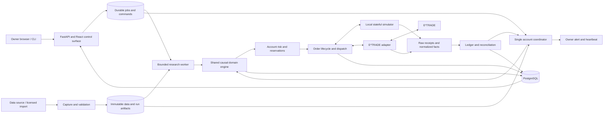

# AutoQuantTrader architecture

Status: authoritative design, consolidated 2026-09-08; Wave 0 supporting contracts remain frozen. Waves 0–2 are accepted, including the exploratory data port, standard halted process foundation and canonical offline economic engine. Wave 3 local research-workspace gates passed; GitHub release verification remains open. E*TRADE production read traversal passed under the owner-authorized margin-privilege amendment, retaining cash-funded strategy limits and separate connected-execution qualification gates. Continuous account coordination and connected execution remain later targets; no trading permission is changed by this document.

This is the sole current architecture. [IMPLEMENTATION_PLAN.md](IMPLEMENTATION_PLAN.md) is the sole delivery plan. The [design review](reviews/2026-09-08-design-review.md) records the independent baseline, comparison with the previous GPT-5.6 Sol design, and code evidence. Historical ADRs retain their factual record; the explicit decisions below supersede conflicting future requirements. Implemented behavior remains unchanged until its migration wave passes.

Wave 0 now supplies the [frozen supporting contract pack](contracts/personal-v1/README.md), including [scope/defaults](contracts/personal-v1/scope-defaults.md), [core engine](contracts/personal-v1/core-engine.md), [account/runtime](contracts/personal-v1/account-runtime.md), [native dependency inventory](contracts/personal-v1/native-dependency-map.md) and [file ownership](contracts/personal-v1/migration-ownership.md). Apply the owner-authorized [account eligibility amendment](contracts/personal-v1/account-eligibility-amendment.md) to the frozen pack: margin privileges may be admitted for read qualification while cash funding, no borrowing and other strategy constraints remain. The historical contract bytes remain frozen. These specify this architecture; they are not competing roadmaps or implemented features. The [baseline](reviews/2026-09-08-wave0/baseline.md) records passing checks, six inherited document-check failures and unavailable qualification environments.

## 1. Product and scope

Build a personal quantitative research and automated execution tool that one owner can understand, operate, recover, and afford. Success means a reproducible research workflow and a reconciled account executing an owner-approved strategy within enforced limits. Profitability is a separate empirical question, not a software acceptance criterion.

| Decision | Personal v1 |
|---|---|
| Owner/account | One owner; one application-exclusive USD brokerage account with CASH or MARGIN privileges; one cash-funded, long-only strategy |
| Universe | DIA, IWM, QQQ, SPY initially; research may use a subset; declare fixed-universe selection bias |
| Cadence | Daily completed-bar decisions first; execution in a configured later regular session, with fresh execution-time observations |
| Instruments/orders | Long-only, whole shares, regular hours, DAY market orders; no shorting, leverage, derivatives, fractional orders, replacement, or extended hours |
| Broker | Preserve E*TRADE production as the selected live venue; qualify its practical session and account workflow early |
| Historical data | Tiingo EOD is the first candidate, conditional on current rights, schema, raw-price/action semantics and coverage; support owner-imported licensed snapshots through the same adapter |
| Interfaces | Existing Python core, CLI, FastAPI and React workspace; owner-authored versioned strategy artifacts |
| Compute | Existing Mac for supervised research and forward simulation; one dedicated always-on host before unattended execution |
| Storage | PostgreSQL operational state; immutable Parquet/object artifacts; DuckDB analysis when needed |
| Non-live venue | A stateful local simulated broker over captured/live observations; explicitly labeled simulated forward testing |

Do not build a SaaS product, general untrusted-code hosting, multi-account broker router, multi-strategy netting service, distributed trading cluster, native application, or ML platform. Intraday data, limit orders and a second broker are later scope decisions with their own execution evidence. The one-strategy restriction simplifies account attribution without weakening account-wide risk.

E*TRADE's documented session lifecycle requires user participation: inactive tokens can require renewal, and tokens expire at midnight US Eastern by default. The product therefore supports automated trading within an authorized session, with a visible daily authorization checklist; it cannot promise indefinitely unattended authentication. If this is incompatible with the owner's eventual operating requirement, reopen broker selection before implementing another adapter. [E*TRADE developer guide](https://developer.etrade.com/getting-started/developer-guides)

## 2. Current state versus target

Reviewed integrated code: `107fa79` in the active checkout. The older workspace checkout is `8685b56`, 161 commits behind that main revision. This is a static design/code review, not a fresh claim that tests or deployment qualification passed.

Waves 0–2 supply admitted historical archives, the sole causal economic engine, retained financial reducers and derived reports. Wave 3 integrates a local selectable dataset/run/report/comparison UI, durable research jobs and descriptive trial registration; its exact acceptance status is recorded in the implementation plan. The former golden path remains explicitly labelled history. The trader is still a non-ready preflight: authoritative broker application/reconciliation and a continuously operating execution path remain later work. Research completion cannot close those connected-execution gaps.

Target readiness must be reported separately as service health, research usability, source quality, account reconciliation, execution eligibility and live authorization. A healthy API or a passing fixture cannot set trading readiness.

## 3. Structure and runtime ownership

Use a modular monolith in the existing repository with three application processes. PostgreSQL and storage support them; ordinary process supervision manages their lifecycle.

| Process/module | Owns | Must not own |
|---|---|---|
| API/UI | Authenticated owner commands, job requests, durable read models and acknowledgements | Broker credentials, direct broker order calls, strategy execution |
| Research worker | Import jobs, historical runs, features, evaluation and report artifacts | Production order credentials or mutation of active account state |
| Account coordinator | Schedule, causal account state, risk admission, OMS, broker ingestion, reconciliation and command consumption | Unbounded research work or concurrent account takeover |
| Strategy subprocess | Approved code/configuration, bounded snapshot input and target output | Broker/network/secrets, direct SQL writes or risk overrides |
| Reconciler module | Independent polling schedule and startup barrier; observed-vs-expected differences | A second account writer or silent projection replacement |
| Supervisor/monitor | Process restart into safe startup, clock/heartbeat health and alert delivery | Automatic re-arm, automatic flatten, or brokerage permissions |

Use the existing packages and adapter/repository seams. Consolidate competing engine and risk entry points behind narrow interfaces instead of renaming the entire repository. No Kafka, Redis, Kubernetes, service mesh, TimescaleDB, or additional operational database is required. Keep PostgreSQL because the code already relies on real transactions, migrations and multi-process ownership; replacing it with SQLite would discard useful work and require requalification.

Research concurrency is resource-bounded and may be one job at a time on the owner's Mac. Separate connection pools and credentials prevent research load or failures from starving execution. Code-development task concurrency in the implementation plan is unrelated to runtime job concurrency.

Simulated-forward deployments cannot resolve production broker credentials or call production order endpoints. A coordinator-owned CLI/session helper handles owner OAuth authorization and ephemeral verifier handoff; the dashboard exposes only sanitized session state.

## 4. Core contracts and causal engine

The orchestration task freezes these contracts before parallel implementation changes their consumers:

| Contract | Required content |
|---|---|
| Instrument/session | Stable instrument ID, exchange calendar/version, symbol validity interval, currency, precision and supported actions |
| Dataset manifest | Source/rights reference, scope, schema, raw object hashes, transformations, coverage, data-quality class and timestamp semantics |
| Market event | Instrument, event time, source publication time if known, first observed time, effective availability policy, revision identity and provenance |
| Run specification | Strategy/code/configuration hash, dataset manifest, engine/runtime version, calendar, execution/cost model, evaluation partition and seed |
| Account snapshot | Causal cash/settlement/positions/marks, pending commitments, ledger revision, control/risk version and reconciliation status |
| Strategy target | Trigger/run identity, target whole-share position or allocation, validity horizon and explanation; no broker order fields |
| Order intent | Target lineage, deterministic internal ID, account, side/quantity, permitted execution window and exact economic payload |
| Risk decision | Snapshot/policy/intent identities, result/reasons, reservation IDs, version and expiry |
| Submission attempt | Broker/environment/account mapping, provider client ID, immutable payload, preview reference, send state and raw outcomes |
| Reconciliation result | Bounded observation coverage, account/order/fill/ledger differences, disposition, unresolved items and completion time |

Use one causal event loop in historical simulation, forward simulation and live composition. The strategy/domain logic is shared; clocks, market inputs and execution adapters differ. Shared logic does not imply identical fills across modes.

For each eligible event, validate time/provenance, advance market knowledge, apply known corporate actions/settlement and broker facts, update order state and ledger, rebuild the causal account projection, then run eligible strategy callbacks. Convert targets against filled positions **and outstanding commitments**, evaluate account risk, and schedule approved intents. No callback receives positions frozen at run start. A newly created order cannot fill from the event that created it.

Freeze a deterministic ordering for simultaneous market, action, execution, settlement and timer events, with stable tie-breaking and explicit unknown source times. Same timestamp alone must not confer causal precedence. Warmup, missing events, duplicate/revised data and session transitions have explicit behavior. Simulated randomness is seeded and recorded.

The current golden runner remains a regression oracle. The fixture callback, golden loop and Phase 3H economics must not evolve into three separate product engines. Phase 3H same-close/zero-cost economics is test-only and supplies no strategy qualification.

## 5. Data and scientific validity

Separate data identity, historical reliability, permission to retain/use it, and permission to trade. Hashes prove unchanged bytes; they do not prove correct economics or historical availability.

| Data class | Permitted use | Limitation |
|---|---|---|
| Synthetic fixture | Contract and accounting regression tests | No empirical strategy or provider evidence |
| Validated current-vintage history | Useful exploratory economics on a frozen licensed snapshot | Historical revisions/publication timing may be unknown; label survivorship and availability assumptions |
| Recorded-as-observed data | Causal replay beginning when the platform actually captured the observations | Cannot reconstruct what was known before the capture began |
| Qualified historical point-in-time data | Stronger historical claims within documented vendor/vintage coverage | Qualification is scope-specific and still requires causal features, universe and execution modeling |

Current-vintage history is allowed to produce honest exploratory reports. It is insufficient by itself to certify a historically point-in-time strategy or qualify live deployment. Qualification must combine suitable data, sensitivity to its limitations, and forward observations. If a strategy depends on unavailable historical facts, reject its evidence or collect a forward record rather than manufacturing timestamps.

Preserve factual `observed_available_at` separately from an exploratory `simulated_available_at_policy`. A historical timing assumption may drive a current-vintage simulation only when its class/report declares that assumption; it must never overwrite receipt history or be promoted to observed/vendor publication evidence. Temporal-invariance tests cover both factual and assumed-availability modes.

An owner-reviewed, versioned validation report can admit data to the appropriate research class. Unavailable external provenance producers and independent-review machinery are not prerequisites for personal exploratory economics. Rights and actual source quality checks remain required; absent evidence remains absent. This supersedes the current captured-tape gate's permanently negative product path through a future versioned migration.

Keep raw responses and normalized data separate. Record session coverage, missing/duplicate rows, OHLCV consistency, source identity, price basis, ticker lifecycle, splits and dividends. Use raw execution-price semantics and account for each action once. Adjusted research series cannot silently become executable prices or combine with duplicate dividend/split postings. Handle cash-in-lieu explicitly before admitting affected periods; otherwise exclude the affected scope with a visible reason, not fabricated cash or dropped rows.

Daily data availability is governed by the provider's actual delivery pattern and configured latest acceptable decision time, not a one-minute-bar 15-second deadline. Use exchange calendars for holidays, half-days and daylight saving time. A missed daily decision is skipped and reported; it is not replayed as a backlog of market orders on reconnect.

The first historical adapter is Tiingo if its current terms and actual data satisfy the declared class. Keep the normalized port provider-neutral and stop expanding Sharadar/Massive in parallel. Provider substitution requires a recorded decision, not a silent change to dataset semantics.

## 6. Research, simulation and reports

Implement a selectable dataset and configurable owner-authored strategy path, beginning with a buy-and-hold/rebalance baseline and a simple trend rule. These are engineering/research references, not investment recommendations.

The W3 local research implementation pairs an explicit SQLite or PostgreSQL database with a private content-addressed typed JSON object store. Immutable requests bind data, calendars, source build, configuration and report conventions. One resource-bounded child resolves inputs, executes the existing engine and validates reports while the supervisor maintains lease/cancellation control. A final database fence authorizes publication. The two reference rules expose an explicit no-fit artifact and descriptive prior-access declarations; no automatic strategy selection or untouched-holdout status is inferred from this workflow.

File-backed research SQLite explicitly uses WAL with full synchronization on a supported patched runtime. Coherent read snapshots release their transactions before typed replay where possible; writers retain immediate transactions and claim fences. WAL is limited to a local filesystem on one host. The research runbook defines coordinated conversion and backups that retain committed WAL contents together with immutable objects. Other database profiles retain their existing configuration.

Historical signals use only completed, available data. Daily signals cannot trade at the same close used to compute them. Freeze the later-session execution schedule before a run. A next-open proxy is an explicitly named exploratory model; a fixed later intraday execution time requires observations for that time. Daily OHLC cannot establish quote spread, queue position or intraday path. Forward capture and conservative stress bridge model uncertainty; unsupported execution claims block qualification.

The simulator models session eligibility, activation latency, cash/settlement, fees, adverse spread/slippage, partial fills, cancellation, rejection and liquidity limits for the supported order subset. Keep a simple deterministic full-fill model for regression/exploration, but label it. A limit-order model is deferred until quote and fill semantics are qualified. Fault simulation separately covers network and broker ambiguity; it is not an empirical fill model.

Every report is calculated from run events and ledger projections, including terminal open positions. Report daily marked NAV, cash flows, total and time-weighted return, realized/unrealized P&L, fees, turnover, exposure, drawdown and benchmark performance. Store metric definitions, annualization/calendar convention, risk-free input where relevant and uncertainty. Insufficient observations or zero variance produce `undefined`, never a flattering zero or infinity. Do not copy golden fixture constants into general reports.

Freeze valuation frequency, stale/missing marks and event-timed external-flow treatment. Split return subperiods at cash flows when marks support it; label approximations otherwise. Benchmark contributions/withdrawals use the same timing. A period-end cash-flow adjustment from a fixture is not a general time-weighted-return method.

Research records the hypothesis and every attempted configuration, then uses chronological training/validation and untouched final holdout. Fit preprocessing and parameters only on training data; use purging/embargo when labels or overlapping horizons require it. Walk-forward evaluation, realistic/adverse costs, parameter stability and simple benchmarks precede promotion. Additional multiple-testing corrections depend on the search size; no arbitrary Sharpe threshold certifies a strategy. Repeated selection among trials creates overfitting risk even when individual backtests look strong. [Bailey et al., The Probability of Backtest Overfitting](https://www.davidhbailey.com/dhbpapers/backtest-prob.pdf)

Freeze strategy/configuration, data specification, costs and acceptance criteria before holdout or forward evaluation. A material change creates a new candidate and invalidates affected evidence. Failed strategy economics do not justify tuning on the holdout; return to a new research trial. Operational completion can be reported even when no strategy qualifies for live trading.

Every evaluation fold declares warmup, fitted-state scope, strategy/account reset versus continuous carry, and scored intervals. Warmup may use eligible earlier history without scoring it. Overlapping scored windows cannot silently double-count returns. Validation/test perturbations cannot change training-fitted parameters or earlier causal decisions.

## 7. Accounting and account-wide risk

Retain the existing Decimal-based balanced append-only journal, FIFO lots, settlement, dividends/splits and corrections. Broker execution/activity identifiers drive idempotent postings. Order acknowledgements and cumulative averages are not substitutes for distinct fills or corrections. Deposits/withdrawals change capital, not strategy profit. Mark stale positions explicitly. Maintain expected ledger state and observed broker state separately; reconcile through explained events or adjustments with provenance.

Use one risk entry point shared by simulation and execution. In one account-serialized database transaction, validate the causal snapshot, control/risk versions and active ownership, then publish the whole decision batch, reservations and durable outbound work. Row locking supports this serialization; broker calls remain outside database transactions. [PostgreSQL locking documentation](https://www.postgresql.org/docs/current/explicit-locking.html)

Mandatory v1 checks: account/instrument/session eligibility; fresh decision and execution inputs; settled/available cash and shares under the cash-funded financing policy; separately qualified margin liabilities, restrictions and reserve overlap; per-order/batch/account notional; concentration; gross exposure; pending-order capacity; repeat-intent/order-count and API budgets; loss/drawdown limits; current reconciliation and operator control. Pending sells do not fund unconfirmed buys. Approved-unsent, UNKNOWN, working, partial and pending-cancel orders retain conservative capacity until authoritative release.

The inherited ADR 0068 numerical envelope is owner-selected **paper-only**, and depends partly on one-minute/SIP observations. Preserve it for its historical profile. Define a separate daily-v1 policy whose mandatory rules have actual producers; do not label an E*TRADE quote as consolidated NBBO without source evidence or interpret missing advanced metrics as passing. Intraday volatility, SIP-specific and sophisticated capacity metrics can be deferred in the new profile explicitly. This is a proposed scope/policy change, not permission to disable existing gates in place. Live capital and loss limits require their own owner-approved values.

Cut over a policy only while paused/quiesced, after reconciling and enumerating all existing commitments. Preserve pending/working/UNKNOWN reservations and original decision-policy bindings; switch only new decisions. Policy retirement never releases holds or rewrites history. A fresh quote or pre-submit price check cannot cap a market-order fill price. Actual fills beyond estimated cash/cost bounds still enter the ledger and trigger risk/reconciliation handling; never discard an inconvenient execution as invalid.

## 8. Orders, E*TRADE and recovery

E*TRADE sandbox supplies stored samples and is for protocol checks, not stateful paper fills or real economic evidence. Keep sandbox credentials, account mapping and endpoints isolated from production. E*TRADE's individual API keys support personal-use applications. [E*TRADE developer guide](https://developer.etrade.com/getting-started/developer-guides), [E*TRADE getting started](https://developer.etrade.com/getting-started)

The broker adapter implements bounded authenticated account/balance/portfolio/order/transaction reads, Preview, Place and Cancel. Use reviewed SDK/library primitives where suitable, standard TLS, fixed environment endpoints, redacted diagnostics and versioned secret-store references. Persist raw non-secret response evidence before deriving economic facts. OAuth token responses and headers stay in secret storage, never the ordinary raw journal.

Persist the internal order-to-provider client-ID mapping and exact payload before effects. E*TRADE documents an account-unique alphanumeric client ID of at most 20 characters which is absent from responses, and a preview validity window of three minutes. Use a shorter local preview TTL and revalidate before Place; do not design recovery around a nonexistent documented client-ID lookup. Preview acceptance alone is not permission to place. Unknown business messages or stale inputs block submission. [E*TRADE Order API](https://apisb.etrade.com/docs/api/order/api-order-v1.html)

Submission protocol:

1. Persist intent, capacity reservation and attempt under the account transaction.
2. Preview the exact payload with a fresh session, binding, price/risk/control state and request permit; retain sanitized evidence and classify business outcomes.
3. Recheck all gates and preview identity/age immediately before dispatch; persist a single-use send claim before Place.
4. Perform Place at most once for that attempt. Record definitive rejection/acceptance or durable `UNKNOWN` if acceptance cannot be established.
5. Apply confirmed fills/corrections independently of order-status messages. Keep cancellation requested until terminal broker evidence; late fills remain possible.

A crash after the send claim may be indistinguishable from a sent request. Never recycle the attempt automatically. E*TRADE UNKNOWN recovery gathers overlapping order/activity/balance/position evidence and requires owner disposition, broker confirmation when necessary, and a fresh reconciliation barrier before re-arm. Similar symbol/quantity/time matches alone are not authoritative identity. Failure to find an order does not prove it was never submitted.

An ambiguous Place immediately latches `HALTED` for new exposure and preserves all commitments. An ambiguous Cancel remains unresolved/pending-cancel with reservations intact; v1 does not automatically reissue it. Reconcile late fills and require disposition before re-arm. A failed/stale preview can restart with full validation only when no Place could have occurred; creating another attempt cannot escape a send-claimed/UNKNOWN latch.

Core lifecycle includes approved/queued, previewed, send-claimed, acknowledged, partially filled, filled, rejected, pending cancel, canceled, expired and UNKNOWN. Model attempt state separately from economic order state: a late fill can affect accounting even after cancellation or an earlier timeout. Order replacement is unsupported in v1 and fails explicitly.

Retry policy is effect-specific. Bounded read-only retries use new journal identities, fresh credentials/permits and backoff. Transient read failures need not permanently poison the account. Do not inherit single-use Place restrictions for every GET. Preview/cancel policies reflect their documented effects; no retry implies successful cancellation. Alerts may retry with incident deduplication because a duplicate warning is preferable to silently losing a critical alert.

## 9. Single owner and reconciliation

One coordinator owns one account lease/generation. Revalidate ownership and control before each effect, fail closed on database loss, and stop dispatch on expiry, clock anomalies or host suspension. A retail broker does not enforce local fences; there is no claim of universal exactly-once behavior. V1 has no automatic failover. A replacement requires confirmed old-worker termination, bounded in-flight uncertainty review, reconciliation and owner re-arm.

Startup/reconnect enters `RECONCILING`. Fetch bounded overlapping paginated orders and activities plus balances and positions, persist raw observations, normalize/deduplicate supported facts and rebuild expected projections. Repeat economic comparisons within the configured convergence budget. Page exhaustion or two equal pages alone does not establish isolated snapshots, unique fill identities or correct cash. Coverage, pagination, activity identity, corrections and settlement must all be accounted for.

Classify expected bounded lag, missing/duplicate execution, external trade, cash-flow difference, corporate action, unknown order and unsupported activity. Block new exposure on unresolved economic discrepancies. Owner-approved external activity adoption creates traceable ledger facts; the default for foreign trades in the exclusive account is halt and review. Tolerances are versioned per field/currency and never used to conceal missing trades. Periodically compare with broker statements independently of the API.

## 10. Controls and personal operations

Keep durable, authenticated, idempotent owner commands with request, acknowledgement, progress and terminal result. Existing severity/latch behavior may remain internally; the interface must describe effects plainly.

Serialize command application and dispatch claims under the account boundary. API receipt means requested, not applied. After pause is applied, no new send claim may be created; already claimed or in-flight effects remain tracked and can finish or become UNKNOWN. Halt cannot retract a network request already underway.

| Action | Required result |
|---|---|
| Pause new risk | Stop new exposure promptly; continue observation, reconciliation and permitted recovery |
| Cancel open orders / drain | Request cancellations and report each unresolved order; complete only on terminal evidence |
| Flatten | Separately approved reduce-only workflow; display residual positions and incomplete outcomes |
| Halt | Latched block on new exposure; cancellation and specifically approved emergency actions remain distinct |
| Stop process | Stop the local runtime even when a data/clock dependency is unhealthy; report that broker orders/positions may remain |
| Re-arm | Owner action after current readiness, reconciliation and blocker disposition; never triggered by restart or CI |

Use synchronized UTC for timestamps, monotonic clocks for elapsed deadlines, database authority for durable leases, and drift/staleness/regression/suspension checks. Retain useful existing trusted-time domain tests. Replace the custom remote head-anchor/signature/native lifecycle machinery with ordinary host time-health and process supervision for personal v1. This assumes an owner-controlled host and reviewed strategy artifacts; backups/checksums are not an adversarial rollback-proof service. No code guard is bypassed in this planning phase. The replacement must pass fault tests before old machinery leaves runtime/build prerequisites.

The dashboard is local/private by default with authenticated server sessions, HttpOnly cookies, CSRF protection, bounded commands, explicit environment/account banners and secret-free read models. Do not require Auth0, public ingress or remote multi-user identity for local research. A later remote UI uses private access plus appropriate TLS/session controls and a reviewed access design.

Use normal least-privilege OS identities and resource-limited strategy processes with no broker secrets. No arbitrary hostile Python upload service. Keep dependencies locked and execution artifacts/configurations immutable by digest. Simplify generated AST/seal checks to stable boundary and behavior tests during migration; retain financial correctness and effect-isolation tests.

Initial operations use local PostgreSQL/Compose for development, keeping existing Supabase smoke records historical. A dedicated exposure-capable environment must prove database availability, backup/restore and secret separation; no free-tier service receives assumed durability guarantees. Unattended sessions need a dedicated awake host, external heartbeat monitoring and an owner alert route. Daily authorization/re-arm remains owner-controlled.

Before live: prove encrypted off-host backup and restore, broker-statement/cursor-based gap recovery, one release rollback rehearsal and alert delivery during host failure. A restore starts halted and reconciles; restoring yesterday's database cannot erase today's brokerage exposure. Run only compatible migrations while quiesced; preserve ledger history and use forward repair over destructive downgrade. Broker-native/manual access remains available outside the application.

## 11. Evidence, budgets and design precedence

The [operational budget specification](OPERATIONAL_BUDGETS.md) defines proposed targets and required measurements; the plan owns exit gates. Keep four distinct evidence classes: economic research, causal replay/shadow, stateful simulated operation, and provider/live execution. Neither sandbox samples nor paper profitability establish live fills.

Test temporal/accounting properties, state-machine races, PostgreSQL contention, adapter fixtures, real authorized read behavior, clean startup, crash boundaries, corrupted state, stale data, token expiry, restore and owner workflows. Use small independent arithmetic examples and multiple datasets/strategies; do not equate a large fixture test suite with an operational platform.

| Earlier design commitment | Current target decision | Migration |
|---|---|---|
| PostgreSQL, Parquet, pure domain, FIFO ledger, atomic reservations | Retain and integrate | Waves 1–5 |
| One owner/account/strategy; E*TRADE live target | Retain; daily-first and session-supervised | Waves 0–1 |
| Alpaca execution build as a prerequisite | Historical adapter only; stateful local simulation and E*TRADE qualification | Waves 4–7 |
| Captured-data eligibility depends on unavailable authoritative provenance/review producers | Owner-reviewed research classes; no invented PIT claims | Waves 0–3 |
| Multiple fixed fixture economic paths | One causal account engine; golden cases remain tests | Waves 2–3 |
| Native trusted-time lifecycle, remote signed anchors and attestation ceremony | Deferred outside personal-v1 critical path; standard clock/process controls | Waves 0–1, verified in Wave 5 |
| Intraday/SIP paper-risk profile as universal prerequisite | Separate supported daily policy; historical values do not authorize live | Waves 0, 4 |
| Auth0/public browser/cloud stack before a useful local product | Local/private authenticated surface; dedicated host only for unattended use | Waves 1, 5 |
| Permanently stalled read/alert attempt after any uncertainty | Bounded observable retry for non-order reads/alerts; Place uncertainty remains latched | Waves 1, 4–5 |
| Chronological phase/subphase narrative as current roadmap | Outcome waves with an integration barrier and at most three workers | All waves |

These are priorities for future implementation even where replacing existing work is necessary. Historical ADRs and runbooks describe the old contracts until the relevant replacement lands. No previous operational approval, credential, paper risk envelope, native enrollment or fixture pass transfers automatically to the new runtime or live profile.
