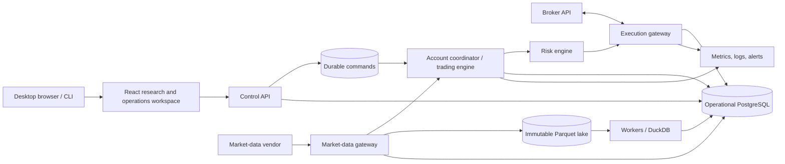
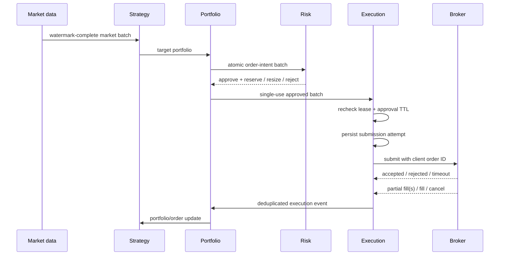

# AutoQuantTrader architecture

## 1. Product definition

AutoQuantTrader will let a single operator:

1. ingest and validate historical and live market data;
2. write versioned quantitative strategies against a stable strategy API;
3. run reproducible event-driven backtests with realistic trading costs;
4. compare experiments and inspect trades, exposures, and failure modes;
5. deploy an approved strategy to a paper account;
6. monitor signals, orders, fills, positions, P&L, health, and risk in real time;
7. stop trading safely and reconcile local state with the broker;
8. promote a proven deployment to live trading through an explicit human gate.

### Initial scope

- Asset class: a small, fixed universe of liquid U.S. ETFs first, then U.S.
  equities after corporate-action and security-lifecycle tests pass.
- Frequency: end-of-day and intraday bars, initially 1 minute or slower.
- Trading behavior: regular market hours, long-only, whole-share DAY market
  orders in the first execution slice. Limit orders follow only after quote-aware
  simulation and broker tests exist.
- Operator model: one user and one brokerage account, with at most one active
  trade-enabled deployment. Multiple strategies may be researched and
  backtested; shared-account netting and virtual strategy sleeves are post-v1.
- Broker: Alpaca paper trading first, behind a broker-neutral adapter.
- Interfaces: Python strategy SDK, CLI for automation, and a desktop-oriented
  browser workspace for research, control, and observation.
- Deployment: Docker Compose locally; one small cloud environment when paper
  trading begins.

The repository currently completes Phases 0 and 2 against deterministic local
fixtures and implements the Phase 1 ingestion/admission contracts without a
licensed admitted vendor. Phase 2 includes the canonical reducers, durable
fenced batch/submission/reservation lifecycle, and fixture-only research
job/report/API/UI/worker path. It does not implement the target paper/live
topology below: the trader remains `not_ready`, Phase 4 is gated, and no real
broker or production market-data adapter is enabled.

### Non-goals for v1

- High-frequency or latency-arbitrage trading.
- Options, futures, FX, crypto, multi-leg orders, or short-locate workflows.
- Multi-tenant SaaS, customer billing, or social strategy marketplace.
- Broker-dealer functions, direct exchange access, co-location, or FIX.
- Machine-learning platform infrastructure beyond consuming a versioned model
  artifact from a strategy.
- A drag-and-drop strategy builder.
- Extended-hours trading, order replacement, internal crossing, or multiple
  strategies sharing one live account.
- Native desktop packaging, native mobile applications, touch-specific mobile
  workflows, PWA installation, service workers, or offline trading.

These constraints are deliberate. A safe, correct event-driven engine for one
asset class is a better foundation than shallow support for many markets.

## 2. Architectural principles

1. **One canonical decision path.** The promotion backtest, shadow, paper, and
   live modes use the same strategy, portfolio, sizing, accounting, and risk
   interfaces. Only the clock, data source, and execution adapter change. Fast
   vectorized notebooks may explore ideas but cannot produce promotion evidence.
2. **Events are facts.** Market observations, signals, order intents, risk
   decisions, submissions, broker updates, fills, and reconciliation results
   are immutable, timestamped records.
3. **The broker is authoritative.** Local state is a projection. On startup,
   reconnect, or disagreement, reconciliation prevents new orders until the
   difference is resolved according to policy.
4. **Risk is independent of strategy.** A strategy proposes an intent; a
   separate risk pipeline may resize or reject it. The strategy cannot bypass
   the risk gate or broker adapter.
5. **Point-in-time reproducibility is a feature.** Every run records code,
   strategy parameters, first-seen or revised dataset policy, feature artifacts,
   calendar/tzdata, fee/slippage model, random seed, schema, and runtime image.
   Backtests see an event only when it would have been available, not merely
   when the underlying market interval occurred.
6. **Safe by default.** Paper mode is the default. Live mode requires separate
   credentials, explicit configuration, an approval record, and a startup
   readiness check.
7. **Simple operations first.** Begin as a modular monolith with separately
   runnable processes. Split a boundary into a service only when scaling or
   failure isolation is demonstrated to require it.
8. **Effect-idempotence, not exactly-once claims.** A database transaction and a
   broker HTTP call cannot commit atomically. Durable attempts, deterministic
   client IDs, broker lookup, deduplication, and reconciliation make retries
   safe; unresolved submissions fail closed.
9. **One writer per account.** An account-scoped lease with a monotonically
   increasing fencing generation is revalidated before every broker side effect.
   Losing ownership or database connectivity blocks new submissions. Because a
   retail broker does not enforce our fencing token, v1 disables automatic
   failover: takeover waits a safety interval and completes reconciliation under
   explicit operator control.

## 3. Recommended stack

| Area | Choice | Rationale |
|---|---|---|
| Core/runtime | Python 3.12+, typed synchronous domain core, `asyncio` adapters | Deterministic replay in the core; async only at broker/data/control I/O edges |
| API | FastAPI + Pydantic | Typed HTTP/SSE contracts and generated API schema |
| Research | NumPy, Polars, SciPy, DuckDB | Columnar feature work and efficient scans over immutable Parquet partitions |
| Dataset storage | Content-addressed Parquet on local/S3-compatible storage | Cheap immutable raw/normalized/feature snapshots with partition checksums |
| Operational database | PostgreSQL 16 | Orders, ledger, risk reservations, commands, jobs, audit, and dataset manifests |
| Hot time series | PostgreSQL first; TimescaleDB only after profiling | Avoids making an extension and a shared hot/history database mandatory |
| Migrations | Alembic + SQLAlchemy | Explicit schema evolution and repository/unit-of-work patterns |
| Jobs | A database-backed job queue initially | Fewer moving parts; migrate to Redis Streams only after measured need |
| Frontend | React + strict TypeScript + Vite | Static desktop-browser SPA; avoids native packaging and an unnecessary SSR runtime |
| UI libraries | React Router, TanStack Query, MUI Community, ECharts | Routing, remote-state synchronization, accessible controls/grids, and analytical charts |
| Browser auth | Auth0 OIDC with server-side tokens/session cookie | Keeps identity tokens and broker/vendor secrets out of browser storage |
| Observability | OpenTelemetry, Prometheus, Grafana, structured JSON logs | Correlated traces, metrics, logs, and alerts |
| Packaging | `uv`, Ruff, mypy/pyright, pytest | Fast deterministic environments and strict automated checks |
| Deployment | Docker Compose, then managed PostgreSQL and containers | Local parity with a modest production footprint |
| Secrets | `.env` only for local development; cloud secret manager elsewhere | Keeps credentials out of code, images, logs, and database rows |

PostgreSQL is the transactional source of truth for operational state and
metadata, not the historical research lake. DuckDB/Polars scan immutable
Parquet partitions directly; PostgreSQL may retain a bounded window of recent
live bars. TimescaleDB is introduced only if profiling shows a sustained hot
time-series query need. This prevents parameter sweeps from competing with the
order ledger for database I/O.

## 4. System context



## 5. Runtime topology

All processes live in one repository and import the same domain packages.

### API process

- Authentication and operator authorization.
- Strategy, dataset, backtest, deployment, and risk configuration endpoints.
- Read models for dashboard views.
- Resumable SSE stream for operational updates and query invalidation.
- Persists control commands: start, pause, drain, resume, flatten, and kill
  switch. It never calls the broker or trading engine directly.

### Worker process

- Historical ingestion and validation.
- Feature computation and dataset snapshots.
- Backtest execution and report generation.
- Scheduled maintenance, retention, and integrity jobs.
- Uses separate database roles/pools and bounded CPU/memory concurrency so
  research cannot starve the live account coordinator.

The current local worker ingests the deterministic Phase 1 fixture, installs
the immutable Phase 2 golden research catalog, and polls durable fixture jobs.
It executes only the repository-owned golden runner under a bounded job claim;
arbitrary strategies, licensed datasets, and paper/live work are not accepted.

### Trading process

- An account coordinator obtains the renewable account lease and fencing
  generation; PostgreSQL prevents two current owners. A replacement coordinator
  cannot trade until the old lease has expired, the takeover safety interval has
  passed, and the reconciliation barrier succeeds.
- Exactly one trade-enabled deployment per account in v1.
- Consumes normalized market events.
- Builds watermark-complete market batches and invokes the strategy through a
  supervised subprocess with a decision deadline. Broker/risk handling remains
  alive if strategy computation crashes or times out.
- Converts target positions into order intents.
- Passes every intent batch through accounting and risk reservation checks.
- Atomically persists orders, single-use risk reservations, and durable
  submission attempts before broker I/O.
- Processes order/fill updates idempotently and updates projections.
- Emits heartbeats and refuses to trade when readiness conditions fail.

### Reconciler process

- Runs as a barrier at startup and after reconnects, then periodically and on
  demand. The account cannot enter `RUNNING` before the barrier passes.
- Compares open orders, fills, cash, buying power, and positions with the broker.
- Reconciles a bounded snapshot/fill cursor twice when provider snapshots are
  not atomic; records manual or foreign broker activity under an explicit
  adopt-or-halt policy.
- Classifies differences as expected lag, recoverable mismatch, or critical.
- Blocks affected strategies or the whole account until critical mismatches are
  resolved.

The trading and reconciliation loops may begin in one OS process, but they
remain separate modules and state machines. If PostgreSQL becomes unavailable,
new orders fail closed while the process continues consuming broker updates as
far as it can; recovery always requires reconciliation.

Deployment lifecycle is explicit and audited:

```text
DRAFT -> APPROVED -> STARTING -> RECONCILING -> SHADOW/RUNNING
                                      |              |
                                      v              v
                                   HALTED    PAUSED/DRAINING/FLATTENING
                                                      |
                                                      v
                                               STOPPED/HALTED
```

Only an authenticated human can approve, arm, resume, or promote. Process
restart does not imply strategy resume.

## 6. Domain boundaries

```text
market_data    normalization, calendars, bars, corporate actions, quality
strategy       strategy protocol, parameters, signals, version metadata
portfolio      targets, valuation, target-to-order conversion
accounting     immutable ledger, cash, lots, positions, P&L projections
risk           pre-trade rules, account limits, circuit breakers, approvals
execution      order state machine, broker protocol, idempotency, recovery
backtest       simulated clock, fill model, costs, run orchestration, metrics
deployment     strategy instances, environments, lifecycle and configuration
reporting      performance, attribution, exposure, experiment comparison
platform       auth, jobs, audit, outbox, configuration, observability
```

Dependency direction is enforced by an automated import-boundary test:

```text
domain primitives       -> standard library only
bounded domain modules  -> primitives and declared public domain contracts
application workflows   -> domain modules and abstract ports
infrastructure adapters -> ports, SQLAlchemy, vendor SDKs, storage clients
composition roots       -> wire workflows and adapters for API/worker/trader
```

SQLAlchemy models, Pydantic transport models, broker SDK objects, filesystem
paths, and network clients never enter domain modules. Cross-module calls use
public contracts rather than importing another module's internals.

## 7. Core contracts

The exact syntax may evolve, but these boundaries should be stable:

```python
class Strategy(Protocol):
    def initialize(
        self, context: StrategyInitializationContext
    ) -> VersionedStrategyState: ...
    def on_market(
        self, context: ReadOnlyStrategyContext, batch: MarketBatch
    ) -> StrategyTransition: ...
    def on_clock(
        self, context: ReadOnlyStrategyContext, event: ClockEvent
    ) -> StrategyTransition: ...
    def on_order_update(
        self, context: StrategyContext, update: OrderUpdate
    ) -> None: ...

class MarketDataPort(Protocol):
    async def stream(self, subscription: Subscription) -> AsyncIterator[MarketEvent]: ...
    async def history(self, query: HistoryQuery) -> list[Bar]: ...

class BrokerPort[ResultT](Protocol):
    def submit(
        self,
        intent: OrderIntent,
        risk_decision_id: str,
        submission_attempt_id: str,
    ) -> ResultT: ...

class BrokerControlPort(Protocol):
    async def cancel(self, broker_order_id: str) -> None: ...

class BrokerRecoveryPort(Protocol):
    async def find_by_client_id(self, client_order_id: str) -> BrokerOrder | None: ...
    async def open_orders(self, cursor: str | None) -> BrokerOrderPage: ...
    async def account_snapshot(self) -> BrokerAccountSnapshot: ...
    async def fills_since(self, cursor: str | None) -> BrokerFillPage: ...
    async def updates(self) -> AsyncIterator[BrokerEvent]: ...

class RiskRule(Protocol):
    def evaluate(
        self, batch: OrderIntentBatch, snapshot: VersionedRiskSnapshot
    ) -> RiskDecision: ...
```

`BrokerPort` is the narrow authorized-submission capability implemented by the
pure simulator. Future paper/live adapters compose it with the asynchronous
control, recovery, reconciliation, and update-stream capabilities instead of
granting every caller one broad broker authority object.

`MarketBatch` is a replay-proof-constructed decision slice for an `as_of`
timestamp; callers cannot manufacture a strategy-eligible complete batch. It
includes its watermark, expected/received instruments, missing-data status, and
late-event policy. The strategy context binds that batch's exact identity and
semantic digest, not only its timestamp. This removes symbol-order and
same-timestamp substitution from cross-sectional strategies. `TargetPortfolio`
declares whether it is a full snapshot or delta, binds a typed market-batch or
clock-event decision trigger, stores targets as an immutable, sorted, unique
tuple, and carries the strategy/version, target ID, `as_of`, expiry, and
rebalance generation. The current intent converter still requires an exact
causal `PortfolioSnapshot`, but it accepts either the exact complete market-batch
trigger or a clock-event trigger whose snapshot supplies independently causal
price and valuation evidence.

Strategies emit **targets** (desired quantity or portfolio weight), not broker
orders. The portfolio layer converts the single active strategy's targets into
an atomic intent batch. Multi-strategy netting, internal crossing, and fill/cost
allocation are deliberately deferred until a strategy-sleeve design is proven.

### Temporal and decision semantics

Every market observation distinguishes:

- `event_time` and, for bars, `interval_start`/`interval_end`;
- `vendor_published_at`, `received_at`, `available_at`, and `ingested_at`;
- source ID/sequence, schema version, correction revision, and first-seen flag.

The live engine closes a decision batch only after its configured watermark.
The backtester replays `available_at`, not just exchange time. A decision based
on a completed bar cannot fill using that bar's high, low, close, or volume; the
default market-order model activates at the next eligible market event after
modeled decision and submission latency. Simultaneous events have a documented,
stable sort key, facts at a timestamp precede a watermark closed at that same
timestamp, and watermarks cannot regress in event time when read in canonical
closed order. Corrections are new facts and never rewrite an event tape. A
source plus observation identity is globally bound to one instrument/event-time
revision chain. Semantic material uses UTC, compact context-independent decimal
text, and typed length-safe Phase 2 identifiers.

Strategies receive a causal, read-only context and cannot query arbitrary
databases. Deterministic random generators, calendars, and any fitted feature
state are injected and versioned. Strategy callback state is externally carried,
bounded, immutable, and digest-chained: every callback advances one generation
and binds its exact predecessor, strategy/configuration/schema versions,
decision trigger contract, and UTC time. Initialization sees only replay start plus copied initial
positions, never future tape or schedule contents.

## 8. Event and order lifecycle



Do not compress the lifecycle into one enum. It contains related state machines:

```text
intent:      CREATED -> APPROVED/RESIZED/REJECTED -> CONSUMED/EXPIRED
submission:  PENDING -> ABANDONED
             PENDING -> IN_FLIGHT -> CONFIRMED/UNKNOWN -> RESOLVED
broker:      PENDING_NEW -> WORKING -> PARTIALLY_FILLED -> FILLED
                              |  +-> PENDING_CANCEL -> CANCELED/CANCEL_REJECTED
                              +----> REJECTED/EXPIRED
```

`RESOLVED` is the Phase 4 reconciliation transition in this vocabulary; the
current durable readiness boundary rejects every persisted `RESOLVED` attempt.
Its local deterministic path supports `ABANDONED`, `CONFIRMED`, and frozen
`UNKNOWN` heads only.

Replace/amend orders are out of scope for v1. Cumulative fills and cash/security
ledger entries are tracked independently from broker status, so a late fill,
trade bust, or correction is applied idempotently even after a cancel response.
Terminal-status duplicates never reopen working state, but they also never cause
a legitimate new execution ID to be discarded.

### Single-writer and submission protocol

Before each external side effect, the account coordinator revalidates its lease
and fencing generation. Risk evaluates the complete intent batch against one
immutable account/price snapshot and atomically creates cash/notional/exposure
reservations. Reservations cover approved-unsent, `UNKNOWN`, working, partially
filled, and pending-cancel orders; they have an expiry and are single-use.

The fencing generation is embedded in attempts/client IDs for detection and
audit, but the broker cannot reject a stale generation. Therefore v1 never
performs automatic coordinator failover. A manual takeover quarantines the
account for longer than the maximum in-flight request window, confirms the prior
runtime is stopped where possible, then runs the full reconciliation barrier.

The broker submission protocol is deliberately effect-idempotent:

1. atomically persist the order, payload hash, risk reservation, fencing
   generation, deterministic client order ID, and pending attempt;
2. recheck ownership, approval TTL, price freshness, and kill state;
3. mark the immutable attempt in flight and call the broker once;
4. on timeout/ambiguous response, enter `UNKNOWN` and query by client order ID;
5. reconcile stream events and paginated REST snapshots through an inbox keyed
   by provider event/execution ID;
6. never create a replacement submission while `UNKNOWN` remains unresolved.

The current Phase 2 SQL boundary implements durable preparation, transaction-
time fence checks before preparation and `IN_FLIGHT`, a dispatch event carrying
the fresh current-lease receipt, proven-unsent stale-`PENDING` recovery to
`ABANDONED`, append-only outcome evidence, UNKNOWN recovery/freezing, and the
replacement prohibition for deterministic simulation. A real broker inbox,
bounded provider lookup, external reconciliation service, automatic or manual
takeover barrier, and operator re-arm remain Phase 4 work.

A transient “not found” is not enough to resubmit: the adapter applies a bounded
lookup/reconciliation policy because broker read paths can lag write paths. A
broker adapter is not eligible for live use unless deterministic lookup and
recovery semantics are contract-tested.

Each adapter also publishes a capability matrix: order types, time-in-force,
sessions, fractionality, tick/lot rules, client-ID constraints, lifecycle
mappings, pagination/cursors, stream-resume behavior, and request budgets.
Unsupported combinations are rejected locally before risk approval.

### Reconciliation barrier

Startup and reconnect recovery use a race-aware barrier:

1. enter `RECONCILING`, block new exposure, and connect while buffering broker
   events;
2. fetch paginated account, position, open/recent order, fill, and non-trade
   activity snapshots with an overlap window;
3. apply snapshots and buffered events through the same idempotent inbox/reducers;
4. repeat from the last cursor until two economically equivalent views converge;
5. classify any manual/foreign activity under the v1 exclusive-account policy;
6. become `RUNNING` only when ledger/account projections agree and all unknown
   submissions are resolved.

Expected provider lag is time-bounded and never permits new exposure while an
economically relevant difference exists. Unresolved submission uncertainty
halts new account exposure, while cancel and authenticated reduce-only recovery
remain available.

## 9. Persistence model

Key tables and invariants:

| Table | Purpose / invariant |
|---|---|
| `instruments` / `instrument_identifiers` | Stable security identity plus effective-dated, knowledge-time symbol/venue/tradability mappings |
| `corporate_action_revisions` / `corporate_action_sets` | Append-only announcement/effective timestamps, strict split/dividend/merger/symbol-change/delisting terms, and ordered versions |
| `data_objects` / `dataset_partitions` | Content-addressed Parquet object, semantic/byte hashes, schema, ranges, rows, layer, and quarantine state |
| `ingestion_jobs` | Idempotency key, source checksum, lifecycle, and publication/quarantine counts |
| `market_events_hot` | Optional bounded operational cache; uniqueness includes source ID and revision |
| `data_quality_issues` | Gaps, duplicates, stale values, outliers, and resolution |
| `dataset_manifests` / `dataset_manifest_partitions` | Immutable ordered normalized partitions plus schema, calendar, universe, corporate-action version, raw basis, and revision policy |
| `feature_artifacts` | Input lineage, lookback/lag, fitted state, code digest, and batch/online parity result |
| `experiment_families` | Every attempted/canceled/completed trial and holdout-access audit |
| `strategy_versions` | Code/artifact digest, schema, parameters, source commit |
| `backtest_runs` | Immutable run manifest, lifecycle, metrics, and artifact links |
| `deployments` | Strategy version + environment + account + approved config |
| `signals` | Strategy output with causal market event and decision timestamp |
| `order_intents` | Desired trade before and after risk evaluation |
| `risk_reservations` | Single-use cash/shares/notional/exposure hold with state snapshot, config, TTL, and fencing generation |
| `orders` | Logical order, unique client ID, payload hash, broker ID, state axes, cumulative quantity, and version |
| `submission_attempts` | Immutable attempt number, delivery state, request/response digest, timestamps, and error class |
| `order_events` | Append-only broker/local transition history; deduplicated source ID |
| `inbox` | Unique provider event/execution IDs for at-least-once stream and snapshot processing |
| `fills` | Unique broker execution ID; price and quantity stored exactly |
| `ledger_entries` | Balanced append-only cash/security/fee/dividend/split/settlement/P&L postings |
| `positions` | Rebuildable account projection from ledger entries; never source of truth |
| `risk_decisions` | Rule-by-rule inputs, result, reason, and configuration version |
| `reconciliations` | Local/broker snapshots, differences, disposition, operator action |
| `account_leases` | Unique active owner, expiry, heartbeat, and monotonically increasing fencing generation |
| `audit_log` | Append-only user/system commands and configuration changes |
| `outbox` | Durable internal publications; broker submission uses the stricter attempt protocol above |

The implemented Phase 2 schema uses independent `phase2_*` tables. Immutable
lease revisions/releases plus a lockable account head back the coordinator;
batch decisions/members/reservations/authorizations back all-or-none risk;
logical orders, authorization consumptions, submission attempts/events, order
events, reservation-release events, exact canonical-ledger facts, and typed
simulation-horizon facts back the durable execution lifecycle. Batch decisions
also retain the canonical authenticated active-capacity universe on which their
outcome depended. Strategy versions/configurations/fixtures, jobs, append-only
job events plus a compare-and-swap head, launch audits, reports, and run
manifests back the fixture research workflow. Startup readiness authenticates
canonical payload hashes, event-chain continuity, relational bindings, heads, exact
remaining-capacity conservation, canonical accounting economics, reconstructed
simulation horizons, reason-specific release evidence, and report/manifest
references. See
[ADR 0032](adr/0032-durable-fenced-batch-execution-lifecycle.md) and
[ADR 0033](adr/0033-durable-fixture-research-workflow.md).

Use `Decimal`/database `NUMERIC` for broker/accounting money, price, and quantity,
but `float64` arrays for numerical research with explicit conversion boundaries
and tolerance tests. Store wall timestamps in UTC and use a monotonic clock for
deadlines. Soft-delete configuration records; never mutate event or ledger
history. Ledger reconstruction must conserve cash and security quantities.
The shared Phase 2 ledger persistence boundary is narrower than the database
type alone: every posting value must round-trip exactly through SQLite's
ten-place `NUMERIC` transport before either SQLite fixtures or PostgreSQL may
accept it.

## 10. Market-data pipeline

1. Fetch raw vendor payloads into immutable content-addressed object storage.
2. Normalize to versioned Parquet partitions using stable security IDs while
   preserving every source timestamp, arrival timestamp, sequence, and revision.
3. Apply effective-dated symbol mappings, exchange calendars, session labels,
   point-in-time universe membership, and corporate-action knowledge.
4. Validate schema, monotonicity, uniqueness, gaps, OHLC relationships, volume,
   staleness, and extreme returns.
5. Quarantine bad partitions rather than silently filling them.
6. Atomically publish an immutable manifest listing ordered partition checksums;
   never overwrite a published partition.
7. Derive higher timeframes and versioned feature artifacts with explicit
   lookback, publication lag, missing-data policy, and fitted training window.

Backtests query only observations with `available_at <= simulated_clock`.
First-seen and corrected tapes are separately selectable. A correction published
at 09:32 is invisible to a 09:31 decision.

Execution and accounting always use raw point-in-time prices plus explicit
split, dividend, merger, fee, and delisting events. Adjusted series may be used
only for research/features and can never become order or fill prices. This
prevents both look-ahead and double-counted corporate actions.

### Current Phase 1A adapter

The implemented adapter is deliberately a recorded, repository-owned synthetic
JSONL fixture. The worker normalizes it through the production-shaped port,
seals deterministic raw and normalized Parquet objects, verifies their hashes,
and only then publishes the catalog in one PostgreSQL transaction. Record-level
failures enter a separate raw quarantine partition. Manifest reads require a
manifest ID and explicit `as_of`, then apply the manifest's frozen revision
policy. The Control API is read-only for this catalog and never performs
ingestion at startup.

This proves local contracts, not vendor admission. The source and entitlement
records shown by the API and browser are permanently marked synthetic,
fixture-only, and unlicensed. A real vendor adapter cannot inherit readiness;
it must pass the same idempotency, temporal, calendar, identity, revision,
corporate-action, quality, and entitlement gates using licensed payloads.

### Current Phase 1B admission boundary

`HistoricalBarSource` is the only ingestion port for recorded and future vendor
adapters. It returns an immutable bundle containing the source profile, raw bar
facts, security master, calendar, corporate actions, entitlement, and source
checksum. The application rejects any bar whose source ID differs from the
profile before opening the object store or a database transaction.

Admission remains separate from parsing and publication. A pure evaluator binds
a frozen source/specification to secret-free evidence, technical artifact
digests, causal timestamps, and an optional independent decision. Synthetic
sources are structurally blocked. A vendor can be admitted only with a licensed
source kind, active entitlement and terms digest, matching identifier/universe/
calendar/corporate-action versions, all required technical checks, a published
manifest, and approval by someone other than the executor. The profile, report,
and checks are inserted atomically and exposed read-only in the browser. Database
integrity checks independently reject an admitted row that violates those
conditions.

### Provider qualification routing

The first external implementation is daily-first. Canonical `1d` bars span one
exact pinned exchange session, including half-days; they are not 24-hour bins.
Sharadar SFP is captured immutably as research evidence, but its supplied OHLCV
is adjusted for splits and stock dividends. Only `closeunadj` is directly raw,
so the adapter preserves all bases and refuses to emit canonical raw OHLCV.
Adjusted SFP OHLCV never enters the canonical raw bar lane.

Exact-page capture is a separate, fail-closed operation. It requires a reviewed,
date-effective authorization artifact that permits local snapshot storage and
research use and binds the digest of the applicable terms. Output is fixed under
the ignored `.local/vendor-snapshots/sharadar-sfp` root. The capture manifest
binds the authorization, terms, exact provider bytes, cursor lineage, and
observed response-column schema digest. Offline loading additionally binds the
capture digest to the pinned calendar ID, version, timezone, and exact session
bounds; derived daily timestamps therefore participate in semantic dataset
identity. None of these artifacts grants admission or trading authority.

Tiingo EOD remains an independent validation and raw-daily qualification
candidate. Its documented unprefixed OHLCV and separately adjusted fields are
different semantic lanes, but field labels do not by themselves prove
execution-safe raw prices. The public contract reviewed here does not establish
a complete publication timestamp or retained vendor-vintage timeline, so an
authorized acquisition can be known no earlier than its actual receipt time.

The Tiingo lane now includes a strict offline parser and repository-owned
synthetic qualification corpus. It validates schema and numeric bounds,
documented-raw-candidate versus adjusted separation, explicit split/dividend
candidates, complete symbol/session coverage, receipt-time causal rules, and
deterministic scope/calendar-bound digests without requesting or retaining
vendor bytes. Its exported dataset is permanently `synthetic_contract_only`,
uses no canonical execution-safe `PriceBasis`, and refuses canonical-bar or
admission-evidence conversion. Exact capture is a separately gated operation;
one bounded scope has passed that gate. A production `HistoricalBarSource`
remains blocked until exact raw-candidate semantics, venue or market provenance,
provider identity mappings, lifecycle, corporate-action authority, and the
remaining admission evidence are frozen and validated against authorized bytes.

ADR 0013 adds an authorization-gated acquisition seam after that offline
qualifier. The seam's preflight, bounded request count and response size,
per-request socket-I/O timeout, secret-safe manifest, and
immutable-output behavior are tested with synthetic responses and an injected
transport. On 2026-07-17, one bounded provider-backed operation also passed the
gate for the completed 2026-01-02 session and retained DIA, IWM, QQQ, and SPY as
an owner-only ignored research capture. Each later operation is still
structurally blocked until a human-approved Tiingo profile records its reviewer
and review time and freezes the product, endpoint, adapter, symbols, and date
scope. A separate matching authorization binds its
normalized profile-contract digest to applicable terms, local-retention rights,
and research-use rights, and an exact approved pinned-calendar artifact binds
the same profile digest, authority, and scope. Credential
presence, successful probing, or the Sharadar authorization cannot satisfy this
provider-specific gate. The profile, authorization, and calendar artifacts are
parsed and validated before `TIINGO_TOKEN` is read; a failed preflight makes no
transport call and writes no output.

The frozen profile includes source and adapter identity, endpoint template,
market provenance, identifier/calendar/corporate-action authorities, correction
policy, and field-schema digest. The synthetic-tested manifest contract binds
that complete profile and normalized contract digest, the matching authorization
and terms digests, the reviewed pinned-calendar artifact digest,
provider/dataset/schema identities, overall request/receipt bounds, and sorted
complete per-symbol receipts. Receipts and manifest bytes are prebuilt before
storage. Owner-only staging, an exclusive final-name reservation,
pre-commit durability requests, and a descriptor-relative atomic rename ensure
that a reported pre-commit failure never leaves a visible final capture. A
final name combines the first request timestamp with the full SHA-256 of those
canonical manifest bytes, so every manifest field participates in the immutable
identity. A process crash can leave only a hidden inert staging or reservation entry. This
acquisition slice does not itself qualify retained bytes or provide a source
adapter or canonical conversion.

ADR 0014 adds the separate offline final-capture verification boundary. It
accepts only a strict final capture name beneath the fixed repository root and
opens every path component, directory, manifest, and object with descriptor-
relative no-follow operations. It requires current-user ownership, the exact
immutable final tree and modes, a recomputed full-manifest final name, the
caller's expected profile, and the exact reviewed authorization bytes. Before
returning, it revalidates the fixed root and selected name to the opened inodes,
the final and object directory metadata and exact entries, and every file
identity observed during the read. It verifies unique
content-addressed objects, sizes, hashes, strict response contracts, and exact
session coverage using an exact pinned calendar for each symbol; no implicit
single venue calendar is allowed. Unrelated hidden crash residue beside a final
capture is ignored and never traversed.

The resulting semantic digest binds the manifest, authorization, expected
calendar authority, and each symbol's calendar ID, version, venue, timezone,
and scoped sessions. Receipt time remains only local observation time. The
verified research snapshot refuses revision lineage, canonical bars, admission
evidence, and `HistoricalBarSource` integration. Its constructor is not public;
the verifier recomputes its manifest, calendar/session, observation/row, and
semantic proof before creation. The reusable verifier wrapper exposes
`verify()`, not the `load()` method that would structurally satisfy the
production source protocol. The implementation is tested with synthetic
captures, performs no network or credential access, and has also verified the
one actual retained capture. Before ADR 0015, it remained a library boundary
because no reviewed portable pinned-calendar artifact contract existed for an
operator CLI.

ADR 0015 supplies that portable contract and removes post-hoc calendar
selection from the public verifier. The canonical reviewed artifact binds the
normalized profile digest, authority, attested tzdata-version label, exact
scope, and one explicit UTC-session calendar per symbol. Its scope is a
human-reviewed
completeness assertion: omitted dates inside the range are treated as
non-sessions, not inferred by the software. Exact artifact bytes are validated
before token or transport access and their SHA-256 is committed to the v2
manifest and full-manifest capture name. Verification requires the same bytes,
derives every `ExchangeCalendar` from them, and includes the artifact digest in
the v2 research proof and semantic identity.

The operator verifier reads owner-only, non-symlinked profile, authorization,
and calendar artifacts plus one strict final basename. It has no environment or
network dependency, performs no writes or catalog transitions, and returns
only secret-free proof digests, calendar identities, and counts with explicit
admission and trading effects of `none`. The checked-in calendar template is
non-authorizing and deliberately mismatched. The exact approved artifact used
for the first capture remains local, ignored, and bounded to that one scope; it
does not authorize arbitrary reruns or broader dates.

ADR 0016 adds the next in-memory receipt-time local-lineage boundary. It accepts
only two or more complete, proof-constructed snapshots with one exact profile,
policy, scope, and calendar artifact. Every capture/key occurrence remains
visible. Economically unchanged rows reuse their preceding local version;
changed row economics create the next linked local version; A -> B -> A creates
version 3. Missing or extra keys reject the complete derivation and never become
deletions, carry-forward values, or tombstones. Whole-response bytes and receipt
metadata remain occurrence evidence but do not by themselves create an economic
revision.

The operator lineage command reuses the descriptor-safe verifier for every
caller-ordered final capture, reads no `.env`, performs no network or writes, and
prints only secret-safe capture, scope, and timing metadata, policy and schema
identifiers, proof digests, counts, a research-only note, and explicit effects
of `none`; it never prints row values or response bytes. Lineage results have no
public constructor and re-derive their components from retained verified proofs.
They refuse raw or canonical bars, admission evidence, and
`HistoricalBarSource`. Only one actual capture exists, so real provider repeat
behavior remains unobserved until a fresh external operator decision permits a
second capture under the same exact still-applicable profile, authorization,
and calendar artifacts and that capture passes the same gates. V1 lineage does
not support artifact rotation.

ADR 0017 adds a separate in-memory exact-retained field-contract boundary for
one proof-constructed verified snapshot. It independently reparses exact
retained responses and replays each strict source field name against its frozen
row target. Its role contract keeps `date` as session identity; unprefixed OHLCV
as `documented_raw_candidate`; adjusted OHLCV as research-only; and
dividend/split fields as corporate-action candidates. Those roles are
application policy, not semantics proved by observed values. Legacy
`raw`, `adjusted`, and `ex-date` constraint strings are exposed only as
`source_schema_constraint_id`: frozen source-schema policy labels whose wording
does not confer canonical `PriceBasis.RAW`, validated adjustment methodology,
or authoritative corporate-action semantics.

The operator command verifies one final tree before deriving a value-free proof
with schema `tiingo-eod-retained-field-qualification-v1` and kind
`exact_retained_field_contract_only`. It reads no `.env`, performs no network or
writes, never prints retained values or response bytes, and refuses raw or
canonical bars, corporate actions, admission evidence, and
`HistoricalBarSource`. The existing actual baseline has completed this
boundary for four responses, four rows, one session, thirteen fields, and
fifty-two field occurrences with every effect `none`; ADR 0017 records its
field-contract, role-contract, and qualification digests. Calendar venue
bindings establish session interpretation only, not Tiingo price-source market
provenance.

ADR 0018 adds a separate offline security-identity and lifecycle contract-only
boundary. It accepts one exact proof-constructed verified snapshot, its exact
ADR 0017 retained-field qualification, and one strict canonical
identity/lifecycle artifact. Every proof and artifact binding is revalidated;
the acquisition profile's `identifier_authority` string remains only a frozen
policy label and cannot substitute for authoritative mapping evidence.

The trade-enabled artifact scope is exactly DIA, IWM, QQQ, and SPY. A separate
repository-owned synthetic corpus exercises one effective-dated ticker change
and one delisted, non-tradable security without expanding that allow-list. The
contract keeps valid time separate from knowledge time and rejects missing,
extra, overlapping, ambiguous, gapped, cross-corpus, or backdated mappings.
Exactly four trade-security IDs and two isolated lifecycle IDs are permitted.
Each trade identifier and included-universe fact must continuously cover its
exact pinned session from open through close; the close instant matches daily
bar normalization. Pinned-calendar venues may constrain scoped resolution, but
a lifecycle instant or venue label does not establish calendar authority;
lifecycle dates outside the exact pinned scope need separate authority before
any production claim.

The contract-only result binds its exact inputs, checks, and counts with
production-identity, raw-execution, canonical-bar, corporate-action,
historical-source, admission, and trading effects of `none`. A fail-closed
non-authorizing artifact template and credential-free operator command are the
implemented operator surface; they perform no provider request or write and
collapse qualification failures to a generic value-free message. No production
identity/lifecycle artifact has passed, and the provider-backed
baseline has not been identity-qualified by this boundary.

ADR 0019 adds the next offline market-semantics and action-candidate
contract-only boundary. It revalidates the exact snapshot, ADR 0017
retained-field proof, and ADR 0018 identity/lifecycle proof before accepting a
strict canonical semantics artifact. The artifact supplements and binds the
profile's free-text market-provenance and corporate-action-authority labels with
a structured contract shape; those fields still require independently selected
evidence before any production claim.

The contract freezes the exact thirteen-field partition: `date` is session
identity; unprefixed OHLCV is documented-raw-candidate; adjusted OHLCV is
adjusted research; and `divCash` plus `splitFactor` are action candidates. It
also freezes zero as the neutral cash-dividend candidate, one as the neutral
split candidate, and new-shares-per-old-share as split orientation. Exactly
five isolated repository-owned cases exercise neutral, cash-dividend, forward-
split, reverse-split, and combined candidates. No candidate establishes an
event or absence, and no session or receipt time becomes an announcement,
publication, payable, availability, revision, or historical-vintage time.

The proof-constructed result keeps adjustment-methodology, admission,
canonical-bar, corporate-action, correction, genuine-raw, historical-source,
market-provenance, trading, and vendor-publication effects at `none`. Its
fail-closed template and credential-free operator command perform no request or
write and emit no provider values or
private evidence. No production semantics or action artifact has passed, and
the provider-backed baseline has not been market-semantics/action-qualified.

The staged Tiingo path is therefore contract qualification, approved profile,
matching rights authorization and pinned calendar, bounded immutable capture,
credential-free offline verification, exact-retained field-contract
qualification, security-identity/lifecycle contract qualification,
market-semantics/action-candidate contract qualification, local receipt-time
lineage when multiple captures exist, and only then the real identity/lifecycle,
genuine-raw, provenance, corporate-action, source, and licensed admission gates.
Later stages cannot grant authority backward to an earlier stage. No stage
invents `vendor_published_at`, a vendor revision, or a historical vintage.

The transport timeout applies to socket I/O for each symbol request. It is not a
strict wall-clock deadline for the complete multi-symbol capture; operational
supervision supplies that stronger deadline until a later transport contract
implements one directly.

Profile, authorization, and calendar reviewer identifiers are auditable local
attestations, not cryptographic signatures. Reviewer authentication and any
required separation of duties remain external governance controls.

Massive raw U.S. SIP trades and quotes remain the later intraday and
execution-evidence lanes once the required entitlement exists; finalized vendor
aggregates remain reconciliation-only. Neither daily product can silently
satisfy a one-minute contract, Tiingo IEX cannot silently substitute for SIP,
and no provider can silently substitute for another. Provider aliases such as
Sharadar permaticker, Tiingo tickers, and Massive FIGIs map to immutable internal
security IDs through effective-dated facts.

The initial trade-enabled qualification universe is DIA, IWM, QQQ, and SPY; a
separate lifecycle corpus covers a ticker change and delisted ETF. Each
authorized retained acquisition is archived with observed request/receipt time
and a content digest. Non-retaining access probes and synthetic contract
qualification create no vendor archive. Cross-vendor disagreement quarantines
or flags data; it never triggers automatic fallback. Credential presence and
successful probes remain secret-free candidate evidence, not entitlement,
admission, or trading authority. See

[ADR 0010](adr/0010-market-data-provider-qualification-routing.md),
[ADR 0011](adr/0011-daily-first-capture-and-raw-lane-separation.md),
[ADR 0012](adr/0012-tiingo-eod-offline-first-qualification.md),
[ADR 0013](adr/0013-tiingo-eod-authorization-gated-capture.md),
[ADR 0014](adr/0014-tiingo-eod-offline-capture-verification.md),
[ADR 0015](adr/0015-tiingo-eod-pinned-calendar-and-operator-verification.md),
[ADR 0016](adr/0016-tiingo-eod-receipt-time-local-lineage.md),
[ADR 0017](adr/0017-tiingo-eod-exact-retained-field-contract-qualification.md),
[ADR 0018](adr/0018-tiingo-eod-security-identity-lifecycle-contract.md),
[ADR 0019](adr/0019-tiingo-eod-market-semantics-and-action-candidates.md), and
[ADR 0020](adr/0020-deterministic-availability-replay-and-market-batches.md).

### Current Phase 2A replay core

The first canonical-engine slice now provides a UTC-only monotonic simulated
clock, availability-first total ordering, inclusive equal-time fact reduction,
and explicit event-time watermarks whose frontiers cannot regress in canonical
closed order. It proof-constructs complete market batches, globally binds each
source/observation identity to one revision chain, selects contiguous
corrections, and uses canonical semantic digests with compact
context-independent decimals and typed Phase 2 identifiers. Portfolio deltas
and risk notionals/cash use the versioned `decimal64-e63-exact-v1` policy, which
traps rounding and binds its version into the intent payload hash. Strategy contexts
bind the exact batch identity and digest; target portfolios use immutable,
sorted, unique target tuples. `ReplayResult.complete_batch_ids` names every
strategy-eligible proof, while incomplete batches are sealed and skipped. The
existing walking thread crosses this batch seam, so it no longer invokes its
strategy from an individual symbol arrival.
Values that enter the operational SQL schema must also be exactly representable
by `NUMERIC(28,10)`. Domain construction rejects values outside that contract,
and transactional read-back verification fails closed when a SQL dialect cannot
preserve an accepted value exactly.

The replay input boundary now also accepts verified repository-owned fixture
manifests. A dedicated all-revision adapter keeps the as-of snapshot reader
unchanged, reproduces manifest/partition identities, verifies exact object and
reference pins, and derives inclusive decision slices from the pinned calendar
and causal universe with an explicit decision lag. Missing slices are retained;
late facts halt and never reopen prior output. Full RawBar/source-tape lineage
and the projected replay digest remain separate.

After successful in-memory replay, an evidence-only composition may atomically
seal a content-addressed `replay_run_manifests` row. It pins the dataset,
calendar, universe, corporate actions, tzdata, plan, engine contracts, source
revision, dependency lock, schema, and runtime; strategy, cost, fill, benchmark,
and RNG scope are explicitly not applicable. There is no mutable run lifecycle.
The sealer locks and rederives catalog facts before authenticating an immutable
object snapshot; durable deployments must enforce versioned, deletion-resistant
object retention because SQL and external object availability are not one atomic
transaction.
This does not create a production HistoricalBarSource or a usable backtest,
expose replay through the API or browser, implement the reference benchmark, or
change paper/live readiness. See
[ADR 0021](adr/0021-manifest-replay-tapes-and-sealed-run-evidence.md).

A separate pure strategy-replay layer now merges complete batches with explicit
UTC `ClockEvent` schedules. At the same instant it processes complete batches
before clocks, and clocks use schedule/sequence/identity order; incomplete
batches still skip `on_market` without suppressing an independently scheduled
clock. Every callback receives a typed decision trigger, copied positions, the
exact configuration-pinned versioned input state, and a read-only fixed-clock snapshot. It returns a
successor state and optional fully hashed target. The transcript binds the
market replay, clock schedule, initialization context, every input/output state,
and target presence or digest. The walking thread now crosses this stateful
reducer seam.

This strategy transcript is in memory only. The ADR 0021 manifest remains
callback-free evidence with strategy/RNG/cost/fill/benchmark pins explicitly
not applicable. No persistence, restart checkpoint, worker command, API route,
browser capability, or trading authority is implied by the strategy reducer
itself. The architecture check also denies these pure reducer modules
ambient filesystem, process, network, thread, randomness, and wall-clock
imports. This guard applies to repository reducer modules; strategies are
trusted in-process code until a future isolation boundary exists. See
[ADR 0022](adr/0022-deterministic-clock-callbacks-and-versioned-strategy-state.md).

The first Phase 2B reducer consumes an explicit immutable portfolio snapshot at
the target's exact decision time. Its positions and causally available prices
are unique and canonically ordered, and each price binds its complete source
market-event digest. A full target converts omitted current holdings to zero; a
partial target changes only named instruments. The resulting intent batch is
stable across caller ordering and may be empty when no rebalance is needed.
Every intent retains the batch, complete target digest, strategy configuration,
decision trigger, and causal price reference, all of which enter the mandatory
risk payload hash. This permits honest clock-target conversion without
relabeling a clock as a market batch. This reducer is pure and does not itself
persist intent batches or grant risk/broker authority; the later Phase 2B
contracts compose that evidence. See
[ADR 0023](adr/0023-causal-portfolio-snapshots-and-intent-batches.md).

The canonical order lifecycle is a separate pure reducer. Submission evidence
binds one exact intent/risk payload, risk decision, submission attempt, and UTC
time, but does not itself consume or prove approval authority. A normalized
contiguous per-order broker sequence records acceptance, rejection,
cancellation, executions, and corrections. Exact duplicate delivery collapses;
identity reuse, gaps, time regression, broker-order drift, and overfills halt.
Cancel requests bind the exact prior non-terminal projection. Execution
corrections advance an exact predecessor chain, so current chain heads determine
cumulative fills, remaining quantity, fees, and status while superseded reports
stay in the semantic transcript. Late fills after cancellation remain conserved,
and a correction can deterministically reopen a filled order. No broker effect,
durable order table, ledger posting, or trading authority is implied. See
[ADR 0024](adr/0024-canonical-order-and-execution-lifecycle-reducer.md).

The first expanded-ledger boundary is also a pure reducer. It accepts only exact
canonical order states plus explicit contribution/withdrawal facts and produces
balanced append-only entries. Initial executions post cash, security units,
fees, and execution trade value; every correction posts only the exact economic
delta from its predecessor, so a bust reverses the original economics without
deleting history. Cash, unit, fee, and trade-value balances are rebuilt from the
entry stream, and conflicting fact identities halt. Execution notional uses an
explicit clearing account rather than pretending to be securities cost basis or
realized P&L. Explicit follow-on contracts supply lots, account policy, marks,
settlement, dividends, splits, and realized/unrealized P&L without changing this
ledger reducer. See
[ADR 0025](adr/0025-append-only-execution-ledger-reducer.md).

The initial account policy is a long-only cash account with FIFO trade-date
lots. Its reducer requires and binds one stable account identity; the canonical
state is proof-constructed and publicly non-instantiable. Current buy execution
heads open lots at execution price; sells consume the oldest lots, and fees are
expensed immediately rather than capitalized. Corrections rebuild the lot book
from current execution heads while retaining the append-only financial
transcript. Explicit marks must be recorded by an explicit valuation time for
every open instrument. Quantity and fee projections reconcile exactly to the
execution ledger, and corrected histories that would create a short position
halt. The projector derives the ledger, heads, lots, positions, balances, P&L,
exposure, cash, and equity from source facts. Revalidation checks canonical
nested evidence and independently re-derives aggregate account totals,
preventing a caller-injected aggregate or `dataclasses.replace` forgery.
Settlement and corporate actions compose as separate overlays below. Transfers,
margin, shorts, and currency translation remain unsupported.
See [ADR 0026](adr/0026-fifo-cash-account-and-causal-valuation.md).

Execution settlement is a separate account-bound append-only overlay on the
trade-date ledger. Its canonical state is proof-constructed and publicly
non-instantiable. Every nonzero execution-revision cash delta requires an
immutable instruction bound to the exact broker event. Trade-time
reclassification removes that delta from cash into a receivable or payable; a
separately recorded confirmation clears only that exact obligation against
cash. Corrections and busts therefore settle independently from their
predecessors. The projection
distinguishes trade-date cash, settled cash, receivables, payables, and
conservative available cash. Open payables reduce availability while unsettled
sale receivables never increase it. Revalidation rebuilds instructions,
confirmations, entries, obligations, balances, cash views, and observation time
from retained facts, so a caller cannot inject buying capacity. Settlement
times are explicit facts rather than inferred T+N dates. See
[ADR 0027](adr/0027-source-bound-execution-settlement-ledger.md).

Corporate-action accounting is another pure append-only overlay. An admitted
split or dividend binds a stable source action, exact source revision, content
digest, explicit whole-share entitlement, and UTC effective/recorded times.
Entitlements reconcile independently against causal execution-ledger units and
the FIFO lot book; ambiguous collisions with position changes or split/dividend
ordering halt. Splits post only their whole-unit delta while retaining each lot's
total basis, and open adjusted positions require a strictly post-split mark.
Dividends debit receivable and credit income at entitlement, then a separately
bound payment clears receivable into cash without recognizing income twice.
Vendor action candidates do not authorize these accounting facts. See
[ADR 0028](adr/0028-source-bound-corporate-action-accounting.md).

### Current Phase 2B simulated-broker contract

The first `BrokerPort` implementation is a pure conservative simulator for
explicit regular-hours sessions, including shortened half-days, and whole-share
DAY market orders. It consumes the existing exact,
current, single-use risk approval before producing a submission, then records a
canonical acceptance and applies explicit activation latency. It fills the full
quantity only when the first sealed `MarketBatch` whose event-time frontier is
strictly later than activation is complete. An incomplete first relevant slice
is never skipped for a later complete slice. If no eligible fact exists, the
accepted order remains working; an expiry, cancellation, rejection, or partial
fill is not invented.

The simulator binds the canonicalized session tape, pinned calendar/session,
working order state, exact source batch and event, versioned price/fee model,
adverse per-share offsets, and fee components into deterministic evidence and
passes its broker events through the canonical order reducer. Conflicting or
incomplete relevant facts fail closed. This source-bound transcript is not a
liquidity model, durable broker adapter, or paper/live authority. The Phase 0
single-intent approval remains a compatibility path; the atomic batch authority
described next supplies exact member authorizations through the same narrow
consumer boundary. See
[ADR 0029](adr/0029-conservative-source-bound-simulated-broker.md).

### Current Phase 2B atomic batch-risk contract

Risk now has a separate process-local Phase 2 contract for one complete
`OrderIntentBatch`. It requires the exact `TargetPortfolio`, re-runs the canonical
target-to-intent conversion against the exact causal `PortfolioSnapshot`, and
requires the complete supplied batch to equal that re-derived position delta.
It then revalidates every member's source event, price, symbol, time, target, and
trigger binding. A projection-attestation constructor accepts only exact,
proof-constructed account and settlement projections when their account
identity, currency, exact ledger, and execution-ledger digest agree, their times
are causal, post-corporate-action positions equal the portfolio, and every
open-position mark matches its causal portfolio event. It derives the account
identity, settlement `available_cash` from cash/payable balances, current gross
exposure from canonical marked positions, positions, and projection/ledger
digests into one publicly non-instantiable, version-, currency-, and
session-bound snapshot. The snapshot retains both projections and revalidates
them before re-attesting every flattened capacity field at provider admission
and every repository or direct-evaluation use. The versioned policy, explicit
regular session, operational state, provider transaction seam, and trusted clocks are
authority-owned inputs rather than per-call overrides.

The fixed rule set covers duplicate and evidence consistency, pause/halt,
instrument and session scope, reference/snapshot freshness, expiry, per-order
quantity and notional, aggregate batch notional, cash buffer, long-only shares,
per-instrument/account gross exposure, and daily/open order counts including
active pending reservations. The boundary approves every member or rejects the
batch as a unit and never resizes an intent. A canonical empty batch produces
no-action evidence and no execution capability.

Reservations deliberately do not net uncertain effects. Buys reserve their
reference notional plus an explicit adverse-price buffer and all fees; sells
reserve fees and shares but cannot fund buys. Pending buys consume exposure
capacity, pending sells do not reduce it, and buys cannot offset sell holds.
Approved-unsent and consumed holds remain active because expiry, local status,
or a cancellation request does not prove that economic exposure disappeared.

A successful nonempty decision atomically installs one immutable,
currency-bound parent hold and one sorted, exact-payload, one-shot child
authorization per intent. Every child binds the exact risk-session digest and
currency. Exact retry returns the original decision, while conflicting reuse of
any immutable identity fails without changing state. Each child is consumed
through the same narrow authorization seam required by `BrokerPort`; a missing,
rejected, expired, mismatched, or reused child cannot produce a simulated
submission.

Each child also carries its maximum execution price and maximum cash
requirement. A capped child requires the simulated broker's pinned session and
model currency to match the authorization, and malformed or internally
insufficient caps fail before consumption. After these static checks, the child
is consumed from current evidence and the simulator records acceptance. The
exact returned submission time and configured latency determine activation; the
simulator then validates only the first relevant sealed source slice strictly
later than that instant. A later unreachable tape suffix cannot change the
selected source, outcome, or broker/order facts, although the result still binds
its full observation tape and horizon. If no source is eligible, the accepted
order remains working. If the first slice is incomplete, or its exact event
produces invalid execution arithmetic, the result is explicitly accepted and
working but deferred-source-blocked, with no execution. If valid terms instead
breach the buy-price, buy-notional-plus-fee, or sell-fee cap, it is accepted and
working but cap-blocked. In each blocked case the child remains consumed and the
parent hold remains active; a later source cannot erase the earlier causal
acceptance. Immutable evidence binds the child authorization, caps, exact source
slice and optional event, model/session context, causal times, and—when
available—computed terms. Result validation re-proves first-source selection
and the recorded block.

One process-local registry maps each active account identity to a single
snapshot, transition lock, and decision/reservation/consumption store. Providers
opened with the same exact account evidence share that state; conflicting
initial evidence or a second authority fails closed instead of creating an
independent capacity universe. All repositories for the exact authority
serialize on the shared store lock, and a snapshot transition cannot race an
authorization or consumption. This process-local contract proves deterministic
simulation and in-process concurrency conservation. ADR 0032 extends it with
SQL batch decisions and reservations, atomic order/submission-attempt
persistence, lifecycle-driven release, durable coordinator leases/fencing, and
stale in-flight preservation as `UNKNOWN`. Real broker reconciliation remains
required before paper execution. See
[ADR 0030](adr/0030-process-local-atomic-intent-batch-risk-reservations.md).

### Current Phase 2B process-local coordinator contract

One strong process-local registry now maps an account identity to a single
authority-owned coordinator state and retains its monotonically increasing
fencing generation. The authority owns a versioned lease policy and trusted
clock. Active same-owner acquisition retries are idempotent; competing owners
fail. Renewal preserves the generation while replacing the exact lease digest,
and the stable owner fence remains valid while validation receipts bind the
current immutable lease revision and expiry.

Every protected operation revalidates the exact account, owner, lease,
generation, current lease digest, and unexpired trusted time while holding the
account transition lock. The fenced broker wrapper keeps that lock across the
delegate submission, rejects reentrant lease transitions, and returns the
delegate result with exact fence-validation and request evidence rather than
separating the check from the side effect.
Clean release is explicit and cannot race a protected operation; the next
deliberate acquisition increments the generation. Abandoned expiry never
authorizes automatic takeover. ADR 0032 extends this stable-fence contract with
durable lease rows and transaction-time SQL revalidation. Manual stop,
reconciliation, and operator re-arm evidence remain gated. See
[ADR 0031](adr/0031-process-local-account-coordinator-leases-and-fences.md).

### Current Phase 2B durable execution contract

The durable coordinator stores immutable lease revisions and clean releases
behind one lockable account head. Acquisition and clean handoff advance a
monotone fencing generation; renewal replaces the current lease digest while
preserving the stable owner fence. Both generations and per-generation renewal
numbers are gap-free, and every renewal binds its exact predecessor digest. The
additive lease-chain migration preserves authenticated v1 lease identities and
downstream references while every new acquisition or renewal uses the v2 lease-
only semantic contract. Risk authorization, submission preparation, dispatch
transition, and reservation mutation lock and revalidate that fence in their
SQL transaction. Revalidation samples the trusted coordinator clock while
holding the head lock; caller-supplied logical event time cannot backdate a
mutation past real expiry. Expired ownership blocks effects and does not become
an automatic takeover signal.

One batch-risk transaction publishes the exact decision, ordered members,
parent reservation, and all child authorizations, or none. Its identity binds a
canonical authenticated active-capacity universe reconstructed under the SQL
lock. Each account also advances a gap-free observation sequence for every
approved, rejected, or no-action decision, so readiness can prove the complete
historical universe even when wall timestamps are equal. Every capacity-affecting
submission, order, and reservation-release fact takes the same account-head lock
and authenticates the observation watermark after which it is visible. A v4
decision at sequence `N` therefore observes exactly mutations with marker less
than `N`; clocks do not decide equality. The additive upgrade preserves v3
decision payloads and assigns legacy mutations marker zero with no digest, while
all new decisions and mutations use authenticated v4 ordering. A partially
released child contributes its exact remaining cash, exposure, and sell-share
holds; a frozen child retains its exact remainder; a fully released child is
omitted.
Thus equal aggregate totals with different
reservation provenance cannot authenticate the same decision. Exact retry
returns the existing result before evaluating the now-changed capacity
projection; changed immutable batch, snapshot, policy, account, or fence
evidence conflicts.

Before any possible broker call, submission preparation atomically persists the
deterministic logical order and client ID, one-shot authorization consumption,
bounded adapter request, preparation fence receipt, attempt, and initial
`PENDING` event. `IN_FLIGHT` requires a fresh transaction-time dispatch receipt
for the prepared stable account/owner/generation fence, current immutable lease
revision and policy, validation time, and expiry. Renewal under that stable
fence can dispatch with a new receipt; a new fencing generation cannot dispatch
old preparation. Recovery may close only a stale `PENDING` head, which has no
dispatch receipt and never crossed the broker-call boundary, as proven-unsent
`ABANDONED`; expiry release authenticates the complete causally visible attempt
snapshot, requires every target attempt to be abandoned, and rejects any
visible `UNKNOWN` sibling. Later sibling activity cannot rewrite that
historical proof. That terminal proof permits an exact safe retry. Confirmed or
ambiguous outcomes are appended even if the lease later expires because expiry
cannot erase an already possible effect; stale in-flight recovery records
`UNKNOWN`.

Any unresolved `UNKNOWN` attempt freezes every child in the parent reservation,
blocking sibling dispatch, retry, and release. Although the domain reserves a
reconciliation vocabulary, the durable repository rejects UNKNOWN resolution,
every persisted `RESOLVED` attempt, and every generic
`RECONCILED_TERMINAL` release. Runtime retry therefore remains blocked until a
real authenticated broker-reconciliation producer exists in Phase 4.

Proven-unsent expiry, exact broker rejection, and execution already represented
by durable accounting are monotone release paths. Execution accounting does not
trust a caller-supplied balanced digest: it reconstructs the canonical ledger
entry from the exact persisted order state and event, then requires quantity,
price, fee, cash, security units, postings, source, account, and time to agree.
Correction revisions must be processed in order with exact cumulative coverage
of the predecessor quantity, and only a positive predecessor-relative delta can
release. A canonical downward or equal-quantity correction creates a sticky
historical freeze; accounting an unrelated execution or appending a later
revision cannot hide it. Its exact economic delta completes the append-only
ledger revision chain when the predecessor is already accounted, while a newly
discovered chain with missing accounting remains wholly absent. New batch
authorization is quarantined account-wide until authenticated correction
closure. A terminal reservation keeps its exact released projection, but its
unresolved correction still activates the quarantine. Stale or skipped
revision chains are rejected as malformed, and readiness fails closed if they
are injected below the relational boundary.

The fourth local path, `SIMULATION_HORIZON_FINAL`, is intentionally narrower
than external reconciliation. Its SQL fact retains the complete canonical
replay input events and watermarks, exact simulator session/model/submission
inputs and derived result identity, and foreign-key bindings to the sealed
replay manifest, reservation, child authorization, confirmed attempt, order,
and final event.
Dispatch first commits the typed request plus the exact replay manifest,
calendar/session, instrument universe, simulator model, and stable submission
inputs. Writes, reads, and readiness rerun the market replay, reproduce the
manifest, authenticate the complete proven-unsent retry chain, rerun
`ConservativeSimulatedBroker`, and reconstruct the typed horizon fact;
the horizon proof and its release must also share the exact durable recording
instant. All durable and recomputed evidence must be exactly equal. Before
residual capacity is released, every final execution projection must have
complete `EXECUTION_ACCOUNTED` coverage bound to the exact final event ID,
revision, head quantity, and canonical ledger entry. A sealed zero-fill working
result needs no execution accounting. Unaccounted fills, correction-frozen heads,
arbitrary hashes, and generic terminal assertions remain blocked.

These paths are implemented for SQLite and PostgreSQL deterministic fixtures.
They do not provide real reconciliation, broker-enforced fencing, automated
takeover, operator re-arm, or paper/live authority; those remain Phase 4 work.
See
[ADR 0032](adr/0032-durable-fenced-batch-execution-lifecycle.md).

## 11. Backtesting model

The target canonical event-driven backtester uses a simulated clock and the same
strategy, accounting, portfolio, order reducer, and risk components as trading.
The implemented close-only broker above is its first `BrokerPort`; a future live
adapter must reuse the canonical order model rather than create a second one.

### Current Phase 2C fixture research workflow

The implemented research catalog is immutable and content-bound. Each strategy
version retains its implementation and parameter-schema digests; each validated
configuration binds that exact version; and each fixture pins its dataset and
source tape, sealed replay, strategy/configuration, benchmark, cost model, fill
model, and metric conventions. The current catalog has exactly one executable
family: the repository-owned synthetic golden buy/split/dividend/sell fixture.
Launch validation rejects substitutions and does not accept arbitrary code,
parameters, uploads, symbols, datasets, or date ranges.

A launch identity is derived from the local operator and bounded idempotency
key. Exact retry returns the existing audited job while changed inputs conflict.
Queued, running, completed, failed, and canceled state is an append-only digest
chain; a compare-and-swap head exists only for locking and query efficiency.
Worker claims are bounded. A content-addressed claim token binds the job,
worker, attempt number, and latest authenticated `RUNNING` event, and rotates on
renewal or recovery. Only that exact current unexpired token may renew, fail, or
complete an attempt. Recovery after expiry increments the attempt number, so a
stale attempt cannot publish even when a later process reuses the same worker
label. The shipped worker instead creates one process-unique identity at start.

The local worker idempotently installs the catalog, polls for one claim at a
time, and runs the deterministic golden path. Success atomically binds the job
to an immutable report and run manifest whose dataset, replay, strategy,
benchmark, model, metric, accounting, and artifact references reproduce the job
input. The report stores separately authenticated semantic, artifact, and
browser-query payloads. The query projection exposes declared conventions,
metrics, equity, trades, positions, ledger trace, and provenance; malformed or
digest-conflicting storage fails closed. A bounded failure classification is
persisted without raw exception text.

Durable query routes expose the catalog, jobs, and completed reports. Launch is
available only in the local environment when durable readiness and a validated
loopback transport boundary are enabled. Bootstrap issues an eight-hour,
process-bound, signed `HttpOnly`, `SameSite=Strict` capability cookie and CSRF
token; the mutation also requires a bounded `Idempotency-Key`. Local-auth CORS
origins must be literal loopback HTTP origins. The API must either bind directly
to loopback or use the explicit trusted-loopback-proxy mode exercised by the
checked-in Compose model, whose only host publication is `127.0.0.1`. The React
Strategies and Backtests pages select only catalog-provided pins, poll active
jobs, display append-only history, and render the verified report. This local
capability is neither identity authentication nor the production OIDC control
plane, and the workflow confers no deployment, promotion, paper, or live
authority. See
[ADR 0033](adr/0033-durable-fixture-research-workflow.md).

The broader backtesting roadmap expands the current narrow contract, when the
required source evidence and explicit policies exist, to model:

- explicit availability, decision, risk, submission, and activation timing;
- market and limit order behavior;
- side-aware synthetic or observed spread, configurable slippage/impact, fees,
  and commissions;
- partial fills and participation caps based on bar volume;
- trading sessions, halts, rejected orders, and missing data;
- cash, buying power, settlement assumptions, and fractional/whole shares.

The current `MarketEvent` exposes only a close, so ADR 0029 deliberately supports
neither those richer execution behaviors nor observed-spread claims. Even when
minute OHLCV becomes available, it cannot reveal intrabar path, queue position,
or true liquidity. Future limit-fill modes must therefore declare
conservative/optimistic ambiguity rules and remain stress tests, not facts.
Paper fills validate workflow, not economic realism. Observed live execution can
later calibrate a versioned cost model.

Required outputs include equity curve, returns, trades, turnover, gross/net
exposure, drawdown, Sharpe/Sortino with declared conventions, hit rate, profit
factor, cost attribution, capacity proxy, and per-symbol/per-period attribution.
Reports also declare return type/frequency, annualization, risk-free and
total-return benchmark versions, external cash-flow treatment, and uncertainty
method. Drawdown duration/recovery, Calmar, tracking error, factor/liquidity
exposure, and cost/capacity stresses are included before promotion.

Validation should use chronological train/validation/test segments, walk-forward
analysis, parameter-stability plots, cost stress tests, and comparison against a
declared benchmark. A good in-sample result is never itself a promotion gate.
Trials belong to an experiment family, including failed and canceled attempts.
Exploration cannot inspect the final holdout; access is audited and promotion
criteria are frozen before it is revealed. Overlapping-label studies use
purging/embargo, and tuned studies report a declared multiple-testing correction.

Vectorized notebooks and parameter screens are allowed for fast hypothesis
generation. Any candidate must then pass canonical event replay, batch-versus-
incremental feature parity, and identical target-decision tests before its
results count toward promotion.

The run manifest pins raw/normalized partition hashes, first-seen/revision
policy, feature artifacts, source commit plus dirty-patch digest, lockfile,
container image, schema migration, calendar/tzdata, numerical-library versions,
RNG algorithm/seed, event sort policy, benchmark, and cost/fill model. Bitwise
repeatability is required only inside a pinned runtime; elsewhere, canonical
event equality and declared numerical tolerances are used.

## 12. Risk architecture

### Pre-trade checks

- Coordinator lease/fencing generation, kill state, and single-use approval are
  current at dispatch time.
- Deployment and market session are enabled.
- Data heartbeat is current and price is not stale or invalid.
- Instrument is allow-listed and not halted/restricted.
- Order price, quantity, notional, and daily order count are within limits.
- Limit price is within a configured band of the reference price.
- Resulting symbol, sector, strategy, gross, net, and leverage exposures are
  within limits.
- Cash/buying-power buffer remains after the proposed order.
- Duplicate client order ID and rapid repeat intent checks pass.
- Open-order and broker/API rate budgets are available.
- The intent is not expired or part of a stale reconnect backlog.

Risk evaluates an atomic intent batch against a versioned price/account snapshot,
not sequential independent orders. Approval and reservations commit in the same
database transaction. Worst-case exposure includes approved-unsent, unknown,
working, partially filled, and pending-cancel orders; a cancel request does not
release its reservation. Cancels, reconciliation, and emergency risk reduction
have reserved broker API capacity ahead of new exposure.

### Runtime circuit breakers

- Max daily realized/unrealized loss.
- Max drawdown from session high-water mark.
- Repeated broker rejects or reconciliation mismatches.
- Stale/disconnected market data or broker stream.
- Excessive slippage, spread, volatility, or order latency.
- Process heartbeat failure or clock drift.

### Kill-switch semantics

Higher-severity state wins. Every transition is durable and idempotent; no state
auto-resumes.

| State | New exposure | Reduce-only | Cancel | Reconcile | Completion / re-arm |
|---|---:|---:|---:|---:|---|
| `RUNNING` | Yes | Yes | Yes | Yes | Normal readiness checks |
| `PAUSED` | No | Explicitly allowed | Yes | Yes | Manual resume after fresh readiness check |
| `DRAINING` | No | No, unless separately authorized | Yes | Yes | All orders terminal and two-pass reconciliation clean |
| `FLATTENING` | No | Dedicated flatten policy | Yes | Continuous | Zero position or explicit incomplete/deadline result |
| `HALTED` | No | Separately authenticated emergency action only | Yes | Yes | Manual re-arm, clean reconciliation, healthy data/clock |

`FLATTEN` cannot promise zero when the market is closed, halted, or illiquid;
its result reports residual exposure. The broker dashboard/manual channel is an
independent last resort when this application or its database is unavailable.

## 13. Security and operational controls

- Separate paper and live broker credentials, accounts, databases/schemas, and
  visual environment banners.
- Use a separate live deployment project, service identity, secret scope, and
  preferably database instance. Promote signed immutable artifacts/configuration,
  never mutable paper database state.
- No live secrets in developer `.env` files, CI logs, browser storage, or images.
- Least-privilege service identities; operator actions require authentication.
- Encrypt traffic and managed storage; redact credentials and account secrets
  from structured logs.
- Dependency scanning, locked dependencies, protected branches, and signed or
  digest-addressed deployment images.
- Database backups and tested point-in-time recovery before live trading.
- Use expand/migrate/contract schema changes compatible with the running and
  previous application version; do not rely on destructive down-migrations for
  ledger recovery. Drain and reconcile before trading-aware deployments.
- SLOs and alerts for data lag, decision lag, submission latency, broker
  disconnects, reject rate, reconciliation differences, risk trips, and P&L.
- Operational runbooks for startup, shutdown, broker outage, data outage,
  unknown order state, partial fill, position mismatch, and kill switch.

Before paper execution, set measured budgets for per-symbol data age, market-
batch completion, strategy deadline, approval TTL, clock drift, submission
latency, unknown-order duration, reconciliation duration, and alert delivery.
Use monotonic time for local deadlines. Performance tests establish a reference
universe/backtest throughput and fail CI on a material regression; optimization
is profile-driven rather than achieved by adding services. The versioned initial
values and tuning rules are recorded in
[Operational budgets](OPERATIONAL_BUDGETS.md).

## 14. API surface

Representative resources:

```text
GET/POST  /strategies, /strategy-versions
GET/POST  /datasets, /data-jobs
GET/POST  /backtests
GET       /backtests/{id}/report
GET/POST  /deployments
POST      /deployments/{id}:start|pause|drain|resume|stop
GET       /accounts/{id}/positions|orders|fills|risk
POST      /accounts/{id}:reconcile|flatten|halt
GET       /health/ready, /health/live
GET       /events/stream
```

The current local Phase 2C slice implements
`GET /api/v1/research/strategies`, `GET /api/v1/research/backtests`,
`GET /api/v1/research/backtests/{job_id}`,
`GET /api/v1/research/backtests/{job_id}/report`, and authenticated
`POST /api/v1/research/backtests`. All routes require durable research
persistence; the launch additionally requires the signed local session cookie,
CSRF header, exact catalog pins, and idempotency header. It returns `202` with a
durable job location. Query routes authenticate stored payloads and return
unavailable rather than serving corrupt evidence.

All mutation requests accept an idempotency key. Control commands return a
durable command ID; asynchronous state changes are observed through the event
stream and audit log.

### Browser-facing contracts

The desktop-browser SPA uses `GET /ui/bootstrap` for immutable environment,
identity, capability, readiness, market-clock, and stream-cursor state;
`GET /dashboard/summary` for the overview projection; and resumable
`GET /events/stream?after={cursor}` SSE for compact resource-version events.
Lists use cursor pagination with an `as_of` timestamp. Time-series responses are
server-downsampled to at most 2,000 rendered points, while full-resolution data
remains a downloadable artifact. Configuration mutations require a resource
version/ETag and errors use RFC Problem Details.

## 15. Browser application

The UI is a static React/Vite SPA optimized for desktop browsers at 1280x720 or
larger. Chromium, Firefox, and WebKit are the supported engines. Native desktop
wrappers, mobile layouts, PWA installation, service workers, persistent query
caches, and offline trading are out of scope.

Navigation groups are Overview; Data; Research; Trading; Risk; Operations; and
Settings. Strategy code remains version-controlled in the repository; the UI
selects immutable strategy versions and edits schema-validated parameters.

The current Research group implements Strategies and Backtests for the local
golden fixture. It displays exact strategy/configuration/data/replay/model pins,
launches only server-cataloged inputs, polls queued and running jobs, retains the
selected job history, and renders verified metrics, equity, trades, positions,
ledger entries, and provenance. Launch controls stay disabled when local auth or
durable readiness is unavailable. Trading, deployment, paper, and live controls
remain unavailable.

TanStack Query owns remote state and React owns temporary presentation state.
SSE carries event IDs and resource versions that invalidate queries rather than
streaming complete snapshots. The client reconnects with `Last-Event-ID`, shows
freshness/`as_of` on operational views, falls back to bounded readiness polling,
and never optimistically completes trading commands.

Paper and live use separate hostnames with a permanent textual environment
banner and no in-app environment switch. `PAUSE` and `HALT` are immediate
idempotent risk-reducing commands; `DRAIN` requires confirmation; and `FLATTEN`,
`RESUME`, `ARM`, and live promotion require fresh readiness, typed
account/environment confirmation, and OIDC reauthentication. Exposure-increasing
controls are disabled when authoritative state is stale.

Auth0 OIDC tokens remain server-side. The browser receives a secure HTTP-only
session cookie and supplies CSRF tokens for mutations. Broker/vendor credentials
never enter browser storage, responses, telemetry, logs, or source maps.

## 16. Repository layout

```text
apps/
  api/                  FastAPI composition root
  worker/               jobs and ingestion runner
  trader/               trading/reconciliation runner
  web/                  desktop-browser React/Vite workspace
packages/
  domain/               pure domain models and rules
  market_data/          ports, normalization, quality, adapters
  strategies/           SDK plus example strategies
  portfolio/            target conversion and valuation
  accounting/           immutable ledger and projections
  risk/                 limits and circuit breakers
  execution/            order state machine and broker adapters
  backtest/             simulated clock and execution
  persistence/          SQLAlchemy models, repositories, migrations
  datasets/             Parquet manifests, feature artifacts, DuckDB access
  observability/        logging, metrics, tracing
tests/
  unit/ integration/ contract/ replay/ e2e/ fault_injection/
infra/
  compose/ monitoring/ deployment/
docs/
  adr/ runbooks/
```

## 17. Testing strategy

- **Unit:** domain invariants, indicators, sizing, risk rules, accounting, order
  transitions, and calendar edge cases.
- **Property-based:** no negative cash unless allowed, cumulative valid fills do
  not exceed order quantity, balanced ledger postings, reservation conservation,
  and fill/position/cash reconstruction. Late fills and corrections remain
  processable after lifecycle closure.
- **Temporal/leakage:** future revisions, universe membership, feature fit state,
  and same-bar prices cannot affect earlier decisions.
- **Golden/replay:** a fixed availability-time tape produces canonical semantic
  equality for decisions and exact ledger/order fields. Metrics use declared
  numerical tolerances; run IDs and wall-clock telemetry are excluded.
- **Differential:** batch and incremental features and target decisions agree on
  the same tape.
- **Contract:** recorded broker/vendor fixtures and sandbox API tests.
- **Integration:** PostgreSQL migrations, transactional outbox, job leases, and
  restart recovery; import-boundary rules prevent architectural dependency drift.
- **End-to-end:** data -> signal -> risk -> order -> fill -> position -> report.
- **Fault injection:** disconnects, duplicate/out-of-order events, timeouts,
  process death after submission, two coordinators/split brain, delayed client-ID
  visibility, fill-during-cancel, stream/snapshot gaps, simultaneous buying-power
  reservations, manual broker orders, database outage, stale intent/backlog, and
  clock drift.
- **Shadow/canary:** compute signals without orders, then minimum-size paper and
  live deployments with automatic rollback/halt criteria.

### Current Phase 2 exit evidence

- The deterministic golden run reproduces the hand-calculated raw-price
  buy/split/dividend/sell path and ends at USD 1,044.04 equity with USD 1,034.04
  settled and available trade cash. An exact repeat preserves decisions,
  orders, ledger, report, and run identity.
- Causality tests require fills strictly after activation and prove that shifting
  a later correction cannot change earlier targets, orders, or final economics.
- Reducer and SQL suites cover balanced postings, cash/share/reservation
  conservation, late fills, correction chains, parallel batch capacity,
  exact partial/frozen/released-child capacity provenance, coordinator exclusion
  and gap-free renewal history, trusted-clock expiry fencing, additive legacy
  lease upgrade, atomic preparation rollback, proven-unsent stale-`PENDING`
  abandonment with exact dispatch receipts, UNKNOWN recovery/freezing, exact
  predecessor-ordered canonical-ledger release accounting, sticky historical
  correction freezes, authenticated equal-time release/observation ordering,
  and
  deterministic reconstruction of the typed local simulation horizon.
  Readiness rejects every persisted `RESOLVED`
  attempt, generic reconciled-terminal facts, unaccounted final executions, and
  corrupted evidence.
- Research workflow tests cover exact catalog registration, audited idempotent
  launch, conflicting-key rejection, parallel claim exclusion, expired-claim
  recovery, rotating exact claim tokens, same-worker stale-attempt fencing,
  active-worker-only completion, immutable report/manifest binding,
  and payload corruption failure. API and React tests cover local session/CSRF
  launch plus catalog, progress/history, and report views.

This evidence closes Phase 2 only for deterministic local fixtures. External
vendor qualification, real broker contracts and reconciliation, automated
takeover, operator re-arm, paper execution, and the Phase 4 fault/activation
gates remain open.

## 18. Architecture decisions to record

Create short ADRs as implementation begins:

1. supported asset class, sessions, order types, and bar frequency;
2. build-versus-adopt engine spike and canonical event-path rule;
3. batch/watermark strategy contract and event ordering;
4. bitemporal data, correction, security lifecycle, and adjustment policy;
5. Parquet research lake plus PostgreSQL operational store;
6. account lease/fencing and database-outage behavior;
7. broker capability matrix, submission uncertainty, and reconciliation barrier;
8. ledger/account model, settlement, and cost-basis policy;
9. experiment/holdout governance and reproducibility manifest;
10. live-promotion, rollback/halt authority, retention, backup, and recovery;
11. post-v1 portfolio allocation if multiple strategies share an account.

## 19. External constraints and references

- Alpaca exposes separate paper endpoints and streaming trade/order updates, so
  the first adapter should treat streaming updates and REST reconciliation as
  complementary rather than relying on either alone:
  <https://docs.alpaca.markets/us/docs/websocket-streaming>.
- Alpaca documents that paper fills omit market impact, latency slippage, queue
  position, price improvement, regulatory fees, and dividends. Paper evidence
  therefore proves workflow resilience, not live execution quality or alpha:
  <https://docs.alpaca.markets/us/docs/paper-trading>.
- Alpaca supports lookup by deterministic client order ID, which is mandatory in
  the uncertain-submission recovery contract:
  <https://docs.alpaca.markets/us/reference/getorderbyclientorderid>.
- A future Interactive Brokers adapter needs a separate capability/recovery ADR
  covering client ownership, pacing, reconnect behavior, and the operational
  dependency on TWS or IB Gateway. Use the current IBKR Campus documentation:
  <https://ibkrcampus.com/campus/ibkr-api-page/twsapi-doc/>.
- DuckDB can scan Parquet with filter and projection pushdown, supporting the
  immutable research-lake design without loading bulk history into the live
  operational database:
  <https://duckdb.org/docs/stable/data/parquet/overview>.
- Timescale continuous aggregates remain an optional hot-data optimization after
  profiling:
  <https://docs.timescale.com/use-timescale/latest/continuous-aggregates/about-continuous-aggregates/>.
- SEC Rule 15c3-5 directly applies to broker-dealers with market access, not
  automatically to every retail API client. Its controls for erroneous orders,
  capital thresholds, access restriction, and review are nevertheless a useful
  safety model. Obtain qualified legal advice before operating for others or
  changing the business model:
  <https://www.sec.gov/rules-regulations/2011/06/risk-management-controls-brokers-or-dealers-market-access>.

This document is engineering guidance, not investment or legal advice.
